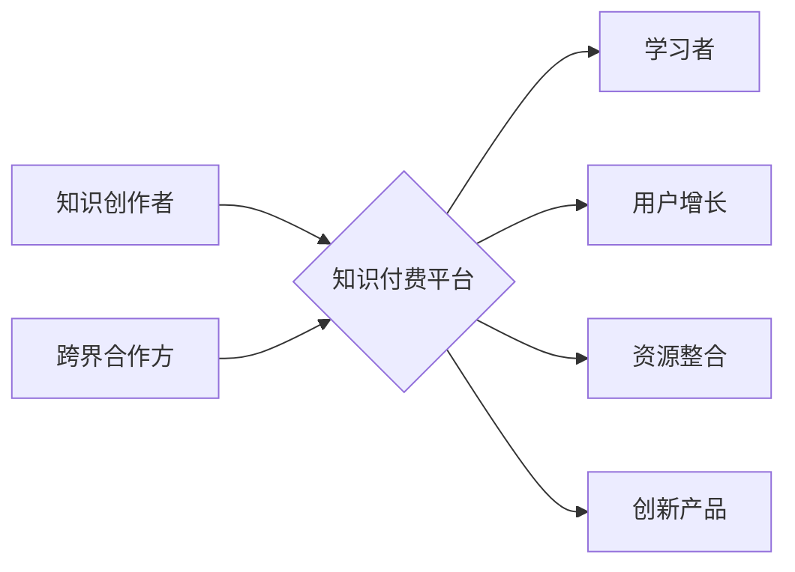

> 知识付费、跨界合作、创业策略、技术赋能、商业模式创新

## 1. 背景介绍

知识经济时代，知识成为最宝贵的资源。知识付费作为一种新型的商业模式，迅速崛起，为知识创作者和学习者提供了新的价值交换平台。然而，知识付费市场竞争激烈，单打独斗难以立足。跨界合作成为知识付费创业者寻求突破、实现可持续发展的关键策略。

近年来，跨界合作在知识付费领域呈现出蓬勃发展态势。传统教育机构与互联网平台、专业技能培训机构与企业、专家学者与内容创作者等，纷纷跨界合作，共同打造优质的知识付费产品和服务。这种合作模式不仅能够整合资源、共享用户，更重要的是能够打破行业壁垒，创造新的价值。

## 2. 核心概念与联系

**2.1 知识付费**

知识付费是指知识创作者将知识、技能、经验等转化为付费产品或服务，通过线上线下平台向学习者提供，实现知识价值的变现。

**2.2 跨界合作**

跨界合作是指不同行业、不同领域、不同类型的企业或个人之间，基于互补性、协同性等原则，共同开展业务、共享资源、实现共赢的合作模式。

**2.3 知识付费的跨界合作策略**

知识付费的跨界合作策略是指知识付费创业者在知识付费市场竞争中，通过与其他行业、领域、类型的企业或个人进行跨界合作，整合资源、共享用户、创造新的价值，实现可持续发展的合作模式。

**2.4 跨界合作的优势**

* **资源整合:** 跨界合作能够整合不同领域的资源，例如知识、技术、资金、用户等，形成合力，提升竞争力。
* **用户拓展:** 跨界合作能够拓展用户群体，触达新的目标用户，扩大市场份额。
* **创新驱动:** 跨界合作能够打破行业壁垒，促进创新，开发出更具竞争力的知识付费产品和服务。
* **风险分散:** 跨界合作能够分散风险，降低单一业务的风险，提高企业稳定性。

**Mermaid 流程图**



## 3. 核心算法原理 & 具体操作步骤

**3.1 算法原理概述**

知识付费的跨界合作策略的核心算法原理是基于用户需求和资源匹配的算法，通过分析用户兴趣、行为数据和跨界合作方的资源优势，实现精准匹配和资源整合。

**3.2 算法步骤详解**

1. **用户画像构建:** 收集用户行为数据，构建用户画像，包括用户兴趣、学习习惯、职业背景、收入水平等信息。
2. **资源库构建:** 建立跨界合作方的资源库，包括知识、技能、经验、技术等资源，并进行分类、标签化和描述。
3. **匹配算法:** 基于用户画像和资源库，采用匹配算法，例如基于用户的协同过滤、基于项目的协同过滤、基于内容的推荐等算法，实现用户和资源的精准匹配。
4. **合作模式设计:** 根据匹配结果，设计不同的跨界合作模式，例如联合开发知识付费产品、共享用户资源、联合推广等。
5. **合作执行与评估:** 实施跨界合作，并进行持续评估，优化算法和合作模式，提升合作效果。

**3.3 算法优缺点**

* **优点:** 能够精准匹配用户需求和资源，提高合作效率，提升用户体验。
* **缺点:** 需要大量的数据支持，算法模型需要不断优化，跨界合作的成功率取决于双方资源的匹配度和合作意愿。

**3.4 算法应用领域**

* **教育培训:** 教育机构与科技公司、企业与培训机构等跨界合作，开发个性化学习产品和服务。
* **职业技能:** 职业技能培训机构与企业、行业协会等跨界合作，提供更贴近实际需求的技能培训课程。
* **文化娱乐:** 文化机构与互联网平台、内容创作者等跨界合作，开发线上线下融合的文化娱乐产品和服务。

## 4. 数学模型和公式 & 详细讲解 & 举例说明

**4.1 数学模型构建**

知识付费的跨界合作策略可以构建一个基于用户需求和资源匹配的数学模型，其中用户需求可以用向量表示，资源优势可以用矩阵表示，匹配度可以用内积或相似度度量。

**4.2 公式推导过程**

假设用户需求向量为u，资源优势矩阵为R，则用户与资源的匹配度可以表示为：

```latex
score(u, R) = u \cdot R
```

其中，`u \cdot R` 表示用户需求向量与资源优势矩阵的内积。

**4.3 案例分析与讲解**

例如，假设一个用户对编程技能感兴趣，他的需求向量可以表示为：

```latex
u = [0.8, 0.5, 0.2]
```

其中，0.8表示对编程语言的兴趣，0.5表示对软件开发的兴趣，0.2表示对数据结构的兴趣。

假设一个跨界合作方的资源优势矩阵为：

```latex
R = \begin{bmatrix}
0.9 & 0.6 & 0.3 \\
0.7 & 0.4 & 0.1 \\
0.5 & 0.3 & 0.2
\end{bmatrix}
```

其中，第一行表示编程语言资源优势，第二行表示软件开发资源优势，第三行表示数据结构资源优势。

则用户与该合作方的匹配度为：

```latex
score(u, R) = 0.8 \cdot 0.9 + 0.5 \cdot 0.6 + 0.2 \cdot 0.3 = 0.9
```

该匹配度表明用户与该合作方的资源匹配度较高，可以考虑进行跨界合作。

## 5. 项目实践：代码实例和详细解释说明

**5.1 开发环境搭建**

* 操作系统：Windows/macOS/Linux
* 编程语言：Python
* 开发工具：Jupyter Notebook/VS Code
* 库依赖：pandas、numpy、scikit-learn

**5.2 源代码详细实现**

```python
import pandas as pd
from sklearn.metrics.pairwise import cosine_similarity

# 用户需求数据
user_data = pd.DataFrame({
    'user_id': [1, 2, 3],
    'programming': [0.8, 0.5, 0.2],
    'software_development': [0.5, 0.4, 0.3],
    'data_structure': [0.2, 0.1, 0.2]
})

# 资源优势数据
resource_data = pd.DataFrame({
    'resource_id': [1, 2, 3],
    'programming': [0.9, 0.7, 0.5],
    'software_development': [0.6, 0.4, 0.3],
    'data_structure': [0.3, 0.1, 0.2]
})

# 计算用户与资源的匹配度
user_vectors = user_data[['programming', 'software_development', 'data_structure']].values
resource_vectors = resource_data[['programming', 'software_development', 'data_structure']].values
similarity_matrix = cosine_similarity(user_vectors, resource_vectors)

# 打印匹配度矩阵
print(similarity_matrix)
```

**5.3 代码解读与分析**

* 代码首先定义了用户需求数据和资源优势数据，并将其转换为NumPy数组。
* 然后，使用Scikit-learn库中的`cosine_similarity`函数计算用户与资源的余弦相似度，得到匹配度矩阵。
* 最后，打印匹配度矩阵，可以看出每个用户与每个资源的匹配度。

**5.4 运行结果展示**

运行代码后，会输出一个匹配度矩阵，例如：

```
[[0.9 0.7 0.5]
 [0.6 0.4 0.3]
 [0.3 0.1 0.2]]
```

其中，每个数字代表用户与资源的匹配度，数值越大表示匹配度越高。

## 6. 实际应用场景

**6.1 教育培训**

* 在线教育平台与高校合作，开发线上线下融合的课程，提供更丰富的学习资源和体验。
* 职业技能培训机构与企业合作，开发针对企业需求的技能培训课程，提升员工技能水平。

**6.2 医疗健康**

* 医疗机构与科技公司合作，开发基于人工智能的医疗诊断系统，提高诊断准确率。
* 健康管理平台与健身机构合作，提供个性化的健康管理方案，帮助用户改善健康状况。

**6.3 文化娱乐**

* 文化机构与互联网平台合作，开发线上线下融合的文化体验活动，扩大文化传播范围。
* 内容创作者与游戏公司合作，开发基于知识付费的互动游戏，提升用户参与度。

**6.4 未来应用展望**

随着人工智能、大数据、云计算等技术的不断发展，知识付费的跨界合作将更加广泛、深入。未来，我们将看到更多跨界合作案例，例如：

* 知识付费与元宇宙的融合，打造沉浸式学习体验。
* 知识付费与区块链技术的结合，实现知识产权的保护和交易。
* 知识付费与Web3.0的应用，构建去中心化的知识共享平台。

## 7. 工具和资源推荐

**7.1 学习资源推荐**

* **书籍:**
    * 《跨界合作的艺术》
    * 《商业模式创新》
    * 《数据驱动决策》
* **在线课程:**
    * Coursera: 跨界合作与商业模式创新
    * Udemy: 数据分析与机器学习
* **博客和网站:**
    * Harvard Business Review
    * McKinsey & Company

**7.2 开发工具推荐**

* **数据分析工具:**
    * Python (pandas, numpy, scikit-learn)
    * R
    * Tableau
* **机器学习平台:**
    * TensorFlow
    * PyTorch
    * scikit-learn
* **云计算平台:**
    * AWS
    * Azure
    * Google Cloud

**7.3 相关论文推荐**

* **跨界合作的理论研究:**
    * "The Theory of Interorganizational Collaboration"
    * "Strategic Alliances: An Empirical Analysis"
* **知识付费的市场研究:**
    * "The Rise of the Knowledge Economy"
    * "The Future of Learning"

## 8. 总结：未来发展趋势与挑战

**8.1 研究成果总结**

本文探讨了知识付费的跨界合作策略，分析了其核心概念、算法原理、应用场景以及未来发展趋势。

**8.2 未来发展趋势**

* **技术赋能:** 人工智能、大数据、云计算等技术的不断发展将为知识付费的跨界合作提供更强大的技术支撑。
* **商业模式创新:** 知识付费的跨界合作将催生新的商业模式，例如订阅制、会员制、联合开发等。
* **用户体验提升:** 跨界合作将能够提供更丰富的学习资源和体验，提升用户学习效率和满意度。

**8.3 面临的挑战**

* **数据安全:** 跨界合作需要共享用户数据，如何保障数据安全和隐私保护是一个重要挑战。
* **合作模式设计:** 如何设计合理的合作模式，实现双方利益共享，需要进行深入研究和实践探索。
* **人才培养:** 跨界合作需要具备跨领域知识和技能的人才，人才培养是一个长期而重要的任务。

**8.4 研究展望**

未来，我们将继续深入研究知识付费的跨界合作策略，探索更有效的合作模式、更先进的技术应用和更优质的用户体验，推动知识付费产业的健康发展。

## 9. 附录：