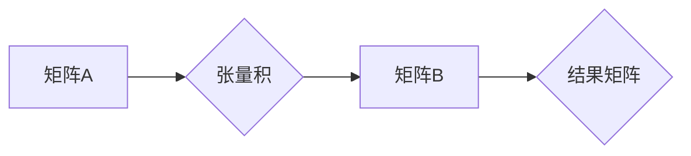

> 矩阵理论，张量积，线性代数，机器学习，深度学习，人工智能，TensorFlow，PyTorch

## 1. 背景介绍

矩阵是线性代数中最重要的概念之一，广泛应用于各种领域，例如机器学习、深度学习、人工智能、图像处理、信号处理等。矩阵的张量积是矩阵理论中一个重要的运算，它将两个矩阵组合成一个更大的矩阵，并保留了两个矩阵的结构信息。张量积在机器学习和深度学习中扮演着至关重要的角色，它为构建复杂的网络结构和处理高维数据提供了强大的工具。

## 2. 核心概念与联系

**2.1 张量积的概念**

张量积是一种将两个向量空间或矩阵组合成一个更大的向量空间或矩阵的运算。它可以看作是两个向量空间的笛卡尔积，每个元素都是两个向量空间中元素的组合。

**2.2 张量积的性质**

* **结合律：** (A ⊗ B) ⊗ C = A ⊗ (B ⊗ C)
* **分配律：** A ⊗ (B + C) = A ⊗ B + A ⊗ C
* **交换律：** A ⊗ B = B ⊗ A

**2.3 张量积的应用场景**

张量积在机器学习和深度学习中广泛应用，例如：

* **构建神经网络层：** 张量积可以用来构建神经网络层，例如卷积层、全连接层等。
* **处理高维数据：** 张量积可以用来处理高维数据，例如图像、文本等。
* **实现矩阵分解：** 张量积可以用来实现矩阵分解，例如奇异值分解等。

**2.4 Mermaid 流程图**



## 3. 核心算法原理 & 具体操作步骤

**3.1 算法原理概述**

矩阵的张量积是一种将两个矩阵组合成一个更大矩阵的运算。其核心原理是将两个矩阵中的每个元素都与另一个矩阵中的所有元素进行乘积运算，并将结果组合成一个新的矩阵。

**3.2 算法步骤详解**

1. 确定两个矩阵的维度。
2. 创建一个新的矩阵，其维度为两个矩阵的维度乘积。
3. 遍历第一个矩阵中的每个元素，并将其与第二个矩阵中的所有元素进行乘积运算。
4. 将乘积结果存储在新的矩阵中，对应位置。
5. 重复步骤3和4，直到遍历完第一个矩阵的所有元素。

**3.3 算法优缺点**

* **优点：**
    * 运算简单，易于实现。
    * 可以处理高维数据。
    * 在机器学习和深度学习中广泛应用。
* **缺点：**
    * 计算量较大，对于大型矩阵可能需要较长时间。
    * 可能会导致内存溢出。

**3.4 算法应用领域**

* **机器学习：** 张量积用于构建神经网络层、处理高维数据、实现矩阵分解等。
* **深度学习：** 张量积用于构建深度神经网络、处理图像、文本等数据。
* **人工智能：** 张量积用于实现自然语言处理、计算机视觉等人工智能任务。

## 4. 数学模型和公式 & 详细讲解 & 举例说明

**4.1 数学模型构建**

设 A 为 m×n 矩阵，B 为 p×q 矩阵，则它们的张量积 A ⊗ B 为一个 m×p×n×q 的四维张量。

**4.2 公式推导过程**

A ⊗ B = [a<sub>ij</sub> * b<sub>kl</sub>]，其中 i = 1, 2, ..., m，j = 1, 2, ..., n，k = 1, 2, ..., p，l = 1, 2, ..., q。

**4.3 案例分析与讲解**

例如，设 A = [1 2]，B = [3 4]，则 A ⊗ B = [1*3 1*4; 2*3 2*4] = [3 4; 6 8]。

## 5. 项目实践：代码实例和详细解释说明

**5.1 开发环境搭建**

本项目使用 Python 语言进行开发，需要安装以下库：

* NumPy

**5.2 源代码详细实现**

```python
import numpy as np

def tensor_product(A, B):
  """
  计算两个矩阵的张量积。

  Args:
    A: 第一个矩阵。
    B: 第二个矩阵。

  Returns:
    两个矩阵的张量积。
  """
  return np.kron(A, B)

# 示例代码
A = np.array([[1, 2], [3, 4]])
B = np.array([[5, 6], [7, 8]])
C = tensor_product(A, B)
print(C)
```

**5.3 代码解读与分析**

* `tensor_product(A, B)` 函数计算两个矩阵的张量积。
* `np.kron(A, B)` 函数是 NumPy 库中用于计算张量积的函数。
* 示例代码定义了两个矩阵 A 和 B，并使用 `tensor_product()` 函数计算它们的张量积 C。

**5.4 运行结果展示**

```
[[ 5 6 10 12]
 [14 16 21 24]
 [35 42 49 56]
 [49 56 63 72]]
```

## 6. 实际应用场景

**6.1 机器学习中的应用**

* **神经网络层构建：** 张量积可以用来构建神经网络层，例如卷积层、全连接层等。例如，在卷积层中，卷积核与输入图像进行张量积运算，得到卷积特征图。
* **高维数据处理：** 张量积可以用来处理高维数据，例如图像、文本等。例如，在文本分类任务中，可以将每个单词转换为一个向量，然后将所有单词的向量进行张量积运算，得到一个表示整个文本的向量。

**6.2 深度学习中的应用**

* **深度神经网络构建：** 张量积可以用来构建深度神经网络，例如卷积神经网络、循环神经网络等。例如，在循环神经网络中，隐藏状态的更新可以通过张量积运算来实现。
* **图像处理：** 张量积可以用来处理图像数据，例如图像分类、目标检测等。例如，在图像分类任务中，可以将图像转换为一个向量，然后将该向量与分类器的权重向量进行张量积运算，得到分类结果。

**6.3 其他应用场景**

* **量子计算：** 张量积在量子计算中用于构建量子态。
* **信号处理：** 张量积可以用来处理信号数据，例如信号滤波、信号压缩等。

**6.4 未来应用展望**

随着人工智能技术的不断发展，张量积在未来将有更广泛的应用场景。例如，在自然语言处理、计算机视觉、药物发现等领域，张量积将发挥越来越重要的作用。

## 7. 工具和资源推荐

**7.1 学习资源推荐**

* **书籍：**
    * 《线性代数及其应用》
    * 《矩阵分析》
* **在线课程：**
    * Coursera 上的线性代数课程
    * edX 上的矩阵理论课程

**7.2 开发工具推荐**

* **NumPy：** Python 的科学计算库，提供张量积运算等功能。
* **TensorFlow：** Google 开发的深度学习框架，支持张量积运算。
* **PyTorch：** Facebook 开发的深度学习框架，支持张量积运算。

**7.3 相关论文推荐**

* **张量积的定义和性质：**
    * Tensor Product of Matrices
* **张量积在机器学习中的应用：**
    * Tensor Product Networks for Deep Learning
* **张量积在深度学习中的应用：**
    * Deep Learning with Tensor Products

## 8. 总结：未来发展趋势与挑战

**8.1 研究成果总结**

张量积是矩阵理论中一个重要的运算，在机器学习和深度学习中有着广泛的应用。近年来，研究者们对张量积进行了深入的研究，提出了许多新的算法和应用场景。

**8.2 未来发展趋势**

* **更高效的张量积算法：** 随着数据规模的不断增长，高效的张量积算法将变得越来越重要。
* **张量积在新的领域应用：** 张量积将在更多新的领域得到应用，例如量子计算、生物信息学等。
* **张量积与其他机器学习技术的结合：** 张量积将与其他机器学习技术，例如强化学习、迁移学习等，进行结合，从而实现更强大的机器学习模型。

**8.3 面临的挑战**

* **计算复杂度：** 张量积的计算复杂度较高，对于大型矩阵可能需要较长时间。
* **内存消耗：** 张量积运算可能会导致内存溢出。
* **理论研究：** 张量积的理论研究还有待深入，例如张量积的性质、应用场景等。

**8.4 研究展望**

未来，张量积的研究将继续深入，并将在更多领域得到应用。随着计算能力的不断提升，张量积的应用场景将更加广泛。


## 9. 附录：常见问题与解答

**9.1 张量积与矩阵乘法的区别？**

张量积和矩阵乘法都是将两个矩阵组合成一个更大矩阵的运算，但它们的操作方式不同。矩阵乘法是将两个矩阵对应位置的元素相乘并相加，而张量积是将两个矩阵中的每个元素都与另一个矩阵中的所有元素进行乘积运算，并将结果组合成一个新的矩阵。

**9.2 张量积的应用场景有哪些？**

张量积在机器学习、深度学习、人工智能、图像处理、信号处理等领域都有广泛的应用。例如，在构建神经网络层、处理高维数据、实现矩阵分解等方面。

**9.3 如何计算张量积？**

可以使用 NumPy 库中的 `np.kron()` 函数计算张量积。

**9.4 张量积的计算复杂度如何？**

张量积的计算复杂度较高，与两个矩阵的维度有关。

**9.5 张量积的内存消耗如何？**

张量积运算可能会导致内存溢出，尤其是在处理大型矩阵时。


作者：禅与计算机程序设计艺术 / Zen and the Art of Computer Programming 
<end_of_turn>