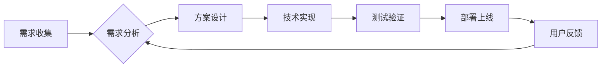

> 研发中心、团队建设、人才培养、技术架构、创新驱动、敏捷开发、持续学习

## 1. 背景介绍

在当今科技日新月异的时代，研发中心作为企业核心竞争力的关键所在，其建设和人才培养显得尤为重要。一个高效、创新、充满活力的研发中心，能够为企业带来持续的增长和发展。然而，建设和运营一个成功的研发中心并非易事，需要从团队建设、人才培养、技术架构、创新驱动等多个方面进行深入思考和实践。

## 2. 核心概念与联系

**2.1 研发中心架构**

研发中心通常由多个部门组成，例如：

* **产品研发部:** 负责产品的设计、开发和测试。
* **技术研发部:** 负责基础技术研究和平台建设。
* **数据科学部:** 负责数据分析、挖掘和应用。
* **工程运维部:** 负责软件部署、监控和维护。

这些部门之间相互协作，共同完成研发目标。

**2.2 团队建设原则**

* **多元化:** 团队成员应来自不同背景、专业和经验，以促进多角度思考和创新。
* **协作性:** 团队成员应具备良好的沟通和协作能力，共同完成目标。
* **责任感:** 团队成员应对自己的工作负责，并积极承担责任。
* **学习型:** 团队应鼓励成员持续学习和成长，不断提升自身能力。

**2.3 人才培养体系**

人才培养体系应涵盖以下几个方面：

* **招聘:** 招募优秀人才，并根据企业需求进行匹配。
* **培训:** 提供各种培训课程，帮助员工提升专业技能和知识。
* **晋升:** 建立清晰的晋升机制，激励员工不断进步。
* **激励:** 制定合理的激励机制，鼓励员工积极工作和创新。

**2.4 流程图**

## 3. 核心算法原理 & 具体操作步骤

**3.1 算法原理概述**

**3.2 算法步骤详解**

**3.3 算法优缺点**

**3.4 算法应用领域**

## 4. 数学模型和公式 & 详细讲解 & 举例说明

**4.1 数学模型构建**

**4.2 公式推导过程**

**4.3 案例分析与讲解**

## 5. 项目实践：代码实例和详细解释说明

**5.1 开发环境搭建**

**5.2 源代码详细实现**

**5.3 代码解读与分析**

**5.4 运行结果展示**

## 6. 实际应用场景

**6.1 应用案例介绍**

**6.2 应用效果分析**

**6.3 应用前景展望**

## 7. 工具和资源推荐

**7.1 学习资源推荐**

**7.2 开发工具推荐**

**7.3 相关论文推荐**

## 8. 总结：未来发展趋势与挑战

**8.1 研究成果总结**

**8.2 未来发展趋势**

**8.3 面临的挑战**

**8.4 研究展望**

## 9. 附录：常见问题与解答

**9.1 常见问题解答**

作者：禅与计算机程序设计艺术 / Zen and the Art of Computer Programming 
<end_of_turn>