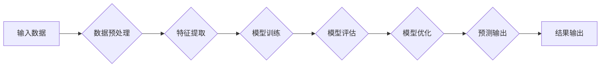

> 算法创新、计算效率、精度提升、机器学习、深度学习、人工智能、数据结构、算法设计

## 1. 背景介绍

在信息时代，数据爆炸式增长，人类对计算效率和精度的需求日益迫切。传统的算法已经难以满足日益复杂的需求，算法创新成为推动科技进步的关键驱动力。从人工智能的兴起到大数据分析的普及，算法创新无处不在，深刻地改变着我们的生活方式和工作模式。

## 2. 核心概念与联系

**2.1 算法的本质**

算法是一种解决特定问题的指令序列，它描述了如何使用有限的资源（如时间、空间和计算能力）完成特定任务。一个好的算法应该具有以下特点：

* **确定性:** 对于给定的输入，算法应该始终产生相同的输出。
* **有限性:** 算法的执行步骤必须有限，不能无限循环。
* **有效性:** 算法的每个步骤都必须是可执行的，并且能够在有限的时间内完成。

**2.2 算法创新与效率提升**

算法创新是指设计和开发新的算法或改进现有算法，以提高计算效率和精度。算法创新可以从以下几个方面入手：

* **数据结构优化:** 选择合适的的数据结构可以显著提高算法的效率。例如，使用哈希表可以实现快速查找操作。
* **算法设计改进:** 通过改进算法的逻辑结构和操作步骤，可以减少算法的执行时间和空间复杂度。例如，使用分治法可以将复杂问题分解成多个子问题，并递归地解决这些子问题。
* **并行化和分布式计算:** 利用多核处理器或分布式计算集群，可以将算法分解成多个任务，并并行执行，从而大幅提高计算速度。

**2.3 算法创新与人工智能**

人工智能的快速发展离不开算法创新的推动。深度学习、强化学习等人工智能算法的突破，都源于对算法设计的不断探索和创新。

**Mermaid 流程图**

## 3. 核心算法原理 & 具体操作步骤

**3.1 算法原理概述**

**3.2 算法步骤详解**

**3.3 算法优缺点**

**3.4 算法应用领域**

## 4. 数学模型和公式 & 详细讲解 & 举例说明

**4.1 数学模型构建**

**4.2 公式推导过程**

**4.3 案例分析与讲解**

## 5. 项目实践：代码实例和详细解释说明

**5.1 开发环境搭建**

**5.2 源代码详细实现**

**5.3 代码解读与分析**

**5.4 运行结果展示**

## 6. 实际应用场景

**6.1 应用场景介绍**

**6.2 案例分析**

**6.3 优势与局限性**

**6.4 未来应用展望**

## 7. 工具和资源推荐

**7.1 学习资源推荐**

**7.2 开发工具推荐**

**7.3 相关论文推荐**

## 8. 总结：未来发展趋势与挑战

**8.1 研究成果总结**

**8.2 未来发展趋势**

**8.3 面临的挑战**

**8.4 研究展望**

## 9. 附录：常见问题与解答

**9.1 常见问题**

**9.2 问题解答**

作者：禅与计算机程序设计艺术 / Zen and the Art of Computer Programming

<end_of_turn>