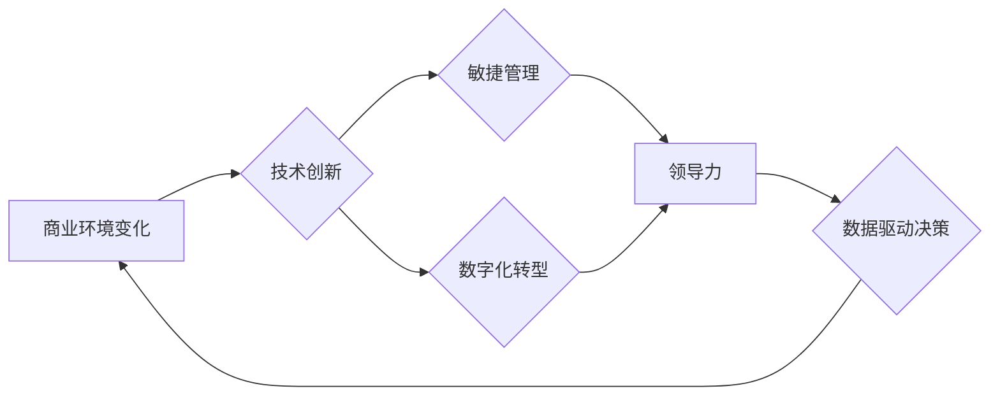

>  商业环境、快速变化、技术创新、敏捷管理、数字化转型、领导力、团队协作、数据驱动决策

## 1. 背景介绍

当今世界，商业环境变化日新月异，科技创新日益加速，传统的管理模式和思维方式已难以适应这种快速变化的节奏。面对激烈的市场竞争和不断涌现的新技术，企业需要不断调整和优化自身的管理模式，以保持竞争力。

对于管理者而言，应对快速变化的商业环境是一个巨大的挑战，需要他们具备敏锐的洞察力、灵活的决策能力和强大的领导力。

## 2. 核心概念与联系

**2.1 商业环境变化**

商业环境变化是指市场需求、技术发展、经济政策、社会文化等因素的动态变化，这些变化会对企业的经营策略、产品服务、市场定位等方面产生影响。

**2.2 技术创新**

技术创新是指利用科学技术知识和方法，创造出新的产品、服务、生产工艺或管理模式的过程。技术创新是推动商业环境变化的重要力量，也是企业保持竞争力的关键。

**2.3 敏捷管理**

敏捷管理是一种以迭代开发、快速反馈和持续改进为核心的管理模式，它强调团队协作、客户需求优先和灵活响应变化。敏捷管理理念可以帮助企业更好地应对快速变化的商业环境。

**2.4 数字化转型**

数字化转型是指企业利用数字化技术和手段，重构业务流程、优化运营模式、提升客户体验的过程。数字化转型是企业应对快速变化的商业环境的重要举措，可以帮助企业提高效率、降低成本、创造新的价值。

**2.5 领导力**

领导力是指领导者能够激励、引导和影响团队成员，实现共同目标的能力。在快速变化的商业环境下，领导者需要具备战略思维、变革能力和团队协作能力，才能带领团队应对挑战，实现成功。

**2.6 数据驱动决策**

数据驱动决策是指利用数据分析和挖掘技术，为决策提供科学依据的过程。在快速变化的商业环境下，数据驱动决策可以帮助企业更好地了解市场趋势、客户需求和业务运营情况，从而做出更准确、更有效的决策。

**Mermaid 流程图**



## 3. 核心算法原理 & 具体操作步骤

**3.1 算法原理概述**

在快速变化的商业环境下，企业需要快速响应市场变化，调整经营策略，优化资源配置。敏捷管理和数据驱动决策是应对这种变化的有效手段。

敏捷管理强调迭代开发、快速反馈和持续改进，可以帮助企业快速响应市场变化，不断优化产品和服务。数据驱动决策利用数据分析和挖掘技术，为决策提供科学依据，可以帮助企业做出更准确、更有效的决策。

**3.2 算法步骤详解**

**3.2.1 敏捷管理步骤**

1. **需求分析:** 首先，需要对市场需求进行深入分析，了解客户的需求和期望。
2. **迭代开发:** 将项目分解成多个小的迭代周期，每个迭代周期都包含需求分析、设计、开发、测试和部署等环节。
3. **快速反馈:** 在每个迭代周期结束后，需要收集用户反馈，并根据反馈进行改进。
4. **持续改进:** 通过不断迭代和改进，最终实现产品的优化和完善。

**3.2.2 数据驱动决策步骤**

1. **数据收集:** 收集相关业务数据，包括销售数据、客户数据、市场数据等。
2. **数据清洗:** 对收集到的数据进行清洗和处理，去除无效数据和错误数据。
3. **数据分析:** 利用数据分析和挖掘技术，对数据进行分析，发现数据中的规律和趋势。
4. **决策制定:** 根据数据分析结果，制定相应的决策方案。
5. **决策评估:** 对决策方案进行评估，并根据评估结果进行调整。

**3.3 算法优缺点**

**3.3.1 敏捷管理优点:**

* 响应速度快，能够快速适应市场变化。
* 能够更好地满足客户需求，提高客户满意度。
* 能够提高团队协作效率，促进团队创新。

**3.3.1 敏捷管理缺点:**

* 需要团队成员具备较高的沟通和协作能力。
* 需要企业文化能够适应敏捷管理理念。
* 项目初期可能缺乏清晰的规划，难以控制项目进度。

**3.3.2 数据驱动决策优点:**

* 决策更加科学，能够降低决策风险。
* 能够提高决策效率，节省决策时间。
* 能够帮助企业更好地了解市场和客户。

**3.3.2 数据驱动决策缺点:**

* 需要企业具备强大的数据分析能力。
* 数据质量会直接影响决策结果，需要保证数据质量。
* 数据分析结果可能存在一定的误差，需要谨慎使用。

**3.4 算法应用领域**

敏捷管理和数据驱动决策广泛应用于各个行业，例如软件开发、互联网、金融、制造业等。

## 4. 数学模型和公式 & 详细讲解 & 举例说明

**4.1 数学模型构建**

在快速变化的商业环境下，企业需要预测未来市场需求和竞争对手行为，以便制定相应的策略。我们可以利用数学模型来模拟和预测市场变化。

例如，我们可以使用**马尔科夫链**模型来预测客户的购买行为，**博弈论**模型来分析竞争对手的策略，**时间序列分析**模型来预测市场需求。

**4.2 公式推导过程**

**4.2.1 马尔科夫链模型**

马尔科夫链模型假设系统状态的未来只依赖于当前状态，与过去状态无关。我们可以用一个状态转移矩阵来表示系统状态之间的转移概率。

假设我们有一个二元状态系统，状态1表示客户购买产品，状态0表示客户不购买产品。状态转移矩阵为：

```
P = [
    [0.8, 0.2],
    [0.3, 0.7]
]
```

其中，P(i,j)表示从状态i转移到状态j的概率。

**4.2.2 博弈论模型**

博弈论模型分析多个智能体之间的相互作用，每个智能体都试图通过自己的策略来最大化自己的利益。

例如，我们可以使用**囚徒困境**模型来分析两个竞争对手之间的价格战。

**4.3 案例分析与讲解**

**4.3.1 马尔科夫链模型应用**

我们可以利用马尔科夫链模型来预测客户的购买行为，例如，如果一个客户在过去购买了我们的产品，那么他未来购买产品的概率会更高。

**4.3.2 博弈论模型应用**

我们可以利用博弈论模型来分析竞争对手的策略，例如，如果我们的竞争对手降低了价格，那么我们应该如何应对？

## 5. 项目实践：代码实例和详细解释说明

**5.1 开发环境搭建**

为了实现敏捷管理和数据驱动决策，我们可以使用一些开源工具和平台，例如：

* **Trello:** 用于项目管理和协作。
* **Jira:** 用于软件开发和项目管理。
* **Python:** 用于数据分析和机器学习。
* **Pandas:** 用于数据处理和分析。
* **Scikit-learn:** 用于机器学习模型训练和评估。

**5.2 源代码详细实现**

以下是一个使用Python和Pandas实现客户购买行为预测的简单代码示例：

```python
import pandas as pd

# 加载数据
data = pd.read_csv('customer_data.csv')

# 构建马尔科夫链模型
states = ['购买', '不购买']
transition_matrix = pd.DataFrame(
    [[0.8, 0.2],
     [0.3, 0.7]],
    index=states,
    columns=states
)

# 预测未来状态
future_state = transition_matrix.loc[data['last_purchase'], data['next_purchase']]

# 打印预测结果
print(future_state)
```

**5.3 代码解读与分析**

这段代码首先加载了客户购买行为数据，然后构建了一个马尔科夫链模型，并使用该模型预测了客户未来购买行为。

**5.4 运行结果展示**

运行结果将显示出每个客户未来购买产品的概率。

## 6. 实际应用场景

**6.1 敏捷管理应用场景**

* 软件开发：敏捷开发方法可以帮助软件开发团队快速响应客户需求，提高软件开发效率。
* 产品设计：敏捷设计方法可以帮助产品设计团队快速迭代产品原型，并根据用户反馈进行改进。
* 市场营销：敏捷营销方法可以帮助企业快速调整营销策略，提高营销效果。

**6.2 数据驱动决策应用场景**

* 客户关系管理：利用客户数据分析，可以更好地了解客户需求，提供个性化服务。
* 市场营销：利用市场数据分析，可以制定更精准的营销策略，提高营销效果。
* 产品开发：利用产品数据分析，可以了解产品使用情况，改进产品功能。

**6.4 未来应用展望**

随着人工智能和机器学习技术的不断发展，敏捷管理和数据驱动决策将更加智能化和自动化。

## 7. 工具和资源推荐

**7.1 学习资源推荐**

* **敏捷软件开发：**《敏捷软件开发》
* **数据驱动决策：**《数据驱动决策》

**7.2 开发工具推荐**

* **Trello:** https://trello.com/
* **Jira:** https://www.atlassian.com/software/jira
* **Python:** https://www.python.org/

**7.3 相关论文推荐**

* **敏捷软件开发：**
    * Beck, K. (2000). Extreme programming explained: Embrace change. Addison-Wesley Professional.
* **数据驱动决策：**
    * Provost, F., & Fawcett, T. (2013). Data science for business: What you need to know about data mining and data-analytic thinking. O'Reilly Media, Inc.

## 8. 总结：未来发展趋势与挑战

**8.1 研究成果总结**

敏捷管理和数据驱动决策是应对快速变化的商业环境的重要手段，它们可以帮助企业提高效率、降低成本、创造新的价值。

**8.2 未来发展趋势**

* **人工智能和机器学习:** 人工智能和机器学习技术将进一步推动敏捷管理和数据驱动决策的智能化和自动化。
* **云计算:** 云计算技术将提供更灵活、更便捷的数据存储和处理能力，支持敏捷管理和数据驱动决策的应用。
* **大数据:** 大数据技术将提供更丰富的数据资源，为敏捷管理和数据驱动决策提供更强大的支持。

**8.3 面临的挑战**

* **人才短缺:** 敏捷管理和数据驱动决策需要具备相关技能的人才，而目前人才短缺是一个普遍问题。
* **文化阻力:** 传统的管理模式和思维方式难以适应敏捷管理和数据驱动决策的理念，需要企业文化进行调整。
* **技术复杂性:** 敏捷管理和数据驱动决策涉及到多种技术，需要企业具备相应的技术能力。

**8.4 研究展望**

未来，我们需要继续研究敏捷管理和数据驱动决策的应用方法，探索新的技术和工具，并推动企业文化转型，以更好地应对快速变化的商业环境。

## 9. 附录：常见问题与解答

**9.1 敏捷管理适合所有行业吗？**

敏捷管理是一种灵活的管理模式，可以应用于各种行业，但需要根据具体行业特点进行调整。

**9.2 数据驱动决策需要多少数据？**

数据驱动决策需要足够多的数据来进行分析和预测，但具体需要多少数据取决于数据的质量和分析方法。

**9.3 如何克服敏捷管理和数据驱动决策的挑战？**

* **人才培养:** 企业需要加强人才培养，培养具备敏捷管理和数据驱动决策技能的人才。
*