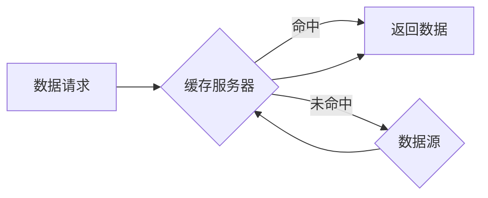

> 缓存技术、高吞吐量、数据访问、性能优化、算法设计、数据结构、内存管理、数据库、网络应用

## 1. 背景介绍

在当今数据爆炸的时代，高吞吐量系统已成为各种应用的核心需求。无论是电商平台的商品查询、金融系统的交易处理，还是大数据平台的实时分析，都需要快速、高效地访问和处理海量数据。然而，直接从持久存储读取数据往往会带来巨大的延迟，成为系统性能瓶颈。

缓存技术应运而生，它通过将频繁访问的数据存储在高速内存中，从而大幅提升数据访问速度，有效缓解系统性能压力。缓存技术在高吞吐量系统中扮演着至关重要的角色，能够显著提升系统的响应速度、处理能力和用户体验。

## 2. 核心概念与联系

### 2.1 缓存概念

缓存是一种临时存储数据结构，用于加速数据访问。它位于CPU和持久存储之间，将经常访问的数据预先加载到内存中，以便快速检索。

### 2.2 缓存层次结构

缓存通常采用多层次结构，从高速到低速依次排列，每个层次的缓存容量和访问速度都不同。常见的缓存层次结构包括：

* **L1 Cache:** 位于CPU内部，容量最小，访问速度最快。
* **L2 Cache:** 位于CPU外，容量比L1 Cache大，访问速度略慢。
* **L3 Cache:** 位于主板上的共享缓存，容量最大，访问速度相对较慢。
* **主存 (RAM):** 计算机的主要内存，容量较大，访问速度比缓存慢。
* **持久存储 (硬盘、SSD):** 数据长期存储设备，容量最大，访问速度最慢。

### 2.3 缓存原理

缓存技术基于“局部性原理”，即程序在运行过程中，经常访问的数据集中在局部区域。通过预先加载这些局部数据到缓存中，可以显著减少数据访问时间。

### 2.4 缓存机制

常见的缓存机制包括：

* **写回 (Write-Through):** 数据修改时，同时更新缓存和持久存储。
* **写缓冲 (Write-Back):** 数据修改时，只更新缓存，待缓存满或系统关闭时，再更新持久存储。
* **读命中 (Read Hit):** 数据在缓存中找到，直接返回。
* **读未命中 (Read Miss):** 数据不在缓存中，需要从持久存储读取，并加载到缓存中。

### 2.5 缓存架构

缓存架构通常由以下组件组成：

* **缓存服务器:** 管理和维护缓存数据。
* **数据源:** 提供数据源，例如数据库、文件系统等。
* **客户端:** 请求数据并接收缓存数据。

**Mermaid 流程图**



## 3. 核心算法原理 & 具体操作步骤

### 3.1 算法原理概述

缓存算法决定了如何选择缓存数据，以及如何处理缓存未命中情况。常见的缓存算法包括：

* **FIFO (First-In, First-Out):** 采用先进先出策略，缓存最先添加的数据首先被移除。
* **LRU (Least Recently Used):** 采用最近最少使用策略，缓存最近最少使用的缓存数据。
* **LFU (Least Frequently Used):** 采用最近最少访问策略，缓存最近最少访问的数据。
* **MRU (Most Recently Used):** 采用最近最频繁使用策略，缓存最近最频繁使用的缓存数据。

### 3.2 算法步骤详解

以LRU算法为例，其具体操作步骤如下：

1. 当数据请求到达缓存服务器时，首先检查缓存中是否存在该数据。
2. 如果存在，则返回数据，并更新该数据的访问时间。
3. 如果不存在，则需要从数据源读取数据，并将其加载到缓存中。
4. 同时，需要移除缓存中最近最少使用的缓存数据，以腾出空间。

### 3.3 算法优缺点

* **FIFO:** 简单易实现，但可能导致频繁访问的数据被移除，降低缓存命中率。
* **LRU:** 命中率较高，但需要维护访问时间信息，增加复杂度。
* **LFU:** 适用于访问频率不均匀的数据，但需要维护访问次数信息，增加复杂度。
* **MRU:** 适用于访问频率变化较大的数据，但可能导致热点数据被移除，降低缓存命中率。

### 3.4 算法应用领域

不同的缓存算法适用于不同的应用场景。例如，LRU算法适用于频繁访问的数据，而LFU算法适用于访问频率不均匀的数据。

## 4. 数学模型和公式 & 详细讲解 & 举例说明

### 4.1 数学模型构建

缓存命中率 (Hit Rate) 是衡量缓存性能的重要指标，定义为缓存命中次数除以总请求次数。

```latex
Hit Rate = \frac{命中次数}{总请求次数}
```

### 4.2 公式推导过程

缓存命中率与缓存算法、数据访问模式等因素有关。

* 缓存算法：不同的缓存算法会影响缓存命中率。例如，LRU算法通常具有较高的命中率。
* 数据访问模式：数据访问模式也会影响缓存命中率。例如，热点数据访问频繁，缓存命中率较高；冷数据访问较少，缓存命中率较低。

### 4.3 案例分析与讲解

假设一个缓存系统，总请求次数为1000次，其中缓存命中次数为800次，则缓存命中率为：

```latex
Hit Rate = \frac{800}{1000} = 0.8
```

这意味着80%的数据请求命中了缓存，从而提高了系统性能。

## 5. 项目实践：代码实例和详细解释说明

### 5.1 开发环境搭建

* 操作系统：Linux
* 编程语言：Python
* 框架：Flask

### 5.2 源代码详细实现

```python
from flask import Flask, request, jsonify

app = Flask(__name__)

# 模拟缓存数据
cache = {}

@app.route('/data/<key>')
def get_data(key):
    if key in cache:
        # 命中缓存
        return jsonify({'data': cache[key]})
    else:
        # 未命中缓存，从数据源获取数据
        data = get_data_from_source(key)
        cache[key] = data
        return jsonify({'data': data})

def get_data_from_source(key):
    # 模拟从数据源获取数据
    return f'Data for key: {key}'

if __name__ == '__main__':
    app.run(debug=True)
```

### 5.3 代码解读与分析

* 首先，我们使用Flask框架构建了一个简单的API。
* 然后，我们定义了一个模拟缓存的字典`cache`。
* 当请求 `/data/<key>` 时，我们首先检查`cache`中是否存在该key的数据。
* 如果存在，则直接返回缓存数据，否则从`get_data_from_source`函数中获取数据，并将其存储到`cache`中。

### 5.4 运行结果展示

当访问 `/data/1` 时，第一次请求会从数据源获取数据并存储到缓存中。第二次访问 `/data/1` 时，则会直接从缓存中获取数据，速度显著提升。

## 6. 实际应用场景

### 6.1 网页缓存

网页缓存可以将静态资源（如图片、CSS、JS文件）存储在浏览器或CDN节点中，减少重复下载，提升网页加载速度。

### 6.2 数据库缓存

数据库缓存可以将经常访问的数据存储在内存中，减少数据库访问次数，提升数据库查询速度。

### 6.3 API缓存

API缓存可以将API接口返回的数据存储在缓存中，减少对后端服务的请求，提升API响应速度。

### 6.4 游戏缓存

游戏缓存可以将游戏资源（如地图、模型、音效）存储在内存中，减少磁盘读写，提升游戏运行流畅度。

### 6.5 未来应用展望

随着云计算、大数据、人工智能等技术的快速发展，缓存技术将发挥更加重要的作用。例如：

* **边缘计算:** 将缓存部署在边缘节点，降低数据传输延迟，提升实时应用性能。
* **物联网:** 将缓存用于物联网设备数据处理，降低网络带宽压力，提升设备响应速度。
* **人工智能:** 将缓存用于机器学习模型训练和推理，加速模型训练速度，提升模型推理效率。

## 7. 工具和资源推荐

### 7.1 学习资源推荐

* **书籍:**
    * 《深入理解计算机系统》
    * 《操作系统导论》
    * 《计算机网络》
* **在线课程:**
    * Coursera: Operating Systems
    * edX: Computer Networks
    * Udemy: Cache Management Techniques

### 7.2 开发工具推荐

* **Redis:** 高性能内存数据库，广泛用于缓存应用。
* **Memcached:** 轻量级内存数据库，适合高并发场景。
* **Varnish Cache:** 高性能HTTP缓存服务器，用于加速网页加载速度。

### 7.3 相关论文推荐

* **LRU Algorithm for Cache Management**
* **A Survey of Cache Replacement Algorithms**
* **Performance Evaluation of Different Cache Algorithms**

## 8. 总结：未来发展趋势与挑战

### 8.1 研究成果总结

缓存技术在高吞吐量系统中发挥着至关重要的作用，能够显著提升系统性能。

### 8.2 未来发展趋势

* **智能缓存:** 利用机器学习等技术，自动优化缓存策略，提高缓存命中率。
* **分布式缓存:** 将缓存部署在多个节点，实现高可用性和扩展性。
* **边缘缓存:** 将缓存部署在边缘节点，降低数据传输延迟，提升实时应用性能。

### 8.3 面临的挑战

* **缓存一致性:** 在分布式缓存环境下，保证缓存数据的一致性是一个挑战。
* **缓存管理复杂性:** 随着缓存规模的扩大，缓存管理的复杂性也会增加。
* **缓存安全:** 缓存数据可能包含敏感信息，需要采取措施保障缓存数据的安全。

### 8.4 研究展望

未来，缓存技术将继续朝着智能化、分布式化、边缘化方向发展，并与其他新兴技术融合，为高吞吐量系统提供更强大的性能保障。

## 9. 附录：常见问题与解答

### 9.1 缓存命中率如何计算？

缓存命中率 = 命中次数 / 总请求次数

### 9.2 常见的缓存算法有哪些？

常见的缓存算法包括FIFO、LRU、LFU、MRU等。

### 9.3 如何选择合适的缓存算法？

选择合适的缓存算法需要根据具体的应用场景和数据访问模式进行考虑。

### 9.4 如何优化缓存性能？

优化缓存性能的方法包括：

* 选择合适的缓存算法
* 调整缓存大小
* 优化数据访问模式
* 使用缓存代理


作者：禅与计算机程序设计艺术 / Zen and the Art of Computer Programming 
<end_of_turn>