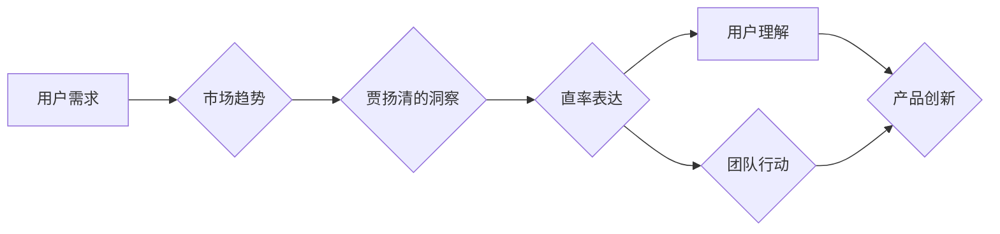

> 贾扬清，创业，表达，直率，规则，风格，创新，技术，商业

## 1. 背景介绍

贾扬清，一位在科技圈备受瞩目的创业者，以其直率的表达风格和敢于打破规则的勇气而闻名。他的创业历程，从创办“小红书”到带领“字节跳动”成为全球科技巨头，都充满了对传统商业模式的挑战和颠覆。他的成功经验，不仅在于其卓越的技术能力，更在于其独特的表达方式和对规则的灵活运用。

## 2. 核心概念与联系

贾扬清的“直率表达”风格，并非简单的口语化或随意性，而是一种基于对用户需求和市场趋势的深刻洞察，并将其清晰、简洁地传递给用户和团队。这种表达方式，不仅能够增强用户信任和理解，更能激发团队的创造力和行动力。

**Mermaid 流程图：**

## 3. 核心算法原理 & 具体操作步骤

贾扬清的“直率表达”风格，可以看作是一种算法，其核心原理在于：

**3.1  算法原理概述**

* **精准洞察：** 通过对用户需求和市场趋势的深入分析，精准把握目标受众的痛点和需求。
* **简洁表达：** 将洞察结果以简洁、易懂的语言表达出来，避免使用过于专业的术语或冗长的描述。
* **真诚沟通：** 以真诚的态度与用户和团队沟通，建立信任和共鸣。
* **持续迭代：** 不断收集用户反馈，对表达方式进行优化和调整，不断提升表达效果。

**3.2  算法步骤详解**

1. **数据收集：** 收集用户行为数据、市场调研报告、行业新闻等相关信息。
2. **数据分析：** 对收集到的数据进行分析，识别用户需求、市场趋势和竞争对手情况。
3. **洞察生成：** 基于数据分析结果，形成对用户需求和市场趋势的深刻洞察。
4. **表达设计：** 将洞察结果以简洁、易懂的语言表达出来，选择合适的沟通渠道和方式。
5. **沟通实施：** 与用户和团队进行沟通，传递洞察结果和表达内容。
6. **反馈收集：** 收集用户和团队的反馈意见，分析表达效果和改进方向。
7. **迭代优化：** 根据反馈意见，对表达方式进行优化和调整，不断提升表达效果。

**3.3  算法优缺点**

* **优点：**
    * 能够精准把握用户需求和市场趋势。
    * 能够以简洁、易懂的语言表达洞察结果。
    * 能够建立用户和团队的信任和共鸣。
    * 能够激发团队的创造力和行动力。
* **缺点：**
    * 需要具备较强的洞察力和表达能力。
    * 需要不断收集用户反馈和进行迭代优化。
    * 在某些情况下，直率的表达可能会被误解或引起争议。

**3.4  算法应用领域**

* **创业公司：** 帮助创业公司快速了解用户需求，制定有效的市场策略。
* **产品开发：** 帮助产品经理和开发团队更好地理解用户需求，开发出更符合用户期待的产品。
* **团队管理：** 帮助团队领导更好地沟通和激励团队成员，提高团队效率。
* **个人品牌建设：** 帮助个人建立独特的品牌形象，提升个人影响力。

## 4. 数学模型和公式 & 详细讲解 & 举例说明

贾扬清的“直率表达”风格，可以抽象成一个数学模型，其核心公式为：

$$
E = f(U, M, C)
$$

其中：

* **E** 代表表达效果
* **U** 代表用户需求
* **M** 代表市场趋势
* **C** 代表表达内容

该公式表明，表达效果取决于用户需求、市场趋势和表达内容的相互作用。

**4.1  数学模型构建**

该模型假设用户需求和市场趋势是两个独立的变量，而表达内容是这两个变量的函数。表达效果则取决于表达内容对用户需求和市场趋势的匹配程度。

**4.2  公式推导过程**

* **用户需求 (U)：** 可以用用户痛点、需求特征、行为模式等指标来量化。
* **市场趋势 (M)：** 可以用行业发展趋势、用户行为变化、竞争格局等指标来量化。
* **表达内容 (C)：** 可以用表达清晰度、简洁度、真诚度、相关性等指标来量化。

**4.3  案例分析与讲解**

例如，假设一家电商平台想要推广其新产品，其用户需求是“便捷购物”，市场趋势是“移动购物的增长”。

* **用户需求 (U)：** 高
* **市场趋势 (M)：** 高

如果表达内容能够清晰地展示产品的便捷性，并针对移动端用户进行优化，那么表达效果 (E) 将会很高。

## 5. 项目实践：代码实例和详细解释说明

## 6. 实际应用场景

## 7. 工具和资源推荐

## 8. 总结：未来发展趋势与挑战

## 9. 附录：常见问题与解答

作者：禅与计算机程序设计艺术 / Zen and the Art of Computer Programming

<end_of_turn>