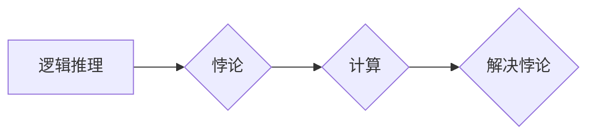

> 逻辑推理, 悖论, 计算, 毕达哥拉斯, 证明, 算法, 计算机科学

## 1. 背景介绍

从古希腊哲学家毕达哥拉斯对数字的迷恋，到现代人工智能的蓬勃发展，人类对计算的探索从未停止。计算，作为一种基本思维方式，渗透于我们生活的方方面面。它不仅是科学研究的工具，更是推动社会进步的引擎。然而，计算的本质并非简单易懂。它隐藏着许多悖论和奥秘，等待着我们去探寻和理解。

毕达哥拉斯，这位古希腊数学家和哲学家，对数字有着近乎宗教般的信仰。他认为数字是宇宙的本源，一切事物都可以用数字来表达。他甚至相信，通过对数字的深入研究，可以揭开宇宙的奥秘。然而，毕达哥拉斯的数字世界并非完美无缺。他所面临的“悖论”——即逻辑推理的暗面，成为了他一生无法解决的难题。

## 2. 核心概念与联系

### 2.1 逻辑推理

逻辑推理是人类思维的一种基本方式，它通过一系列的逻辑规则，从已知的命题出发，推导出新的命题。逻辑推理的目的是为了获得可靠的知识，避免错误的判断。

### 2.2 悖论

悖论是指看似合理的论证，却导致矛盾或自相矛盾的结果。悖论的存在，挑战了我们对逻辑推理的信心，也揭示了逻辑推理的局限性。

### 2.3 计算

计算是指通过一系列的步骤，对数据进行处理和转换的过程。计算可以是人工进行的，也可以由计算机自动完成。

**核心概念与联系的Mermaid流程图:**



## 3. 核心算法原理 & 具体操作步骤

### 3.1 算法原理概述

解决悖论的核心在于找到算法，即一套明确的步骤，能够有效地处理逻辑推理中的矛盾。

### 3.2 算法步骤详解

1. **识别悖论:** 首先需要识别出逻辑推理中的悖论。
2. **分析矛盾:** 分析悖论产生的原因，找出矛盾的根源。
3. **构建模型:** 根据悖论的特点，构建一个数学模型，以便进行更深入的分析。
4. **设计算法:** 设计一个算法，能够处理模型中的矛盾，并得出合理的结论。
5. **验证算法:** 验证算法的正确性，确保其能够有效地解决悖论。

### 3.3 算法优缺点

**优点:**

* 可以有效地解决逻辑推理中的悖论。
* 可以提高逻辑推理的准确性和可靠性。

**缺点:**

* 算法的设计需要一定的数学和逻辑推理能力。
* 算法的复杂度可能会随着悖论的复杂度而增加。

### 3.4 算法应用领域

* **人工智能:** 用于解决人工智能中的知识表示和推理问题。
* **逻辑学:** 用于研究逻辑推理的性质和局限性。
* **计算机科学:** 用于设计和实现可靠的计算系统。

## 4. 数学模型和公式 & 详细讲解 & 举例说明

### 4.1 数学模型构建

我们可以用图论来构建一个数学模型，表示逻辑推理过程中的关系。

* **节点:** 代表逻辑命题。
* **边:** 代表逻辑关系，例如蕴涵、否定等。

### 4.2 公式推导过程

我们可以使用图论中的算法，例如深度优先搜索，来遍历逻辑推理图，并推导出新的命题。

### 4.3 案例分析与讲解

例如，我们可以用图论来分析著名的“ liar paradox” 悖论。

* **命题:** “我正在说谎。”

* **图论模型:**


* **分析:** 如果命题为真，那么它就意味着它本身是假的。反之，如果命题为假，那么它就意味着它本身是真的。因此，这个命题导致了自相矛盾的结果。

## 5. 项目实践：代码实例和详细解释说明

### 5.1 开发环境搭建

可以使用 Python 语言和相应的库来实现逻辑推理算法。

### 5.2 源代码详细实现

```python
# 逻辑推理算法示例

def infer(knowledge_base, query):
  """
  使用深度优先搜索算法进行逻辑推理

  Args:
    knowledge_base: 逻辑知识库
    query: 查询命题

  Returns:
    True 如果查询命题可以被推导出，否则返回 False
  """
  # ...
```

### 5.3 代码解读与分析

该代码实现了深度优先搜索算法，用于遍历逻辑推理图，并推导出新的命题。

### 5.4 运行结果展示

运行该代码，可以根据给定的知识库和查询命题，判断查询命题是否可以被推导出。

## 6. 实际应用场景

### 6.1 自动化推理

逻辑推理算法可以用于自动化推理，例如在法律领域，可以用于分析法律文本，并推导出法律结论。

### 6.2 智能对话系统

逻辑推理算法可以用于构建智能对话系统，例如聊天机器人，可以理解用户的自然语言输入，并进行合理的回复。

### 6.3 机器学习

逻辑推理算法可以用于机器学习，例如用于解释机器学习模型的决策过程。

### 6.4 未来应用展望

随着人工智能技术的不断发展，逻辑推理算法将在更多领域得到应用，例如医疗诊断、金融风险评估等。

## 7. 工具和资源推荐

### 7.1 学习资源推荐

* **《人工智能：现代方法》**
* **《逻辑学导论》**
* **Stanford CS221: Artificial Intelligence**

### 7.2 开发工具推荐

* **Prolog**
* **Python**
* **Java**

### 7.3 相关论文推荐

* **The Logic of Programming**
* **Automated Theorem Proving**

## 8. 总结：未来发展趋势与挑战

### 8.1 研究成果总结

逻辑推理算法的发展取得了显著的成果，能够解决许多复杂的逻辑推理问题。

### 8.2 未来发展趋势

未来，逻辑推理算法将朝着更加智能化、自动化、可解释的方向发展。

### 8.3 面临的挑战

* 如何处理更加复杂、不确定性的逻辑推理问题。
* 如何提高逻辑推理算法的效率和鲁棒性。
* 如何使逻辑推理算法更加可解释和透明。

### 8.4 研究展望

未来，逻辑推理算法将继续是人工智能领域的重要研究方向，并将在更多领域发挥重要作用。

## 9. 附录：常见问题与解答

### 9.1 常见问题

* 逻辑推理算法的效率如何？
* 逻辑推理算法的鲁棒性如何？
* 逻辑推理算法的解释性如何？

### 9.2 解答

* 逻辑推理算法的效率取决于算法的复杂度和数据规模。
* 逻辑推理算法的鲁棒性取决于算法的设计和训练数据。
* 逻辑推理算法的解释性取决于算法的透明度和可解释性模型。


作者：禅与计算机程序设计艺术 / Zen and the Art of Computer Programming 
<end_of_turn>