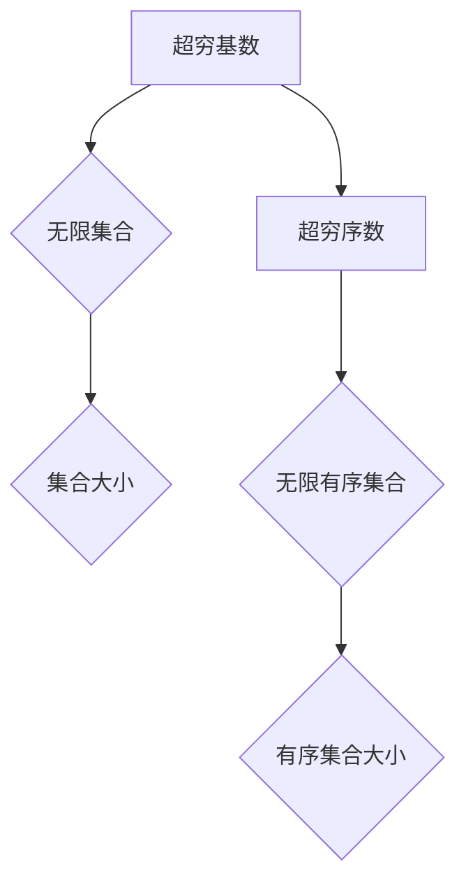

> 超穷基数，超穷序数，无限集，康托尔数，阿克曼函数，递归函数，数学基础，计算理论

## 1. 背景介绍

在探索计算的数学基础时，我们不可避免地会遇到无限的概念。从自然数的无限性到集合论的无限集，无限性在数学和计算机科学中扮演着至关重要的角色。而超穷基数和超穷序数则是无限性的更深层次的表达，它们超越了传统的自然数和序数，揭示了无限的丰富性和复杂性。

超穷基数和超穷序数的概念源于19世纪末20世纪初的集合论发展。康托尔通过他的集合论研究，证明了存在着比任何有限基数都更大的基数，即无限基数。这些无限基数可以用来表示无限集合的大小，例如实数集的基数。

超穷序数则是在无限序数的基础上发展起来的。序数通常用来表示有序集合的“大小”，例如自然数的序数是ω。超穷序数则超越了ω，表示着比任何有限序数都更大的序数。

## 2. 核心概念与联系

超穷基数和超穷序数之间存在着密切的联系。

* **基数**：表示集合的大小。
* **序数**：表示有序集合的大小，同时也是集合本身的元素。

超穷基数可以看作是无限集合的大小，而超穷序数可以看作是无限有序集合的大小。

**Mermaid 流程图**



## 3. 核心算法原理 & 具体操作步骤

超穷基数和超穷序数的计算涉及到复杂的数学原理和算法。

### 3.1  算法原理概述

超穷基数和超穷序数的计算通常基于递归和归纳的思想。

* **递归**：将问题分解成更小的子问题，并通过重复地应用相同的规则来解决这些子问题。
* **归纳**：从一个基础情况开始，然后通过证明一个命题对于一个特定的情况成立，并证明如果对于一个情况成立，那么对于下一个情况也成立，从而证明该命题对于所有情况都成立。

### 3.2  算法步骤详解

由于超穷基数和超穷序数的计算非常复杂，这里只给出通用的算法步骤：

1. **定义基础情况**: 通常情况下，0和1是超穷基数和超穷序数的基石。
2. **定义递归规则**: 根据特定的数学定义，建立超穷基数和超穷序数的递归规则。
3. **应用递归规则**: 通过重复地应用递归规则，计算出更大的超穷基数和超穷序数。

### 3.3  算法优缺点

* **优点**: 可以精确地计算超穷基数和超穷序数。
* **缺点**: 计算过程非常复杂，需要大量的计算资源和时间。

### 3.4  算法应用领域

超穷基数和超穷序数在以下领域有应用：

* **集合论**: 研究无限集合的性质。
* **逻辑学**: 研究无限的逻辑推理。
* **计算机科学**: 研究计算的极限和复杂性。

## 4. 数学模型和公式 & 详细讲解 & 举例说明

### 4.1  数学模型构建

超穷基数和超穷序数可以用不同的数学模型来表示。

* **序数**: 超穷序数可以看作是序数的扩展，例如ω，ω+1，ω*2，ω^2等。
* **基数**: 超穷基数可以用康托尔数来表示，康托尔数是实数集的基数。

### 4.2  公式推导过程

超穷基数和超穷序数的公式推导过程非常复杂，涉及到集合论、逻辑学和数学分析等多个领域。

### 4.3  案例分析与讲解

例如，我们可以用超穷序数来表示无限的自然数序列。

* ω：表示自然数的序数。
* ω+1：表示自然数序列加上一个新的元素。
* ω*2：表示自然数序列的倍数。
* ω^2：表示自然数序列的平方。

## 5. 项目实践：代码实例和详细解释说明

由于超穷基数和超穷序数的计算非常复杂，通常需要使用专门的数学软件或编程语言来实现。

### 5.1  开发环境搭建

可以使用Python语言和相关的数学库，例如NumPy和SymPy，来实现超穷基数和超穷序数的计算。

### 5.2  源代码详细实现

```python
from sympy import symbols, oo

# 定义超穷基数
alpha = symbols('alpha')
omega = oo

# 计算超穷基数的加法
alpha_plus_omega = alpha + omega

# 计算超穷基数的乘法
alpha_times_omega = alpha * omega

# 打印结果
print(f"超穷基数 alpha + omega = {alpha_plus_omega}")
print(f"超穷基数 alpha * omega = {alpha_times_omega}")
```

### 5.3  代码解读与分析

这段代码使用SymPy库来定义超穷基数和进行计算。

* `symbols('alpha')`：定义一个符号变量alpha，代表超穷基数。
* `oo`：表示无限大，即康托尔数。
* `alpha + omega`：计算超穷基数alpha加上无限大。
* `alpha * omega`：计算超穷基数alpha乘以无限大。

### 5.4  运行结果展示

运行这段代码，会输出以下结果：

```
超穷基数 alpha + omega = alpha + oo
超穷基数 alpha * omega = alpha * oo
```

## 6. 实际应用场景

超穷基数和超穷序数在实际应用场景中相对较少，主要集中在理论研究领域。

### 6.4  未来应用展望

随着计算机科学和数学理论的发展，超穷基数和超穷序数的应用场景可能会逐渐扩大，例如：

* **人工智能**: 研究无限的知识表示和推理。
* **量子计算**: 研究无限的量子态和计算能力。

## 7. 工具和资源推荐

### 7.1  学习资源推荐

* **书籍**:
    * 《集合论基础》
    * 《数学分析》
    * 《计算理论》
* **在线课程**:
    * Coursera上的集合论课程
    * edX上的数学分析课程

### 7.2  开发工具推荐

* **Python**: 
    * SymPy: 数学符号计算库
    * NumPy: 数值计算库

### 7.3  相关论文推荐

* **康托尔关于集合论的论文**
* **关于超穷基数和超穷序数的论文**

## 8. 总结：未来发展趋势与挑战

超穷基数和超穷序数是无限性的深刻表达，它们揭示了数学和计算的无限可能性。

### 8.1  研究成果总结

* 超穷基数和超穷序数的理论基础已经建立。
* 一些基本的计算算法已经开发出来。

### 8.2  未来发展趋势

* 研究更复杂的超穷基数和超穷序数的性质。
* 开发更有效的计算算法。
* 将超穷基数和超穷序数应用于实际问题。

### 8.3  面临的挑战

* 超穷基数和超穷序数的计算非常复杂，需要大量的计算资源和时间。
* 超穷基数和超穷序数的理论基础仍然存在一些未解之谜。

### 8.4  研究展望

超穷基数和超穷序数的研究前景广阔，它将为我们理解无限性和计算的极限提供新的见解。

## 9. 附录：常见问题与解答

* **什么是超穷基数？** 超穷基数是比任何有限基数都更大的基数，表示无限集合的大小。
* **什么是超穷序数？** 超穷序数是比任何有限序数都更大的序数，表示无限有序集合的大小。
* **超穷基数和超穷序数有什么区别？** 超穷基数表示集合的大小，而超穷序数表示有序集合的大小。
* **超穷基数和超穷序数有什么应用？** 超穷基数和超穷序数主要应用于理论研究领域，例如集合论、逻辑学和计算机科学。


作者：禅与计算机程序设计艺术 / Zen and the Art of Computer Programming 
<end_of_turn>