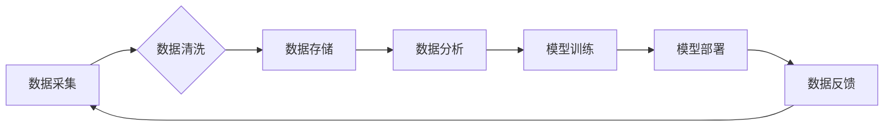

> AI创业, 数据管理, 数据质量, 数据安全, 数据治理, 数据可视化, 数据分析

## 1. 背景介绍

人工智能（AI）技术近年来发展迅速，已渗透到各个行业，并催生了一批新的创业公司。然而，AI创业并非易事，数据管理是AI创业成功的关键因素之一。

数据是AI算法的燃料，高质量的数据可以训练出更精准、更有效的AI模型。然而，现实中，数据往往存在着各种问题，例如不完整、不一致、不准确等，这些问题会直接影响AI模型的性能。因此，如何有效地管理数据，确保数据质量，是AI创业成功的关键。

## 2. 核心概念与联系

**2.1 数据管理的核心概念**

数据管理是指对数据的整个生命周期进行规划、组织、控制和维护的过程。它包括数据采集、存储、处理、分析、共享和安全等多个方面。

**2.2 数据管理与AI创业的关系**

数据管理与AI创业有着密切的联系。AI创业的核心是利用数据训练和部署AI模型，而数据管理则是为AI模型提供高质量数据的基础。

**2.3 数据管理的重点**

在AI创业中，数据管理的重点包括：

* **数据质量:** 确保数据的准确性、完整性、一致性和时效性。
* **数据安全:** 保护数据的机密性和完整性，防止数据泄露和篡改。
* **数据治理:** 建立数据管理的规范和流程，确保数据的使用合规性和可追溯性。
* **数据可视化:** 将数据以直观的方式呈现出来，方便用户理解和分析。
* **数据分析:** 利用数据分析技术挖掘数据中的价值，为AI模型的训练和部署提供支持。

**2.4 数据管理流程图**



## 3. 核心算法原理 & 具体操作步骤

**3.1 算法原理概述**

数据清洗是数据管理的重要环节，它旨在消除数据中的噪声、错误和不完整信息，提高数据的质量。常见的算法包括：

* **缺失值处理:** 使用平均值、中位数或其他方法填充缺失值。
* **异常值处理:** 删除或替换异常值，例如使用箱线图识别异常值。
* **数据标准化:** 将数据转换为标准化格式，例如将数据缩放到0到1之间。
* **数据转换:** 将数据转换为其他格式，例如将文本数据转换为数字数据。

**3.2 算法步骤详解**

1. **数据收集:** 收集需要清洗的数据。
2. **数据预处理:** 对数据进行初步处理，例如删除重复数据、转换数据类型等。
3. **缺失值处理:** 使用合适的算法处理缺失值。
4. **异常值处理:** 使用合适的算法处理异常值。
5. **数据标准化:** 将数据转换为标准化格式。
6. **数据转换:** 将数据转换为其他格式。
7. **数据验证:** 验证数据清洗的结果，确保数据质量达到预期要求。

**3.3 算法优缺点**

* **优点:** 可以有效地提高数据质量，为AI模型的训练提供高质量的数据。
* **缺点:** 数据清洗过程可能比较复杂，需要一定的专业知识和经验。

**3.4 算法应用领域**

数据清洗算法广泛应用于各个领域，例如：

* **金融:** 处理金融数据的异常值和缺失值，提高风险评估的准确性。
* **医疗:** 处理医疗数据的噪声和不完整信息，提高疾病诊断的准确性。
* **电商:** 处理电商数据的缺失值和异常值，提高商品推荐的准确性。

## 4. 数学模型和公式 & 详细讲解 & 举例说明

**4.1 数学模型构建**

数据清洗可以看作是一个优化问题，目标是找到最优的清洗策略，以最大程度地提高数据质量。可以使用数学模型来描述数据清洗过程，例如：

* **目标函数:** 用于衡量数据质量，例如数据完整性、准确性和一致性。
* **约束条件:** 用于限制清洗策略的选择，例如数据量、时间限制等。

**4.2 公式推导过程**

可以使用数学工具，例如线性规划、非线性规划等，来求解数据清洗的优化问题。

**4.3 案例分析与讲解**

例如，假设我们有一个包含客户信息的数据库，其中存在一些缺失值和异常值。我们可以使用数学模型来构建一个数据清洗策略，例如：

* **目标函数:** 最大化客户信息的完整性和准确性。
* **约束条件:** 

    * 允许填充缺失值，但填充值必须符合一定的规则。
    * 允许删除异常值，但删除异常值必须经过一定的判断标准。

通过求解这个优化问题，我们可以得到一个最优的清洗策略，以最大程度地提高客户信息的质量。

## 5. 项目实践：代码实例和详细解释说明

**5.1 开发环境搭建**

可以使用Python语言和相关的库来实现数据清洗。例如，可以使用Pandas库来处理数据，Scikit-learn库来处理异常值，Numpy库来进行数据转换等。

**5.2 源代码详细实现**

```python
import pandas as pd

# 读取数据
data = pd.read_csv('customer_data.csv')

# 处理缺失值
data['age'].fillna(data['age'].mean(), inplace=True)

# 处理异常值
data = data[(data['income'] > 0) & (data['income'] < 1000000)]

# 数据标准化
data['income'] = (data['income'] - data['income'].min()) / (data['income'].max() - data['income'].min())

# 保存数据
data.to_csv('cleaned_data.csv', index=False)
```

**5.3 代码解读与分析**

这段代码首先读取了客户数据，然后使用Pandas库的fillna方法填充缺失值，使用条件筛选删除异常值，最后使用数据标准化方法将收入数据转换为标准化格式。

**5.4 运行结果展示**

运行这段代码后，会生成一个名为cleaned_data.csv的文件，该文件包含了清洗后的客户数据。

## 6. 实际应用场景

**6.1 数据清洗在AI创业中的应用场景**

数据清洗在AI创业中应用广泛，例如：

* **图像识别:** 清洗图像数据，去除噪声和模糊，提高图像识别模型的准确性。
* **自然语言处理:** 清洗文本数据，去除停用词和标点符号，提高自然语言处理模型的性能。
* **推荐系统:** 清洗用户行为数据，去除异常行为，提高推荐系统的准确性。

**6.2 案例分析**

例如，一家AI创业公司开发了一个图像识别模型，用于识别不同种类的水果。为了提高模型的准确性，他们需要对水果图像数据进行清洗，去除背景噪声、模糊图像等问题。通过数据清洗，他们可以提高模型的识别精度，并最终开发出更成功的图像识别产品。

**6.4 未来应用展望**

随着AI技术的不断发展，数据清洗在AI创业中的应用场景将会更加广泛。例如，随着自动驾驶技术的进步，数据清洗将被用于处理自动驾驶车辆收集到的海量数据，提高自动驾驶系统的安全性。

## 7. 工具和资源推荐

**7.1 学习资源推荐**

* **书籍:**

    * 《数据清洗与数据质量管理》
    * 《数据挖掘实战》

* **在线课程:**

    * Coursera上的《数据科学》课程
    * edX上的《数据分析》课程

**7.2 开发工具推荐**

* **Python:** 

    * Pandas
    * Scikit-learn
    * Numpy

* **其他工具:**

    * Trifacta Wrangler
    * Alteryx

**7.3 相关论文推荐**

* 《数据清洗方法综述》
* 《数据质量评估方法研究》

## 8. 总结：未来发展趋势与挑战

**8.1 研究成果总结**

数据清洗技术近年来取得了显著的进展，出现了许多新的算法和工具。这些技术可以有效地提高数据质量，为AI模型的训练和部署提供高质量的数据。

**8.2 未来发展趋势**

未来，数据清洗技术将朝着以下几个方向发展：

* **自动化:** 使用机器学习算法自动识别和处理数据中的问题。
* **智能化:** 使用人工智能技术，根据数据的特点选择最合适的清洗策略。
* **可解释性:** 使数据清洗过程更加透明，更容易理解。

**8.3 面临的挑战**

数据清洗技术也面临着一些挑战，例如：

* **数据复杂性:** 随着数据的规模和复杂性不断增加，数据清洗变得更加困难。
* **数据隐私:** 数据清洗过程中需要处理敏感数据，需要保证数据的隐私安全。
* **标准化:** 数据清洗缺乏统一的标准和规范，不同领域的应用场景存在差异。

**8.4 研究展望**

未来，需要进一步研究数据清洗的自动化、智能化和可解释性，并解决数据复杂性、数据隐私和标准化等挑战，推动数据清洗技术的发展。

## 9. 附录：常见问题与解答

**9.1 如何处理缺失值？**

常见的处理缺失值的方法包括：

* **删除含有缺失值的记录:** 这种方法简单粗暴，可能会导致数据丢失。
* **使用平均值、中位数或其他统计量填充缺失值:** 这种方法可以保留所有数据，但可能会引入偏差。
* **使用机器学习算法预测缺失值:** 这种方法可以更准确地预测缺失值，但需要训练模型。

**9.2 如何处理异常值？**

常见的处理异常值的方法包括：

* **删除异常值:** 这种方法简单粗暴，可能会导致数据丢失。
* **替换异常值:** 可以使用平均值、中位数或其他统计量替换异常值。
* **使用机器学习算法识别异常值:** 这种方法可以更准确地识别异常值，但需要训练模型。


作者：禅与计算机程序设计艺术 / Zen and the Art of Computer Programming 
<end_of_turn>