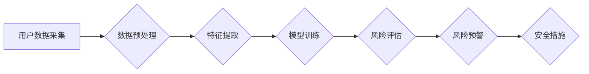

>  电商安全风险评估，用户数据安全，人工智能，机器学习，深度学习，数据分析，风险预测

## 1. 背景介绍

随着电商行业的蓬勃发展，用户数据已成为企业最重要的资产之一。然而，随着数据规模的不断扩大，用户数据安全风险也日益突出。数据泄露、隐私侵犯等事件频发，给电商企业带来了巨大的经济损失和声誉损害。因此，如何有效评估和控制用户数据安全风险，成为电商企业面临的重大挑战。

传统的数据安全风险评估方法主要依赖于人工分析和规则匹配，效率低下，难以应对复杂多变的攻击场景。而人工智能（AI）技术的快速发展为电商企业提供了新的解决方案。AI技术能够通过学习和分析海量数据，识别潜在的安全威胁，并提供精准的风险评估和预警。

## 2. 核心概念与联系

### 2.1 用户数据安全风险

用户数据安全风险是指用户数据在电商平台上被非法获取、使用、披露或篡改的可能性。

### 2.2 人工智能（AI）

人工智能（AI）是指模拟人类智能行为的计算机系统。AI技术涵盖了机器学习、深度学习、自然语言处理等多个领域。

### 2.3 机器学习（ML）

机器学习（ML）是AI的一个子领域，它通过算法训练模型，使模型能够从数据中学习并做出预测。

### 2.4 深度学习（DL）

深度学习（DL）是机器学习的一个子领域，它使用多层神经网络来模拟人类大脑的学习过程。

**AI在电商用户数据安全风险评估中的应用流程**



## 3. 核心算法原理 & 具体操作步骤

### 3.1 算法原理概述

在电商用户数据安全风险评估中，常用的算法包括：

* **异常检测算法**: 识别数据中的异常值，例如账户登录时间、地点、设备等异常行为。
* **关联规则挖掘算法**: 发现用户数据之间的关联关系，例如哪些用户同时访问了哪些敏感页面。
* **分类算法**: 将用户数据进行分类，例如高风险用户、中风险用户、低风险用户。

### 3.2 算法步骤详解

**异常检测算法为例**

1. **数据采集**: 收集用户数据，例如登录时间、地点、设备等。
2. **数据预处理**: 对数据进行清洗、转换、归一化等处理。
3. **特征提取**: 从数据中提取特征，例如用户登录频率、登录时间段、登录设备类型等。
4. **模型训练**: 使用异常检测算法训练模型，例如K-Means聚类算法、Isolation Forest算法等。
5. **风险评估**: 将新用户数据输入模型，预测其是否属于异常行为。
6. **风险预警**: 当模型预测用户行为异常时，发出风险预警。

### 3.3 算法优缺点

**异常检测算法的优缺点**

* **优点**: 能够识别未知的攻击模式，对数据量要求不高。
* **缺点**: 难以区分正常行为和异常行为的边界，容易产生误报。

### 3.4 算法应用领域

异常检测算法广泛应用于：

* **网络安全**: 检测网络攻击、入侵行为。
* **欺诈检测**: 检测信用卡欺诈、账户盗用等行为。
* **用户行为分析**: 识别用户异常行为，例如恶意注册、刷单等。

## 4. 数学模型和公式 & 详细讲解 & 举例说明

### 4.1 数学模型构建

**异常检测算法的数学模型**

假设用户数据特征向量为X，模型的目标是学习一个异常值分布P(X)，并根据该分布判断新用户数据是否属于异常值。

### 4.2 公式推导过程

**K-Means聚类算法的公式推导**

1. **距离计算**: 使用欧氏距离计算数据点之间的距离。
2. **聚类中心更新**: 计算每个簇的中心点，并更新聚类中心的位置。
3. **数据点分配**: 将每个数据点分配到距离其最近的聚类中心。

### 4.3 案例分析与讲解

**异常检测算法在电商平台中的应用案例**

电商平台可以使用异常检测算法检测用户账户登录异常行为，例如：

* 用户在短时间内多次尝试登录同一个账户。
* 用户从不同地理位置登录同一个账户。
* 用户使用不同的设备登录同一个账户。

当系统检测到这些异常行为时，会发出风险预警，并采取相应的安全措施，例如锁定账户、发送短信验证码等。

## 5. 项目实践：代码实例和详细解释说明

### 5.1 开发环境搭建

* 操作系统: Ubuntu 20.04
* Python 版本: 3.8
* 必要的库: scikit-learn, pandas, numpy

### 5.2 源代码详细实现

```python
import pandas as pd
from sklearn.ensemble import IsolationForest

# 加载用户数据
data = pd.read_csv('user_data.csv')

# 数据预处理
# ...

# 特征提取
features = data[['login_frequency', 'login_time_range', 'device_type']]

# 模型训练
model = IsolationForest(contamination=0.1)
model.fit(features)

# 风险评估
predictions = model.predict(features)

# 风险预警
# ...
```

### 5.3 代码解读与分析

* **数据加载**: 使用pandas库加载用户数据。
* **数据预处理**: 对数据进行清洗、转换、归一化等处理。
* **特征提取**: 从数据中提取特征，例如用户登录频率、登录时间段、登录设备类型等。
* **模型训练**: 使用IsolationForest算法训练模型，并设置异常值比例为0.1。
* **风险评估**: 使用训练好的模型预测用户数据是否属于异常值。
* **风险预警**: 当模型预测用户数据为异常值时，发出风险预警。

### 5.4 运行结果展示

运行代码后，会输出用户数据是否属于异常值的预测结果。

## 6. 实际应用场景

### 6.1 用户注册风险评估

电商平台可以使用AI技术评估用户注册风险，例如识别恶意注册、虚假账户等。

### 6.2 交易安全风险评估

电商平台可以使用AI技术评估交易安全风险，例如识别欺诈交易、刷单行为等。

### 6.3 数据泄露风险评估

电商平台可以使用AI技术评估数据泄露风险，例如识别数据漏洞、恶意攻击等。

### 6.4 未来应用展望

* **个性化风险评估**: 根据用户的行为特征和历史数据，提供个性化的风险评估和安全建议。
* **实时风险监控**: 使用实时数据流进行风险监控，及时发现和应对新的安全威胁。
* **自动化安全响应**: 使用AI技术自动执行安全响应措施，例如锁定账户、封禁IP地址等。

## 7. 工具和资源推荐

### 7.1 学习资源推荐

* **书籍**:
    * 《深度学习》
    * 《机器学习实战》
* **在线课程**:
    * Coursera: 深度学习
    * edX: 机器学习

### 7.2 开发工具推荐

* **Python**: 广泛用于机器学习和深度学习开发。
* **scikit-learn**: Python机器学习库。
* **TensorFlow**: Google开发的深度学习框架。
* **PyTorch**: Facebook开发的深度学习框架。

### 7.3 相关论文推荐

* **Isolation Forest**: https://arxiv.org/abs/1706.01407
* **Anomaly Detection with Deep Learning**: https://arxiv.org/abs/1803.01869

## 8. 总结：未来发展趋势与挑战

### 8.1 研究成果总结

AI技术在电商用户数据安全风险评估领域取得了显著成果，能够有效识别和预测安全威胁，提高电商平台的安全防护能力。

### 8.2 未来发展趋势

* **模型精度提升**: 研究更准确、更鲁棒的异常检测算法。
* **数据融合**: 将来自不同来源的数据融合，提高风险评估的准确性。
* **解释性增强**: 使AI模型的决策过程更加透明可解释。

### 8.3 面临的挑战

* **数据隐私保护**: 如何在保证数据安全的同时，有效利用用户数据进行风险评估。
* **算法可解释性**: 如何提高AI模型的解释性，增强用户信任。
* **技术伦理**: 如何确保AI技术在安全风险评估中的应用符合伦理道德规范。

### 8.4 研究展望

未来，AI技术在电商用户数据安全风险评估领域将继续发挥重要作用，并朝着更智能、更安全、更可信的方向发展。

## 9. 附录：常见问题与解答

**常见问题**:

* **AI模型的准确率如何？**

**解答**: AI模型的准确率取决于多种因素，例如数据质量、算法选择、模型训练等。一般来说，经过充分训练的AI模型能够达到较高的准确率。

* **AI模型是否会产生误报？**

**解答**: 任何AI模型都可能产生误报，这是因为现实世界的数据往往是复杂多变的。

* **如何保证AI模型的安全性？**

**解答**: 为了保证AI模型的安全性，需要采取多种措施，例如数据加密、模型安全审计等。

作者：禅与计算机程序设计艺术 / Zen and the Art of Computer Programming


<end_of_turn>