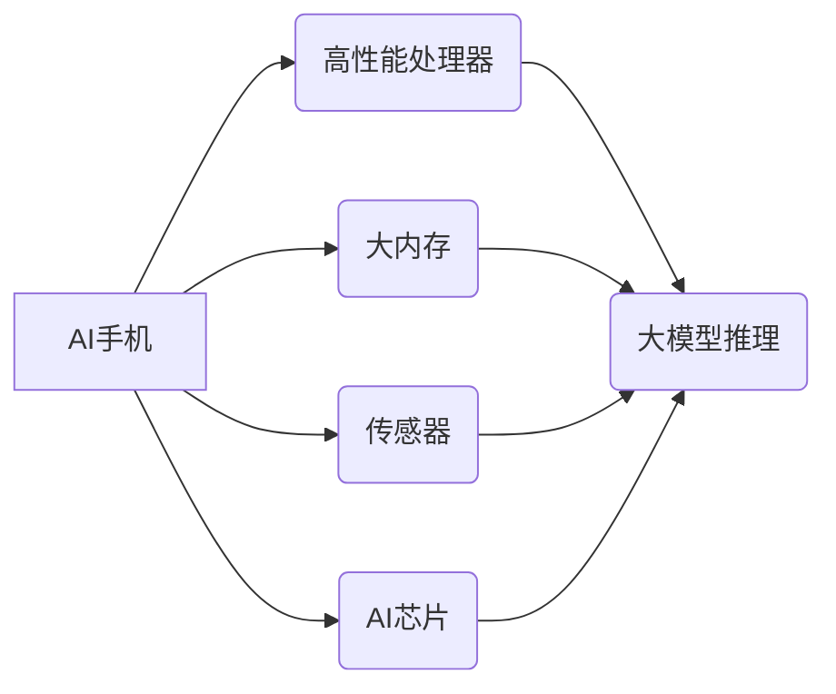

> AI手机,大模型,深度学习,自然语言处理,计算机视觉,边缘计算,移动智能,人工智能应用

## 1. 背景介绍

近年来，人工智能（AI）技术飞速发展，深度学习算法取得了突破性进展，大模型的出现更是推动了AI技术的广泛应用。大模型，是指参数规模庞大、训练数据海量的人工智能模型，其强大的学习能力和泛化能力使其在自然语言处理、计算机视觉、语音识别等领域展现出巨大的潜力。

与此同时，移动智能设备的普及和发展也为AI技术的应用提供了广阔的平台。手机作为人们日常生活中不可或缺的工具，拥有强大的计算能力、海量存储空间和丰富的传感器数据，为部署和运行AI模型提供了理想的硬件环境。

基于以上背景，AI手机应运而生。AI手机是指将大模型集成到手机设备中，利用手机的强大计算能力和传感器数据，实现更智能、更便捷的移动体验。

## 2. 核心概念与联系

**2.1 AI手机的构成**

AI手机的核心部件包括：

* **高性能处理器:** 负责运行大模型的计算任务，例如CPU、GPU、NPU等。
* **大内存:** 存储大模型的参数和中间结果，例如RAM、ROM等。
* **传感器:** 收集手机周围的环境信息，例如摄像头、麦克风、陀螺仪、加速度计等。
* **AI芯片:** 专为AI计算量身定制的芯片，可以加速大模型的推理速度。

**2.2 大模型的部署**

大模型的部署方式主要有两种：

* **云端部署:** 将大模型部署在云服务器上，手机通过网络请求云端进行推理计算。
* **边缘部署:** 将大模型部署在手机设备上，手机本地进行推理计算。

**2.3 核心概念关系图**



## 3. 核心算法原理 & 具体操作步骤

**3.1 算法原理概述**

大模型的训练主要基于深度学习算法，例如卷积神经网络（CNN）、循环神经网络（RNN）和Transformer等。这些算法通过多层神经网络结构，学习数据中的特征和模式，从而实现对数据的理解和预测。

**3.2 算法步骤详解**

1. **数据预处理:** 将原始数据进行清洗、转换和格式化，使其适合模型训练。
2. **模型构建:** 根据任务需求选择合适的深度学习模型架构，并设置模型参数。
3. **模型训练:** 使用训练数据训练模型，通过调整模型参数，使模型的预测结果与真实值尽可能接近。
4. **模型评估:** 使用测试数据评估模型的性能，例如准确率、召回率、F1-score等。
5. **模型部署:** 将训练好的模型部署到目标平台，例如云服务器或手机设备。

**3.3 算法优缺点**

**优点:**

* 强大的学习能力，能够学习复杂的数据模式。
* 泛化能力强，能够应用于不同的任务和领域。
* 持续改进，随着训练数据的增加，模型性能不断提升。

**缺点:**

* 训练成本高，需要大量的计算资源和训练数据。
* 模型解释性差，难以理解模型的决策过程。
* 容易受到数据偏差的影响，导致模型存在偏见。

**3.4 算法应用领域**

* 自然语言处理：文本分类、情感分析、机器翻译、对话系统等。
* 计算机视觉：图像识别、物体检测、图像分割、视频分析等。
* 语音识别：语音转文本、语音助手、语音搜索等。
* 其他领域：医疗诊断、金融风险评估、推荐系统等。

## 4. 数学模型和公式 & 详细讲解 & 举例说明

**4.1 数学模型构建**

深度学习模型通常采用神经网络结构，其核心是多层感知机（MLP）。MLP由多个神经元组成，每个神经元接收多个输入信号，并通过激活函数进行处理，输出一个信号。

**4.2 公式推导过程**

* **激活函数:** 激活函数的作用是将神经元的输入信号转换为输出信号，常用的激活函数包括ReLU、Sigmoid和Tanh等。

* **损失函数:** 损失函数用于衡量模型预测结果与真实值的差距，常用的损失函数包括交叉熵损失和均方误差损失等。

* **梯度下降:** 梯度下降算法用于优化模型参数，通过计算损失函数的梯度，不断调整模型参数，使损失函数最小化。

**4.3 案例分析与讲解**

以图像分类为例，假设我们有一个包含10个类别的数据集，每个类别有1000张图片。我们可以使用CNN模型进行图像分类，CNN模型由多个卷积层、池化层和全连接层组成。

* **卷积层:** 用于提取图像特征，例如边缘、纹理等。
* **池化层:** 用于降低图像尺寸，并提取更抽象的特征。
* **全连接层:** 用于将提取的特征映射到10个类别。

训练过程中，我们使用交叉熵损失函数和梯度下降算法，不断调整模型参数，使模型能够准确地将图像分类到正确的类别。

## 5. 项目实践：代码实例和详细解释说明

**5.1 开发环境搭建**

* 操作系统：Ubuntu 20.04
* Python 版本：3.8
* 深度学习框架：TensorFlow 2.0

**5.2 源代码详细实现**

```python
import tensorflow as tf

# 定义模型结构
model = tf.keras.models.Sequential([
    tf.keras.layers.Conv2D(32, (3, 3), activation='relu', input_shape=(28, 28, 1)),
    tf.keras.layers.MaxPooling2D((2, 2)),
    tf.keras.layers.Conv2D(64, (3, 3), activation='relu'),
    tf.keras.layers.MaxPooling2D((2, 2)),
    tf.keras.layers.Flatten(),
    tf.keras.layers.Dense(10, activation='softmax')
])

# 编译模型
model.compile(optimizer='adam',
              loss='sparse_categorical_crossentropy',
              metrics=['accuracy'])

# 训练模型
model.fit(x_train, y_train, epochs=5)

# 评估模型
loss, accuracy = model.evaluate(x_test, y_test)
print('Test loss:', loss)
print('Test accuracy:', accuracy)
```

**5.3 代码解读与分析**

* 代码首先定义了一个简单的CNN模型，包含两个卷积层、两个池化层和一个全连接层。
* 然后，使用Adam优化器、交叉熵损失函数和准确率指标编译模型。
* 最后，使用训练数据训练模型，并使用测试数据评估模型性能。

**5.4 运行结果展示**

训练完成后，模型的准确率通常会达到较高的水平，例如在MNIST手写数字识别任务中，模型的准确率可以达到98%以上。

## 6. 实际应用场景

**6.1 智能助手**

AI手机可以集成智能助手，例如Siri、Google Assistant等，通过语音识别和自然语言理解，帮助用户完成各种任务，例如设置提醒、发送邮件、查询天气等。

**6.2 个性化推荐**

AI手机可以根据用户的使用习惯和偏好，提供个性化的应用推荐、内容推荐和商品推荐。

**6.3 增强现实**

AI手机可以利用摄像头和传感器数据，实现增强现实功能，例如在现实世界中叠加虚拟物体，提供交互式体验。

**6.4 语音翻译**

AI手机可以实现实时语音翻译，帮助用户跨语言交流。

**6.5 健康监测**

AI手机可以利用传感器数据，监测用户的健康状况，例如心率、睡眠质量等，并提供健康建议。

**6.4 未来应用展望**

随着AI技术的不断发展，AI手机的应用场景将更加广泛，例如：

* **医疗诊断:** AI手机可以辅助医生进行诊断，例如识别皮肤病、分析X光片等。
* **教育辅助:** AI手机可以提供个性化的学习辅导，例如智能答疑、语音朗读等。
* **安全监控:** AI手机可以作为安全监控设备，例如识别陌生人、报警等。

## 7. 工具和资源推荐

**7.1 学习资源推荐**

* **在线课程:** Coursera、edX、Udacity等平台提供丰富的AI课程。
* **书籍:** 《深度学习》、《机器学习》、《人工智能》等书籍。
* **开源项目:** TensorFlow、PyTorch、Keras等开源项目。

**7.2 开发工具推荐**

* **深度学习框架:** TensorFlow、PyTorch、Keras等。
* **编程语言:** Python。
* **云平台:** AWS、Azure、Google Cloud等。

**7.3 相关论文推荐**

* **Transformer:** Attention Is All You Need
* **BERT:** BERT: Pre-training of Deep Bidirectional Transformers for Language Understanding
* **GPT-3:** Language Models are Few-Shot Learners

## 8. 总结：未来发展趋势与挑战

**8.1 研究成果总结**

近年来，AI手机领域取得了显著进展，大模型的性能不断提升，应用场景不断拓展。

**8.2 未来发展趋势**

* **模型轻量化:** 开发更轻量化的模型，降低手机的计算资源消耗。
* **边缘计算:** 将更多AI计算任务部署到手机设备上，提高计算效率和隐私保护。
* **多模态交互:** 支持多种输入方式，例如语音、图像、文本等，实现更自然的人机交互。

**8.3 面临的挑战**

* **数据隐私:** AI手机收集大量用户数据，如何保护用户隐私是一个重要挑战。
* **计算资源:** 大模型的训练和推理需要大量的计算资源，如何降低手机的功耗和热量是一个技术难题。
* **算法安全:** AI模型容易受到攻击，如何保证模型的安全性是一个关键问题。

**8.4 研究展望**

未来，AI手机将朝着更智能、更便捷、更安全的方向发展，为人们的生活带来更多便利和乐趣。


## 9. 附录：常见问题与解答

**9.1 如何选择合适的AI手机？**

选择AI手机时，需要考虑以下因素：

* 处理器性能：选择高性能处理器，例如骁龙8 Gen 2、天玑9200等。
* 内存容量：选择大内存，例如8GB、12GB等，可以提高手机的运行流畅度。
* 存储空间：选择大存储空间，例如128GB、256GB等，可以存储更多应用和数据。
* AI芯片：选择配备AI芯片的手机，可以加速AI模型的推理速度。

**9.2 AI手机的安全性如何？**

AI手机的安全性是一个重要问题，需要采取以下措施：

* 使用安全的操作系统和应用商店。
* 定期更新手机系统和应用。
* 使用强密码和多因素身份验证。
* 注意保护个人隐私信息。

**9.3 AI手机的未来发展趋势是什么？**

AI手机的未来发展趋势包括：

* 模型轻量化
* 边缘计算
* 多模态交互
* 更智能的应用场景


作者：禅与计算机程序设计艺术 / Zen and the Art of Computer Programming 
<end_of_turn>