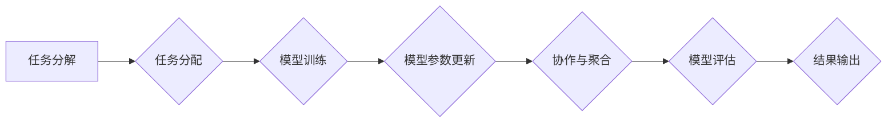

> AI模型, 任务分配, 协作, 分布式训练, 联邦学习, 任务调度, 资源管理, 效率优化

## 1. 背景介绍

随着人工智能技术的飞速发展，AI模型规模不断扩大，训练和部署的复杂度也随之提高。传统的单机训练模式已难以满足对大规模模型训练的需求，分布式训练和联邦学习等技术应运而生。然而，在分布式环境下，如何高效地分配任务给不同的模型节点，并协调模型之间的协作，仍然是一个重要的挑战。

本篇文章将深入探讨AI模型的任务分配与协作问题，分析其核心概念、算法原理、实践案例以及未来发展趋势。

## 2. 核心概念与联系

**2.1 任务分配**

任务分配是指将一个大型任务分解成多个子任务，并将其分配给不同的模型节点进行处理。

**2.2 协作**

协作是指多个模型节点之间进行信息共享和模型参数更新，共同完成一个大型任务。

**2.3 分布式训练**

分布式训练是指将模型参数和数据分布在多个节点上，并通过通信协议进行参数更新，从而实现大规模模型的训练。

**2.4 联邦学习**

联邦学习是一种分布式训练的特殊形式，模型参数在本地节点上进行更新，而模型权重则在中央服务器上进行聚合。

**2.5 任务调度**

任务调度是指根据任务优先级、资源可用性和模型节点状态等因素，动态分配任务给不同的模型节点。

**2.6 资源管理**

资源管理是指监控和管理模型训练所需的计算资源、存储资源和网络资源。

**2.7 效率优化**

效率优化是指通过优化任务分配策略、协作机制和资源管理策略，提高模型训练的效率。

**Mermaid 流程图**



## 3. 核心算法原理 & 具体操作步骤

### 3.1  算法原理概述

任务分配和协作算法的核心目标是将任务高效地分配给不同的模型节点，并协调模型之间的协作，以实现模型训练的加速和效率提升。常见的算法包括：

* **基于优先级的任务分配算法:** 根据任务的优先级、截止时间和资源需求等因素，优先分配给具有更高优先级的任务。
* **基于资源的动态任务分配算法:** 根据模型节点的可用资源和任务的资源需求，动态分配任务，以最大化资源利用率。
* **基于协作的模型训练算法:** 通过模型参数共享和更新机制，协调模型之间的协作，实现模型训练的加速和性能提升。

### 3.2  算法步骤详解

**3.2.1 基于优先级的任务分配算法**

1. 将任务分解成多个子任务。
2. 为每个子任务分配优先级。
3. 根据优先级，将任务分配给不同的模型节点。
4. 模型节点根据任务优先级进行处理。

**3.2.2 基于资源的动态任务分配算法**

1. 监控模型节点的可用资源。
2. 评估任务的资源需求。
3. 根据资源可用性和任务需求，动态分配任务。
4. 调整任务分配策略，以优化资源利用率。

**3.2.3 基于协作的模型训练算法**

1. 将模型参数分布在不同的模型节点上。
2. 模型节点根据本地数据进行模型训练。
3. 模型节点将模型参数更新发送到中央服务器。
4. 中央服务器聚合模型参数，并更新全局模型参数。
5. 将更新后的全局模型参数发送回模型节点。

### 3.3  算法优缺点

**3.3.1 基于优先级的任务分配算法**

* **优点:** 简单易实现，易于理解。
* **缺点:** 无法动态调整任务分配策略，可能导致资源浪费或任务延迟。

**3.3.2 基于资源的动态任务分配算法**

* **优点:** 可以动态调整任务分配策略，提高资源利用率。
* **缺点:** 需要复杂的资源监控和调度机制。

**3.3.3 基于协作的模型训练算法**

* **优点:** 可以加速模型训练，提高模型性能。
* **缺点:** 需要复杂的通信协议和参数更新机制。

### 3.4  算法应用领域

* **大规模模型训练:** 分布式训练和联邦学习可以用于训练大型语言模型、图像识别模型等。
* **边缘计算:** 基于协作的模型训练可以用于边缘设备上的模型训练和推理。
* **数据隐私保护:** 联邦学习可以用于保护用户数据隐私，在不泄露原始数据的情况下进行模型训练。

## 4. 数学模型和公式 & 详细讲解 & 举例说明

### 4.1  数学模型构建

**4.1.1 任务分配模型**

假设有N个任务，M个模型节点，每个任务的优先级为p_i，模型节点的资源可用量为r_j。任务分配模型的目标是最大化任务完成的总优先级，同时满足资源约束。

**4.1.2 协作模型**

协作模型的目标是通过模型参数更新机制，使模型整体性能达到最大化。常用的协作模型包括：

* **平均聚合:** 将所有模型节点的模型参数平均聚合。
* **加权聚合:** 根据模型节点的性能或贡献度，对模型参数进行加权聚合。

### 4.2  公式推导过程

**4.2.1 任务分配模型优化目标函数**

```latex
max \sum_{i=1}^{N} p_i * x_{ij}
```

**约束条件:**

```latex
\sum_{i=1}^{N} x_{ij} \leq r_j, j = 1, 2, ..., M
```

其中，x_{ij}表示任务i是否被分配给模型节点j，取值为0或1。

**4.2.2 协作模型性能指标**

常用的协作模型性能指标包括：

* **准确率:** 模型预测结果与真实结果的匹配度。
* **召回率:** 模型预测出所有正例样本的比例。
* **F1-score:** 准确率和召回率的调和平均值。

### 4.3  案例分析与讲解

**4.3.1 任务分配案例**

假设有5个任务，3个模型节点，每个任务的优先级分别为5, 3, 2, 4, 1，每个模型节点的资源可用量分别为10, 8, 6。

可以使用线性规划算法求解任务分配模型，得到最优的任务分配方案。

**4.3.2 协作模型案例**

假设有3个模型节点，每个节点训练了一个图像识别模型。可以使用平均聚合或加权聚合方法，将模型参数聚合到一个全局模型中。

可以通过测试全局模型的性能，评估协作模型的效果。

## 5. 项目实践：代码实例和详细解释说明

### 5.1  开发环境搭建

* 操作系统: Ubuntu 20.04
* Python 版本: 3.8
* 框架: PyTorch

### 5.2  源代码详细实现

```python
# 任务分配算法示例
def task_allocation(tasks, nodes):
    # ...
    return allocated_tasks

# 协作模型训练示例
def collaborative_training(models):
    # ...
    return global_model

# 任务调度示例
def task_scheduler(tasks, nodes):
    # ...
    return scheduled_tasks
```

### 5.3  代码解读与分析

* **任务分配算法:** 该算法根据任务优先级和节点资源可用量，分配任务给不同的节点。
* **协作模型训练:** 该算法将多个模型节点的模型参数聚合，训练一个全局模型。
* **任务调度:** 该算法根据任务优先级、节点状态和资源可用量，动态分配任务给不同的节点。

### 5.4  运行结果展示

* 任务分配结果: 显示每个任务分配给哪个节点。
* 协作模型性能: 显示全局模型的准确率、召回率和F1-score。
* 任务调度效率: 显示任务完成时间和资源利用率。

## 6. 实际应用场景

### 6.1  大规模模型训练

* 使用分布式训练技术，训练大型语言模型、图像识别模型等。
* 提高模型训练速度和效率，降低训练成本。

### 6.2  边缘计算

* 在边缘设备上进行模型训练和推理，降低网络延迟和数据传输成本。
* 利用协作模型训练技术，在有限的边缘设备资源上训练高效的模型。

### 6.3  数据隐私保护

* 使用联邦学习技术，在不泄露原始数据的情况下进行模型训练。
* 保护用户数据隐私，满足数据安全和合规性要求。

### 6.4  未来应用展望

* **更智能的任务分配算法:** 基于机器学习和深度学习技术，开发更智能的任务分配算法，能够动态调整任务分配策略，并根据任务特性和节点状态进行优化。
* **更有效的协作机制:** 研究更有效的协作机制，例如异步协作、联邦蒸馏等，提高模型训练效率和性能。
* **更广泛的应用场景:** 将任务分配和协作技术应用于更多领域，例如科学计算、金融分析、医疗诊断等。

## 7. 工具和资源推荐

### 7.1  学习资源推荐

* **书籍:**
    * 《深度学习》
    * 《分布式机器学习》
    * 《联邦学习》
* **在线课程:**
    * Coursera: 深度学习
    * edX: 分布式机器学习
    * fast.ai: 深度学习

### 7.2  开发工具推荐

* **框架:** PyTorch, TensorFlow
* **分布式训练框架:** Horovod, Ray
* **联邦学习框架:** TensorFlow Federated, PySyft

### 7.3  相关论文推荐

* **分布式训练:**
    * Dean, J., et al. (2012). Large scale distributed deep networks.
* **联邦学习:**
    * McMahan, B., et al. (2017). Communication-efficient learning of deep networks from decentralized data.

## 8. 总结：未来发展趋势与挑战

### 8.1  研究成果总结

* 任务分配和协作算法取得了显著进展，能够有效地提高模型训练效率和性能。
* 分布式训练和联邦学习技术得到了广泛应用，推动了大规模模型的训练和部署。

### 8.2  未来发展趋势

* **更智能的任务分配算法:** 基于机器学习和深度学习技术，开发更智能的任务分配算法，能够动态调整任务分配策略，并根据任务特性和节点状态进行优化。
* **更有效的协作机制:** 研究更有效的协作机制，例如异步协作、联邦蒸馏等，提高模型训练效率和性能。
* **更广泛的应用场景:** 将任务分配和协作技术应用于更多领域，例如科学计算、金融分析、医疗诊断等。

### 8.3  面临的挑战

* **数据异构性:** 不同节点的数据分布可能存在差异，需要开发更有效的处理数据异构性的方法。
* **模型隐私保护:** 在协作训练过程中，模型参数可能泄露隐私信息，需要开发更有效的模型隐私保护机制。
* **资源管理:** 在分布式环境下，需要高效地管理计算资源、存储资源和网络资源。

### 8.4  研究展望

* 研究更鲁棒、更安全、更高效的任务分配和协作算法。
* 开发更有效的处理数据异构性和模型隐私保护机制。
* 将任务分配和协作技术应用于更多领域，推动人工智能技术的进步。

## 9. 附录：常见问题与解答

* **Q1: 为什么需要任务分配和协作？**

* **A1:** 任务分配和协作可以提高模型训练效率和性能，并解决大