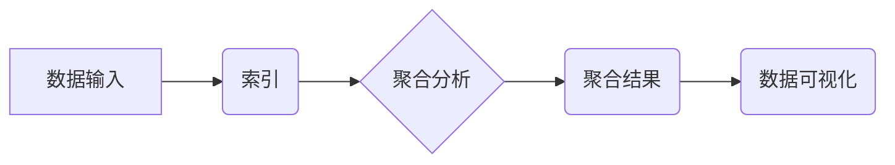

> ES聚合分析，Elasticsearch，聚合，分析，数据挖掘，数据可视化，代码实例

## 1. 背景介绍

在当今数据爆炸的时代，海量数据的存储和分析已成为企业发展的重要课题。Elasticsearch（简称ES）作为一款开源的分布式搜索和分析引擎，凭借其强大的搜索能力、灵活的数据模型和丰富的聚合分析功能，在数据分析领域得到了广泛应用。

ES聚合分析是指对存储在ES中的数据进行分组、统计和汇总，以发现数据中的隐藏模式、趋势和异常值。通过聚合分析，我们可以对数据进行深入挖掘，获得更全面的洞察，从而支持更明智的决策。

## 2. 核心概念与联系

**2.1 核心概念**

* **索引（Index）：** ES中的数据存储单元，类似于关系数据库中的表。每个索引包含多个文档。
* **文档（Document）：** ES中的基本数据单元，类似于关系数据库中的记录。每个文档包含一系列键值对，称为字段。
* **聚合（Aggregation）：** ES提供的用于对数据进行分组、统计和汇总的功能。聚合操作可以对文档中的特定字段进行分析，并生成聚合结果。

**2.2 架构关系**



**2.3 核心联系**

数据首先被存储到ES的索引中，然后通过聚合分析功能对数据进行处理，生成聚合结果。聚合结果可以用于数据可视化，帮助用户直观地了解数据趋势和模式。

## 3. 核心算法原理 & 具体操作步骤

**3.1 算法原理概述**

ES聚合分析算法基于MapReduce思想，将数据分发到多个节点进行并行处理。每个节点负责对一部分数据进行聚合计算，最终将结果汇总到主节点，生成最终的聚合结果。

**3.2 算法步骤详解**

1. **数据分片：** 将数据按照一定的规则分片到不同的节点上。
2. **聚合计算：** 每个节点对其分片的数据进行聚合计算，例如求平均值、计数、最大值等。
3. **结果汇总：** 将每个节点的聚合结果汇总到主节点上。
4. **结果输出：** 主节点将最终的聚合结果输出到用户界面。

**3.3 算法优缺点**

* **优点：**
    * 并行处理能力强，可以快速处理海量数据。
    * 灵活的聚合函数，可以满足各种数据分析需求。
    * 易于扩展，可以根据需要增加节点数量。
* **缺点：**
    * 对数据结构和查询条件有依赖性，需要提前规划好数据模型和查询策略。
    * 复杂聚合操作可能需要较长的计算时间。

**3.4 算法应用领域**

* **电商分析：** 分析用户购买行为、商品销售趋势等。
* **金融分析：** 分析交易数据、风险评估等。
* **社交媒体分析：** 分析用户互动、舆情监测等。
* **网站分析：** 分析用户访问行为、页面浏览量等。

## 4. 数学模型和公式 & 详细讲解 & 举例说明

**4.1 数学模型构建**

假设我们有一个包含用户购买记录的ES索引，每个文档代表一次购买记录，包含用户ID、商品ID和购买时间等字段。我们想要分析不同用户在不同时间段内的购买频率。

我们可以构建一个数学模型来表示用户购买频率：

```latex
购买频率 = 购买次数 / 时间段长度
```

其中：

* 购买次数：用户在指定时间段内购买商品的次数。
* 时间段长度：指定的时间段长度，例如一天、一周、一个月等。

**4.2 公式推导过程**

购买频率的计算公式可以推导如下：

1. 首先，我们需要统计每个用户在指定时间段内的购买次数。
2. 然后，我们需要确定时间段的长度。
3. 最后，将购买次数除以时间段长度，即可得到用户的购买频率。

**4.3 案例分析与讲解**

假设我们想要分析用户在过去一周内的购买频率。我们可以使用ES的聚合分析功能，对用户购买记录进行分组统计，并计算每个用户的购买频率。

例如，我们可以使用`terms`聚合函数对用户ID进行分组，并使用`sum`聚合函数统计每个用户在过去一周内的购买次数。然后，我们可以使用`script`聚合函数计算每个用户的购买频率。

## 5. 项目实践：代码实例和详细解释说明

**5.1 开发环境搭建**

* 安装Java JDK
* 下载Elasticsearch安装包
* 启动Elasticsearch服务

**5.2 源代码详细实现**

```java
import org.elasticsearch.action.search.SearchRequest;
import org.elasticsearch.action.search.SearchResponse;
import org.elasticsearch.client.RequestOptions;
import org.elasticsearch.client.RestHighLevelClient;
import org.elasticsearch.index.query.QueryBuilders;
import org.elasticsearch.search.aggregations.AggregationBuilders;
import org.elasticsearch.search.aggregations.bucket.terms.Terms;
import org.elasticsearch.search.aggregations.bucket.terms.TermsAggregationBuilder;

import java.io.IOException;

public class ES聚合分析 {

    public static void main(String[] args) throws IOException {
        // 创建Elasticsearch客户端
        RestHighLevelClient client = new RestHighLevelClient();

        // 创建搜索请求
        SearchRequest request = new SearchRequest("purchase_log");

        // 添加查询条件
        request.source().query(QueryBuilders.rangeQuery("purchase_time").gte("2023-03-06T00:00:00").lte("2023-03-13T23:59:59"));

        // 添加聚合分析
        TermsAggregationBuilder termsAgg = AggregationBuilders.terms("user_id").field("user_id");
        termsAgg.subAggregation(AggregationBuilders.sum("purchase_count").field("quantity"));
        request.source().aggregation(termsAgg);

        // 发送搜索请求
        SearchResponse response = client.search(request, RequestOptions.DEFAULT);

        // 获取聚合结果
        Terms userTerms = response.getAggregations().get("user_id");
        for (Terms.Bucket bucket : userTerms.getBuckets()) {
            System.out.println("用户ID：" + bucket.getKeyAsString());
            System.out.println("购买次数：" + bucket.getAggregations().get("purchase_count").getValue());
        }

        // 关闭客户端
        client.close();
    }
}
```

**5.3 代码解读与分析**

* 代码首先创建Elasticsearch客户端，并构建搜索请求。
* 搜索请求中添加了查询条件，筛选出过去一周的购买记录。
* 然后，代码添加了聚合分析，使用`terms`聚合函数对用户ID进行分组，并使用`sum`聚合函数统计每个用户在指定时间段内的购买次数。
* 最后，代码发送搜索请求，获取聚合结果，并打印出每个用户的购买次数。

**5.4 运行结果展示**

运行代码后，将输出每个用户的购买次数，例如：

```
用户ID：123
购买次数：5
用户ID：456
购买次数：2
```

## 6. 实际应用场景

**6.1 电商分析**

* 分析用户购买行为，例如购买频率、平均购买金额、最受欢迎的商品等。
* 预测用户购买需求，例如推荐商品、个性化营销等。
* 识别异常用户行为，例如恶意刷单、虚假交易等。

**6.2 金融分析**

* 分析交易数据，例如交易金额、交易频率、交易类型等。
* 风险评估，例如识别高风险客户、预测潜在风险等。
* 欺诈检测，例如识别异常交易、预防欺诈行为等。

**6.3 社交媒体分析**

* 分析用户互动，例如点赞、评论、转发等。
* 舆情监测，例如识别热点话题、分析用户情绪等。
* 用户画像，例如分析用户兴趣、行为特征等。

**6.4 网站分析**

* 分析用户访问行为，例如页面浏览量、停留时间、跳出率等。
* 优化网站结构，例如调整页面布局、优化导航等。
* 识别用户需求，例如分析用户搜索关键词、点击行为等。

**6.5 未来应用展望**

随着数据量的不断增长和分析技术的不断发展，ES聚合分析将在更多领域得到应用，例如：

* 人工智能：用于训练机器学习模型，例如推荐系统、自然语言处理等。
* 物联网：用于分析传感器数据，例如设备状态监测、环境监测等。
* 医疗健康：用于分析患者数据，例如疾病诊断、治疗效果评估等。

## 7. 工具和资源推荐

**7.1 学习资源推荐**

* Elasticsearch官方文档：https://www.elastic.co/guide/en/elasticsearch/reference/current/index.html
* Elasticsearch中文社区：https://www.elastic.co/cn/community
* Elasticsearch学习教程：https://www.elastic.co/guide/en/elasticsearch/reference/current/getting-started.html

**7.2 开发工具推荐**

* Kibana：用于可视化ES数据，分析聚合结果。
* Logstash：用于收集、处理和传输数据到ES。
* Beats：用于收集各种类型的日志数据，例如系统日志、应用程序日志等。

**7.3 相关论文推荐**

* Elasticsearch: A Scalable, Distributed Search Engine
* Elasticsearch: A Distributed, Scalable, and Fault-Tolerant Search Engine

## 8. 总结：未来发展趋势与挑战

**8.1 研究成果总结**

ES聚合分析技术已经取得了显著的成果，在数据分析领域得到了广泛应用。

**8.2 未来发展趋势**

* **更强大的聚合功能：** 未来ES将继续增加新的聚合函数，支持更复杂的分析需求。
* **更智能的分析：** 将结合机器学习算法，实现更智能的数据分析，例如自动发现数据模式、预测未来趋势等。
* **更易于使用的界面：** 将提供更直观、易于使用的界面，方便用户进行数据分析。

**8.3 面临的挑战**

* **数据规模和复杂度：** 随着数据量的不断增长和复杂度增加，ES聚合分析面临着更大的挑战。
* **性能优化：** 需要不断优化ES的性能，提高其处理海量数据的效率。
* **安全性和隐私保护：** 需要加强ES的安全性和隐私保护机制，确保数据安全。

**8.4 研究展望**

未来，我们将继续研究ES聚合分析技术，探索更强大的分析功能、更智能的分析方法和更易于使用的界面，为数据分析领域的发展做出贡献。

## 9. 附录：常见问题与解答

**9.1 如何选择合适的聚合函数？**

选择合适的聚合函数取决于具体的分析需求。例如，如果需要统计每个用户购买的商品数量，可以使用`terms`聚合函数；如果需要计算每个用户购买的总金额，可以使用`sum`聚合函数。

**9.2 如何优化ES聚合分析的性能？**

可以采用以下方法优化ES聚合分析的性能：

* 使用合适的索引分片策略。
* 使用缓存机制。
* 优化查询条件。
* 使用并行处理。

**9.3 如何保证ES聚合分析结果的准确性？**

需要确保数据质量，并对聚合分析结果进行验证。

作者：禅与计算机程序设计艺术 / Zen and the Art of Computer Programming


<end_of_turn>