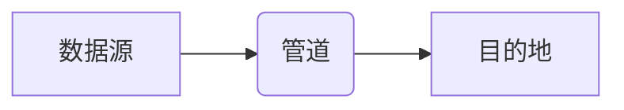

> Flume, 流式数据处理, 数据采集, 数据传输, HDFS, Kafka, 实时数据分析

## 1. 背景介绍

在当今数据爆炸的时代，海量数据源不断涌现，实时数据处理和分析的需求日益迫切。Flume作为一款开源的分布式流式数据采集和传输工具，在处理海量数据流方面展现出强大的能力。它能够从各种数据源采集数据，并将其可靠地传输到目标存储系统，为实时数据分析、日志收集、监控报警等场景提供强有力的支持。

## 2. 核心概念与联系

Flume的核心概念包括：

* **数据源（Source）：**负责从各种数据源采集数据，例如文件系统、网络流、数据库等。
* **管道（Channel）：**用于缓冲数据，并确保数据在源和目的地之间可靠传输。
* **目的地（Sink）：**负责将数据写入目标存储系统，例如HDFS、Kafka、Elasticsearch等。

Flume采用流式处理的方式，数据从源到目的地的传输过程可以概括为以下步骤：

**Flume的架构特点：**

* **分布式：**Flume可以部署在多个节点上，实现数据流的并行处理和容错能力。
* **可靠性：**Flume采用数据缓冲和重试机制，确保数据传输的可靠性。
* **可扩展性：**Flume支持自定义数据源、管道和目的地，可以根据实际需求灵活扩展。
* **易于配置：**Flume采用配置文件的方式进行配置，操作简单易懂。

## 3. 核心算法原理 & 具体操作步骤

### 3.1  算法原理概述

Flume的核心算法原理是基于流式处理的事件驱动模型。数据源将数据以事件的形式发送到管道，管道将事件缓冲并转发到目的地。Flume使用一个事件队列来管理数据流，并通过线程池机制实现并发处理。

### 3.2  算法步骤详解

1. **数据源采集数据：**数据源根据配置读取数据，并将数据以事件的形式发送到管道。
2. **管道缓冲数据：**管道接收事件后，将其存储在内部缓冲区中，并根据配置策略进行数据处理，例如数据格式转换、数据过滤等。
3. **目的地接收数据：**目的地接收管道发送的事件，并将其写入目标存储系统。

### 3.3  算法优缺点

**优点：**

* 流式处理，实时性强。
* 分布式架构，可扩展性好。
* 可靠性高，数据传输可靠。
* 易于配置，操作简单。

**缺点：**

* 对数据格式转换和处理能力有限。
* 对数据清洗和去重能力有限。

### 3.4  算法应用领域

Flume广泛应用于以下场景：

* **日志收集：**从各种服务器和应用程序收集日志数据，并将其传输到集中式日志存储系统。
* **实时数据分析：**从传感器、设备等数据源采集实时数据，并将其传输到实时数据分析平台进行处理和分析。
* **监控报警：**从监控系统收集数据，并将其传输到报警系统，实现实时监控和报警。

## 4. 数学模型和公式 & 详细讲解 & 举例说明

Flume的算法原理可以抽象为一个数据流模型，其中数据流的传输过程可以表示为一个概率图模型。

### 4.1  数学模型构建

假设数据流由多个节点组成，每个节点代表一个数据处理单元，例如数据源、管道、目的地等。数据流的传输过程可以表示为一个有向图，其中节点之间通过边连接，边表示数据流的传输方向。

### 4.2  公式推导过程

数据流的传输概率可以根据节点的配置参数和数据流的特性进行计算。例如，数据源的传输概率可以根据数据源的读取速度和数据量进行计算，管道的传输概率可以根据管道的缓冲容量和数据传输速度进行计算。

### 4.3  案例分析与讲解

假设有一个数据流模型，其中数据源读取数据的速度为100KB/s，管道缓冲容量为1MB，目的地写入数据的速度为50KB/s。

根据上述参数，可以计算出数据流的传输概率和延迟时间。

## 5. 项目实践：代码实例和详细解释说明

### 5.1  开发环境搭建

Flume的开发环境搭建需要以下软件：

* Java Development Kit (JDK)
* Apache Flume

### 5.2  源代码详细实现

Flume的源代码主要包含以下几个模块：

* **核心模块：**包含Flume的核心算法实现，例如事件处理、数据传输等。
* **数据源模块：**包含各种数据源的实现，例如文件系统数据源、网络流数据源等。
* **管道模块：**包含各种管道类型的实现，例如内存管道、文件管道等。
* **目的地模块：**包含各种目的地的实现，例如HDFS目的地、Kafka目的地等。

### 5.3  代码解读与分析

Flume的代码实现主要使用Java语言编写，并采用面向对象编程的思想。

### 5.4  运行结果展示

Flume的运行结果可以查看Flume的日志文件和监控界面。

## 6. 实际应用场景

Flume在实际应用场景中具有广泛的应用价值。

### 6.1  日志收集

Flume可以从各种服务器和应用程序收集日志数据，并将其传输到集中式日志存储系统，例如Elasticsearch、Logstash、Kibana等。

### 6.2  实时数据分析

Flume可以从传感器、设备等数据源采集实时数据，并将其传输到实时数据分析平台，例如Spark Streaming、Flink等，实现实时数据分析和处理。

### 6.3  监控报警

Flume可以从监控系统收集数据，并将其传输到报警系统，实现实时监控和报警。

### 6.4  未来应用展望

随着数据量的不断增长和实时数据处理需求的不断提升，Flume在未来将有更广泛的应用场景。例如，可以用于物联网数据采集和处理、金融数据实时分析、医疗数据实时监控等领域。

## 7. 工具和资源推荐

### 7.1  学习资源推荐

* Apache Flume官方文档：https://flume.apache.org/
* Flume学习教程：https://www.tutorialspoint.com/flume/index.htm

### 7.2  开发工具推荐

* Apache Maven
* Apache Ant

### 7.3  相关论文推荐

* Flume: A Distributed, Reliable, and Available Service for Aggregating Log Data
* Building a Real-Time Data Pipeline with Flume and Kafka

## 8. 总结：未来发展趋势与挑战

### 8.1  研究成果总结

Flume作为一款开源的流式数据处理工具，在数据采集、传输和处理方面取得了显著的成果。其分布式架构、可靠性高、可扩展性好等特点使其成为大数据时代的数据处理的重要工具。

### 8.2  未来发展趋势

Flume的未来发展趋势包括：

* **支持更多数据源和目的地：**

Flume将支持更多的数据源和目的地，例如云平台数据源、数据库数据源等。
* **增强数据处理能力：**Flume将增强数据处理能力，例如支持数据清洗、去重、格式转换等操作。
* **提高实时性：**Flume将提高实时性，例如支持更快的事件处理速度和更小的延迟时间。

### 8.3  面临的挑战

Flume面临的挑战包括：

* **数据处理能力的提升：**随着数据量的不断增长，Flume需要提升数据处理能力，才能满足实时数据处理的需求。
* **数据安全和隐私保护：**Flume需要加强数据安全和隐私保护措施，确保数据安全可靠。
* **生态系统建设：**Flume需要加强生态系统建设，吸引更多开发者和用户参与到Flume的开发和使用中。

### 8.4  研究展望

未来，Flume的研究方向将集中在以下几个方面：

* **开发更强大的数据处理引擎：**开发更强大的数据处理引擎，能够处理更复杂的数据类型和更复杂的业务逻辑。
* **构建更完善的数据安全和隐私保护机制：**构建更完善的数据安全和隐私保护机制，确保数据安全可靠。
* **加强Flume的生态系统建设：**加强Flume的生态系统建设，吸引更多开发者和用户参与到Flume的开发和使用中。

## 9. 附录：常见问题与解答

### 9.1  Flume配置问题

### 9.2  Flume运行问题

### 9.3  Flume数据传输问题

作者：禅与计算机程序设计艺术 / Zen and the Art of Computer Programming

<end_of_turn>