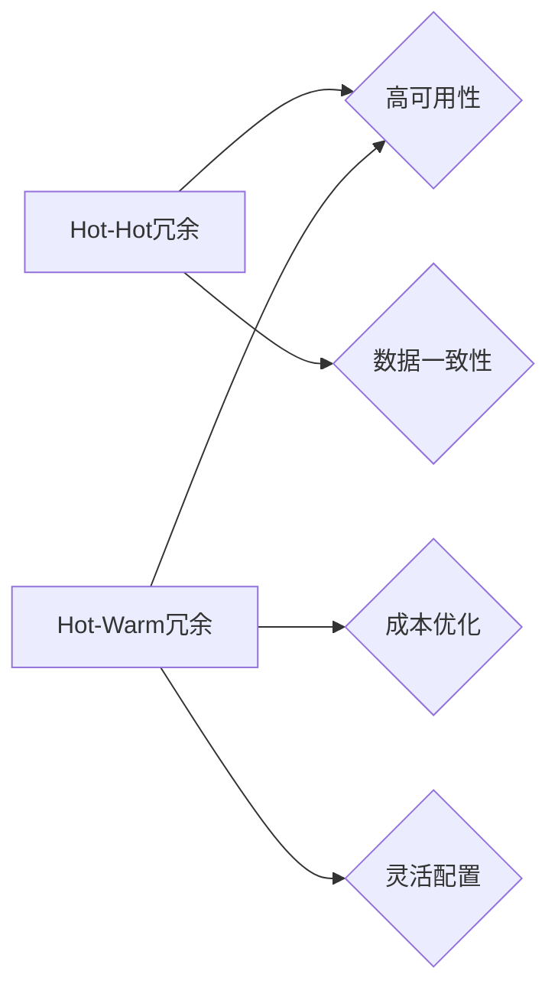

> Hot-Hot冗余，Hot-Warm冗余，高可用性，数据一致性，性能优化，云计算，分布式系统

## 1. 背景介绍

在当今以云计算和分布式系统为核心的技术时代，高可用性和数据一致性已成为系统设计和部署的至关重要指标。面对突发故障、硬件故障和网络波动等潜在风险，冗余设计成为保障系统稳定运行和业务连续性的关键手段。

Hot-Hot冗余和Hot-Warm冗余是两种常见的冗余设计模式，它们分别针对不同的场景和需求提供不同的解决方案。本文将深入探讨Hot-Hot和Hot-Warm冗余的设计原理、核心算法、实践案例以及未来发展趋势，帮助读者全面理解并应用这些技术，构建更加可靠、高效的系统架构。

## 2. 核心概念与联系

**2.1 Hot-Hot冗余**

Hot-Hot冗余，顾名思义，是指将数据和计算资源进行完全的复制，并部署在多个物理节点上。所有节点都处于高可用状态，即随时可以处理用户请求。当一个节点发生故障时，其他节点可以立即接管其工作负载，确保系统无缝切换，用户体验不受影响。

**2.2 Hot-Warm冗余**

Hot-Warm冗余则是一种更灵活的冗余设计模式。它将数据和计算资源分为两类：

* **Hot数据:** 经常被访问的数据，需要保持高可用性和低延迟，通常部署在高速存储设备和高性能计算节点上。
* **Warm数据:** 访问频率较低的，但仍然需要进行备份和恢复的数据，可以部署在成本更低的存储设备和计算节点上。

当Hot数据节点发生故障时，Warm数据节点可以快速切换到Hot状态，提供数据访问服务。

**2.3 关系图**



## 3. 核心算法原理 & 具体操作步骤

**3.1 算法原理概述**

Hot-Hot和Hot-Warm冗余的设计核心在于数据复制和故障转移机制。

* **数据复制:** 将数据副本复制到多个节点，确保数据安全性和可用性。
* **故障转移:** 当一个节点发生故障时，自动将其工作负载转移到其他可用节点，保证系统持续运行。

**3.2 算法步骤详解**

**Hot-Hot冗余:**

1. 将数据复制到多个节点，每个节点都拥有完整的数据副本。
2. 使用一致性协议（如Paxos、Raft）保证数据在所有节点上的一致性。
3. 使用心跳机制监控节点状态，一旦检测到节点故障，立即触发故障转移机制。
4. 将故障节点的工作负载转移到其他可用节点，并更新数据副本。

**Hot-Warm冗余:**

1. 将数据分为Hot数据和Warm数据两类，分别部署在不同的节点上。
2. Hot数据节点使用Hot-Hot冗余机制，保证高可用性和低延迟。
3. Warm数据节点使用较低成本的存储和计算资源，降低成本。
4. 当Hot数据节点发生故障时，Warm数据节点可以快速切换到Hot状态，提供数据访问服务。

**3.3 算法优缺点**

**Hot-Hot冗余:**

* **优点:** 高可用性、数据一致性强。
* **缺点:** 成本高，资源利用率低。

**Hot-Warm冗余:**

* **优点:** 成本低，资源利用率高，灵活配置。
* **缺点:** 访问延迟可能较高，数据一致性需要额外的机制保证。

**3.4 算法应用领域**

* **Hot-Hot冗余:** 高可用性要求高的系统，如金融交易系统、电商平台、在线游戏等。
* **Hot-Warm冗余:** 访问频率差异大的系统，如数据仓库、日志系统、备份系统等。

## 4. 数学模型和公式 & 详细讲解 & 举例说明

**4.1 数学模型构建**

假设一个系统有N个节点，其中M个节点处于Hot状态，N-M个节点处于Warm状态。

* **数据访问概率:**

    * Hot数据访问概率: P_hot
    * Warm数据访问概率: P_warm

* **节点故障概率:**

    * Hot节点故障概率: P_hot_fail
    * Warm节点故障概率: P_warm_fail

**4.2 公式推导过程**

* **系统可用性:**

    * 系统可用性 = 1 - (P_hot_fail * P_hot * (N-M) + P_warm_fail * P_warm * M)

* **数据一致性:**

    * 数据一致性 = 1 - (P_hot_fail * P_hot * (N-M) * (N-M-1)/2)

**4.3 案例分析与讲解**

假设一个系统有10个节点，其中5个节点处于Hot状态，5个节点处于Warm状态。

* Hot节点故障概率: 0.01
* Warm节点故障概率: 0.005
* Hot数据访问概率: 0.8
* Warm数据访问概率: 0.2

根据上述公式，可以计算出该系统的可用性和数据一致性。

## 5. 项目实践：代码实例和详细解释说明

**5.1 开发环境搭建**

* 操作系统: Ubuntu 20.04
* 虚拟机: VirtualBox
* 编程语言: Python
* 框架: Flask

**5.2 源代码详细实现**

```python
from flask import Flask, request, jsonify

app = Flask(__name__)

# 模拟数据存储
data = {}

# 节点状态
node_status = {
    'node1': 'Hot',
    'node2': 'Hot',
    'node3': 'Warm',
    'node4': 'Warm',
    'node5': 'Warm',
}

@app.route('/data/<key>', methods=['GET'])
def get_data(key):
    if key in data:
        return jsonify({'data': data[key]})
    else:
        return jsonify({'error': 'Key not found'}), 404

@app.route('/data/<key>', methods=['POST'])
def set_data(key):
    data[key] = request.json['value']
    return jsonify({'message': 'Data updated'}), 200

if __name__ == '__main__':
    app.run(debug=True)
```

**5.3 代码解读与分析**

* 该代码示例使用Flask框架构建了一个简单的API服务，模拟数据存储和访问。
* 节点状态使用字典存储，Hot节点和Warm节点分别对应不同的访问策略。
* 当请求到达Hot节点时，直接从内存中读取数据；当请求到达Warm节点时，需要从磁盘或其他存储设备中读取数据，访问延迟较高。

**5.4 运行结果展示**

* 启动服务后，可以使用curl或Postman等工具发送请求，测试数据访问和更新功能。
* 可以观察到Hot节点访问速度更快，Warm节点访问速度较慢。

## 6. 实际应用场景

**6.1 数据仓库**

数据仓库通常存储大量历史数据，访问频率较低。可以使用Hot-Warm冗余模式，将常用的数据部署在Hot节点，将历史数据部署在Warm节点，降低成本并提高资源利用率。

**6.2 日志系统**

日志系统需要存储大量日志数据，但访问频率差异较大。可以使用Hot-Warm冗余模式，将最新的日志数据部署在Hot节点，将历史日志数据部署在Warm节点，保证实时日志分析的同时降低存储成本。

**6.3 备份系统**

备份系统需要定期备份数据，但访问频率较低。可以使用Hot-Warm冗余模式，将最新的备份数据部署在Hot节点，将历史备份数据部署在Warm节点，保证数据恢复速度的同时降低存储成本。

**6.4 未来应用展望**

随着云计算和人工智能技术的不断发展，Hot-Hot和Hot-Warm冗余模式将应用于更多场景，例如：

* **边缘计算:** 将数据和计算资源部署在边缘节点，实现低延迟和高可靠性。
* **物联网:** 处理海量物联网数据，实现实时分析和决策。
* **区块链:** 保证区块链数据的安全性和可用性。

## 7. 工具和资源推荐

**7.1 学习资源推荐**

* **书籍:**
    * 《分布式系统的设计与实现》
    * 《高可用系统设计》
* **在线课程:**
    * Coursera: Distributed Systems
    * Udemy: Building Highly Available Systems

**7.2 开发工具推荐**

* **容器化平台:** Docker, Kubernetes
* **云存储服务:** AWS S3, Azure Blob Storage, Google Cloud Storage
* **数据库:** MySQL, PostgreSQL, MongoDB

**7.3 相关论文推荐**

* Paxos Made Live: An Engineering Perspective
* Raft: In Search of an Understandable Consensus Algorithm
* Hot-Warm Data Management in Cloud Storage Systems

## 8. 总结：未来发展趋势与挑战

**8.1 研究成果总结**

Hot-Hot和Hot-Warm冗余模式是保障系统高可用性和数据一致性的重要技术手段。

* Hot-Hot冗余模式提供高可用性和强数据一致性，但成本高，资源利用率低。
* Hot-Warm冗余模式成本低，资源利用率高，灵活配置，但访问延迟可能较高，数据一致性需要额外的机制保证。

**8.2 未来发展趋势**

* **自动化管理:** 利用人工智能和机器学习技术，自动进行节点状态监控、故障转移和资源分配，提高冗余系统的自动化程度。
* **多层级冗余:** 将冗余设计扩展到多层级，例如数据层、计算层、网络层，实现更全面的故障容错能力。
* **边缘计算:** 将冗余设计部署在边缘节点，实现低延迟和高可靠性的边缘计算。

**8.3 面临的挑战**

* **成本控制:** 冗余系统需要额外的硬件和软件资源，如何控制成本是重要的挑战。
* **复杂性管理:** 冗余系统架构复杂，需要复杂的管理和维护机制。
* **数据一致性:** 在分布式环境下，保证数据一致性是重要的挑战。

**8.4 研究展望**

未来研究方向包括：

* 开发更智能、更高效的冗余管理算法。
* 研究新的冗余设计模式，例如混合冗余、动态冗余等。
* 探索新的应用场景，例如边缘计算、物联网等。

## 9. 附录：常见问题与解答

**9.1 问题:** Hot-Hot冗余和Hot-Warm冗余哪个模式更适合我的系统？

**9.2 答案:** 

* 如果您的系统对高可用性和数据一致性要求很高，并且预算充足，可以选择Hot-Hot冗余模式。
* 如果您的系统对成本敏感，并且数据访问频率差异较大，可以选择Hot-Warm冗余模式。

**9.3 问题:** 如何实现数据一致性在Hot-Warm冗余模式下？

**9.4 答案:** 

可以使用分布式一致性协议，例如Paxos、Raft等，保证数据在所有节点上的一致性。

**9.5 问题:** 如何监控和管理冗余系统？

**9.6 答案:** 

可以使用监控工具和管理平台，监控节点状态、故障转移情况和资源利用率，并进行相应的管理和维护。


作者：禅与计算机程序设计艺术 / Zen and the Art of Computer Programming 
<end_of_turn>