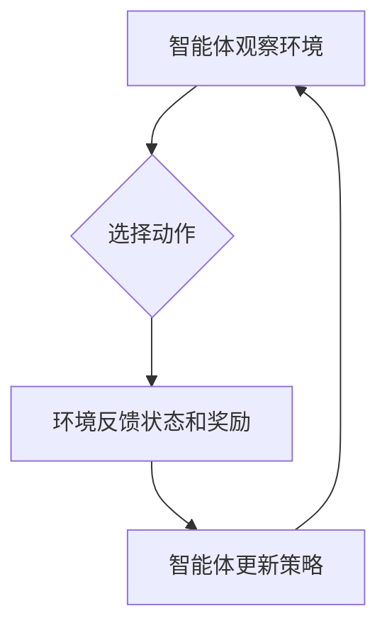

> 强化学习，游戏AI，Python，机器学习，深度学习，Q-learning，策略梯度，环境模拟，游戏开发

## 1. 背景介绍

在当今科技飞速发展的时代，人工智能（AI）已成为一个备受关注的领域。其中，强化学习（Reinforcement Learning，RL）作为机器学习的一个重要分支，因其能够训练智能体在复杂环境中学习并做出最优决策的能力而备受瞩目。强化学习在游戏AI领域有着广泛的应用前景，能够赋予游戏角色更智能、更逼真的行为，提升玩家的游戏体验。

游戏AI的传统方法通常依赖于人工设计的规则和状态机，但这些方法难以应对复杂的游戏环境和玩家行为的随机性。强化学习则通过让智能体与环境进行交互，并根据其行为获得奖励或惩罚，从而学习最优策略。这种学习过程类似于人类学习的模式，能够使游戏AI更加灵活、适应性强。

## 2. 核心概念与联系

**2.1 强化学习的基本概念**

强化学习的核心概念包括：

* **智能体（Agent）：** 学习和决策的实体。
* **环境（Environment）：** 智能体所处的外部世界。
* **状态（State）：** 环境的当前状态。
* **动作（Action）：** 智能体可以采取的行动。
* **奖励（Reward）：** 智能体根据其动作获得的反馈。
* **策略（Policy）：** 智能体选择动作的规则。

**2.2 强化学习的流程**

强化学习的流程可以概括为以下步骤：

1. 智能体观察环境的当前状态。
2. 根据策略选择一个动作。
3. 环境根据动作产生新的状态和奖励。
4. 智能体根据奖励更新策略，以提高未来获得奖励的概率。

**2.3 强化学习与游戏AI的联系**

在游戏AI领域，智能体可以是游戏角色，环境是游戏世界，状态是游戏中的场景和角色信息，动作是角色可以执行的操作，奖励是完成任务或获得胜利的反馈。通过强化学习，游戏AI可以学习最优的游戏策略，从而表现出更智能、更逼真的行为。

**2.4 Mermaid 流程图**



## 3. 核心算法原理 & 具体操作步骤

### 3.1  算法原理概述

Q-learning 是一种经典的强化学习算法，它通过学习一个 Q 表来评估每个状态-动作对的价值。Q 表是一个表格，其中每个单元格存储了在特定状态下执行特定动作的预期未来奖励。

Q-learning 的目标是找到一个策略，使得智能体在任何状态下选择能够获得最大预期奖励的动作。

### 3.2  算法步骤详解

1. 初始化 Q 表，将所有单元格的值设置为 0。
2. 在环境中与智能体交互，观察状态和获得奖励。
3. 根据当前状态和动作，更新 Q 表中的值：

```
Q(s, a) = Q(s, a) + α * [r + γ * max(Q(s', a')) - Q(s, a)]
```

其中：

* Q(s, a) 是在状态 s 下执行动作 a 的预期未来奖励。
* α 是学习率，控制着学习速度。
* r 是当前状态下获得的奖励。
* γ 是折扣因子，控制着未来奖励的权重。
* s' 是执行动作 a 后进入的下一个状态。
* a' 是在下一个状态 s' 中可以执行的动作，选择动作 a' 的 Q 值最大。

4. 重复步骤 2 和 3，直到 Q 表收敛。

### 3.3  算法优缺点

**优点：**

* 能够学习复杂的策略。
* 适用于离散状态和动作空间。

**缺点：**

* 需要大量的训练数据。
* 对于连续状态和动作空间，Q 表的维度会非常高，难以存储和更新。

### 3.4  算法应用领域

Q-learning 广泛应用于各种领域，例如：

* 游戏AI
* 机器人控制
* 自动驾驶
* 医疗诊断

## 4. 数学模型和公式 & 详细讲解 & 举例说明

### 4.1  数学模型构建

强化学习的数学模型可以概括为马尔可夫决策过程（Markov Decision Process，MDP）。MDP 由以下五个要素组成：

* 状态空间 S：所有可能的系统状态的集合。
* 动作空间 A：在每个状态下可以执行的动作的集合。
* 转移概率分布 P：描述从一个状态到另一个状态的概率分布。
* 奖励函数 R：描述在每个状态下执行每个动作获得的奖励。
* 策略 π：描述智能体在每个状态下选择动作的规则。

### 4.2  公式推导过程

Q-learning 算法的目标是找到一个策略 π*，使得智能体在任何状态下选择能够获得最大预期未来奖励的动作。

Q-learning 算法使用 Bellman 方程来更新 Q 表：

```
Q(s, a) = Q(s, a) + α * [r + γ * max(Q(s', a')) - Q(s, a)]
```

其中：

* Q(s, a) 是在状态 s 下执行动作 a 的预期未来奖励。
* α 是学习率，控制着学习速度。
* r 是当前状态下获得的奖励。
* γ 是折扣因子，控制着未来奖励的权重。
* s' 是执行动作 a 后进入的下一个状态。
* a' 是在下一个状态 s' 中可以执行的动作，选择动作 a' 的 Q 值最大。

### 4.3  案例分析与讲解

假设有一个简单的游戏，智能体可以向左或向右移动，目标是到达终点。

* 状态空间 S：智能体当前的位置。
* 动作空间 A：向左或向右移动。
* 转移概率分布 P：每次移动的概率为 0.9，移动失败的概率为 0.1。
* 奖励函数 R：到达终点获得 100 的奖励，其他状态获得 0 的奖励。

使用 Q-learning 算法，智能体可以学习到最优策略，即在每个位置选择能够更靠近终点的动作。

## 5. 项目实践：代码实例和详细解释说明

### 5.1  开发环境搭建

* Python 3.x
* TensorFlow 或 PyTorch

### 5.2  源代码详细实现

```python
import numpy as np

# 定义状态空间和动作空间
state_space = [0, 1, 2, 3, 4]
action_space = ['left', 'right']

# 初始化 Q 表
Q_table = np.zeros((len(state_space), len(action_space)))

# 设置超参数
alpha = 0.1
gamma = 0.9

# 训练过程
for episode in range(1000):
    state = 0
    while state != len(state_space) - 1:
        # 选择动作
        action = np.argmax(Q_table[state, :])

        # 执行动作并获得奖励和下一个状态
        next_state = state + 1 if action == 'right' else state - 1
        reward = 1 if next_state == len(state_space) - 1 else 0

        # 更新 Q 表
        Q_table[state, action] = Q_table[state, action] + alpha * (reward + gamma * np.max(Q_table[next_state, :]) - Q_table[state, action])

        # 更新状态
        state = next_state

# 测试过程
state = 0
while state != len(state_space) - 1:
    action = np.argmax(Q_table[state, :])
    next_state = state + 1 if action == 'right' else state - 1
    print(f'状态: {state}, 动作: {action}, 下一个状态: {next_state}')
    state = next_state
```

### 5.3  代码解读与分析

* 代码首先定义了状态空间和动作空间。
* 然后初始化 Q 表，并将学习率和折扣因子设置为超参数。
* 训练过程使用循环迭代，每次迭代智能体从一个随机状态开始，并根据 Q 表选择动作，执行动作并获得奖励和下一个状态。
* 使用 Bellman 方程更新 Q 表，使得智能体在未来能够获得更高的奖励。
* 测试过程使用训练好的 Q 表，模拟智能体在环境中的行为。

### 5.4  运行结果展示

运行代码后，智能体将学习到最优策略，并能够在游戏中到达终点。

## 6. 实际应用场景

### 6.1 游戏AI开发

强化学习可以用于开发更智能、更逼真的游戏AI，例如：

* 策略游戏：例如围棋、象棋、星际争霸等，强化学习可以训练AI学习最优策略，挑战人类玩家。
* 角色扮演游戏：例如魔兽世界、最终幻想等，强化学习可以训练AI控制角色的行为，使其更加智能和逼真。
* 射击游戏：例如使命召唤、守望先锋等，强化学习可以训练AI控制角色的射击和移动，使其更加精准和灵活。

### 6.2 其他应用场景

除了游戏AI，强化学习还应用于其他领域，例如：

* 机器人控制：训练机器人学习完成各种任务，例如导航、抓取、组装等。
* 自动驾驶：训练自动驾驶汽车学习驾驶技能，例如避障、变道、停车等。
* 医疗诊断：训练AI辅助医生诊断疾病，提高诊断准确率。

### 6.4  未来应用展望

随着人工智能技术的不断发展，强化学习将在未来发挥更加重要的作用。

* 更智能的AI：强化学习将使AI更加智能、更加能够理解和应对复杂环境。
* 更个性化的体验：强化学习可以根据用户的喜好和行为定制个性化的体验，例如游戏、娱乐、教育等。
* 更高效的决策：强化学习可以帮助企业和组织做出更优的决策，提高效率和效益。

## 7. 工具和资源推荐

### 7.1  学习资源推荐

* **书籍:**
    * Reinforcement Learning: An Introduction by Richard S. Sutton and Andrew G. Barto
    * Deep Reinforcement Learning Hands-On by Maxim Lapan
* **在线课程:**
    * Coursera: Reinforcement Learning Specialization by David Silver
    * Udacity: Deep Reinforcement Learning Nanodegree

### 7.2  开发工具推荐

* **Python:** 作为强化学习的常用编程语言，Python 提供了丰富的库和框架，例如 TensorFlow、PyTorch、OpenAI Gym 等。
* **OpenAI Gym:** 一个用于强化学习研究和开发的开源平台，提供各种环境和算法。

### 7.3  相关论文推荐

* Deep Q-Network (DQN)
* Proximal Policy Optimization (PPO)
* Trust Region Policy Optimization (TRPO)

## 8. 总结：未来发展趋势与挑战

### 8.1  研究成果总结

强化学习在过去几十年取得了显著的进展，在游戏AI、机器人控制、自动驾驶等领域取得了突破性的成果。

### 8.2  未来发展趋势

* **深度强化学习:** 将深度神经网络与强化学习相结合，提高AI的学习能力和泛化能力。
* **多智能体强化学习:** 研究多个智能体在同一个环境中交互学习的策略。
* **可解释性强化学习:** 研究如何解释强化学习模型的决策过程，提高模型的可理解性和可信任性。

### 8.3  面临的挑战

* **样本效率:** 强化学习算法通常需要大量的训练数据，这在现实世界中可能难以获得。
* **探索与利用的平衡:** 强化学习算法需要在探索新策略和利用已知策略之间找到平衡，这在某些情况下可能比较困难