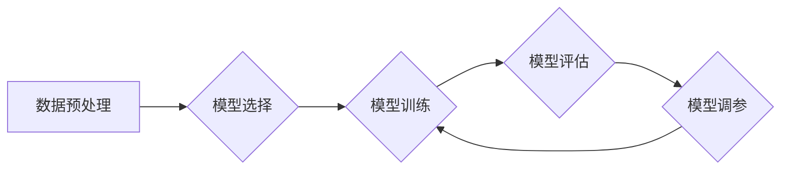

> Scikit-learn, 机器学习, 算法原理, 代码实战, 分类, 回归, 聚类, 降维

## 1. 背景介绍

在当今数据爆炸的时代，机器学习作为人工智能的核心技术，在各个领域发挥着越来越重要的作用。Scikit-learn 是一个功能强大、易于使用的 Python 机器学习库，为机器学习研究和应用提供了丰富的工具和算法。

本篇文章将深入探讨 Scikit-learn 的核心概念、算法原理以及代码实战案例，帮助读者理解机器学习的基本原理，并掌握使用 Scikit-learn 进行机器学习任务的技能。

## 2. 核心概念与联系

Scikit-learn 的核心概念包括：

* **模型:** 机器学习模型是用来学习数据模式的数学函数。
* **训练:** 使用训练数据来调整模型参数，使模型能够准确预测未知数据。
* **测试:** 使用测试数据来评估模型的性能。
* **超参数:** 模型训练过程中需要设置的一些参数，例如学习率、正则化系数等。

Scikit-learn 提供了多种机器学习算法，可以分为以下几类：

* **监督学习:** 训练数据包含标签，模型需要学习将输入特征映射到对应的标签。
    * **分类:** 将数据分类到不同的类别。例如，垃圾邮件分类、图像识别等。
    * **回归:** 预测连续值。例如，房价预测、股票价格预测等。
* **无监督学习:** 训练数据不包含标签，模型需要从数据中发现隐藏的模式。
    * **聚类:** 将数据点分组到不同的簇中。例如，客户群分析、异常检测等。
    * **降维:** 将高维数据降到低维空间，同时保留数据的关键信息。例如，数据可视化、特征选择等。

**Scikit-learn 框架流程图:**

## 3. 核心算法原理 & 具体操作步骤

### 3.1  算法原理概述

本节将介绍 Scikit-learn 中常用的机器学习算法原理，包括线性回归、逻辑回归、支持向量机、决策树、随机森林和 k 均值聚类等。

### 3.2  算法步骤详解

对于每个算法，我们将详细介绍其训练和预测步骤，并使用代码示例进行说明。

### 3.3  算法优缺点

我们将分析每个算法的优缺点，例如训练速度、预测精度、对数据规模的适应性等，帮助读者选择合适的算法。

### 3.4  算法应用领域

我们将介绍每个算法在实际应用中的场景，例如图像识别、自然语言处理、金融预测等，帮助读者了解算法的应用范围。

## 4. 数学模型和公式 & 详细讲解 & 举例说明

### 4.1  数学模型构建

我们将介绍每个算法背后的数学模型，例如线性回归的最小二乘法、逻辑回归的 sigmoid 函数等，并解释其原理。

### 4.2  公式推导过程

我们将详细推导每个算法的关键公式，例如决策树的信息增益、随机森林的集成学习等，帮助读者理解算法的数学基础。

### 4.3  案例分析与讲解

我们将使用具体的案例分析每个算法的数学模型和公式，例如使用线性回归预测房价、使用逻辑回归判断邮件是否为垃圾邮件等，帮助读者理解算法的应用。

## 5. 项目实践：代码实例和详细解释说明

### 5.1  开发环境搭建

我们将介绍如何搭建 Scikit-learn 的开发环境，包括安装 Python、Scikit-learn 库以及必要的依赖包。

### 5.2  源代码详细实现

我们将提供完整的源代码示例，演示如何使用 Scikit-learn 进行机器学习任务，例如分类、回归、聚类等。

### 5.3  代码解读与分析

我们将详细解释代码的每一行，帮助读者理解代码的逻辑和功能。

### 5.4  运行结果展示

我们将展示代码运行的结果，例如模型的准确率、混淆矩阵等，帮助读者评估模型的性能。

## 6. 实际应用场景

### 6.1  案例分析

我们将介绍 Scikit-learn 在实际应用中的案例，例如推荐系统、欺诈检测、医疗诊断等，帮助读者了解算法的应用场景。

### 6.2  未来应用展望

我们将展望 Scikit-learn 在未来发展趋势，例如深度学习、强化学习等，帮助读者了解算法的未来发展方向。

## 7. 工具和资源推荐

### 7.1  学习资源推荐

我们将推荐一些 Scikit-learn 的学习资源，例如官方文档、教程、书籍等，帮助读者深入学习 Scikit-learn。

### 7.2  开发工具推荐

我们将推荐一些 Scikit-learn 开发工具，例如 Jupyter Notebook、VS Code 等，帮助读者提高开发效率。

### 7.3  相关论文推荐

我们将推荐一些与 Scikit-learn 相关的论文，帮助读者了解算法的最新研究成果。

## 8. 总结：未来发展趋势与挑战

### 8.1  研究成果总结

我们将总结 Scikit-learn 的研究成果，例如算法的改进、性能的提升等，帮助读者了解算法的发展历程。

### 8.2  未来发展趋势

我们将展望 Scikit-learn 的未来发展趋势，例如深度学习、强化学习等，帮助读者了解算法的未来发展方向。

### 8.3  面临的挑战

我们将分析 Scikit-learn 面临的挑战，例如算法的复杂性、数据规模的增长等，帮助读者了解算法的未来发展方向。

### 8.4  研究展望

我们将展望 Scikit-learn 的未来研究方向，例如算法的效率提升、算法的鲁棒性增强等，帮助读者了解算法的未来发展方向。

## 9. 附录：常见问题与解答

我们将解答一些关于 Scikit-learn 的常见问题，例如如何选择合适的算法、如何调参、如何解决过拟合等，帮助读者解决实际问题。

**作者：禅与计算机程序设计艺术 / Zen and the Art of Computer Programming**

<end_of_turn>