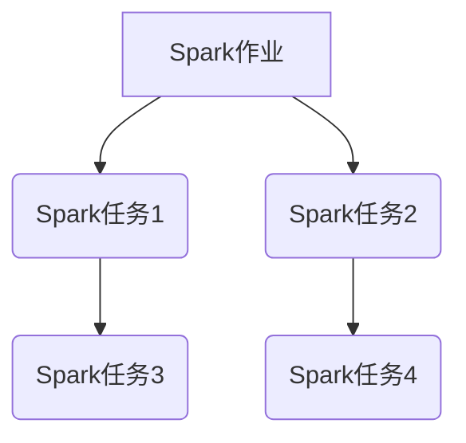

> Spark, DAG, Directed Acyclic Graph, Spark作业调度, Spark任务执行, Spark编程

## 1. 背景介绍

Apache Spark 是一个开源的统一分析引擎，它支持批处理、流式处理和机器学习等多种计算模式。Spark 的高性能和易用性使其成为大数据处理的首选工具之一。Spark 的核心是其强大的作业调度机制，它利用 Directed Acyclic Graph (DAG) 来表示和执行 Spark 作业。

DAG 是一个有向无环图，它可以用来表示一个任务的执行依赖关系。在 Spark 中，每个 Spark 作业都对应一个 DAG 节点，而 DAG 的边表示节点之间的依赖关系。例如，如果一个 Spark 作业需要依赖另一个 Spark 作业的结果，那么这两个作业之间的关系就用一条边表示。

Spark 的作业调度器会根据 DAG 的结构来调度 Spark 作业的执行。它会首先识别 DAG 中的根节点，然后依次执行 DAG 中的节点，直到所有节点都执行完毕。

## 2. 核心概念与联系

### 2.1 Spark作业

Spark 作业是 Spark 程序中执行的一个独立单元，它可以包含多个 Spark 任务。

### 2.2 Spark任务

Spark 任务是 Spark 作业中执行的一个最小单元，它可以被分配到不同的 executor 上执行。

### 2.3 DAG

DAG 是一个有向无环图，它可以用来表示 Spark 作业的执行依赖关系。

**Spark DAG 结构**



## 3. 核心算法原理 & 具体操作步骤

### 3.1  算法原理概述

Spark DAG 的核心算法是基于拓扑排序的。拓扑排序是一种将有向无环图中的节点按照其依赖关系进行排序的算法。

Spark 的作业调度器会首先构建一个 DAG，然后使用拓扑排序算法来确定 DAG 中节点的执行顺序。拓扑排序算法的原理是：

1. 找到所有入度为 0 的节点，这些节点没有依赖关系，可以先执行。
2. 将这些节点从 DAG 中删除，并更新其他节点的入度。
3. 重复步骤 1 和 2，直到所有节点都被执行。

### 3.2  算法步骤详解

1. **构建 DAG:** Spark 会根据 Spark 程序的代码，构建一个 DAG，其中每个节点代表一个 Spark 任务，边表示任务之间的依赖关系。
2. **拓扑排序:** Spark 会使用拓扑排序算法来确定 DAG 中节点的执行顺序。
3. **任务调度:** Spark 会根据拓扑排序的结果，将任务分配到不同的 executor 上执行。
4. **任务执行:** executor 会执行分配给它的任务，并将结果返回给 Driver。
5. **结果收集:** Driver 会收集所有 executor 的结果，并最终返回给用户。

### 3.3  算法优缺点

**优点:**

* **高效:** 拓扑排序算法可以保证 Spark 作业的按需执行，避免了不必要的资源浪费。
* **灵活:** DAG 的结构可以灵活地表示各种复杂的 Spark 作业依赖关系。
* **可扩展:** Spark 的作业调度器可以根据集群资源的动态变化，调整任务的执行顺序和分配策略。

**缺点:**

* **复杂:** DAG 的构建和拓扑排序算法的实现相对复杂。
* **依赖关系:** DAG 的结构需要准确地反映 Spark 作业的依赖关系，否则可能会导致作业执行失败。

### 3.4  算法应用领域

Spark DAG 的算法原理和应用场景广泛，例如：

* **数据处理:** Spark 可以用于处理海量数据，例如日志分析、用户行为分析等。
* **机器学习:** Spark 可以用于训练机器学习模型，例如分类、回归等。
* **流式处理:** Spark 可以用于处理实时数据流，例如股票价格监控、用户行为实时分析等。

## 4. 数学模型和公式 & 详细讲解 & 举例说明

### 4.1  数学模型构建

DAG 可以用数学模型来表示，其中：

* **节点:** 表示 Spark 任务。
* **边:** 表示任务之间的依赖关系。

DAG 可以用一个有向图 G = (V, E) 来表示，其中：

* V 是节点集合，E 是边的集合。

### 4.2  公式推导过程

拓扑排序算法的目的是找到一个节点的线性排列，使得对于 DAG 中的任意一条边 (u, v)，节点 u 在排列中出现在节点 v 之前。

拓扑排序算法的步骤可以表示为以下公式：

1. **入度为 0 的节点:** 找到所有入度为 0 的节点，将其添加到队列中。
2. **节点执行:** 从队列中取出一个节点 u，执行节点 u 的任务。
3. **更新入度:** 对于所有与节点 u 有边连接的节点 v，更新节点 v 的入度，即入度 - 1。
4. **重复步骤 2 和 3:** 重复步骤 2 和 3，直到队列为空。

### 4.3  案例分析与讲解

假设有一个 DAG，其中节点 A、B、C、D、E，边关系如下：

* A -> B
* A -> C
* B -> D
* C -> E

使用拓扑排序算法，可以得到以下节点执行顺序：

1. A
2. B
3. C
4. D
5. E

## 5. 项目实践：代码实例和详细解释说明

### 5.1  开发环境搭建

* Java Development Kit (JDK) 8 或更高版本
* Apache Spark 3.0 或更高版本
* IDE (例如 Eclipse, IntelliJ IDEA)

### 5.2  源代码详细实现

```java
import org.apache.spark.SparkConf;
import org.apache.spark.SparkContext;
import org.apache.spark.api.java.JavaRDD;
import org.apache.spark.api.java.JavaSparkContext;

public class SparkDAGExample {

    public static void main(String[] args) {
        // 创建 SparkConf 配置
        SparkConf conf = new SparkConf().setAppName("SparkDAGExample").setMaster("local[*]");
        // 创建 SparkContext
        JavaSparkContext sc = new JavaSparkContext(conf);

        // 创建一个 RDD
        JavaRDD<Integer> data = sc.parallelize(Arrays.asList(1, 2, 3, 4, 5));

        // 第一个任务：平方
        JavaRDD<Integer> squaredData = data.map(x -> x * x);

        // 第二个任务：过滤偶数
        JavaRDD<Integer> evenData = squaredData.filter(x -> x % 2 == 0);

        // 第三个任务：求和
        int sum = evenData.reduce((x, y) -> x + y);

        // 打印结果
        System.out.println("偶数平方和：" + sum);

        // 关闭 SparkContext
        sc.stop();
    }
}
```

### 5.3  代码解读与分析

* 代码首先创建了一个 SparkConf 配置和一个 JavaSparkContext。
* 然后，创建了一个 RDD，包含数字 1 到 5。
* 第一个任务是平方，使用 map 函数将每个数字平方。
* 第二个任务是过滤偶数，使用 filter 函数过滤出偶数平方。
* 第三个任务是求和，使用 reduce 函数将所有偶数平方相加。
* 最后，打印结果并关闭 SparkContext。

### 5.4  运行结果展示

```
偶数平方和：16
```

## 6. 实际应用场景

Spark DAG 的应用场景非常广泛，例如：

* **数据处理:** Spark 可以用于处理海量数据，例如日志分析、用户行为分析等。
* **机器学习:** Spark 可以用于训练机器学习模型，例如分类、回归等。
* **流式处理:** Spark 可以用于处理实时数据流，例如股票价格监控、用户行为实时分析等。

### 6.4  未来应用展望

随着大数据和人工智能技术的不断发展，Spark DAG 的应用场景将会更加广泛。例如：

* **异构数据处理:** Spark DAG 可以用于处理不同类型的数据，例如结构化数据、非结构化数据、半结构化数据等。
* **实时数据分析:** Spark DAG 可以用于实时分析海量数据，例如用户行为分析、网络流量分析等。
* **机器学习模型训练:** Spark DAG 可以用于训练复杂的机器学习模型，例如深度学习模型等。

## 7. 工具和资源推荐

### 7.1  学习资源推荐

* Apache Spark 官方文档: https://spark.apache.org/docs/latest/
* Spark 中文文档: https://spark.apache.org/docs/latest/zh-cn/
* Spark 入门教程: https://spark.apache.org/docs/latest/getting-started.html

### 7.2  开发工具推荐

* Eclipse: https://www.eclipse.org/
* IntelliJ IDEA: https://www.jetbrains.com/idea/

### 7.3  相关论文推荐

* Spark: Cluster Computing with Working Sets
* Resilient Distributed Datasets: A Fault-Tolerant Abstraction for In-Memory Cluster Computing

## 8. 总结：未来发展趋势与挑战

### 8.1  研究成果总结

Spark DAG 的研究成果已经取得了显著进展，它为大数据处理提供了高效、灵活、可扩展的解决方案。

### 8.2  未来发展趋势

未来，Spark DAG 的发展趋势包括：

* **异构数据处理:** 支持处理不同类型的数据，例如结构化数据、非结构化数据、半结构化数据等。
* **实时数据分析:** 支持实时分析海量数据，例如用户行为分析、网络流量分析等。
* **机器学习模型训练:** 支持训练复杂的机器学习模型，例如深度学习模型等。

### 8.3  面临的挑战

Spark DAG 还面临一些挑战，例如：

* **DAG 的构建和优化:** 如何构建一个高效的 DAG，并对其进行优化，以提高 Spark 作业的执行效率。
* **资源管理:** 如何高效地管理 Spark 集群的资源，以满足不同 Spark 作业的需求。
* **容错机制:** 如何提高 Spark DAG 的容错能力，以应对集群节点故障等情况。

### 8.4  研究展望

未来，我们将继续研究 Spark DAG 的相关技术，以解决上述挑战，并推动 Spark DAG 的发展。

## 9. 附录：常见问题与解答

### 9.1  问题：Spark DAG 的执行顺序是如何确定的？

### 9.2  问题：如何优化 Spark DAG 的执行效率？

### 9.3  问题：如何处理 Spark DAG 中的依赖关系冲突？


作者：禅与计算机程序设计艺术 / Zen and the Art of Computer Programming 
<end_of_turn>