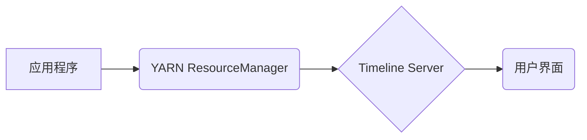

> YARN, Timeline Server, 大数据, 分布式系统, 监控, 调度, 代码实例

## 1. 背景介绍

随着大数据时代的到来，分布式计算框架如Apache Hadoop和Apache Spark等日益普及，它们处理海量数据的能力得到了广泛认可。然而，随着集群规模的不断扩大，对资源的管理和任务的监控也变得更加复杂。为了解决这些问题，Apache YARN（Yet Another Resource Negotiator）应运而生，它是一个资源管理和调度框架，为各种应用程序提供统一的资源分配和管理机制。

YARN 的核心组件之一是 Timeline Server，它负责记录和存储应用程序的生命周期信息，包括任务提交、运行、完成以及失败等事件。Timeline Server 提供了丰富的查询接口，可以方便地查询应用程序的历史运行情况，帮助用户进行故障诊断、性能分析和资源优化。

## 2. 核心概念与联系

Timeline Server 是 YARN 集群中一个重要的组件，它负责记录和存储应用程序的生命周期信息。

**核心概念：**

* **应用程序生命周期：** 指应用程序从提交到完成（或失败）的整个过程。
* **事件：** 应用程序生命周期中的重要事件，例如任务提交、运行、完成、失败等。
* **元数据：** 应用程序和事件的相关信息，例如应用程序名称、任务类型、运行时间、资源消耗等。
* **时间线：** 应用程序生命周期中事件的记录，按照时间顺序排列。

**架构图：**



**核心联系：**

* 应用程序向 YARN ResourceManager 提交任务。
* YARN ResourceManager 将任务分配给节点，并通知 Timeline Server 记录任务提交事件。
* Timeline Server 收集应用程序和任务的事件信息，并将其存储在时间线上。
* 用户可以通过 Timeline Server 的查询接口查看应用程序的历史运行情况。

## 3. 核心算法原理 & 具体操作步骤

### 3.1  算法原理概述

Timeline Server 的核心算法是基于时间序列数据的存储和查询。它采用了一种高效的存储结构，将事件信息按照时间顺序存储在磁盘上，并使用索引机制快速查找特定时间段内的事件。

### 3.2  算法步骤详解

1. **事件接收：** Timeline Server 接收来自 YARN ResourceManager 的应用程序和任务事件信息。
2. **事件序列化：** 事件信息被序列化成二进制格式，以便存储和传输。
3. **事件存储：** 事件信息被存储在磁盘上，按照时间顺序排列。
4. **索引构建：** Timeline Server 会定期构建索引，以便快速查找特定时间段内的事件。
5. **事件查询：** 用户可以通过 Timeline Server 的查询接口，指定时间范围和查询条件，获取相应的事件信息。

### 3.3  算法优缺点

**优点：**

* **高效存储：** 时间序列存储结构和索引机制，保证了事件信息的快速存储和查询。
* **灵活查询：** 提供丰富的查询接口，可以根据不同的需求查询应用程序的历史运行情况。
* **高可用性：** Timeline Server 可以配置多个实例，实现高可用性。

**缺点：**

* **存储空间：** 随着应用程序数量和事件数量的增加，Timeline Server 的存储空间需求也会增加。
* **复杂性：** Timeline Server 的架构和算法相对复杂，需要专业的技术人员进行维护和管理。

### 3.4  算法应用领域

Timeline Server 的算法原理和技术可以应用于各种需要记录和分析时间序列数据的场景，例如：

* **系统监控：** 记录系统资源使用情况、应用程序运行状态等信息，帮助用户进行故障诊断和性能分析。
* **日志分析：** 记录应用程序和系统日志信息，帮助用户分析事件发生的原因和趋势。
* **数据分析：** 记录数据处理过程中的事件信息，帮助用户分析数据流和处理效率。

## 4. 数学模型和公式 & 详细讲解 & 举例说明

### 4.1  数学模型构建

Timeline Server 的核心算法可以抽象为一个时间序列数据模型，其中：

* **时间轴：** 表示时间序列的轴线，单位可以是秒、分钟、小时等。
* **事件点：** 表示时间轴上发生的事件，每个事件点包含事件类型、时间戳和相关元数据。

### 4.2  公式推导过程

Timeline Server 的查询算法可以利用时间轴和事件点的关系进行推导。

假设用户查询时间范围为 [start_time, end_time]，则查询结果包含所有在该时间范围内的事件点。

查询算法可以表示为：

```
查询结果 = {事件点 | start_time <= 事件点时间戳 <= end_time}
```

### 4.3  案例分析与讲解

例如，用户查询时间范围为 [2023-03-01 00:00:00, 2023-03-01 23:59:59]，则查询结果包含所有在 2023 年 3 月 1 日 00:00:00 到 23:59:59 之间发生的事件点。

## 5. 项目实践：代码实例和详细解释说明

### 5.1  开发环境搭建

Timeline Server 的开发环境搭建需要以下软件：

* Java Development Kit (JDK)
* Apache Maven
* Apache Hadoop

### 5.2  源代码详细实现

Timeline Server 的源代码主要位于 Apache YARN 的代码库中。

### 5.3  代码解读与分析

Timeline Server 的代码实现主要包括以下几个模块：

* **事件处理模块：** 负责接收和处理来自 YARN ResourceManager 的事件信息。
* **数据存储模块：** 负责将事件信息存储在磁盘上，并构建索引。
* **查询模块：** 负责处理用户查询事件信息。
* **用户界面模块：** 提供用户界面，方便用户查看应用程序的历史运行情况。

### 5.4  运行结果展示

运行 Timeline Server 后，用户可以通过 Web 界面查看应用程序的历史运行情况，例如任务提交时间、运行时间、资源消耗等信息。

## 6. 实际应用场景

Timeline Server 在实际应用场景中可以用于：

* **应用程序监控：** 监控应用程序的运行状态，及时发现问题。
* **资源管理：** 分析应用程序的资源使用情况，优化资源分配。
* **性能分析：** 分析应用程序的性能瓶颈，提高性能。
* **故障诊断：** 帮助用户快速定位和解决应用程序故障。

### 6.4  未来应用展望

随着大数据和云计算的发展，Timeline Server 的应用场景将会更加广泛。未来，Timeline Server 可以应用于：

* **机器学习：** 记录机器学习模型的训练过程，分析模型的性能和收敛速度。
* **物联网：** 记录物联网设备的运行状态和数据采集情况，帮助用户进行设备管理和数据分析。
* **金融科技：** 记录金融交易的详细信息，帮助用户进行风险控制和欺诈检测。

## 7. 工具和资源推荐

### 7.1  学习资源推荐

* Apache YARN 官方文档：https://hadoop.apache.org/docs/current/hadoop-yarn/
* Timeline Server 源代码：https://github.com/apache/hadoop/tree/master/hadoop-yarn/timeline-server

### 7.2  开发工具推荐

* Apache Maven
* Eclipse IDE
* IntelliJ IDEA

### 7.3  相关论文推荐

* Timeline Server: A Distributed System for Tracking Application Life Cycles in Hadoop
* YARN: Yet Another Resource Negotiator

## 8. 总结：未来发展趋势与挑战

### 8.1  研究成果总结

Timeline Server 是 Apache YARN 集群中一个重要的组件，它为应用程序的生命周期管理提供了强大的支持。Timeline Server 的核心算法和技术可以应用于各种需要记录和分析时间序列数据的场景。

### 8.2  未来发展趋势

未来，Timeline Server 将会朝着以下方向发展：

* **更强大的查询功能：** 支持更复杂的查询条件和数据分析功能。
* **更完善的监控和告警机制：** 提供更丰富的监控指标和告警规则，帮助用户及时发现问题。
* **更强大的数据存储和处理能力：** 支持更大的数据量和更复杂的查询操作。

### 8.3  面临的挑战

Timeline Server 的发展也面临着一些挑战：

* **数据存储和管理：** 随着应用程序数量和事件数量的增加，Timeline Server 的数据存储和管理需求会越来越大。
* **系统性能优化：** 随着查询复杂度的增加，Timeline Server 的系统性能需要不断优化。
* **安全性和可靠性：** Timeline Server 需要保证数据的安全性、可靠性和可用性。

### 8.4  研究展望

未来，我们将继续研究和改进 Timeline Server 的算法和技术，使其能够更好地满足大数据时代的需求。


## 9. 附录：常见问题与解答

**常见问题：**

* **Timeline Server 的存储方式是什么？**

Timeline Server 使用时间序列存储结构和索引机制，将事件信息按照时间顺序存储在磁盘上。

* **Timeline Server 的查询接口有哪些？**

Timeline Server 提供了丰富的查询接口，可以根据不同的需求查询应用程序的历史运行情况。

* **Timeline Server 的高可用性如何实现？**

Timeline Server 可以配置多个实例，实现高可用性。

**解答：**

* **Timeline Server 的存储方式是什么？**

Timeline Server 使用时间序列存储结构和索引机制，将事件信息按照时间顺序存储在磁盘上。

* **Timeline Server 的查询接口有哪些？**

Timeline Server 提供了丰富的查询接口，可以根据不同的需求查询应用程序的历史运行情况。

* **Timeline Server 的高可用性如何实现？**

Timeline Server 可以配置多个实例，实现高可用性。


作者：禅与计算机程序设计艺术 / Zen and the Art of Computer Programming 
<end_of_turn>