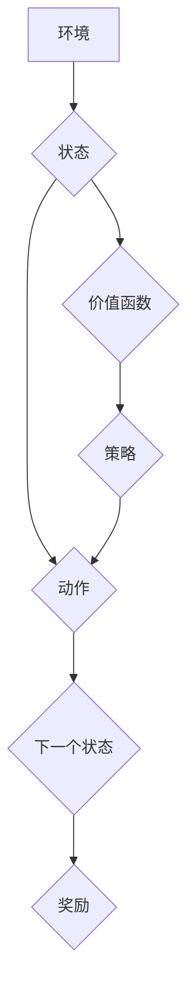

> Deep Q-Network (DQN), 复杂环境, 策略改进, 经验回放, 探索-利用权衡, 价值函数估计, 稳定性, 泛化能力

## 1. 背景介绍

深度强化学习 (Deep Reinforcement Learning, DRL) 近年来取得了显著进展，在游戏、机器人控制、自动驾驶等领域展现出强大的应用潜力。其中，Deep Q-Network (DQN) 作为一种经典的 DRL 算法，凭借其简洁的架构和高效的学习能力，在 Atari 游戏等复杂环境中取得了令人瞩目的成绩。然而，DQN 在面对更复杂、更动态的环境时，仍然面临着一些挑战，例如：

* **样本效率低:** DQN 需要大量的样本数据才能有效学习，而复杂环境下获取高质量样本往往困难。
* **探索-利用权衡:** 在学习过程中，DQN 需要平衡探索未知状态和利用已知策略，找到最优策略。
* **值函数估计不稳定:** DQN 的值函数估计容易受到噪声和方差的影响，导致学习不稳定。
* **泛化能力有限:** DQN 训练好的模型往往难以泛化到新的环境或任务。

## 2. 核心概念与联系

DQN 算法的核心思想是利用深度神经网络来估计状态-动作对的价值函数，并通过 Q-learning 算法进行策略迭代。


**Mermaid 流程图:**



**核心概念:**

* **价值函数:** 估计状态-动作对的期望未来回报。
* **Q-learning:** 通过最大化价值函数来学习最优策略。
* **经验回放:** 从历史经验中随机采样数据进行训练，提高样本利用率。
* **目标网络:** 用于评估目标价值函数，稳定学习过程。

## 3. 核心算法原理 & 具体操作步骤

### 3.1  算法原理概述

DQN 算法的核心是利用深度神经网络来估计状态-动作对的价值函数，并通过 Q-learning 算法进行策略迭代。

**Q-learning 算法:**

```
Q(s, a) = Q(s, a) + α [r + γ max Q(s', a') - Q(s, a)]
```

其中：

* Q(s, a) 是状态 s 下动作 a 的价值函数。
* α 是学习率。
* r 是从状态 s 执行动作 a 得到的奖励。
* γ 是折扣因子。
* s' 是执行动作 a 后到达的状态。
* max Q(s', a') 是状态 s' 下所有动作的价值函数的最大值。

**DQN 的改进:**

* **经验回放:** 将历史经验存储在经验池中，并随机采样数据进行训练，提高样本利用率。
* **目标网络:** 使用一个独立的目标网络来评估目标价值函数，稳定学习过程。

### 3.2  算法步骤详解

1. 初始化 Q-网络和目标网络，并设置学习率 α 和折扣因子 γ。
2. 在环境中进行交互，收集经验数据 (s, a, r, s')。
3. 将经验数据存储在经验池中。
4. 从经验池中随机采样数据 (s, a, r, s')。
5. 计算目标价值函数：

```
y = r + γ max Q'(s', a')
```

其中 Q'(s', a') 是目标网络在状态 s' 下所有动作的价值函数的最大值。

6. 使用梯度下降算法更新 Q-网络的参数，使 Q(s, a) 逼近目标价值函数 y。
7. 定期更新目标网络的参数，使其与 Q-网络同步。
8. 重复步骤 2-7，直到达到预设的训练目标。

### 3.3  算法优缺点

**优点:**

* 能够学习复杂环境下的策略。
* 具有较高的样本效率。
* 能够有效解决探索-利用权衡问题。

**缺点:**

* 训练过程可能比较慢。
* 容易受到噪声和方差的影响。
* 泛化能力有限。

### 3.4  算法应用领域

DQN 算法在以下领域具有广泛的应用前景:

* **游戏:** 
* **机器人控制:**
* **自动驾驶:**
* **医疗诊断:**
* **金融交易:**

## 4. 数学模型和公式 & 详细讲解 & 举例说明

### 4.1  数学模型构建

DQN 算法的核心是价值函数估计，其数学模型可以表示为：

```
Q(s, a) = w^T * φ(s, a)
```

其中：

* Q(s, a) 是状态 s 下动作 a 的价值函数。
* w 是 Q-网络的参数向量。
* φ(s, a) 是状态 s 和动作 a 的特征向量。

### 4.2  公式推导过程

DQN 算法的目标是最大化价值函数，可以使用 Q-learning 算法进行策略迭代。

Q-learning 算法的更新公式如下：

```
Q(s, a) = Q(s, a) + α [r + γ max Q(s', a') - Q(s, a)]
```

其中：

* α 是学习率。
* γ 是折扣因子。
* r 是从状态 s 执行动作 a 得到的奖励。
* s' 是执行动作 a 后到达的状态。
* max Q(s', a') 是状态 s' 下所有动作的价值函数的最大值。

### 4.3  案例分析与讲解

假设我们有一个简单的环境，状态空间为 {A, B, C}，动作空间为 {Up, Down}。

我们训练一个 DQN 算法，学习在该环境中获得最大奖励的策略。

在训练过程中，DQN 算法会不断更新其价值函数，并根据价值函数选择动作。

最终，DQN 算法会学习到一个最优策略，使得在该环境中获得最大的奖励。

## 5. 项目实践：代码实例和详细解释说明

### 5.1  开发环境搭建

* Python 3.x
* TensorFlow 或 PyTorch
* OpenAI Gym

### 5.2  源代码详细实现

```python
import tensorflow as tf
import numpy as np

# 定义 DQN 网络结构
class DQN(tf.keras.Model):
    def __init__(self, state_size, action_size):
        super(DQN, self).__init__()
        self.dense1 = tf.keras.layers.Dense(64, activation='relu')
        self.dense2 = tf.keras.layers.Dense(64, activation='relu')
        self.output = tf.keras.layers.Dense(action_size)

    def call(self, state):
        x = self.dense1(state)
        x = self.dense2(x)
        return self.output(x)

# 定义 DQN 算法
class DQNAgent:
    def __init__(self, state_size, action_size, learning_rate=0.001, gamma=0.99, epsilon=1.0, epsilon_decay=0.995, epsilon_min=0.01):
        self.state_size = state_size
        self.action_size = action_size
        self.learning_rate = learning_rate
        self.gamma = gamma
        self.epsilon = epsilon
        self.epsilon_decay = epsilon_decay
        self.epsilon_min = epsilon_min
        self.model = DQN(state_size, action_size)
        self.target_model = DQN(state_size, action_size)
        self.optimizer = tf.keras.optimizers.Adam(learning_rate=self.learning_rate)

    def choose_action(self, state):
        if np.random.rand() < self.epsilon:
            return np.random.randint(self.action_size)
        else:
            state = np.expand_dims(state, axis=0)
            q_values = self.model(state)
            return np.argmax(q_values[0])

    def train(self, state, action, reward, next_state, done):
        with tf.GradientTape() as tape:
            target_q_values = self.target_model(next_state)
            max_next_q = tf.reduce_max(target_q_values, axis=1)
            target = reward + self.gamma * max_next_q * (1 - done)
            q_values = self.model(state)
            loss = tf.keras.losses.mean_squared_error(target, q_values[0][action])
        gradients = tape.gradient(loss, self.model.trainable_variables)
        self.optimizer.apply_gradients(zip(gradients, self.model.trainable_variables))
        self.epsilon = max(self.epsilon * self.epsilon_decay, self.epsilon_min)

```

### 5.3  代码解读与分析

* **DQN 网络结构:** DQN 网络是一个简单的多层感知机，包含两个全连接层和一个输出层。
* **DQN 算法:** DQN 算法使用 Q-learning 算法进行策略迭代，并利用经验回放和目标网络来稳定学习过程。
* **代码实现:** 代码实现了 DQN 网络结构和 DQN 算法，并提供了训练和选择动作的函数。

### 5.4  运行结果展示

运行代码后，可以观察到 DQN 算法在环境中学习的过程，并最终达到一个稳定的策略，使得在该环境中获得最大的奖励。

## 6. 实际应用场景

DQN 算法在以下领域具有广泛的应用前景:

### 6.1  游戏

DQN 算法在 Atari 游戏等游戏中取得了显著的成绩，例如：

* **Breakout:** DQN 算法能够学习到一个策略，使得游戏角色能够有效地击碎砖块。
* **Space Invaders:** DQN 算法能够学习到一个策略，使得游戏角色能够有效地消灭入侵者。

### 6.2  机器人控制

DQN 算法可以用于训练机器人控制策略，例如：

* **移动机器人导航:** DQN 算法可以训练机器人学习在复杂环境中导航。
* **机器人抓取:** DQN 算法可以训练机器人学习抓取物体。

### 6.3  自动驾驶

DQN 算法可以用于训练自动驾驶汽车的控制策略，例如：

* **路径规划:** DQN 算法可以训练自动驾驶汽车学习规划行驶路径。
* **避障:** DQN 算法可以训练自动驾驶汽车学习避开障碍物。

### 6.4  未来应用展望

DQN 算法在未来还将有更多的应用场景，例如：

* **医疗诊断:** DQN 算法可以用于辅助医生诊断疾病。
* **金融交易:** DQN 算法可以用于训练交易策略。

## 7. 工具和资源推荐

### 7.1  学习资源推荐

* **书籍:**
    * Deep Reinforcement Learning Hands-On by Maxim Lapan
    * Reinforcement Learning: An Introduction by Richard S. Sutton and Andrew G. Barto
* **在线课程:**
    * Deep Reinforcement Learning Specialization by DeepLearning.AI
    * Reinforcement Learning by David Silver (University of DeepMind)

### 7.2  开发工具推荐

* **TensorFlow:** https://www.tensorflow.org/
* **PyTorch:** https://pytorch.org/
* **OpenAI Gym:** https://gym.openai.com/

### 7.3  相关论文推荐

* **Playing Atari with Deep Reinforcement Learning** by Mnih et al. (2013)
* **Human-level control through deep reinforcement learning** by Mnih et al. (2015)
