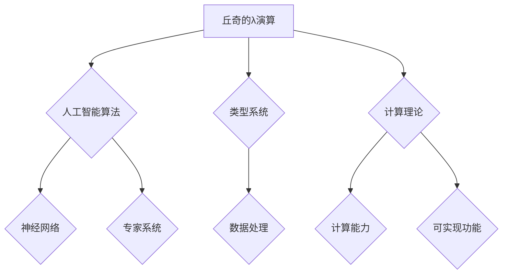

>  * 计算机科学
>  * 逻辑学
>  * 算法
>  * 人工智能
>  * 语言模型
>  * 历史影响

## 1. 背景介绍

20世纪中叶，计算机科学正处于蓬勃发展的阶段。在这一时期，两位杰出的科学家，艾伦·图灵和约翰·冯·诺伊曼，为计算机科学的发展奠定了坚实的基础。图灵提出了著名的“图灵测试”，试图衡量机器是否具有智能；冯·诺伊曼则提出了“冯·诺伊曼体系结构”，为现代计算机的硬件设计提供了蓝本。

与此同时，在麻省理工学院，一位名叫艾伦·丘奇的年轻学者正在进行着对逻辑学和计算理论的深入研究。丘奇的贡献主要集中在以下几个方面：

* **λ演算：** 丘奇提出了λ演算，一种基于函数抽象的逻辑系统，它能够表达任何可计算函数。λ演算为计算机科学提供了强大的理论基础，并对后来的编程语言设计产生了深远的影响。
* **类型系统：** 丘奇对类型系统的研究为程序的可靠性和安全性提供了保障。类型系统能够帮助程序员避免类型错误，提高代码的质量。
* **计算理论：** 丘奇对计算理论的贡献包括停机问题和可计算性理论等重要研究成果。这些研究成果对计算机科学的发展产生了深远的影响。

## 2. 核心概念与联系

丘奇的研究成果对后来的人工智能发展产生了深远的影响。

**2.1  λ演算与人工智能**

λ演算是一种强大的逻辑系统，它能够表达任何可计算函数。这使得λ演算成为人工智能研究的重要工具。例如，许多人工智能算法，如神经网络和专家系统，都可以用λ演算来表示。

**2.2  类型系统与人工智能**

类型系统能够帮助程序员避免类型错误，提高代码的质量。这对于人工智能研究非常重要，因为人工智能系统通常需要处理大量的数据，并且需要保证数据的正确性。

**2.3  计算理论与人工智能**

丘奇对计算理论的研究成果，如停机问题和可计算性理论，为人工智能研究提供了重要的理论基础。这些理论成果帮助我们理解了计算机的计算能力，以及人工智能系统能够实现哪些功能。

**Mermaid 流程图**



## 3. 核心算法原理 & 具体操作步骤

### 3.1  算法原理概述

λ演算是一种基于函数抽象的逻辑系统，它能够表达任何可计算函数。λ演算的基本概念是“抽象”和“应用”。

* **抽象：** 抽象是指将一个函数定义为一个新的符号，这个符号代表了该函数的计算过程。
* **应用：** 应用是指将一个函数应用到一个具体的输入上，得到一个输出。

### 3.2  算法步骤详解

1. **定义函数：** 使用λ符号定义一个函数，例如：λx.x+1 表示一个将输入加1的函数。
2. **应用函数：** 将函数应用到一个具体的输入上，例如： (λx.x+1) 2 表示将函数应用到输入2上，得到结果3。
3. **β归约：** λ演算中的β归约是将函数应用到输入的过程，它将函数的定义替换为具体的输入。例如： (λx.x+1) 2  →  2+1  →  3。

### 3.3  算法优缺点

**优点：**

* **简洁：** λ演算能够用简洁的符号表示复杂的计算过程。
* **强大：** λ演算能够表达任何可计算函数。
* **理论基础：** λ演算为计算机科学提供了强大的理论基础。

**缺点：**

* **抽象：** λ演算的抽象性可能难以理解。
* **效率：** λ演算的计算效率可能不如其他编程语言。

### 3.4  算法应用领域

* **人工智能：** λ演算被广泛应用于人工智能研究，例如神经网络和专家系统。
* **编程语言设计：** λ演算对后来的编程语言设计产生了深远的影响，例如Haskell和Lisp。
* **逻辑学：** λ演算是一种强大的逻辑系统，被广泛应用于逻辑学研究。

## 4. 数学模型和公式 & 详细讲解 & 举例说明

### 4.1  数学模型构建

λ演算可以看作是一个基于函数的数学模型。在这个模型中，函数被表示为抽象符号，输入被表示为参数，输出被表示为结果。

### 4.2  公式推导过程

λ演算的β归约规则是其核心公式。该规则规定，当一个函数应用到一个具体的输入上时，函数的定义会被替换为具体的输入。

**公式：**

(λx.M)N → M[x := N]

**解释：**

* (λx.M)N 表示函数M应用到输入N上。
* M[x := N] 表示将函数M中的所有x替换为N。

**举例：**

(λx.x+1)2 → 2+1 → 3

### 4.3  案例分析与讲解

**案例：**

计算 (λx.x*x)3

**分析：**

1. 函数定义：λx.x*x 表示一个将输入平方后的函数。
2. 应用输入：将函数应用到输入3上，得到 (λx.x*x)3。
3. β归约：根据β归约规则，将函数定义中的x替换为3，得到 3*3 → 9。

**结果：**

(λx.x*x)3 = 9

## 5. 项目实践：代码实例和详细解释说明

### 5.1  开发环境搭建

本项目使用Python语言进行开发，需要安装Python环境和相关库。

### 5.2  源代码详细实现

```python
def lambda_function(x):
  """
  定义一个将输入平方后的函数
  """
  return x * x

# 应用函数到输入3
result = lambda_function(3)

# 打印结果
print(result)
```

### 5.3  代码解读与分析

* `def lambda_function(x):` 定义了一个名为`lambda_function`的函数，该函数接受一个参数`x`。
* `return x * x` 函数的返回值是输入`x`的平方。
* `result = lambda_function(3)` 将函数应用到输入3上，并将结果存储在`result`变量中。
* `print(result)` 打印`result`变量的值，即9。

### 5.4  运行结果展示

```
9
```

## 6. 实际应用场景

### 6.1  神经网络

λ演算被广泛应用于神经网络的研究。神经网络中的神经元可以看作是函数，而连接神经元的连接权重可以看作是函数的参数。λ演算可以用来表示神经网络的计算过程，并进行优化。

### 6.2  专家系统

专家系统是一种基于规则的知识表示和推理系统。λ演算可以用来表示专家系统的规则，并进行推理。

### 6.3  编程语言设计

λ演算对后来的编程语言设计产生了深远的影响，例如Haskell和Lisp。这些语言都采用了λ演算中的函数抽象和应用的概念。

### 6.4  未来应用展望

随着人工智能技术的不断发展，λ演算在人工智能领域的应用前景广阔。例如，λ演算可以用于开发更强大的神经网络模型，以及设计更智能的专家系统。

## 7. 工具和资源推荐

### 7.1  学习资源推荐

* **《计算机程序的结构与解释》**：这是一本经典的计算机科学教材，介绍了λ演算的基本概念和应用。
* **《类型系统》**：这是一本关于类型系统的经典著作，介绍了类型系统的原理和应用。
* **在线课程：** 许多在线平台提供关于λ演算和人工智能的课程，例如Coursera和edX。

### 7.2  开发工具推荐

* **Python：** Python是一种流行的编程语言，被广泛应用于人工智能研究。
* **Haskell：** Haskell是一种功能型编程语言，它采用了λ演算中的函数抽象和应用的概念。

### 7.3  相关论文推荐

* **《λ演算》**：这是一篇关于λ演算的经典论文，介绍了λ演算的基本概念和理论基础。
* **《神经网络》**：这是一篇关于神经网络的经典论文，介绍了神经网络的原理和应用。

## 8. 总结：未来发展趋势与挑战

### 8.1  研究成果总结

丘奇的研究成果对计算机科学和人工智能的发展产生了深远的影响。λ演算为计算机科学提供了强大的理论基础，类型系统为程序的可靠性和安全性提供了保障，计算理论为人工智能研究提供了重要的理论基础。

### 8.2  未来发展趋势

随着人工智能技术的不断发展，λ演算在人工智能领域的应用前景广阔。例如，λ演算可以用于开发更强大的神经网络模型，以及设计更智能的专家系统。

### 8.3  面临的挑战

λ演算的抽象性可能难以理解，并且其计算效率可能不如其他编程语言。如何克服这些挑战，使其更易于理解和使用，是未来研究的重要方向。

### 8.4  研究展望

未来，我们将继续研究λ演算在人工智能领域的应用，并探索其在其他领域的应用潜力。


## 9. 附录：常见问题与解答

**问题：** λ演算和编程语言有什么区别？

**答案：** λ演算是一种逻辑系统，它能够表达任何可计算函数。编程语言是一种用于编写程序的工具，它通常基于λ演算或其他逻辑系统。

**问题：** λ演算的计算效率如何？

**答案：** λ演算的计算效率可能不如其他编程语言，例如C++和Java。

**问题：** 如何学习λ演算？

**答案：** 可以阅读相关书籍和在线课程，例如《计算机程序的结构与解释》和Coursera上的λ演算课程。


作者：禅与计算机程序设计艺术 / Zen and the Art of Computer Programming 
<end_of_turn>