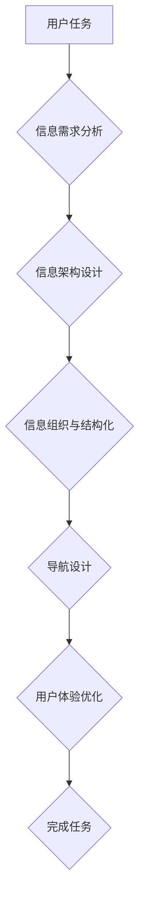

> 任务导向设计，信息架构，用户体验，用户需求，信息组织，导航设计，交互设计

## 1. 背景介绍

在当今信息爆炸的时代，用户每天需要处理海量的数字信息。如何有效地组织、检索和利用这些信息，成为了一个至关重要的挑战。信息架构 (Information Architecture，IA) 作为解决这一问题的关键技术，旨在通过合理地组织和结构化信息，帮助用户轻松地找到所需的信息，并提高用户体验。

传统的IA设计往往以内容为中心，着重于信息的分类、标签和组织结构。然而，随着用户需求的多样化和交互方式的不断变化，单纯依靠内容导向的设计模式已经难以满足用户的实际需求。

任务导向设计 (Task-Oriented Design) 应运而生，它将用户的任务和目标作为设计的核心，旨在通过理解用户的行为模式和信息需求，构建一个能够引导用户完成特定任务的清晰、直观的信息架构。

## 2. 核心概念与联系

任务导向设计的核心概念是将用户任务作为设计起点，通过分析用户行为和信息需求，构建一个能够有效支持用户完成任务的信息架构。

**信息架构**是指对信息进行分类、组织、结构化和导航的设计，它决定了用户如何访问、理解和利用信息。

**任务导向设计**则强调以用户任务为中心，通过分析用户行为和信息需求，设计一个能够引导用户完成任务的系统。

**Mermaid 流程图:**



## 3. 核心算法原理 & 具体操作步骤

### 3.1  算法原理概述

任务导向设计并不依赖于特定的算法，而是基于对用户任务和信息需求的深入理解。

其核心原理是：

* **用户任务分析:** 通过观察用户行为、访谈用户需求和分析用户场景，明确用户想要完成的任务目标。
* **信息需求分析:** 识别用户在完成任务过程中需要获取的信息类型、内容和结构。
* **信息架构设计:** 根据用户任务和信息需求，设计一个清晰、直观的组织结构，将信息分类、标签和结构化。
* **导航设计:** 设计一个易于理解和使用的导航系统，引导用户快速找到所需的信息。

### 3.2  算法步骤详解

1. **用户任务分析:**

* 使用用户访谈、问卷调查、用户行为分析等方法，收集用户任务信息。
* 将用户任务进行分类和细化，明确每个任务的目标和步骤。

2. **信息需求分析:**

* 分析每个任务所需的具体信息类型、内容和结构。
* 识别用户在信息检索、理解和利用过程中可能遇到的困难。

3. **信息架构设计:**

* 根据用户任务和信息需求，设计一个清晰、直观的组织结构。
* 使用合适的分类、标签和导航方式，将信息进行结构化和组织。

4. **导航设计:**

* 设计一个易于理解和使用的导航系统，引导用户快速找到所需的信息。
* 使用清晰的导航标签、面包屑导航和搜索功能，帮助用户浏览和检索信息。

### 3.3  算法优缺点

**优点:**

* 能够更好地满足用户需求，提高用户体验。
* 能够帮助用户更有效地完成任务。
* 能够提高信息的可发现性和可理解性。

**缺点:**

* 需要对用户任务和信息需求进行深入的分析和理解。
* 设计过程较为复杂，需要专业的知识和经验。

### 3.4  算法应用领域

任务导向设计广泛应用于各种领域，例如：

* 网站设计
* 移动应用开发
* 企业信息系统
* 数字图书馆
* 在线教育平台

## 4. 数学模型和公式 & 详细讲解 & 举例说明

在任务导向设计中，可以使用数学模型和公式来量化用户任务和信息需求，并评估信息架构的有效性。

### 4.1  数学模型构建

**用户任务复杂度模型:**

```latex
T = f(N, C, I)
```

其中：

* T 表示用户任务的复杂度
* N 表示任务步骤的数量
* C 表示每个步骤的复杂度
* I 表示任务所需的知识和信息量

**信息检索效率模型:**

```latex
E = g(S, R, P)
```

其中：

* E 表示信息检索的效率
* S 表示搜索结果的数量
* R 表示相关结果的比例
* P 表示用户检索所需的时间

### 4.2  公式推导过程

用户任务复杂度模型和信息检索效率模型可以通过用户行为数据和实验结果进行推导和验证。

例如，可以通过分析用户完成任务所需的时间、点击次数和错误率等数据，来评估任务复杂度和信息检索效率。

### 4.3  案例分析与讲解

假设我们设计一个在线购物网站，用户需要完成“购买商品”的任务。

我们可以使用上述模型来分析用户任务的复杂度和信息检索效率。

* **任务复杂度:** 购买商品的任务可能包含多个步骤，例如：浏览商品、加入购物车、填写收货地址、选择支付方式等。每个步骤的复杂度也可能不同，例如：选择商品的复杂度可能较低，而填写收货地址的复杂度可能较高。
* **信息检索效率:** 用户需要在网站上搜索商品信息、查看商品详情、比较商品价格等。搜索结果的数量、相关结果的比例和用户检索所需的时间都会影响信息检索效率。

通过分析这些因素，我们可以优化网站的信息架构和导航设计，提高用户体验和任务完成效率。

## 5. 项目实践：代码实例和详细解释说明

### 5.1  开发环境搭建

为了演示任务导向设计，我们可以使用 Python 和 Flask 框架开发一个简单的任务管理系统。

开发环境搭建步骤如下：

1. 安装 Python 和 Flask 框架。
2. 创建一个新的 Python 项目文件夹。
3. 创建一个名为 `app.py` 的 Python 文件，作为项目的入口文件。

### 5.2  源代码详细实现

```python
from flask import Flask, render_template

app = Flask(__name__)

@app.route('/')
def index():
    return render_template('index.html')

if __name__ == '__main__':
    app.run(debug=True)
```

### 5.3  代码解读与分析

* `from flask import Flask, render_template`: 导入 Flask 框架和模板渲染功能。
* `app = Flask(__name__)`: 创建一个 Flask 应用实例。
* `@app.route('/')`: 定义一个路由规则，当访问根路径 '/' 时，执行 `index()` 函数。
* `def index()`: 定义一个函数，返回 `index.html` 模板文件。
* `if __name__ == '__main__':`: 确保代码只在脚本执行时运行。
* `app.run(debug=True)`: 启动 Flask 应用，开启调试模式。

### 5.4  运行结果展示

运行上述代码后，访问 `http://127.0.0.1:5000/`，将会看到一个简单的网页，这是任务管理系统的首页。

## 6. 实际应用场景

任务导向设计在各种实际应用场景中发挥着重要作用，例如：

### 6.1  电商平台

电商平台需要帮助用户快速找到所需商品，完成购买流程。任务导向设计可以帮助电商平台优化商品分类、搜索功能和导航设计，提高用户体验和转化率。

### 6.2  在线教育平台

在线教育平台需要帮助用户找到合适的课程、学习资料和互动资源。任务导向设计可以帮助在线教育平台优化课程分类、搜索功能和学习路径设计，提高用户学习效率和满意度。

### 6.3  医疗信息系统

医疗信息系统需要帮助医生和患者快速找到所需医疗信息、预约挂号和管理病历。任务导向设计可以帮助医疗信息系统优化信息组织、导航设计和用户界面设计，提高医疗服务效率和安全性。

### 6.4  未来应用展望

随着人工智能、大数据和物联网技术的不断发展，任务导向设计将更加深入地融入到各种应用场景中。

例如，人工智能可以帮助我们更好地理解用户的任务和需求，而大数据可以帮助我们收集和分析用户行为数据，从而不断优化信息架构和用户体验。

## 7. 工具和资源推荐

### 7.1  学习资源推荐

* **书籍:**
    * 《Don Norman's The Design of Everyday Things》
    * 《Information Architecture for the World Wide Web》
    * 《Designing for the Digital Age》
* **在线课程:**
    * Coursera: Information Architecture Specialization
    * Udemy: Information Architecture: Design & Implementation

### 7.2  开发工具推荐

* **信息架构设计工具:**
    * Miro
    * Figma
    * Sketch
* **网站地图生成工具:**
    * Screaming Frog
    * Sitebulb

### 7.3  相关论文推荐

* **Task-Oriented Design for User Interfaces**
* **Information Architecture for the Web: Principles and Practice**
* **The Role of Information Architecture in User Experience Design**

## 8. 总结：未来发展趋势与挑战

### 8.1  研究成果总结

任务导向设计已经取得了显著的成果，帮助我们更好地理解用户需求，设计更有效的信息架构，提高用户体验。

### 8.2  未来发展趋势

未来，任务导向设计将朝着以下方向发展：

* **更加个性化:** 基于用户行为和偏好，提供个性化的信息架构和导航体验。
* **更加智能化:** 利用人工智能技术，自动分析用户任务和信息需求，动态调整信息架构。
* **更加跨平台:** 在不同设备和平台上提供一致的用户体验。

### 8.3  面临的挑战

任务导向设计也面临着一些挑战，例如：

* **用户任务的复杂性和多样性:** 用户任务的复杂性和多样性不断增加，需要更加灵活和智能的信息架构设计方法。
* **信息爆炸和内容更新速度:** 信息爆炸和内容更新速度加快，需要更加高效的信息组织和检索机制。
* **跨文化和语言差异:** 信息架构需要考虑跨文化和语言差异，才能满足全球用户的需求。

### 8.4  研究展望

未来，我们需要继续深入研究任务导向设计，探索新的算法、模型和方法，以应对不断变化的用户需求和技术发展。


## 9. 附录：常见问题与解答

### 9.1  常见问题

* **任务导向设计和内容导向设计有什么区别？**

* **如何进行用户任务分析？**

* **如何评估信息架构的有效性？**

### 9.2  解答

* **任务导向设计和内容导向设计有什么区别？**

任务导向设计以用户任务为中心，旨在帮助用户完成特定任务，而内容导向设计则以内容为中心，着重于信息的分类、组织和结构化。

* **如何进行用户任务分析？**

用户任务分析可以通过用户访谈、问卷调查、用户行为分析等方法进行。

* **如何评估信息架构的有效性？**

可以通过用户测试、A/B 测试等方法评估信息架构的有效性。

作者：禅与计算机程序设计艺术 / Zen and the Art of Computer Programming


<end_of_turn>