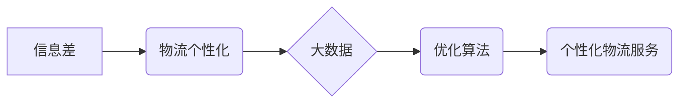

> 大数据，物流个性化，信息差，优化算法，机器学习，预测模型，供应链管理

## 1. 背景介绍

在当今全球化经济的背景下，物流行业面临着日益激烈的竞争压力。消费者对商品的个性化需求不断增长，同时，物流成本的控制也成为企业关注的焦点。如何有效利用大数据技术，缩小信息差，实现物流个性化优化，成为物流行业发展的重要趋势。

传统物流模式往往采用标准化、批量化的服务方式，难以满足消费者个性化的需求。而大数据技术能够收集、分析和挖掘海量物流数据，为个性化物流服务提供数据支撑。通过分析消费者购买行为、配送偏好、地理位置等信息，可以实现个性化的配送路线规划、配送时间安排、配送方式选择等，从而提升客户满意度和物流效率。

## 2. 核心概念与联系

**2.1 信息差**

信息差是指在物流过程中，不同参与方之间信息不对称的情况。例如，货主对货物运输情况了解有限，而物流企业则掌握着更详细的运输信息。这种信息不对称会导致物流效率低下、成本增加、服务质量下降等问题。

**2.2 物流个性化**

物流个性化是指根据不同客户的实际需求，提供定制化的物流服务。例如，一些客户可能需要快速配送，而另一些客户则可能更注重价格优惠。物流个性化可以满足不同客户的个性化需求，提升客户满意度。

**2.3 大数据**

大数据是指海量、高速度、高多样性的数据。大数据技术能够对海量物流数据进行分析和挖掘，发现隐藏的规律和趋势，为物流个性化提供数据支撑。

**2.4 核心概念关系图**



**2.5 核心概念原理**

通过大数据技术，可以收集和分析海量物流数据，例如：

* **客户数据:** 购买历史、配送偏好、地理位置等
* **货物数据:** 商品种类、重量、体积、价值等
* **运输数据:** 配送路线、运输时间、运输成本等

基于这些数据，可以构建个性化物流服务模型，实现以下功能：

* **个性化配送路线规划:** 根据客户地理位置、配送时间偏好等信息，规划最优的配送路线，减少运输时间和成本。
* **个性化配送时间安排:** 根据客户工作时间、生活习惯等信息，安排最合适的配送时间，提高客户满意度。
* **个性化配送方式选择:** 根据客户需求和货物特性，提供多种配送方式选择，例如快递、货运、自提等。

## 3. 核心算法原理 & 具体操作步骤

**3.1 算法原理概述**

物流个性化优化算法通常基于机器学习和预测模型，通过训练和学习海量物流数据，预测客户需求和物流成本，从而实现个性化服务。常见的算法包括：

* **回归算法:** 用于预测连续型变量，例如配送时间、运输成本等。
* **分类算法:** 用于分类不同类型的客户或货物，例如快速配送客户、高价值货物等。
* **聚类算法:** 用于将客户或货物进行分组，例如根据地理位置、购买习惯等进行分组。

**3.2 算法步骤详解**

1. **数据收集和预处理:** 收集海量物流数据，并进行清洗、转换、标准化等预处理操作。
2. **特征工程:** 从原始数据中提取特征，例如客户购买历史、地理位置、货物属性等，这些特征将作为算法训练的输入。
3. **模型选择和训练:** 选择合适的算法模型，并根据训练数据进行模型训练，调整模型参数，使其能够准确预测客户需求和物流成本。
4. **模型评估和优化:** 使用测试数据评估模型性能，并根据评估结果进行模型优化，例如调整模型参数、增加训练数据等。
5. **个性化服务实现:** 将训练好的模型应用于实际物流场景，根据客户需求和物流成本预测结果，实现个性化配送路线规划、配送时间安排、配送方式选择等服务。

**3.3 算法优缺点**

* **优点:**

    * 能够根据客户需求和物流成本进行个性化优化，提高物流效率和客户满意度。
    * 可以利用大数据技术挖掘隐藏的规律和趋势，为物流决策提供数据支撑。

* **缺点:**

    * 需要海量数据进行训练和学习，数据质量对算法性能有重要影响。
    * 算法模型的复杂度较高，需要专业的技术人员进行开发和维护。

**3.4 算法应用领域**

* **电商物流:** 个性化配送路线规划、配送时间安排、配送方式选择等。
* **快消品物流:** 库存优化、配送网络规划、运输成本控制等。
* **医疗物流:** 冷链物流、药品配送、医疗器械运输等。

## 4. 数学模型和公式 & 详细讲解 & 举例说明

**4.1 数学模型构建**

物流个性化优化问题可以建模为一个多目标优化问题，目标函数包括：

* **客户满意度:** 衡量客户对物流服务的满意程度，例如配送时间、配送成本、服务质量等。
* **物流成本:** 衡量物流服务的成本，例如运输成本、仓储成本、人工成本等。

**4.2 公式推导过程**

假设有N个客户，每个客户有不同的需求和偏好，可以用向量表示，例如：

* **客户需求向量:**  x<sub>i</sub> = (d<sub>i</sub>, t<sub>i</sub>, c<sub>i</sub>)

其中：

* d<sub>i</sub>: 客户i的地理位置
* t<sub>i</sub>: 客户i对配送时间的偏好
* c<sub>i</sub>: 客户i对配送成本的敏感度

假设有M条配送路线，每条路线的成本和配送时间可以用向量表示，例如：

* **配送路线成本向量:**  c<sub>j</sub> = (c<sub>j1</sub>, c<sub>j2</sub>, ..., c<sub>jm</sub>)
* **配送路线时间向量:**  t<sub>j</sub> = (t<sub>j1</sub>, t<sub>j2</sub>, ..., t<sub>jm</sub>)

目标函数可以定义为：

* **客户满意度:**  ∑<sub>i=1</sub><sup>N</sup> s<sub>i</sub>(x<sub>i</sub>, r<sub>i</sub>)
* **物流成本:**  ∑<sub>j=1</sub><sup>M</sup> c<sub>j</sub>

其中：

* s<sub>i</sub>(x<sub>i</sub>, r<sub>i</sub>): 客户i对配送路线r<sub>i</sub>的满意度
* r<sub>i</sub>: 客户i分配的配送路线

**4.3 案例分析与讲解**

假设有三个客户，他们的需求向量分别为：

* 客户1: x<sub>1</sub> = (10, 1, 0.5)
* 客户2: x<sub>2</sub> = (20, 2, 0.2)
* 客户3: x<sub>3</sub> = (30, 3, 0.8)

假设有四条配送路线，它们的成本和时间向量分别为：

* 路线1: c<sub>1</sub> = (10, 15), t<sub>1</sub> = (10, 15)
* 路线2: c<sub>2</sub> = (15, 12), t<sub>2</sub> = (12, 10)
* 路线3: c<sub>3</sub> = (20, 8), t<sub>3</sub> = (8, 12)
* 路线4: c<sub>4</sub> = (25, 6), t<sub>4</sub> = (6, 10)

通过优化算法，可以找到最优的配送方案，例如：

* 客户1分配到路线1
* 客户2分配到路线2
* 客户3分配到路线3

这种方案可以最大程度地满足客户需求，同时控制物流成本。

## 5. 项目实践：代码实例和详细解释说明

**5.1 开发环境搭建**

* 操作系统: Ubuntu 20.04
* Python 版本: 3.8
* 必要的库: pandas, numpy, scikit-learn, matplotlib

**5.2 源代码详细实现**

```python
import pandas as pd
from sklearn.model_selection import train_test_split
from sklearn.linear_model import LinearRegression

# 数据加载
data = pd.read_csv('logistics_data.csv')

# 特征工程
features = ['distance', 'time_preference', 'cost_sensitivity']
target = 'delivery_time'

X = data[features]
y = data[target]

# 数据分割
X_train, X_test, y_train, y_test = train_test_split(X, y, test_size=0.2, random_state=42)

# 模型训练
model = LinearRegression()
model.fit(X_train, y_train)

# 模型评估
y_pred = model.predict(X_test)
print('模型评估结果:')
print(model.score(X_test, y_test))

# 个性化配送时间预测
new_customer = pd.DataFrame({'distance': [15], 'time_preference': [2], 'cost_sensitivity': [0.3]})
predicted_delivery_time = model.predict(new_customer)
print('新客户的预测配送时间:', predicted_delivery_time)
```

**5.3 代码解读与分析**

* 代码首先加载物流数据，并进行特征工程，提取客户需求和配送时间等特征。
* 然后将数据分割为训练集和测试集，使用线性回归模型训练预测模型。
* 模型评估结果显示模型的准确率。
* 最后，使用训练好的模型预测新客户的配送时间。

**5.4 运行结果展示**

运行代码后，会输出模型评估结果和新客户的预测配送时间。

## 6. 实际应用场景

**6.1 电商物流**

* 个性化配送路线规划: 根据客户地理位置、配送时间偏好等信息，规划最优的配送路线，减少运输时间和成本。
* 个性化配送时间安排: 根据客户工作时间、生活习惯等信息，安排最合适的配送时间，提高客户满意度。
* 个性化配送方式选择: 根据客户需求和货物特性，提供多种配送方式选择，例如快递、货运、自提等。

**6.2 快消品物流**

* 库存优化: 根据历史销售数据和预测模型，优化库存水平，减少库存积压和缺货风险。
* 配送网络规划: 根据客户分布和物流成本，规划最优的配送网络，提高配送效率和服务范围。
* 运输成本控制: 通过优化配送路线和运输方式，降低运输成本。

**6.3 医疗物流**

* 冷链物流: 确保药品和医疗器械在运输过程中保持低温状态，保证其有效性。
* 药品配送: 根据药品种类、保质期等信息，优化药品配送路线和时间，确保药品及时送达。
* 医疗器械运输: 根据医疗器械的特性和运输要求，选择合适的运输方式和包装方案，确保医疗器械安全运输。

**6.4 未来应用展望**

随着大数据技术和人工智能技术的不断发展，物流个性化优化将更加智能化、自动化。未来，物流个性化服务将更加深入地融入到各个行业，为消费者提供更加便捷、高效、个性化的物流体验。

## 7. 工具和资源推荐

**7.1 学习资源推荐**

* **书籍:**
    * 《大数据分析》
    * 《机器学习》
    * 《物流管理》
* **在线课程:**
    * Coursera: 数据科学、机器学习
    * edX: 物流管理、供应链管理

**7.2 开发工具推荐**

* **Python:** 数据分析、机器学习
* **R:** 数据可视化、统计分析
* **Hadoop:** 大数据处理
* **Spark:** 大数据计算

**7.3 相关论文推荐**

* **Logistics