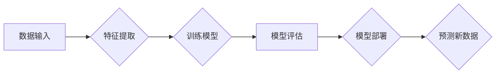

> 分类、机器学习、算法、逻辑回归、支持向量机、决策树、随机森林、代码实例、实践

## 1. 背景介绍

在当今数据爆炸的时代，如何有效地从海量数据中提取有价值的信息变得尤为重要。分类作为机器学习领域的核心任务之一，旨在将数据点划分为预定义的类别。它广泛应用于各个领域，例如图像识别、文本分类、欺诈检测、医疗诊断等。

分类算法的核心思想是学习数据之间的模式和规律，并根据这些模式对新的数据进行预测。不同的分类算法具有不同的原理、优缺点和适用场景。

## 2. 核心概念与联系

分类算法的核心概念包括：

* **特征 (Feature):** 用于描述数据点的属性或特性的变量。
* **类别 (Class):** 数据点可以属于的预定义的集合。
* **训练集 (Training Set):** 用于训练分类模型的数据集，包含已知类别的数据点。
* **测试集 (Testing Set):** 用于评估分类模型性能的数据集，包含未知类别的数据点。
* **模型 (Model):** 学习了数据模式的数学模型，用于预测新数据点的类别。

**分类算法流程图:**



## 3. 核心算法原理 & 具体操作步骤

### 3.1  算法原理概述

本节将介绍几种常用的分类算法，包括逻辑回归、支持向量机、决策树和随机森林。

**3.1.1 逻辑回归 (Logistic Regression)**

逻辑回归是一种用于二分类问题的线性模型。它将线性函数的输出映射到0到1之间的概率值，表示数据点属于正类的概率。

**3.1.2 支持向量机 (Support Vector Machine)**

支持向量机是一种基于间隔最大化的分类算法。它试图找到一个超平面，将不同类别的数据点尽可能地分开。

**3.1.3 决策树 (Decision Tree)**

决策树是一种树形结构的分类算法。它通过一系列的决策节点和分支，将数据点逐步分类。

**3.1.4 随机森林 (Random Forest)**

随机森林是一种集成学习算法，它通过构建多个决策树并进行投票，提高分类的准确性。

### 3.2  算法步骤详解

**3.2.1 逻辑回归步骤详解**

1. **特征选择:** 选择与分类任务相关的特征。
2. **线性模型构建:** 使用线性函数将特征映射到概率值。
3. **参数估计:** 使用最大似然估计法估计模型参数。
4. **模型评估:** 使用测试集评估模型性能。

**3.2.2 支持向量机步骤详解**

1. **核函数选择:** 选择合适的核函数，将数据映射到高维空间。
2. **间隔最大化:** 使用拉格朗日乘子法求解间隔最大化的优化问题。
3. **支持向量确定:** 找到最优超平面上的支持向量。
4. **模型预测:** 使用支持向量和超平面预测新数据点的类别。

**3.2.3 决策树步骤详解**

1. **选择最优特征:** 使用信息增益或基尼系数等指标选择最优特征进行划分。
2. **构建决策节点:** 根据最优特征将数据点划分为不同的子集。
3. **递归划分:** 对每个子集重复步骤1和步骤2，直到满足停止条件。
4. **叶子节点分类:** 将叶子节点的数据点归类为同一类别。

**3.2.4 随机森林步骤详解**

1. **Bootstrap aggregating (Bagging):** 从训练集随机抽取多个样本集，每个样本集称为bootstrap样本。
2. **决策树构建:** 在每个bootstrap样本上构建一个决策树。
3. **投票预测:** 对新数据点进行预测时，将所有决策树的预测结果进行投票，选择出现次数最多的类别作为最终预测结果。

### 3.3  算法优缺点

| 算法 | 优点 | 缺点 |
|---|---|---|
| 逻辑回归 | 易于理解和实现，计算效率高 | 容易过拟合，对非线性数据拟合能力差 |
| 支持向量机 | 泛化能力强，对高维数据鲁棒性好 | 训练时间长，参数选择较复杂 |
| 决策树 | 易于理解和解释，可以处理非线性数据 | 容易过拟合，对数据噪声敏感 |
| 随机森林 | 泛化能力强，鲁棒性好 | 训练时间长，解释性较差 |

### 3.4  算法应用领域

* **图像识别:** 分类图像中的物体、场景或人物。
* **文本分类:** 将文本归类到不同的主题或类别，例如情感分析、垃圾邮件过滤。
* **欺诈检测:** 识别欺诈交易或行为。
* **医疗诊断:** 根据患者的症状和检查结果预测疾病类型。

## 4. 数学模型和公式 & 详细讲解 & 举例说明

### 4.1  数学模型构建

**4.1.1 逻辑回归模型**

逻辑回归模型的数学表达式为：

$$
p(y=1|x) = \frac{1}{1 + e^{-(w^T x + b)}}
$$

其中：

* $p(y=1|x)$ 是数据点 $x$ 属于正类的概率。
* $w$ 是模型参数向量。
* $x$ 是数据点的特征向量。
* $b$ 是模型偏置项。

**4.1.2 支持向量机模型**

支持向量机的数学模型是通过求解以下优化问题得到：

$$
\min_{w,b} \frac{1}{2} ||w||^2 + C \sum_{i=1}^{n} \xi_i
$$

$$
s.t. y_i (w^T x_i + b) \geq 1 - \xi_i, \xi_i \geq 0
$$

其中：

* $w$ 是模型参数向量。
* $b$ 是模型偏置项。
* $x_i$ 是第 $i$ 个数据点。
* $y_i$ 是第 $i$ 个数据点的类别标签。
* $C$ 是惩罚参数。
* $\xi_i$ 是松弛变量，用于容忍分类错误。

### 4.2  公式推导过程

**4.2.1 逻辑回归模型推导**

逻辑回归模型的推导过程基于最大似然估计法。假设数据点服从伯努利分布，则似然函数为：

$$
L(w,b) = \prod_{i=1}^{n} p(y_i|x_i)^{y_i} (1-p(y_i|x_i))^{(1-y_i)}
$$

通过对数似然函数求极大值，可以得到模型参数 $w$ 和 $b$ 的估计值。

**4.2.2 支持向量机模型推导**

支持向量机的推导过程基于间隔最大化原理。间隔最大化是指找到一个超平面，使得不同类别的数据点之间的最小距离最大化。

### 4.3  案例分析与讲解

**4.3.1 逻辑回归案例分析**

假设我们想要预测学生是否会通过考试，根据学生的学习时间和考试成绩构建逻辑回归模型。

**4.3.2 支持向量机案例分析**

假设我们想要识别手写数字，可以使用支持向量机构建一个分类模型。

## 5. 项目实践：代码实例和详细解释说明

### 5.1  开发环境搭建

本项目使用 Python 语言和 scikit-learn 库进行开发。

**5.1.1 安装 Python 和 scikit-learn**

```bash
pip install python scikit-learn
```

### 5.2  源代码详细实现

```python
from sklearn.linear_model import LogisticRegression
from sklearn.svm import SVC
from sklearn.tree import DecisionTreeClassifier
from sklearn.ensemble import RandomForestClassifier
from sklearn.model_selection import train_test_split
from sklearn.metrics import accuracy_score

# 加载数据
# ...

# 将数据分为训练集和测试集
X_train, X_test, y_train, y_test = train_test_split(X, y, test_size=0.2, random_state=42)

# 训练逻辑回归模型
model_lr = LogisticRegression()
model_lr.fit(X_train, y_train)

# 训练支持向量机模型
model_svm = SVC()
model_svm.fit(X_train, y_train)

# 训练决策树模型
model_dt = DecisionTreeClassifier()
model_dt.fit(X_train, y_train)

# 训练随机森林模型
model_rf = RandomForestClassifier()
model_rf.fit(X_train, y_train)

# 对测试集进行预测
y_pred_lr = model_lr.predict(X_test)
y_pred_svm = model_svm.predict(X_test)
y_pred_dt = model_dt.predict(X_test)
y_pred_rf = model_rf.predict(X_test)

# 计算模型准确率
accuracy_lr = accuracy_score(y_test, y_pred_lr)
accuracy_svm = accuracy_score(y_test, y_pred_svm)
accuracy_dt = accuracy_score(y_test, y_pred_dt)
accuracy_rf = accuracy_score(y_test, y_pred_rf)

# 打印模型准确率
print(f"逻辑回归准确率: {accuracy_lr}")
print(f"支持向量机准确率: {accuracy_svm}")
print(f"决策树准确率: {accuracy_dt}")
print(f"随机森林准确率: {accuracy_rf}")
```

### 5.3  代码解读与分析

这段代码演示了如何使用 scikit-learn 库训练和评估几种常见的分类算法。

* 首先，代码加载数据并将其分为训练集和测试集。
* 然后，代码分别训练逻辑回归、支持向量机、决策树和随机森林模型。
* 接下来，代码使用训练好的模型对测试集进行预测。
* 最后，代码计算模型的准确率并打印结果。

### 5.4  运行结果展示

运行代码后，会输出每个模型的准确率。

## 6. 实际应用场景

### 6.1  图像识别

分类算法广泛应用于图像识别领域，例如：

* **人脸识别:** 将图像中的人脸识别为特定个体。
* **物体检测:** 在图像中检测和识别特定物体，例如汽车、行人、动物等。
* **场景分类:** 将图像归类到不同的场景类别，例如街道、室内、自然景观等。

### 6.2  文本分类

分类算法也广泛应用于文本分类领域，例如：

* **情感分析:** 分析文本表达的情感倾向，例如正面、负面、中性。
* **垃圾邮件过滤:** 将垃圾邮件从正常邮件中过滤出来。
* **主题分类:** 将文本归类到不同的主题类别，例如新闻、科技、体育等。

### 6.3  欺诈检测

分类算法可以用于识别欺诈交易或行为，例如：

* **信用卡欺诈检测:** 识别信用卡交易中的欺诈行为。
* **网络欺诈检测:** 识别网络攻击和恶意行为。
* **保险欺诈检测:** 识别保险理赔中的欺诈行为。

### 6.4  未来应用展望

随着人工智能技术的不断发展，分类算法将在更多领域得到应用，例如：

* **医疗诊断:** 根据患者的症状和检查结果预测疾病类型。
* **个性化推荐:** 根据用户的兴趣和行为推荐个性化的商品或服务。
* **自动驾驶:** 识别道路上的障碍物和