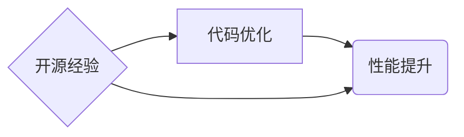

> 代码优化，性能提升，开源经验，软件架构，算法分析，性能测试，代码审查，最佳实践

## 1. 背景介绍

在当今软件开发领域，代码质量和性能至关重要。随着软件系统规模和复杂度的不断增长，代码优化和性能提升已成为开发团队面临的重大挑战。开源软件凭借其开放性、可共享性和社区支持，为代码优化和性能提升提供了宝贵的经验和资源。

开源软件项目通常由众多开发者共同维护和改进，积累了丰富的代码优化和性能提升经验。这些经验可以帮助开发团队提高代码质量、提升软件性能，并降低开发成本。

## 2. 核心概念与联系

**2.1 代码优化**

代码优化是指通过修改代码结构、算法和数据结构等方式，提高代码的执行效率、减少资源消耗，从而提升软件性能。

**2.2 性能提升**

性能提升是指通过各种技术手段，提高软件的响应速度、处理能力、吞吐量等性能指标。

**2.3 开源经验**

开源经验是指开源软件项目中积累的代码优化、性能提升、软件架构设计等方面的经验和最佳实践。

**2.4 核心概念关系图**

## 3. 核心算法原理 & 具体操作步骤

**3.1 算法原理概述**

代码优化和性能提升通常涉及到算法分析和优化。算法分析是指对算法的效率进行评估，包括时间复杂度和空间复杂度。算法优化是指通过修改算法结构或实现方式，提高算法的效率。

**3.2 算法步骤详解**

1. **算法分析:** 对目标代码进行分析，识别性能瓶颈。可以使用性能测试工具或代码分析工具进行分析。
2. **算法优化:** 根据分析结果，选择合适的算法优化策略。常见的算法优化策略包括：
    * **时间复杂度优化:** 减少算法执行时间。
    * **空间复杂度优化:** 减少算法使用的内存空间。
    * **数据结构优化:** 选择更合适的的数据结构来存储和处理数据。
3. **代码实现:** 将优化后的算法代码集成到目标软件中。
4. **性能测试:** 对优化后的软件进行性能测试，验证优化效果。

**3.3 算法优缺点**

不同的算法优化策略各有优缺点，需要根据具体情况选择合适的策略。

**3.4 算法应用领域**

算法优化和性能提升技术广泛应用于各种软件领域，例如：

* **Web 应用:** 提高网站响应速度和用户体验。
* **移动应用:** 优化移动设备资源利用率，提高应用性能。
* **大数据处理:** 提高大数据处理速度和效率。
* **人工智能:** 优化机器学习算法训练和推理速度。

## 4. 数学模型和公式 & 详细讲解 & 举例说明

**4.1 数学模型构建**

代码优化和性能提升可以利用数学模型进行分析和评估。例如，可以使用时间复杂度和空间复杂度来衡量算法的效率。

**4.2 公式推导过程**

时间复杂度通常用大O符号表示，例如O(n)、O(log n)、O(n^2)等。这些符号表示算法执行时间与输入数据大小的关系。

**4.3 案例分析与讲解**

例如，一个线性搜索算法的时间复杂度为O(n)，这意味着算法执行时间与输入数据大小成正比。而一个二分搜索算法的时间复杂度为O(log n)，这意味着算法执行时间与输入数据大小的 logarithm 成正比。

## 5. 项目实践：代码实例和详细解释说明

**5.1 开发环境搭建**

使用常用的开发环境，例如Linux、macOS或Windows，并安装必要的软件工具，例如编译器、调试器和性能测试工具。

**5.2 源代码详细实现**

提供一个具体的代码优化案例，例如优化一个排序算法的代码实现。

**5.3 代码解读与分析**

详细解释优化后的代码实现，说明优化策略和效果。

**5.4 运行结果展示**

使用性能测试工具对优化前后代码进行测试，并展示测试结果，例如执行时间、内存消耗等指标。

## 6. 实际应用场景

**6.1 Web 应用优化**

优化网站响应速度、减少页面加载时间，提高用户体验。

**6.2 移动应用优化**

优化移动设备资源利用率，提高应用性能和流畅度。

**6.3 大数据处理优化**

提高大数据处理速度和效率，缩短数据分析时间。

**6.4 未来应用展望**

随着人工智能、云计算等技术的不断发展，代码优化和性能提升将变得更加重要。

## 7. 工具和资源推荐

**7.1 学习资源推荐**

* 书籍：《代码优化》、《性能测试》、《软件架构设计》
* 在线课程：Coursera、Udemy、edX等平台上的相关课程
* 博客和论坛：Stack Overflow、GitHub等平台上的相关博客和论坛

**7.2 开发工具推荐**

* 性能测试工具：JMeter、LoadRunner、Gatling等
* 代码分析工具：SonarQube、Code Climate、Coverity等
* 调试工具：GDB、LLDB、Visual Studio Debugger等

**7.3 相关论文推荐**

* ACM SIGMETRICS、IEEE Transactions on Software Engineering等期刊上的相关论文

## 8. 总结：未来发展趋势与挑战

**8.1 研究成果总结**

开源经验为代码优化和性能提升提供了宝贵的资源和指导。

**8.2 未来发展趋势**

* 自动化代码优化工具的开发和应用
* 基于人工智能的代码优化和性能提升技术
* 云原生环境下的代码优化和性能提升

**8.3 面临的挑战**

* 复杂软件系统代码优化和性能提升的难度
* 不同平台和环境下的代码优化和性能提升差异
* 代码优化和性能提升的评估和衡量标准

**8.4 研究展望**

* 开发更智能、更自动化、更有效的代码优化和性能提升工具
* 研究新的代码优化和性能提升技术
* 建立统一的代码优化和性能提升标准和规范

## 9. 附录：常见问题与解答

**9.1 如何选择合适的代码优化策略？**

选择合适的代码优化策略需要根据具体情况进行分析，例如算法复杂度、数据结构、硬件环境等。

**9.2 如何评估代码优化效果？**

可以使用性能测试工具对优化前后代码进行测试，并比较测试结果，例如执行时间、内存消耗等指标。

**9.3 如何避免代码优化带来的副作用？**

在进行代码优化时，需要谨慎考虑代码的可读性、可维护性和安全性，避免优化带来的副作用。

作者：禅与计算机程序设计艺术 / Zen and the Art of Computer Programming 
<end_of_turn>