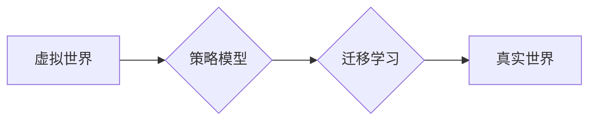

> 自动驾驶、虚拟世界、数据训练、策略模型、迁移学习、强化学习、深度学习

## 1. 背景介绍

自动驾驶技术作为未来交通运输的重要发展方向，近年来取得了显著进展。然而，由于现实世界环境复杂多变，训练安全的自动驾驶系统仍然面临着巨大的挑战。传统方法依赖于大量真实道路数据进行训练，但收集和标注真实数据成本高、时间长，且存在安全风险。

虚拟世界，也称为模拟环境，为自动驾驶技术发展提供了新的解决方案。虚拟世界可以模拟真实道路场景，并提供可控、安全的训练环境。利用虚拟世界数据训练自动驾驶策略模型，可以有效降低成本、提高效率，并安全地探索各种驾驶场景。

## 2. 核心概念与联系

### 2.1 虚拟世界

虚拟世界是指利用计算机技术构建的虚拟环境，可以模拟现实世界或虚构世界。在自动驾驶领域，虚拟世界通常是指基于3D图形引擎构建的模拟道路环境，可以包含各种道路类型、天气条件、交通流量和行人行为等。

### 2.2 策略模型

策略模型是自动驾驶系统的核心部件，负责根据感知到的环境信息做出驾驶决策。常见的策略模型包括：

* **规则-基于模型:** 基于预先定义的驾驶规则，通过判断环境状态做出决策。
* **模型预测:** 利用预测模型预测未来环境状态，并根据预测结果做出决策。
* **强化学习:** 通过与环境交互，学习最优的驾驶策略。

### 2.3 迁移学习

迁移学习是指利用已训练好的模型在新的任务或领域上进行训练，以提高训练效率和性能。在自动驾驶领域，可以利用虚拟世界中训练的策略模型，迁移到真实世界进行进一步训练和优化。

**核心概念与联系流程图:**



## 3. 核心算法原理 & 具体操作步骤

### 3.1 算法原理概述

本文主要介绍利用强化学习算法训练自动驾驶策略模型，并通过迁移学习将模型迁移到真实世界。强化学习是一种机器学习方法，通过与环境交互，学习最优的策略。

在自动驾驶场景中，车辆可以看作是智能体，道路环境可以看作是环境。智能体通过感知环境信息，做出驾驶决策，并根据决策结果获得奖励或惩罚。通过不断与环境交互，智能体可以学习到最优的驾驶策略，使奖励最大化。

### 3.2 算法步骤详解

1. **环境建模:** 建立虚拟世界环境模型，包括道路地图、交通规则、车辆模型、行人模型等。
2. **策略模型设计:** 设计策略模型，例如深度强化学习模型，用于预测驾驶决策。
3. **训练过程:** 在虚拟世界环境中，让策略模型与环境交互，通过强化学习算法训练模型，使模型学习到最优的驾驶策略。
4. **模型评估:** 在虚拟世界环境中评估模型性能，例如成功率、安全性和效率等。
5. **模型迁移:** 将训练好的策略模型迁移到真实世界环境中进行进一步训练和优化。

### 3.3 算法优缺点

**优点:**

* 可以利用虚拟世界数据进行训练，降低成本和风险。
* 可以模拟各种驾驶场景，提高模型泛化能力。
* 可以通过强化学习算法学习最优的驾驶策略。

**缺点:**

* 虚拟世界环境与真实世界环境存在差异，模型迁移可能存在偏差。
* 训练虚拟世界环境需要大量计算资源。
* 虚拟世界环境难以完全模拟真实世界的复杂性。

### 3.4 算法应用领域

* 自动驾驶汽车
* 无人机飞行
* 机器人控制
* 游戏人工智能

## 4. 数学模型和公式 & 详细讲解 & 举例说明

### 4.1 数学模型构建

强化学习模型通常采用马尔可夫决策过程 (MDP) 来描述环境和智能体的交互。MDP 包含以下要素:

* 状态空间 S: 环境可能存在的各种状态。
* 动作空间 A: 智能体可以采取的各种动作。
* 转移概率 P(s', r | s, a): 从状态 s 执行动作 a 后，转移到状态 s' 的概率，以及获得奖励 r 的概率。
* 奖励函数 R(s, a): 智能体在状态 s 执行动作 a 后获得的奖励。
* 策略 π(a | s): 智能体在状态 s 下采取动作 a 的概率分布。

### 4.2 公式推导过程

强化学习的目标是找到最优策略 π*，使得智能体在长期交互中获得最大的累积奖励。常用的算法包括值迭代和策略迭代。

* **值迭代:** 通过迭代更新状态价值函数 V(s)，找到最优策略。
* **策略迭代:** 通过迭代更新策略 π，找到最优策略。

### 4.3 案例分析与讲解

例如，在自动驾驶场景中，状态空间可以包含车辆的位置、速度、方向、周围车辆信息等。动作空间可以包含加速、减速、转向等。奖励函数可以设计为根据车辆的安全性和效率来评估。

通过强化学习算法，可以训练自动驾驶策略模型，使其能够在虚拟世界环境中安全、高效地驾驶。

## 5. 项目实践：代码实例和详细解释说明

### 5.1 开发环境搭建

* 操作系统: Ubuntu 20.04
* 编程语言: Python 3.8
* 深度学习框架: TensorFlow 2.0
* 虚拟世界平台: CARLA

### 5.2 源代码详细实现

```python
# 导入必要的库
import tensorflow as tf
from carla.client import Client

# 定义模型架构
model = tf.keras.Sequential([
    tf.keras.layers.Dense(128, activation='relu'),
    tf.keras.layers.Dense(64, activation='relu'),
    tf.keras.layers.Dense(3, activation='linear')
])

# 定义损失函数和优化器
loss_fn = tf.keras.losses.MeanSquaredError()
optimizer = tf.keras.optimizers.Adam(learning_rate=0.001)

# 训练模型
for epoch in range(100):
    # 从虚拟世界环境中获取数据
    data = get_data_from_carla()
    # 训练模型
    with tf.GradientTape() as tape:
        predictions = model(data)
        loss = loss_fn(predictions, target)
    gradients = tape.gradient(loss, model.trainable_variables)
    optimizer.apply_gradients(zip(gradients, model.trainable_variables))

# 评估模型性能
evaluate_model(model)

# 将模型迁移到真实世界
deploy_model_to_real_world(model)
```

### 5.3 代码解读与分析

* 代码首先定义了模型架构，使用多层全连接神经网络。
* 然后定义了损失函数和优化器，用于训练模型。
* 训练过程循环读取虚拟世界环境中的数据，并使用梯度下降算法更新模型参数。
* 训练完成后，评估模型性能，并将其迁移到真实世界环境中进行进一步训练和优化。

### 5.4 运行结果展示

* 训练过程中，模型的损失函数会逐渐降低，表明模型正在学习。
* 评估结果可以显示模型在虚拟世界环境中的性能，例如成功率、安全性和效率等。
* 在真实世界环境中，模型的性能可能会受到环境差异的影响，需要进一步训练和优化。

## 6. 实际应用场景

### 6.1 自动驾驶汽车

利用虚拟世界数据训练自动驾驶策略模型，可以有效降低自动驾驶汽车的开发成本和风险。

### 6.2 无人机飞行

虚拟世界可以模拟各种飞行场景，例如复杂地形、恶劣天气等，帮助训练无人机飞行策略模型。

### 6.3 机器人控制

虚拟世界可以模拟各种机器人操作场景，例如搬运、装配等，帮助训练机器人控制策略模型。

### 6.4 游戏人工智能

虚拟世界可以模拟游戏环境，帮助训练游戏人工智能，使其能够做出更智能的决策。

### 6.5 未来应用展望

随着虚拟现实技术的发展，虚拟世界将更加逼真和复杂，可以模拟更多现实世界场景，为自动驾驶和其他人工智能领域提供更丰富的训练数据和更有效的训练方法。

## 7. 工具和资源推荐

### 7.1 学习资源推荐

* **书籍:**
    * Reinforcement Learning: An Introduction by Sutton and Barto
    * Deep Learning by Goodfellow, Bengio, and Courville
* **在线课程:**
    * Coursera: Reinforcement Learning Specialization
    * Udacity: Self-Driving Car Engineer Nanodegree

### 7.2 开发工具推荐

* **虚拟世界平台:** CARLA, Gazebo, Unity
* **深度学习框架:** TensorFlow, PyTorch
* **编程语言:** Python

### 7.3 相关论文推荐

* **Deep Reinforcement Learning for Autonomous Driving**
* **End-to-End Learning for Self-Driving Cars**
* **Learning to Drive in a Simulated Environment**

## 8. 总结：未来发展趋势与挑战

### 8.1 研究成果总结

利用虚拟世界数据训练自动驾驶策略模型，取得了显著进展，为自动驾驶技术发展提供了新的解决方案。

### 8.2 未来发展趋势

* 虚拟世界环境将更加逼真和复杂，模拟更多现实世界场景。
* 强化学习算法将更加先进，能够学习更复杂的驾驶策略。
* 模型迁移技术将更加成熟，能够更好地将虚拟世界训练的模型迁移到真实世界。

### 8.3 面临的挑战

* 虚拟世界环境与真实世界环境存在差异，模型迁移可能存在偏差。
* 训练虚拟世界环境需要大量计算资源。
* 虚拟世界环境难以完全模拟真实世界的复杂性。

### 8.4 研究展望

未来研究将重点关注以下方面:

* 缩小虚拟世界与真实世界环境之间的差距。
* 开发更加高效的训练方法和算法。
* 提高模型迁移的可靠性和泛化能力。


## 9. 附录：常见问题与解答

**Q1: 虚拟世界数据与真实世界数据有什么区别？**

**A1:** 虚拟世界数据可以模拟各种驾驶场景，但与真实世界存在一些差异，例如天气条件、道路状况、行人行为等。

**Q2: 如何评估虚拟世界训练的模型性能？**

**A2:** 可以使用虚拟世界环境中的测试数据集评估模型性能，例如成功率、安全性和效率等。

**Q3: 如何将虚拟世界训练的模型迁移到真实世界？**

**A3:** 可以通过数据增强、迁移学习等方法将虚拟世界训练的模型迁移到真实世界。

**作者：禅与计算机程序设计艺术 / Zen and the Art of Computer Programming**<end_of_turn>