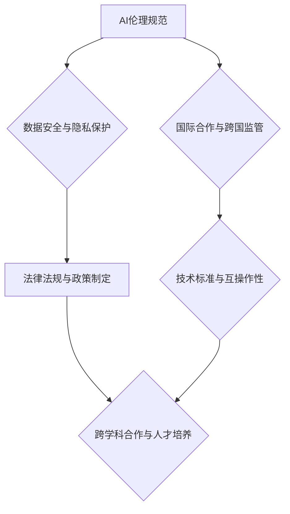

> 人工智能，全球治理，伦理规范，数据安全，国际合作，法律法规，技术标准，跨国监管

## 1. 背景介绍

人工智能（AI）技术近年来发展迅速，已渗透到各个领域，深刻地改变着人类社会。从自动驾驶到医疗诊断，从金融交易到个性化教育，AI正在推动着生产方式、生活方式和社会结构的变革。然而，AI技术的快速发展也带来了新的挑战和风险，例如算法偏见、数据隐私泄露、工作岗位替代等。这些挑战跨越国界，需要全球范围内的合作来应对。

当前，全球范围内对AI治理的讨论日益活跃。各国政府、国际组织、企业和学术界都在积极探索如何建立一个安全、可持续、公正的AI生态系统。然而，由于各国利益、价值观和发展水平存在差异，AI治理的国际合作面临着诸多复杂性。

## 2. 核心概念与联系

**2.1 AI 伦理规范**

AI 伦理规范是指在人工智能技术研发、应用和监管过程中，遵循的道德准则和行为规范。其核心目标是确保AI技术的发展和应用符合人类的价值观和利益，避免产生负面影响。

**2.2 数据安全与隐私保护**

数据是AI技术的基石，但同时也是隐私和安全的重要问题。AI系统的训练和运行都需要大量数据，而这些数据可能包含个人敏感信息。因此，数据安全和隐私保护是AI治理的重要议题。

**2.3 国际合作与跨国监管**

AI技术的跨国性特征要求国际合作和跨国监管机制的建立。各国需要加强沟通和协调，共同制定国际标准和规范，以确保AI技术的安全、可控和可持续发展。

**2.4 法律法规与政策制定**

各国政府需要制定相应的法律法规和政策，规范AI技术的研发、应用和监管。这些法律法规应涵盖AI技术的伦理规范、数据安全、责任追究等方面。

**2.5 技术标准与互操作性**

AI技术的标准化和互操作性是促进国际合作和产业发展的重要因素。各国需要共同制定技术标准，确保不同国家和地区的AI系统能够互联互通。

**2.6 跨学科合作与人才培养**

AI治理是一个跨学科的挑战，需要来自计算机科学、伦理学、法律、社会学等多个领域的专家共同参与。同时，还需要加强AI人才的培养，为AI治理提供专业人才支撑。

**Mermaid 流程图**

## 3. 核心算法原理 & 具体操作步骤

**3.1 算法原理概述**

**3.2 算法步骤详解**

**3.3 算法优缺点**

**3.4 算法应用领域**

## 4. 数学模型和公式 & 详细讲解 & 举例说明

**4.1 数学模型构建**

**4.2 公式推导过程**

**4.3 案例分析与讲解**

## 5. 项目实践：代码实例和详细解释说明

**5.1 开发环境搭建**

**5.2 源代码详细实现**

**5.3 代码解读与分析**

**5.4 运行结果展示**

## 6. 实际应用场景

**6.1 医疗保健**

**6.2 金融服务**

**6.3 制造业**

**6.4 未来应用展望**

## 7. 工具和资源推荐

**7.1 学习资源推荐**

**7.2 开发工具推荐**

**7.3 相关论文推荐**

## 8. 总结：未来发展趋势与挑战

**8.1 研究成果总结**

**8.2 未来发展趋势**

**8.3 面临的挑战**

**8.4 研究展望**

## 9. 附录：常见问题与解答

**9.1 AI 技术的伦理风险有哪些？**

**9.2 如何保护个人数据隐私？**

**9.3 AI 技术的监管应该如何进行？**

**9.4 AI 技术对就业市场的影响是什么？**

**9.5 AI 技术的未来发展趋势是什么？**

作者：禅与计算机程序设计艺术 / Zen and the Art of Computer Programming

<end_of_turn>