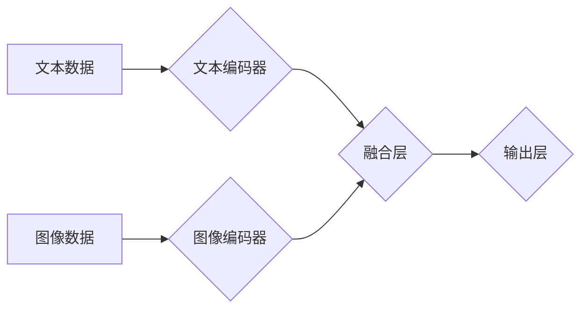

> 多模态大模型、工业设计、生产制造、计算机视觉、自然语言处理、深度学习、Transformer、图神经网络

## 1. 背景介绍

近年来，人工智能技术取得了飞速发展，其中，多模态大模型 (Multimodal Large Models, MMLMs) 作为一种新兴的 AI 技术，展现出巨大的潜力。MMLMs 能够处理多种模态数据，例如文本、图像、音频、视频等，并从中学习到丰富的知识和表示。

传统 AI 模型通常只处理单一模态数据，例如文本或图像，而 MMLMs 则能够融合多模态信息，从而获得更全面的理解和更准确的预测。这使得 MMLMs 在许多领域，例如机器翻译、图像字幕、问答系统、机器人交互等方面展现出优异的性能。

工业设计和生产制造领域也面临着巨大的挑战，例如产品设计创新、生产流程优化、质量控制等。MMLMs 的出现为这些领域带来了新的机遇。

## 2. 核心概念与联系

多模态大模型的核心概念是融合不同模态数据，学习跨模态的表示和关系。

**2.1 多模态数据**

多模态数据是指包含多种不同类型数据的集合，例如文本、图像、音频、视频等。

**2.2 多模态表示**

多模态表示是指将不同模态数据映射到同一个语义空间，使得不同模态数据能够相互理解和交互。

**2.3 多模态关系**

多模态关系是指不同模态数据之间的关联和依赖关系。例如，一张图片可以与一段文字描述相对应，一段音频可以与一段文字转录相对应。

**2.4 多模态学习**

多模态学习是指利用多模态数据训练模型，学习跨模态的表示和关系。

**2.5 多模态大模型架构**

MMLMs 通常采用以下几种架构：

* **融合式架构:** 将不同模态数据分别进行编码，然后将编码结果融合在一起进行后续处理。
* **共享式架构:** 使用共享的权重参数对不同模态数据进行编码，从而学习跨模态的表示。
* **自监督式架构:** 利用多模态数据的自监督学习方式，例如图像字幕对、文本-音频对等，训练 MMLMs。

**Mermaid 流程图**

## 3. 核心算法原理 & 具体操作步骤

### 3.1  算法原理概述

MMLMs 的核心算法原理是利用深度学习技术，例如 Transformer、图神经网络等，学习跨模态的表示和关系。

**3.1.1 Transformer**

Transformer 是一种基于注意力机制的深度学习模型，能够有效地处理序列数据，例如文本和音频。

**3.1.2 图神经网络**

图神经网络 (Graph Neural Networks, GNNs) 是一种能够处理图结构数据的深度学习模型，能够学习节点之间的关系和依赖关系。

### 3.2  算法步骤详解

**3.2.1 数据预处理**

首先需要对多模态数据进行预处理，例如文本数据进行分词和词嵌入，图像数据进行裁剪和增强等。

**3.2.2 模型训练**

使用深度学习框架，例如 TensorFlow 或 PyTorch，训练 MMLMs 模型。训练过程中，需要使用合适的损失函数和优化算法，例如交叉熵损失函数和 Adam 优化算法。

**3.2.3 模型评估**

训练完成后，需要对 MMLMs 模型进行评估，例如使用准确率、召回率、F1-score 等指标来衡量模型的性能。

### 3.3  算法优缺点

**3.3.1 优点**

* 能够处理多种模态数据，获得更全面的理解。
* 能够学习跨模态的表示和关系，提高模型的泛化能力。
* 在许多领域，例如机器翻译、图像字幕、问答系统等方面展现出优异的性能。

**3.3.2 缺点**

* 训练 MMLMs 模型需要大量的计算资源和时间。
* 多模态数据的标注成本较高。
* 跨模态关系的学习仍然是一个挑战。

### 3.4  算法应用领域

MMLMs 在许多领域都有广泛的应用，例如：

* **机器翻译:** 将文本从一种语言翻译成另一种语言。
* **图像字幕:** 为图像生成文本描述。
* **问答系统:** 回答用户提出的问题。
* **机器人交互:** 帮助机器人理解和响应用户的指令。
* **医疗诊断:** 辅助医生进行疾病诊断。

## 4. 数学模型和公式 & 详细讲解 & 举例说明

### 4.1  数学模型构建

MMLMs 的数学模型通常基于深度学习框架，例如 TensorFlow 或 PyTorch。模型的结构和参数可以通过深度学习算法进行训练。

### 4.2  公式推导过程

MMLMs 的训练过程涉及到许多数学公式，例如损失函数、优化算法等。这些公式的推导过程通常基于微积分和概率论的知识。

### 4.3  案例分析与讲解

可以结合具体的 MMLMs 模型，例如 CLIP、DALL-E 等，进行案例分析和讲解，说明其数学模型和公式是如何应用于实际场景的。

## 5. 项目实践：代码实例和详细解释说明

### 5.1  开发环境搭建

介绍如何搭建 MMLMs 的开发环境，例如安装 Python、深度学习框架、必要的库等。

### 5.2  源代码详细实现

提供一个简单的 MMLMs 模型的源代码示例，并进行详细的解释说明。

### 5.3  代码解读与分析

对源代码进行解读和分析，解释代码的逻辑和功能。

### 5.4  运行结果展示

展示 MMLMs 模型的运行结果，例如图像字幕、文本生成等。

## 6. 实际应用场景

### 6.1  工业设计

MMLMs 可以用于辅助工业设计，例如：

* **产品概念设计:** 根据文本描述生成产品概念图。
* **产品外观设计:** 根据用户反馈和设计趋势生成产品外观设计方案。
* **产品功能设计:** 根据用户需求和产品功能描述生成产品功能设计方案。

### 6.2  生产制造

MMLMs 可以用于优化生产制造流程，例如：

* **生产过程优化:** 分析生产过程中的数据，识别瓶颈和改进点。
* **质量控制:** 利用图像识别技术检测产品缺陷。
* **预测性维护:** 利用机器学习模型预测设备故障，进行提前维护。

### 6.3  其他应用场景

MMLMs 还可以在其他领域应用，例如：

* **客户服务:** 利用聊天机器人提供客户服务。
* **市场营销:** 利用个性化推荐系统进行精准营销。
* **教育:** 利用智能辅导系统提供个性化教育服务。

### 6.4  未来应用展望

随着 MMLMs 技术的不断发展，其在工业设计和生产制造领域的应用前景十分广阔。未来，MMLMs 将能够更加深入地融入到工业设计和生产制造流程中，为企业带来更大的价值。

## 7. 工具和资源推荐

### 7.1  学习资源推荐

* **书籍:**
    * 《深度学习》
    * 《自然语言处理》
    * 《计算机视觉》
* **在线课程:**
    * Coursera
    * edX
    * Udacity

### 7.2  开发工具推荐

* **深度学习框架:** TensorFlow, PyTorch
* **图像处理库:** OpenCV
* **自然语言处理库:** NLTK, spaCy

### 7.3  相关论文推荐

* **CLIP:** https://arxiv.org/abs/2103.00020
* **DALL-E:** https://openai.com/blog/dall-e/

## 8. 总结：未来发展趋势与挑战

### 8.1  研究成果总结

MMLMs 技术取得了显著的进展，在许多领域展现出巨大的潜力。

### 8.2  未来发展趋势

* **模型规模和能力的提升:** 未来 MMLMs 模型将更加庞大，能够处理更多模态数据，并学习更复杂的知识和关系。
* **跨模态理解和生成能力的增强:** MMLMs 将能够更加深入地理解和生成跨模态内容，例如生成更加逼真的图像和视频。
* **应用场景的拓展:** MMLMs 将应用于更多领域，例如医疗、教育、金融等。

### 8.3  面临的挑战

* **数据标注成本:** 多模态数据的标注成本较高，需要开发更加高效的标注方法。
* **模型训练成本:** 训练大型 MMLMs 模型需要大量的计算资源和时间。
* **模型解释性和可解释性:** MMLMs 模型的决策过程往往难以解释，需要开发更加可解释的模型。

### 8.4  研究展望

未来，MMLMs 研究将继续朝着更加智能、高效、可解释的方向发展。

## 9. 附录：常见问题与解答

### 9.1  常见问题

* 什么是多模态大模型？
* 多模态大模型有哪些应用场景？
* 如何训练多模态大模型？
* 多模态大模型有哪些挑战？

### 9.2  解答

* 多模态大模型 (MMLMs) 是一种能够处理多种模态数据，例如文本、图像、音频等，并从中学习到丰富的知识和表示的深度学习模型。
* MMLMs 的应用场景非常广泛，例如机器翻译、图像字幕、问答系统、机器人交互、医疗诊断等。
* 训练 MMLMs 模型需要使用深度学习框架，例如 TensorFlow 或 PyTorch，并使用大量的多模态数据进行训练。
* MMLMs 的挑战包括数据标注成本高、模型训练成本高、模型解释性和可解释性低等。

作者：禅与计算机程序设计艺术 / Zen and the Art of Computer Programming 
<end_of_turn>