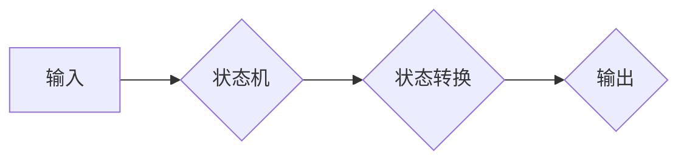

> 自动机理论，计算模型，图灵机，状态机，有限状态机，正则表达式，语言识别

## 1. 背景介绍

1956年，艾伦·图灵的《计算机器与智能》一文发表，标志着人工智能领域正式诞生。同年，美国麻省理工学院举办了一场名为“自动机研究”的研讨会，汇聚了当时世界顶尖的计算机科学家，他们共同探讨了计算模型、自动机理论以及人工智能的未来发展方向。

这场研讨会对计算机科学的发展产生了深远的影响，它不仅促进了自动机理论的完善，也为人工智能的发展奠定了坚实的基础。

## 2. 核心概念与联系

### 2.1 自动机理论

自动机理论是计算机科学的一个重要分支，它研究的是模拟计算过程的抽象模型——自动机。自动机是一种能够接受输入并产生输出的装置，它通过一系列有限的状态转换来处理输入信息。

### 2.2 计算模型

计算模型是描述计算过程的抽象框架，它定义了计算过程的步骤、规则和限制。常见的计算模型包括图灵机、有限状态机、多项式时间等。

### 2.3 图灵机

图灵机是图灵提出的一个理论模型，它被认为是最强大的通用计算模型。图灵机由一个无限长的带、一个读写头和一个状态机组成。状态机控制读写头的动作，并根据当前状态和带上的符号进行状态转换。图灵机能够模拟任何算法，因此它被认为是计算能力的终极标准。

### 2.4 状态机

状态机是一种简单的计算模型，它由有限个状态和状态转换规则组成。状态机根据输入信息和当前状态进行状态转换，并产生相应的输出。

### 2.5 有限状态机

有限状态机是一种特殊的状态机，它只具有有限个状态。有限状态机常用于识别正则表达式和处理简单的计算任务。

### 2.6 正则表达式

正则表达式是一种用于描述文本模式的语法。正则表达式可以用来匹配、查找和替换文本。

### 2.7 语言识别

语言识别是指识别输入文本是否属于某个特定的语言或语法规则的过程。自动机理论为语言识别提供了理论基础，例如有限状态机和推导式文法可以用于识别简单的语言。

**Mermaid 流程图**



## 3. 核心算法原理 & 具体操作步骤

### 3.1 算法原理概述

图灵机是一种强大的计算模型，它能够模拟任何算法。图灵机的核心原理是通过状态转换和符号操作来处理输入信息。

### 3.2 算法步骤详解

1. 初始化：设置图灵机的初始状态和带上的符号。
2. 读取：读写头读取带上的符号。
3. 状态转换：根据当前状态和读取的符号，状态机进行状态转换。
4. 写入：根据状态转换的结果，读写头写入新的符号到带子上。
5. 移动：读写头在带子上移动到下一个位置。
6. 重复：重复步骤2-5，直到达到终止状态。

### 3.3 算法优缺点

**优点：**

* 强大的计算能力：图灵机能够模拟任何算法。
* 理论基础完善：图灵机的理论基础已经非常完善。

**缺点：**

* 效率低：图灵机的计算效率通常较低。
* 实现复杂：图灵机的实现比较复杂。

### 3.4 算法应用领域

图灵机的理论应用广泛，包括：

* 计算机科学：算法分析、程序设计、编译原理等。
* 人工智能：机器学习、自然语言处理等。
* 数学逻辑：证明理论、形式化语言等。

## 4. 数学模型和公式 & 详细讲解 & 举例说明

### 4.1 数学模型构建

图灵机的数学模型可以描述为一个五元组：

M = (Q, Σ, Γ, δ, q0)

其中：

* Q：状态集合
* Σ：输入字母表
* Γ：带字母表
* δ：状态转换函数
* q0：初始状态

### 4.2 公式推导过程

状态转换函数 δ 定义了图灵机在特定状态和输入符号下进行状态转换和符号操作的规则。

δ : Q × Γ → Q × Γ × {L, R}

其中：

* L：向左移动
* R：向右移动

### 4.3 案例分析与讲解

**例子：**

考虑一个简单的图灵机，它能够识别二进制数中的偶数。

* 状态集合：Q = {q0, q1, q2}
* 输入字母表：Σ = {0, 1}
* 带字母表：Γ = {0, 1, B} (B 为空白符号)
* 状态转换函数：δ 如下表所示：

| 状态 | 输入 | 输出 | 移动 |
|---|---|---|---|
| q0 | 0 | 0 | R |
| q0 | 1 | 1 | R |
| q1 | 0 | B | L |
| q1 | 1 | B | L |
| q2 | 0 | B | L |
| q2 | 1 | B | L |

* 初始状态：q0

**解释：**

图灵机从初始状态 q0 开始，读取带上的符号。如果读取到 0 或 1，则将符号写入带子上，并向右移动。如果读取到 B，则表示已经识别出偶数，并进入终止状态 q2。

## 5. 项目实践：代码实例和详细解释说明

### 5.1 开发环境搭建

本项目使用 Python 语言进行开发，开发环境如下：

* 操作系统：Windows/macOS/Linux
* Python 版本：3.7+
* IDE：VS Code/PyCharm

### 5.2 源代码详细实现

```python
class TuringMachine:
    def __init__(self, states, alphabet, tape, transition_function, initial_state):
        self.states = states
        self.alphabet = alphabet
        self.tape = tape
        self.transition_function = transition_function
        self.current_state = initial_state
        self.head_position = 0

    def read_symbol(self):
        return self.tape[self.head_position]

    def write_symbol(self, symbol):
        self.tape[self.head_position] = symbol

    def move_head(self, direction):
        if direction == 'L':
            self.head_position -= 1
        elif direction == 'R':
            self.head_position += 1

    def run(self):
        while self.current_state not in self.halt_states:
            current_symbol = self.read_symbol()
            next_state, next_symbol, direction = self.transition_function[self.current_state][current_symbol]
            self.write_symbol(next_symbol)
            self.move_head(direction)
            self.current_state = next_state

# 示例代码：识别二进制数中的偶数
states = {'q0', 'q1', 'q2'}
alphabet = {'0', '1'}
tape = ['0'] * 100
transition_function = {
    'q0': {'0': ('q0', '0', 'R'), '1': ('q1', '1', 'R')},
    'q1': {'0': ('q1', 'B', 'L'), '1': ('q1', 'B', 'L')},
    'q2': {'0': ('q2', 'B', 'L'), '1': ('q2', 'B', 'L')}
}
initial_state = 'q0'
halt_states = {'q2'}

tm = TuringMachine(states, alphabet, tape, transition_function, initial_state)
tm.run()
```

### 5.3 代码解读与分析

代码实现了一个简单的图灵机，它能够识别二进制数中的偶数。

* `TuringMachine` 类定义了图灵机的基本结构和操作方法。
* `transition_function` 字典定义了图灵机的状态转换规则。
* `run()` 方法模拟了图灵机的运行过程。

### 5.4 运行结果展示

运行代码后，图灵机会将输入的二进制数中的偶数识别出来，并将其他符号替换为 B。

## 6. 实际应用场景

### 6.1 编译原理

图灵机的理论为编译原理提供了基础，例如，编译器可以使用图灵机模拟程序的执行过程，并进行优化和代码生成。

### 6.2 语言识别

图灵机可以用于识别正则表达式和自然语言中的语法规则，例如，文本编辑器可以使用图灵机实现语法高亮和代码补全功能。

### 6.3 机器学习

图灵机的理论为机器学习提供了理论基础，例如，支持向量机和神经网络可以看作是图灵机的变体。

### 6.4 未来应用展望

随着人工智能技术的不断发展，图灵机的应用场景将会更加广泛，例如：

* 自动程序生成
* 自动推理和决策
* 自动代码修复

## 7. 工具和资源推荐

### 7.1 学习资源推荐

* 《计算理论导论》
* 《自动机理论》
* 《图灵机》

### 7.2 开发工具推荐

* Python
* JFLAP

### 7.3 相关论文推荐

* 《On Computable Numbers, with an Application to the Entscheidungsproblem》
* 《A Mathematical Theory of Communication》

## 8. 总结：未来发展趋势与挑战

### 8.1 研究成果总结

自动机理论和图灵机模型为计算机科学的发展做出了巨大贡献，它为我们理解计算过程提供了理论基础，并推动了人工智能、编译原理等领域的进步。

### 8.2 未来发展趋势

未来，自动机理论和图灵机模型将会继续发展，例如：

* 量子图灵机
* 概率图灵机
* 进化图灵机

### 8.3 面临的挑战

自动机理论和图灵机模型也面临着一些挑战，例如：

* 复杂性：复杂系统的自动机模型难以构建和分析。
* 效率：图灵机的计算效率仍然是一个问题。
* 理解：图灵机的理论仍然存在一些未解之谜。

### 8.4 研究展望

未来，我们需要继续探索新的自动机模型，提高计算效率，并深入理解图灵机的理论。


## 9. 附录：常见问题与解答

### 9.1 什么是图灵机？

图灵机是一种理论模型，它能够模拟任何算法。

### 9.2 图灵机的计算能力有多强？

图灵机被认为是最强大的通用计算模型，它能够模拟任何算法。

### 9.3 图灵机的应用场景有哪些？

图灵机的应用场景非常广泛，包括编译原理、语言识别、机器学习等。

### 9.4 图灵机的未来发展趋势是什么？

未来，图灵机的理论将会继续发展，例如量子图灵机、概率图灵机等。

作者：禅与计算机程序设计艺术 / Zen and the Art of Computer Programming


<end_of_turn>