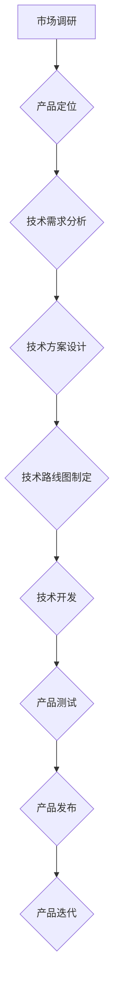

> 技术路线图，前沿技术，产品商业化，规模化，软件开发，技术趋势

## 1. 背景介绍

在当今科技日新月异的时代，软件产品的发展周期越来越短，市场竞争日益激烈。为了在激烈的市场竞争中脱颖而出，软件产品必须能够快速响应市场需求，紧跟前沿技术趋势，不断迭代升级。而技术路线图作为软件产品发展的指导性文件，扮演着至关重要的角色。它能够帮助团队清晰地规划产品未来的技术方向，明确技术目标和实施路径，从而提高产品开发效率，降低开发风险，最终实现产品商业化和规模化。

然而，仅仅拥有一个技术路线图并不能保证产品的成功。制定一个有效的技术路线图需要深入了解市场需求、用户痛点、技术趋势以及自身团队的能力，并根据这些因素进行权衡和决策。

## 2. 核心概念与联系

**2.1 技术路线图的概念**

技术路线图是一种描述软件产品未来技术发展方向的图示文档，它清晰地展示了产品技术目标、关键技术、实现路径以及时间节点等信息。技术路线图可以帮助团队成员达成共识，明确开发方向，并为产品开发提供清晰的指导。

**2.2 技术路线图的要素**

* **目标:** 明确产品的最终目标，例如市场份额、用户数量、收入目标等。
* **技术方向:** 确定产品的核心技术方向，例如人工智能、云计算、大数据等。
* **关键技术:** 识别实现产品目标的关键技术，例如机器学习算法、云平台架构、数据存储技术等。
* **实施路径:**  描述实现关键技术的具体步骤和方法，例如采用开源框架、自主研发、与第三方合作等。
* **时间节点:**  设定实现各阶段目标的时间节点，例如产品发布日期、功能迭代周期等。

**2.3 技术路线图与产品策略的关系**

技术路线图是产品策略的重要组成部分，它需要与产品策略相一致，并为产品策略的实现提供技术支撑。产品策略决定了产品的定位、目标用户、竞争优势等，而技术路线图则决定了如何通过技术手段实现这些目标。

**2.4 技术路线图与市场趋势的关系**

技术路线图需要紧跟市场技术趋势，并预判未来的技术发展方向。只有这样才能确保产品的技术领先性，并满足用户不断变化的需求。

**2.5 技术路线图的动态性**

技术路线图不是一成不变的，它需要根据市场变化、用户反馈、技术发展等因素进行动态调整。

**2.6 Mermaid 流程图**

## 3. 核心算法原理 & 具体操作步骤

**3.1 算法原理概述**

**3.2 算法步骤详解**

**3.3 算法优缺点**

**3.4 算法应用领域**

## 4. 数学模型和公式 & 详细讲解 & 举例说明

**4.1 数学模型构建**

**4.2 公式推导过程**

**4.3 案例分析与讲解**

## 5. 项目实践：代码实例和详细解释说明

**5.1 开发环境搭建**

**5.2 源代码详细实现**

**5.3 代码解读与分析**

**5.4 运行结果展示**

## 6. 实际应用场景

**6.1 应用场景介绍**

**6.2 案例分析**

**6.3 效益评估**

**6.4 未来应用展望**

## 7. 工具和资源推荐

**7.1 学习资源推荐**

**7.2 开发工具推荐**

**7.3 相关论文推荐**

## 8. 总结：未来发展趋势与挑战

**8.1 研究成果总结**

**8.2 未来发展趋势**

**8.3 面临的挑战**

**8.4 研究展望**

## 9. 附录：常见问题与解答

**9.1 常见问题**

**9.2 问题解答**

作者：禅与计算机程序设计艺术 / Zen and the Art of Computer Programming

<end_of_turn>