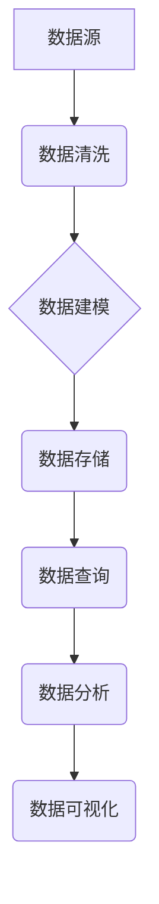

> 数据图谱,知识图谱,软件架构,数据管理,人工智能,机器学习,数据可视化

## 1. 背景介绍

在当今数据爆炸的时代，海量数据已成为企业和组织的宝贵资源。然而，这些数据往往分散、孤立，难以有效利用。传统的数据库结构难以应对复杂的数据关系和多维度的知识表达。为了解决这一问题，数据图谱应运而生，它以图的形式存储和管理数据，能够更好地捕捉数据之间的关系和依赖性，从而实现对数据的更深入的理解和利用。

数据图谱作为一种新型的数据管理技术，其核心思想是将数据抽象为节点和边，构建一个知识网络。节点代表数据实体，边代表数据之间的关系。这种图结构能够更直观地展现数据之间的关联，并支持对数据的灵活查询和分析。

## 2. 核心概念与联系

数据图谱的核心概念包括：

* **节点 (Node):** 代表数据实体，例如人、地点、事件、概念等。
* **边 (Edge):** 代表数据之间的关系，例如“工作于”、“居住在”、“参与”等。
* **属性 (Attribute):** 描述节点或边的特征，例如姓名、年龄、职位等。

数据图谱与知识图谱、关系数据库等技术存在着密切的联系：

* **知识图谱 (Knowledge Graph):** 知识图谱是一种更高级的数据图谱，它不仅包含数据实体和关系，还包含了语义信息和推理规则。
* **关系数据库 (Relational Database):** 关系数据库以表的形式存储数据，并通过关系连接表之间的数据。与数据图谱相比，关系数据库的结构更僵化，难以表达复杂的数据关系。

**数据图谱架构**



## 3. 核心算法原理 & 具体操作步骤

### 3.1  算法原理概述

数据图谱的构建主要依赖于以下核心算法：

* **数据抽取:** 从各种数据源中提取数据实体和关系。
* **数据清洗:** 去除数据中的噪声、重复数据和错误数据。
* **数据建模:** 将数据实体和关系映射到图结构中。
* **数据存储:** 将数据图谱存储在高效的图数据库中。
* **数据查询:** 支持对数据图谱进行灵活的查询和分析。

### 3.2  算法步骤详解

1. **数据收集:** 从各种数据源收集数据，例如文本文件、数据库、API等。
2. **数据清洗:** 使用数据清洗算法去除数据中的噪声、重复数据和错误数据。
3. **实体识别:** 使用自然语言处理技术识别数据中的实体，例如人名、地名、机构名等。
4. **关系抽取:** 使用机器学习算法识别数据中的关系，例如“工作于”、“居住在”、“参与”等。
5. **数据建模:** 将数据实体和关系映射到图结构中，构建数据图谱。
6. **数据存储:** 将数据图谱存储在高效的图数据库中，例如Neo4j、OrientDB等。
7. **数据查询:** 使用图数据库提供的查询语言进行数据查询和分析。

### 3.3  算法优缺点

**优点:**

* 能够更好地捕捉数据之间的关系和依赖性。
* 支持对数据的灵活查询和分析。
* 能够处理复杂的数据结构和多维度的知识表达。

**缺点:**

* 数据建模和关系抽取算法的复杂性。
* 图数据库的性能和 scalability 问题。

### 3.4  算法应用领域

数据图谱技术在各个领域都有广泛的应用，例如：

* **搜索引擎:** 构建知识图谱，提高搜索结果的准确性和相关性。
* **推荐系统:** 建立用户兴趣图谱，提供个性化的推荐服务。
* **社交网络:** 分析用户关系网络，挖掘社交关系和群体特征。
* **金融领域:** 构建金融知识图谱，进行风险评估和欺诈检测。
* **医疗领域:** 建立疾病知识图谱，辅助诊断和治疗。

## 4. 数学模型和公式 & 详细讲解 & 举例说明

### 4.1  数学模型构建

数据图谱可以抽象为一个图论模型，其中：

* 节点集：N = {n1, n2, ..., nk}，表示数据实体。
* 边集：E = {(n1, n2), (n2, n3), ..., (nk-1, nk)}，表示数据之间的关系。

每个节点可以拥有属性集：A = {a1, a2, ..., am}，每个边可以拥有属性集：B = {b1, b2, ..., bn}。

### 4.2  公式推导过程

* **节点度:** 节点n的度表示与该节点相连边的数量，记为deg(n)。
* **路径长度:** 从节点n1到节点n2的路径长度表示连接这两个节点的边的数量。
* **中心性:** 节点的中心性度量其在图中的重要性，例如：
    * **度中心性:** 节点的度与其所有邻居节点的度的平均值之比。
    * **介数中心性:** 节点位于所有节点对之间的最短路径上的次数。

### 4.3  案例分析与讲解

例如，在社交网络中，我们可以使用数据图谱技术分析用户之间的关系。

* 节点：用户
* 边：好友关系
* 属性：用户姓名、年龄、性别等

通过计算节点的度中心性和介数中心性，我们可以识别出社交网络中的关键用户，这些用户拥有较高的影响力。

## 5. 项目实践：代码实例和详细解释说明

### 5.1  开发环境搭建

* Python 3.x
* Neo4j 图数据库
* PyNeo4j 图数据库驱动

### 5.2  源代码详细实现

```python
from py2neo import Graph

# 连接 Neo4j 图数据库
graph = Graph("bolt://localhost:7687", auth=("neo4j", "password"))

# 创建节点
user_node = graph.create_node("User", name="Alice", age=30)

# 创建边
graph.create_relationship(user_node, "KNOWS", graph.node("User", name="Bob"))

# 查询数据
result = graph.run("MATCH (u:User) RETURN u.name")
for record in result:
    print(record["u.name"])
```

### 5.3  代码解读与分析

* 代码首先连接到 Neo4j 图数据库。
* 然后创建了一个名为 "Alice" 的用户节点，并设置了其年龄为 30 岁。
* 接着创建了一个 "KNOWS" 类型的边，连接 "Alice" 节点和另一个名为 "Bob" 的用户节点。
* 最后使用 Cypher 查询语句查询所有用户节点的名称，并打印出来。

### 5.4  运行结果展示

```
Alice
Bob
```

## 6. 实际应用场景

### 6.1  推荐系统

数据图谱可以用于构建个性化的推荐系统。例如，电商平台可以利用用户购买历史、浏览记录和评分等数据构建用户兴趣图谱，并根据用户兴趣推荐相关商品。

### 6.2  知识管理

数据图谱可以用于构建企业内部的知识库，方便员工查找和共享知识。例如，可以将公司产品、技术文档、案例研究等信息存储在数据图谱中，并通过图结构进行组织和查询。

### 6.3  风险管理

数据图谱可以用于识别和分析风险。例如，金融机构可以利用客户交易数据、信用评分等信息构建风险图谱，并根据图谱分析识别潜在的风险客户。

### 6.4  未来应用展望

数据图谱技术的发展前景广阔，未来将应用于更多领域，例如：

* **人工智能:** 数据图谱可以作为人工智能模型的知识源，提高模型的准确性和泛化能力。
* **物联网:** 数据图谱可以用于管理和分析物联网设备的数据，实现智能化控制和管理。
* **区块链:** 数据图谱可以用于构建区块链网络的知识图谱，提高网络的安全性、透明度和可信度。

## 7. 工具和资源推荐

### 7.1  学习资源推荐

* **书籍:**
    * 《数据图谱：构建数据驱动型组织》
    * 《知识图谱：构建智能应用的知识基础》
* **在线课程:**
    * Coursera: 数据科学与数据工程
    * Udemy: 数据图谱与知识图谱

### 7.2  开发工具推荐

* **Neo4j:** 开源图数据库
* **OrientDB:** 开源图数据库
* **TigerGraph:** 商业图数据库
* **PyNeo4j:** Python 图数据库驱动

### 7.3  相关论文推荐

* **Knowledge Graphs: A Survey**
* **Data Graph: A New Paradigm for Data Management**
* **Graph Neural Networks: A Review of Methods and Applications**

## 8. 总结：未来发展趋势与挑战

### 8.1  研究成果总结

数据图谱技术近年来取得了显著进展，在数据管理、知识表示、人工智能等领域展现出巨大的潜力。

### 8.2  未来发展趋势

* **更强大的数据抽取和关系抽取算法:** 能够更准确地识别数据实体和关系，构建更完整的知识图谱。
* **更灵活的图数据库:** 支持更复杂的查询和分析，并具有更高的性能和 scalability。
* **更广泛的应用场景:** 数据图谱技术将应用于更多领域，例如医疗、教育、金融等。

### 8.3  面临的挑战

* **数据质量问题:** 数据图谱的构建依赖于高质量的数据，而现实世界的数据往往存在噪声、重复和错误。
* **数据隐私问题:** 数据图谱包含大量敏感信息，需要采取措施保护用户隐私。
* **技术标准问题:** 目前数据图谱技术缺乏统一的标准，这制约了技术的推广和应用。

### 8.4  研究展望

未来，数据图谱技术将继续朝着更智能、更安全、更可扩展的方向发展。研究者将继续探索新的算法和技术，以解决数据图谱面临的挑战，并将其应用于更多领域，为人类社会带来更大的价值。

## 9. 附录：常见问题与解答

### 9.1  数据图谱与关系数据库的区别是什么？

数据图谱以图结构存储数据，能够更好地表达复杂的数据关系，而关系数据库以表结构存储数据，难以表达复杂的数据关系。

### 9.2  如何构建数据图谱？

构建数据图谱需要以下步骤：数据收集、数据清洗、实体识别、关系抽取、数据建模、数据存储、数据查询。

### 9.3  数据图谱有哪些应用场景？

数据图谱应用场景广泛，例如推荐系统、知识管理、风险管理、人工智能等。

### 9.4  数据图谱有哪些技术挑战？

数据图谱面临的数据质量问题、数据隐私问题、技术标准问题等挑战。

### 9.5  数据图谱的未来发展趋势是什么？

数据图谱技术将朝着更智能、更安全、更可扩展的方向发展，并应用于更多领域。


作者：禅与计算机程序设计艺术 / Zen and the Art of Computer Programming 
<end_of_turn>