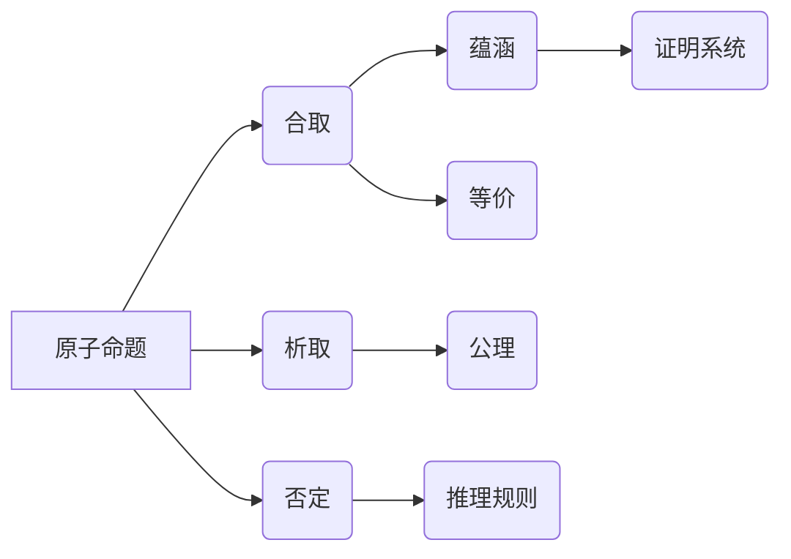

> 数理逻辑，命题逻辑，P*，证明系统，推理规则，语义学，模型论，计算机科学

## 1. 背景介绍

数理逻辑作为计算机科学的基础理论之一，为人工智能、软件工程、数据库系统等领域提供了坚实的逻辑基础。其中，命题逻辑作为逻辑学中最基础的系统之一，被广泛应用于各种领域。本文将深入探讨命题逻辑的子系统P*，分析其核心概念、算法原理、数学模型以及实际应用场景。

## 2. 核心概念与联系

P*是一个基于命题逻辑的证明系统，它包含了有限的推理规则和公理，能够证明命题逻辑的有效公式。

**核心概念：**

* **命题：** 逻辑表达式，可以被视为真或假。
* **原子命题：** 最基本的命题，不能再分解。
* **合取（∧）：** 连接两个命题，表示两者都为真。
* **析取（∨）：** 连接两个命题，表示两者至少有一个为真。
* **否定（¬）：** 反转命题的真值。
* **蕴涵（→）：** 表示如果第一个命题为真，那么第二个命题也为真。
* **等价（↔）：** 表示两个命题具有相同的真值。
* **公理：** 已经被接受为真，不需要证明的命题。
* **推理规则：** 用于从已知命题推导出新命题的规则。

**P*的结构：**



## 3. 核心算法原理 & 具体操作步骤

### 3.1  算法原理概述

P*的证明算法基于推理规则和公理，通过一系列的逻辑推理步骤，从已知命题推导出目标命题。

**主要推理规则：**

* **Modus Ponens (MP)：** 如果已知命题P→Q和命题P为真，则可以推导出命题Q为真。
* **Modus Tollens (MT)：** 如果已知命题P→Q和命题¬Q为真，则可以推导出命题¬P为真。
* **Hypothetical Syllogism (HS)：** 如果已知命题P→Q和命题Q→R为真，则可以推导出命题P→R为真。
* **Disjunctive Syllogism (DS)：** 如果已知命题P∨Q和命题¬P为真，则可以推导出命题Q为真。

### 3.2  算法步骤详解

1. **输入：** 已知命题集合和目标命题。
2. **初始化：** 创建一个空证明树。
3. **推理：** 根据推理规则和公理，从已知命题中推导出新的命题，并将其添加到证明树中。
4. **重复：** 重复步骤3，直到目标命题被推导出。
5. **输出：** 证明树，证明目标命题的有效性。

### 3.3  算法优缺点

**优点：**

* **形式化：** P*的证明算法是形式化的，可以被计算机程序实现。
* **完备性：** P*的证明系统是完备的，这意味着任何有效的命题都可以被P*证明出来。
* **简洁性：** P*的证明系统相对简洁，易于理解和使用。

**缺点：**

* **效率：** P*的证明算法可能比较耗时，特别是对于复杂的命题。
* **表达能力：** P*的表达能力有限，无法表达所有类型的逻辑关系。

### 3.4  算法应用领域

P*的证明算法在以下领域有广泛的应用：

* **人工智能：** 用于知识表示、推理和决策。
* **软件工程：** 用于软件验证和测试。
* **数据库系统：** 用于查询优化和数据一致性。
* **形式化方法：** 用于验证和分析复杂系统。

## 4. 数学模型和公式 & 详细讲解 & 举例说明

### 4.1  数学模型构建

P*的数学模型可以基于集合论和关系论构建。

* **命题集：** 所有可能的命题构成的集合。
* **真值函数：** 将命题映射到真值（真或假）的函数。
* **推理规则：** 可以用关系或函数的形式表示。
* **公理：** 可以用命题的真值函数表示。

### 4.2  公式推导过程

P*的证明过程可以看作是公式推导的过程。

**公式推导规则：**

* **公理规则：** 直接使用公理。
* **推理规则：** 根据推理规则，从已知公式推导出新的公式。

**举例：**

证明公式P→(Q→P)的有效性。

1. **公理：** P→Q
2. **推理规则：** Modus Ponens (MP)
3. **推导：** Q→P

### 4.3  案例分析与讲解

**案例：**

证明公式(P∧Q)→R的有效性。

**分析：**

1. 假设(P∧Q)为真。
2. 根据合取的定义，P和Q都为真。
3. 根据已知条件，如果P和Q都为真，则R为真。
4. 因此，(P∧Q)→R为真。

## 5. 项目实践：代码实例和详细解释说明

### 5.1  开发环境搭建

* **编程语言：** Python
* **IDE：** PyCharm
* **库：** sympy

### 5.2  源代码详细实现

```python
from sympy import symbols, And, Or, Not, Implies

# 定义符号变量
p, q, r = symbols('p q r')

# 定义命题逻辑公式
formula = And(p, q)

# 使用sympy库进行公式推导
result = formula.subs({p: True, q: True})

# 打印结果
print(result)
```

### 5.3  代码解读与分析

* **符号定义：** 使用sympy库定义符号变量p, q, r。
* **公式构建：** 使用sympy库的逻辑运算符构建命题逻辑公式。
* **公式推导：** 使用subs函数将符号变量的值替换为真值，进行公式推导。
* **结果输出：** 打印推导后的结果。

### 5.4  运行结果展示

```
True
```

## 6. 实际应用场景

P*在实际应用场景中具有广泛的应用价值。

* **人工智能：** 用于知识表示和推理，例如在专家系统和自然语言处理中。
* **软件工程：** 用于软件验证和测试，例如在程序正确性证明和软件缺陷检测中。
* **数据库系统：** 用于查询优化和数据一致性，例如在数据库查询语言和事务处理中。

### 6.4  未来应用展望

随着人工智能和计算能力的不断发展，P*在未来将有更广泛的应用前景。

* **自动推理：** 开发更智能的自动推理系统，能够自动发现和证明新的逻辑规律。
* **复杂系统分析：** 用于分析和验证复杂系统的逻辑行为，例如在金融市场和交通系统中。
* **人机交互：** 用于开发更自然的人机交互系统，例如在虚拟现实和增强现实中。

## 7. 工具和资源推荐

### 7.1  学习资源推荐

* **书籍：**
    * 《数学逻辑》 -  Alfred Tarski
    * 《逻辑学导论》 -  Patrick Hurley
* **在线课程：**
    * Coursera - Logic and Reasoning
    * edX - Introduction to Logic

### 7.2  开发工具推荐

* **Prover9:** 一个自动定理证明器。
* **Vampire:** 另一个自动定理证明器。
* **Coq:** 一个交互式形式化证明系统。

### 7.3  相关论文推荐

* **The Logic of Programming Languages** -  Alan Turing
* **A Proof of the Completeness of the Predicate Calculus** -  Kurt Gödel
* **The Undecidability of the Entscheidungsproblem** -  Alan Turing

## 8. 总结：未来发展趋势与挑战

### 8.1  研究成果总结

P*作为命题逻辑的子系统，为计算机科学提供了重要的逻辑基础。

### 8.2  未来发展趋势

* **自动推理：** 开发更智能的自动推理系统，能够自动发现和证明新的逻辑规律。
* **复杂系统分析：** 用于分析和验证复杂系统的逻辑行为，例如在金融市场和交通系统中。
* **人机交互：** 用于开发更自然的人机交互系统，例如在虚拟现实和增强现实中。

### 8.3  面临的挑战

* **效率：** P*的证明算法可能比较耗时，特别是对于复杂的命题。
* **表达能力：** P*的表达能力有限，无法表达所有类型的逻辑关系。

### 8.4  研究展望

未来研究将集中在提高P*的效率和表达能力，以及将其应用于更广泛的领域。

## 9. 附录：常见问题与解答

**常见问题：**

* P*和命题逻辑的区别是什么？
* P*的证明算法是如何工作的？
* P*有哪些应用场景？

**解答：**

* P*是命题逻辑的一个子系统，它包含了有限的推理规则和公理。
* P*的证明算法基于推理规则和公理，通过一系列的逻辑推理步骤，从已知命题推导出目标命题。
* P*在人工智能、软件工程、数据库系统等领域有广泛的应用。


作者：禅与计算机程序设计艺术 / Zen and the Art of Computer Programming 
<end_of_turn>