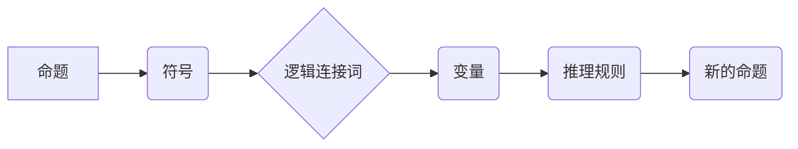

> 数理逻辑，形式符号，命题逻辑，谓词逻辑，推理规则，证明系统，计算机科学

## 1. 背景介绍

数理逻辑作为计算机科学的基础理论之一，为计算机程序的正确性、可验证性和可推理性提供了坚实的基础。它提供了一种形式化的语言和推理机制，用于表达和分析复杂的概念、关系和推理过程。

在计算机科学领域，数理逻辑的应用广泛，包括：

* **程序验证:** 使用逻辑推理来证明程序的正确性，确保程序在特定输入下能够产生预期输出。
* **人工智能:**  构建智能系统，例如专家系统和机器学习算法，需要依赖于逻辑推理和知识表示。
* **数据库系统:**  查询语言和数据库设计都依赖于逻辑关系和推理规则。
* **软件工程:**  软件设计和开发过程中，逻辑思维和形式化建模可以提高软件的可靠性和可维护性。

## 2. 核心概念与联系

数理逻辑的核心概念包括：

* **命题:**  一个陈述，可以是真或假。例如，“天是蓝色的”是一个命题。
* **符号:**  用字母、符号等表示命题、变量、逻辑连接词等。例如，用“p”表示“天是蓝色的”这个命题。
* **逻辑连接词:**  用于连接命题，例如“与”（∧）、“或”（∨）、“非”（¬）等。
* **变量:**  可以代表任意命题的符号。例如，用“x”表示一个任意命题。
* **推理规则:**  用于从已知命题推导出新命题的规则。例如，modus ponens 规则：如果“p”蕴含“q”，并且“p”为真，那么“q”也为真。

**Mermaid 流程图**



## 3. 核心算法原理 & 具体操作步骤

### 3.1  算法原理概述

数理逻辑的核心算法是**推理算法**，用于根据已知命题和推理规则推导出新的命题。常见的推理算法包括：

* **模式匹配:**  寻找已知规则中与当前命题相匹配的部分，并根据规则进行推理。
* **归纳推理:**  从多个具体实例中推导出一般规律。
* **演绎推理:**  从一般规律出发，推导出具体的实例。

### 3.2  算法步骤详解

**以模式匹配为例，推理算法的步骤如下：**

1. **输入:**  已知命题集和推理规则集。
2. **匹配:**  对当前命题进行匹配，寻找与推理规则中模式相匹配的部分。
3. **应用规则:**  如果找到匹配，则根据规则进行推理，推导出新的命题。
4. **重复:**  重复步骤2和3，直到无法再进行推理。

### 3.3  算法优缺点

**优点:**

* **形式化:**  推理过程是形式化的，可以避免主观判断和错误。
* **可验证性:**  推理过程可以被验证，确保推理结果的正确性。
* **可自动化:**  推理算法可以被自动化，实现程序的自动推理功能。

**缺点:**

* **复杂性:**  推理算法的实现往往比较复杂，需要专业的逻辑学和计算机科学知识。
* **效率:**  对于复杂的问题，推理算法的效率可能较低。
* **知识表达:**  将知识表示成逻辑形式可能比较困难。

### 3.4  算法应用领域

* **人工智能:**  用于构建专家系统、推理引擎和机器学习算法。
* **程序验证:**  用于证明程序的正确性，确保程序在特定输入下能够产生预期输出。
* **数据库系统:**  用于查询语言的解释和执行，以及数据库设计的逻辑推理。

## 4. 数学模型和公式 & 详细讲解 & 举例说明

### 4.1  数学模型构建

数理逻辑的数学模型通常使用**布尔代数**和**谓词逻辑**。

* **布尔代数:**  用于表示命题逻辑，其中命题可以看作是布尔变量，逻辑连接词对应布尔运算。
* **谓词逻辑:**  用于表示更复杂的逻辑关系，可以包含变量和量词。

### 4.2  公式推导过程

**命题逻辑的推理规则:**

* **modus ponens:**  如果 p → q 为真，且 p 为真，则 q 为真。
* **modus tollens:**  如果 p → q 为真，且 ¬q 为真，则 ¬p 为真。

**举例说明:**

假设 p 表示“天是晴朗的”，q 表示“我可以去野餐”。

* p → q 表示“如果天是晴朗的，那么我可以去野餐”。
* 如果 p 为真（天是晴朗的）且 p → q 为真，则根据 modus ponens 规则，q 为真（我可以去野餐）。

### 4.3  案例分析与讲解

**谓词逻辑的案例分析:**

假设我们有一个谓词“loves(x, y)”表示“x 爱 y”。

* ∀x ∃y loves(x, y) 表示“每个人都有人爱”。
* ∃x ∀y loves(x, y) 表示“有人爱所有人”。

这两个公式表达了不同的含义，前者表示每个人至少有一人爱他，后者表示存在一个人被所有人爱。

## 5. 项目实践：代码实例和详细解释说明

### 5.1  开发环境搭建

可以使用 Python 语言和相应的逻辑推理库进行实现。

### 5.2  源代码详细实现

```python
from logic import *

# 定义命题
p = Proposition("天是晴朗的")
q = Proposition("我可以去野餐")

# 定义逻辑连接词
and_ = And()
or_ = Or()
not_ = Not()

# 定义推理规则
modus_ponens = Rule(
    [p, p -> q],
    q
)

# 推理过程
inference = InferenceEngine()
inference.add_rule(modus_ponens)
inference.add_proposition(p)
result = inference.infer()

# 打印结果
print(result)
```

### 5.3  代码解读与分析

* 首先，定义了命题和逻辑连接词。
* 然后，定义了推理规则，例如 modus ponens 规则。
* 使用 InferenceEngine 类进行推理，添加规则和命题，并调用 infer() 方法进行推理。
* 最后，打印推理结果。

### 5.4  运行结果展示

```
[q]
```

## 6. 实际应用场景

### 6.1  程序验证

可以使用数理逻辑来验证程序的正确性，例如证明程序在特定输入下能够产生预期输出。

### 6.2  人工智能

在人工智能领域，数理逻辑用于构建专家系统、推理引擎和机器学习算法。例如，专家系统可以使用逻辑规则来模拟人类专家知识，推理引擎可以使用逻辑推理来解决问题，机器学习算法可以使用逻辑推理来学习和改进。

### 6.3  数据库系统

数据库系统中，查询语言和数据库设计都依赖于逻辑关系和推理规则。例如，SQL 查询语言可以使用逻辑连接词来连接多个条件，数据库设计可以使用逻辑关系来定义数据之间的关系。

### 6.4  未来应用展望

随着人工智能和计算机科学的发展，数理逻辑的应用场景将会更加广泛。例如，在自动驾驶、医疗诊断、金融风险管理等领域，数理逻辑将发挥越来越重要的作用。

## 7. 工具和资源推荐

### 7.1  学习资源推荐

* **《数理逻辑》:**  由陈家树教授编写的经典教材，对数理逻辑进行了深入的讲解。
* **《人工智能：现代方法》:**  由Stuart Russell和Peter Norvig编写的经典教材，介绍了人工智能的各种方法，包括基于逻辑的推理方法。
* **在线课程:**  Coursera、edX 等平台上提供了一些关于数理逻辑和人工智能的在线课程。

### 7.2  开发工具推荐

* **Prolog:**  一种专门用于逻辑编程的语言。
* **Python:**  一种通用的编程语言，可以结合逻辑推理库进行实现。
* **SMT Solvers:**  用于解决符号数学问题，可以用于程序验证和逻辑推理。

### 7.3  相关论文推荐

* **《A Logical Framework for Knowledge Representation》:**  介绍了一种基于逻辑的知识表示框架。
* **《Automated Theorem Proving》:**  介绍了自动定理证明技术。
* **《Logic in Artificial Intelligence》:**  介绍了逻辑在人工智能中的应用。

## 8. 总结：未来发展趋势与挑战

### 8.1  研究成果总结

数理逻辑在计算机科学领域取得了重要的成果，为程序验证、人工智能、数据库系统等领域提供了坚实的基础。

### 8.2  未来发展趋势

* **更强大的推理算法:**  开发更强大、更高效的推理算法，能够处理更复杂的问题。
* **更灵活的知识表示:**  开发更灵活、更强大的知识表示方法，能够更好地表达复杂的概念和关系。
* **更广泛的应用场景:**  将数理逻辑应用到更多领域，例如自动驾驶、医疗诊断、金融风险管理等。

### 8.3  面临的挑战

* **知识表达的复杂性:**  将复杂的世界知识表示成逻辑形式仍然是一个挑战。
* **推理算法的效率:**  对于复杂的问题，推理算法的效率仍然是一个瓶颈。
* **解释性和可理解性:**  逻辑推理的结果往往难以解释和理解，需要开发更易于理解的推理方法。

### 8.4  研究展望

未来，数理逻辑的研究将继续朝着更强大、更灵活、更易于理解的方向发展，为计算机科学和人工智能的发展提供更坚实的基础。

## 9. 附录：常见问题与解答

**常见问题:**

* **数理逻辑和逻辑学有什么区别？**

数理逻辑是逻辑学的应用分支，它使用数学方法来研究逻辑问题。

* **数理逻辑有什么应用场景？**

数理逻辑在程序验证、人工智能、数据库系统等领域都有广泛的应用。

* **如何学习数理逻辑？**

可以阅读相关书籍、参加在线课程、学习编程语言等。

**作者：禅与计算机程序设计艺术 / Zen and the Art of Computer Programming**<end_of_turn>

<end_of_turn>