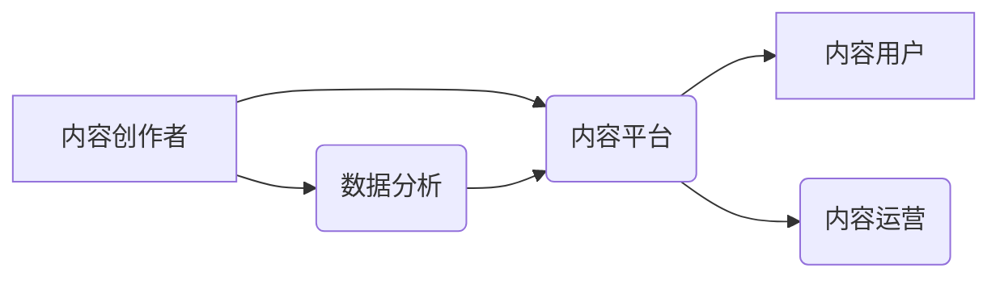

> 新媒体、内容产业、人工智能、大数据、云计算、区块链、Web3.0

## 1. 背景介绍

新媒体时代已经到来，互联网、移动互联网、社交媒体等新兴媒体平台的蓬勃发展，深刻地改变了人们获取信息、消费内容的方式。传统媒体模式面临着前所未有的挑战，而新媒体创业者则看到了巨大的机遇。

内容产业作为新媒体的核心驱动力，正在经历一场前所未有的变革。用户对个性化、多元化、互动性强的内容需求日益增长，而新兴技术的发展为内容创作、传播、运营提供了强大的支撑。

## 2. 核心概念与联系

**2.1 新媒体**

新媒体是指利用互联网、移动互联网、社交媒体等新兴技术平台进行信息传播和内容创作的媒体形式。其特点是：

* **互动性强:** 用户可以主动参与内容创作和传播，形成双向互动。
* **传播速度快:** 信息传播速度极快，可以实现实时更新和传播。
* **内容形式多样:** 包括文字、图片、视频、音频等多种形式，满足用户多元化需求。
* **地域限制少:** 信息传播不受地域限制，可以实现全球化传播。

**2.2 内容产业**

内容产业是指围绕内容创作、生产、传播、运营等环节，形成的产业链。其核心要素包括：

* **内容创作者:** 包括作家、编剧、导演、摄影师、设计师等，负责内容的创作和制作。
* **内容平台:** 包括网站、APP、社交媒体等，提供内容的展示和传播平台。
* **内容用户:** 包括读者、观众、听众等，是内容的消费主体。
* **内容运营:** 包括内容推广、营销、数据分析等，负责内容的传播和运营。

**2.3 核心技术**

人工智能、大数据、云计算、区块链等新兴技术正在深刻地改变内容产业的运作模式。

* **人工智能:** 可以用于内容创作、推荐、审核、翻译等方面，提高内容生产效率和质量。
* **大数据:** 可以用于分析用户行为、内容偏好等，帮助内容创作者和运营者更好地理解用户需求。
* **云计算:** 可以提供强大的计算和存储资源，支持内容产业的快速发展。
* **区块链:** 可以用于内容版权保护、内容交易等方面，保障内容创作者的权益。

**2.4 核心架构**

新媒体内容产业的架构可以概括为：



## 3. 核心算法原理 & 具体操作步骤

**3.1 算法原理概述**

内容推荐算法是新媒体内容产业的核心技术之一，其目的是根据用户的兴趣和行为，推荐他们可能感兴趣的内容。常见的推荐算法包括：

* **基于内容的推荐:** 根据内容的主题、标签、关键词等特征，推荐与用户兴趣相似的其他内容。
* **基于用户的推荐:** 根据用户的历史浏览记录、点赞、评论等行为，推荐与用户相似用户喜欢的其他内容。
* **协同过滤:** 根据用户对相同内容的评分或行为，预测用户对其他内容的兴趣。
* **深度学习推荐:** 利用深度神经网络模型，学习用户和内容之间的复杂关系，进行更精准的推荐。

**3.2 算法步骤详解**

以基于内容的推荐算法为例，其具体步骤如下：

1. **内容特征提取:** 对内容进行分析，提取其主题、标签、关键词等特征。
2. **用户兴趣建模:** 根据用户的历史浏览记录、点赞、评论等行为，构建用户的兴趣模型。
3. **相似度计算:** 计算内容特征与用户兴趣模型之间的相似度。
4. **推荐排序:** 根据相似度排序，推荐与用户兴趣最相似的内容。

**3.3 算法优缺点**

* **优点:** 能够推荐与用户兴趣相似的个性化内容，提高用户体验。
* **缺点:** 需要大量的用户数据和内容数据进行训练，算法复杂度较高。

**3.4 算法应用领域**

内容推荐算法广泛应用于电商、社交媒体、视频网站、新闻网站等领域，帮助平台提高用户粘性、促进用户转化。

## 4. 数学模型和公式 & 详细讲解 & 举例说明

**4.1 数学模型构建**

假设有N个用户和M个内容，用户i对内容j的评分为r<sub>ij</sub>。基于内容的推荐算法可以构建如下数学模型：

```latex
score(u, c) = \sum_{j=1}^{M} \frac{sim(c, c_j) * r_{uj}}{ \sum_{k=1}^{M} sim(c, c_k)}
```

其中：

* score(u, c) 表示用户u对内容c的推荐得分。
* sim(c, c<sub>j</sub>) 表示内容c与内容c<sub>j</sub>之间的相似度。
* r<sub>uj</sub> 表示用户u对内容c<sub>j</sub>的评分。

**4.2 公式推导过程**

该公式的推导过程如下：

1. 计算每个内容与目标内容c的相似度。
2. 将每个相似度与用户对该内容的评分相乘。
3. 将所有乘积相加，得到用户对目标内容的推荐得分。
4. 将所有相似度加和，作为分母，进行归一化处理。

**4.3 案例分析与讲解**

假设有三个用户和三个内容，用户对内容的评分如下：

| 用户 | 内容1 | 内容2 | 内容3 |
|---|---|---|---|
| 用户1 | 5 | 3 | 4 |
| 用户2 | 4 | 5 | 2 |
| 用户3 | 3 | 4 | 5 |

假设内容1与内容2的相似度为0.8，内容1与内容3的相似度为0.6。

则用户1对内容2的推荐得分：

```latex
score(用户1, 内容2) = \frac{0.8 * 3}{0.8 + 0.6} = 0.6
```

## 5. 项目实践：代码实例和详细解释说明

**5.1 开发环境搭建**

* 操作系统: Ubuntu 20.04 LTS
* 编程语言: Python 3.8
* 框架: Flask
* 数据库: MySQL

**5.2 源代码详细实现**

```python
from flask import Flask, request, jsonify
from sklearn.feature_extraction.text import TfidfVectorizer
from sklearn.metrics.pairwise import cosine_similarity

app = Flask(__name__)

# 加载内容数据
contents = [
    "这是一个关于人工智能的文章",
    "这是一个关于机器学习的文章",
    "这是一个关于深度学习的文章",
]

# 创建TF-IDF向量化器
vectorizer = TfidfVectorizer()
content_vectors = vectorizer.fit_transform(contents)

# 计算内容之间的相似度
similarity_matrix = cosine_similarity(content_vectors)

@app.route('/recommend', methods=['POST'])
def recommend():
    user_query = request.json.get('query')
    # ... (根据用户查询，计算与内容的相似度，并推荐相关内容)
    return jsonify({'recommendations': recommendations})

if __name__ == '__main__':
    app.run(debug=True)
```

**5.3 代码解读与分析**

* 该代码实现了一个简单的基于内容的推荐系统。
* 使用TF-IDF向量化器将内容转换为向量表示。
* 使用余弦相似度计算内容之间的相似度。
* 接收用户查询，根据查询计算与内容的相似度，并推荐相关内容。

**5.4 运行结果展示**

当用户发送一个查询请求，例如"人工智能"时，系统会返回与该查询相关的推荐内容。

## 6. 实际应用场景

**6.1 新闻推荐**

根据用户的阅读历史和兴趣，推荐与用户相关的新闻文章。

**6.2 视频推荐**

根据用户的观看历史和兴趣，推荐与用户相关的视频内容。

**6.3 电商推荐**

根据用户的购买历史和浏览记录，推荐与用户相关的商品。

**6.4 社交媒体推荐**

根据用户的关注和互动行为，推荐与用户相关的用户和内容。

**6.5 教育推荐**

根据用户的学习进度和兴趣，推荐与用户相关的学习资源。

**6.6 未来应用展望**

随着人工智能、大数据等技术的不断发展，内容推荐算法将更加精准、个性化，能够更好地满足用户的需求。

## 7. 工具和资源推荐

**7.1 学习资源推荐**

* **书籍:**
    * 《推荐系统》
    * 《机器学习》
* **在线课程:**
    * Coursera: Recommender Systems
    * Udacity: Machine Learning Engineer Nanodegree

**7.2 开发工具推荐**

* **Python:** 
    * Scikit-learn
    * TensorFlow
    * PyTorch
* **框架:**
    * Flask
    * Django

**7.3 相关论文推荐**

* **Collaborative Filtering for Implicit Feedback Datasets**
* **Matrix Factorization Techniques for Recommender Systems**

## 8. 总结：未来发展趋势与挑战

**8.1 研究成果总结**

新媒体内容产业的快速发展，推动了内容推荐算法的研究和应用。

**8.2 未来发展趋势**

* **更精准的推荐:** 利用深度学习等技术，学习用户和内容之间的复杂关系，进行更精准的推荐。
* **更个性化的推荐:** 考虑用户的个性化需求，提供更个性化的推荐内容。
* **更交互式的推荐:** 鼓励用户参与推荐过程，提供更交互式的推荐体验。

**8.3 面临的挑战**

* **数据稀疏性:** 用户行为数据和内容数据往往存在稀疏性，难以训练有效的推荐算法。
* **冷启动问题:** 新用户和新内容难以获得推荐，需要解决冷启动问题。
* **推荐算法的公平性:** 避免推荐算法产生偏见，确保推荐结果的公平性。

**8.4 研究展望**

未来，内容推荐算法的研究将更加注重数据质量、算法效率、公平性等方面，以更好地服务于新媒体内容产业的发展。

## 9. 附录：常见问题与解答

**9.1 如何解决数据稀疏性问题？**

可以使用协同过滤、矩阵分解等算法，利用用户之间的相似性和内容之间的相似性，弥补数据稀疏性。

**9.2 如何解决冷启动问题？**

可以使用基于内容的推荐、基于用户的推荐等算法，利用已有数据进行推荐，并逐步积累用户行为数据，缓解冷启动问题。

**9.3 如何保证推荐算法的公平性？**

需要定期评估推荐算法的公平性，并采取措施避免算法产生偏见，例如使用公平性指标进行评估，并调整算法参数以确保推荐结果的公平性。


作者：禅与计算机程序设计艺术 / Zen and the Art of Computer Programming 
<end_of_turn>