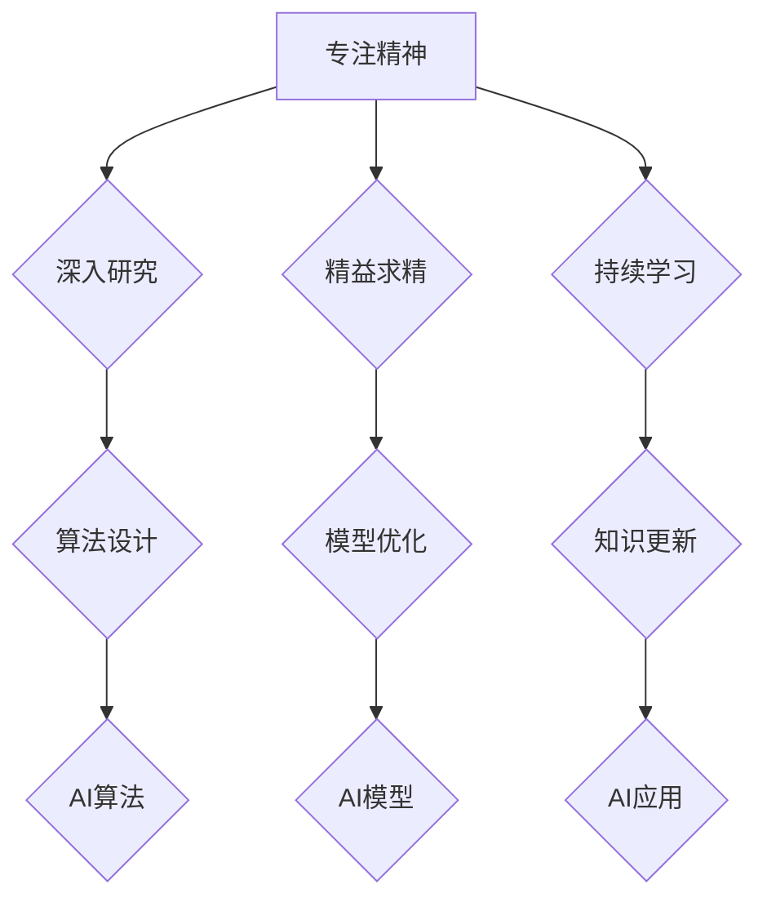

>  专注、深度学习、机器学习、算法、模型、实践、应用、未来

## 1. 背景介绍

在当今科技飞速发展的时代，人工智能（AI）作为一门新兴学科，正以惊人的速度改变着我们的生活。从语音识别到图像识别，从自动驾驶到医疗诊断，AI技术的应用领域日益广泛。然而，在追求AI技术突破的同时，我们也需要反思，如何才能真正做到“专注”，才能在AI领域取得长足的进步。

曾国藩，清朝著名的政治家、思想家，以其精湛的治国理政和深邃的思想著称。他的《曾国藩家书》中，充满了对人生、学习、治国的深刻思考，其中“专注”的精神尤为引人注目。曾国藩认为，想要取得成功，就必须做到“专心致志”，将精力集中在最重要的事情上，才能事半功倍。

## 2. 核心概念与联系

**2.1  专注精神的本质**

专注精神的核心在于集中注意力，排除干扰，将精力集中在当下最重要的事情上。它是一种意志力和自律的体现，需要我们克服内心的杂念和外界的诱惑，才能真正做到“心无旁骛”。

**2.2  专注与AI发展的联系**

在AI领域，专注精神同样至关重要。

* **算法设计与优化:** 

   AI算法的设计和优化是一个需要高度专注的过程。需要深入理解算法原理，分析算法的优缺点，并不断进行改进和优化，才能设计出高效、准确的算法。

* **模型训练与调参:** 

   AI模型的训练是一个耗时、耗资源的过程，需要对模型参数进行反复调优，才能获得最佳的性能。

* **数据分析与挖掘:** 

   AI模型的训练依赖于海量的数据，需要对数据进行深入分析和挖掘，才能发现隐藏其中的规律和模式。

**2.3  专注精神的体现**

在AI领域，专注精神的体现可以从以下几个方面看：

* **深入研究:** 

   对AI领域的某个特定问题进行深入研究，不断探索新的解决方案。

* **精益求精:** 

   对AI算法和模型进行不断优化，追求更高的精度和效率。

* **持续学习:** 

   关注AI领域的最新进展，不断学习新的知识和技能。

**2.4  Mermaid 流程图**



## 3. 核心算法原理 & 具体操作步骤

**3.1  算法原理概述**

深度学习算法是一种模仿人类大脑神经网络结构的机器学习算法。它通过多层神经网络来学习数据特征，并进行预测或分类。深度学习算法的优势在于能够自动学习数据特征，无需人工特征工程，并且能够处理复杂的数据模式。

**3.2  算法步骤详解**

1. **数据预处理:** 

   将原始数据进行清洗、转换和格式化，使其适合深度学习算法的训练。

2. **网络结构设计:** 

   根据任务需求设计深度神经网络的结构，包括神经元数量、层数、激活函数等。

3. **参数初始化:** 

   为神经网络中的参数进行随机初始化。

4. **前向传播:** 

   将输入数据通过神经网络进行前向传播，计算输出结果。

5. **反向传播:** 

   根据输出结果与真实标签之间的误差，利用梯度下降算法反向传播误差，更新神经网络参数。

6. **训练迭代:** 

   重复前向传播和反向传播的过程，直到模型性能达到预设目标。

7. **模型评估:** 

   使用测试数据评估模型的性能，并进行调参优化。

8. **模型部署:** 

   将训练好的模型部署到实际应用场景中。

**3.3  算法优缺点**

**优点:**

* 自动学习数据特征，无需人工特征工程。
* 能够处理复杂的数据模式。
* 性能优异，在许多任务中取得了突破性进展。

**缺点:**

* 训练数据量大，计算资源消耗高。
* 模型训练时间长，需要大量的计算资源和时间。
* 模型解释性差，难以理解模型的决策过程。

**3.4  算法应用领域**

* **图像识别:** 

   人脸识别、物体检测、图像分类等。

* **语音识别:** 

   语音转文本、语音助手等。

* **自然语言处理:** 

   机器翻译、文本摘要、情感分析等。

* **推荐系统:** 

   商品推荐、内容推荐等。

* **医疗诊断:** 

   疾病诊断、影像分析等。

## 4. 数学模型和公式 & 详细讲解 & 举例说明

**4.1  数学模型构建**

深度学习算法的核心是神经网络模型。神经网络模型由多个层组成，每一层包含多个神经元。神经元之间通过连接权重进行信息传递。

**4.2  公式推导过程**

* **激活函数:** 

   激活函数用于引入非线性，使神经网络能够学习复杂的数据模式。常见的激活函数包括 sigmoid 函数、ReLU 函数等。

* **损失函数:** 

   损失函数用于衡量模型预测结果与真实标签之间的误差。常见的损失函数包括均方误差、交叉熵损失等。

* **梯度下降算法:** 

   梯度下降算法用于更新神经网络参数，使其朝着最小化损失函数的方向进行调整。

**4.3  案例分析与讲解**

以图像分类为例，假设我们有一个包含猫和狗的图像数据集。我们可以使用深度学习算法训练一个图像分类模型，使其能够识别出图像中是猫还是狗。

* **数据预处理:** 

   将图像数据进行尺寸调整、归一化等处理。

* **网络结构设计:** 

   设计一个包含卷积层、池化层和全连接层的深度神经网络。

* **参数初始化:** 

   对神经网络参数进行随机初始化。

* **训练迭代:** 

   使用梯度下降算法训练模型，使其能够将猫和狗图像分类正确。

* **模型评估:** 

   使用测试数据评估模型的性能，并进行调参优化。

## 5. 项目实践：代码实例和详细解释说明

**5.1  开发环境搭建**

* **操作系统:** 

   Linux、macOS 或 Windows

* **编程语言:** 

   Python

* **深度学习框架:** 

   TensorFlow、PyTorch 或 Keras

**5.2  源代码详细实现**

```python
import tensorflow as tf

# 定义模型结构
model = tf.keras.models.Sequential([
    tf.keras.layers.Conv2D(32, (3, 3), activation='relu', input_shape=(28, 28, 1)),
    tf.keras.layers.MaxPooling2D((2, 2)),
    tf.keras.layers.Conv2D(64, (3, 3), activation='relu'),
    tf.keras.layers.MaxPooling2D((2, 2)),
    tf.keras.layers.Flatten(),
    tf.keras.layers.Dense(10, activation='softmax')
])

# 编译模型
model.compile(optimizer='adam',
              loss='sparse_categorical_crossentropy',
              metrics=['accuracy'])

# 训练模型
model.fit(x_train, y_train, epochs=10)

# 评估模型
loss, accuracy = model.evaluate(x_test, y_test)
print('Test loss:', loss)
print('Test accuracy:', accuracy)
```

**5.3  代码解读与分析**

* **模型结构:** 

   该代码定义了一个简单的卷积神经网络模型，包含两层卷积层、两层池化层和一层全连接层。

* **编译模型:** 

   使用 Adam 优化器、交叉熵损失函数和准确率作为评估指标编译模型。

* **训练模型:** 

   使用训练数据训练模型，训练 epochs 次。

* **评估模型:** 

   使用测试数据评估模型的性能，并打印测试损失和准确率。

**5.4  运行结果展示**

训练完成后，模型将能够对图像进行分类，并输出分类结果的概率分布。

## 6. 实际应用场景

**6.1  图像识别:** 

   自动驾驶汽车、人脸识别系统、医疗影像分析等。

**6.2  语音识别:** 

   语音助手、语音搜索、语音翻译等。

**6.3  自然语言处理:** 

   机器翻译、文本摘要、聊天机器人等。

**6.4  未来应用展望**

* **个性化推荐:** 

   根据用户的兴趣和行为，提供个性化的商品、内容和服务推荐。

* **智能医疗:** 

   辅助医生进行诊断、治疗和预防疾病。

* **智能教育:** 

   提供个性化的学习方案和智能辅导。

## 7. 工具和资源推荐

**7.1  学习资源推荐**

* **书籍:** 

   《深度学习》

* **在线课程:** 

   Coursera、edX、Udacity 等平台上的深度学习课程。

* **博客和论坛:** 

   机器学习和深度学习相关的博客和论坛，例如 TensorFlow 官方博客、PyTorch 官方博客等。

**7.2  开发工具推荐**

* **深度学习框架:** 

   TensorFlow、PyTorch、Keras 等。

* **编程语言:** 

   Python

* **数据处理工具:** 

   Pandas、NumPy 等。

**7.3  相关论文推荐**

* **AlexNet:** 

   ImageNet Large Scale Visual Recognition Challenge 2012 冠军论文。

* **VGGNet:** 

   ImageNet Large Scale Visual Recognition Challenge 2014 冠军论文。

* **ResNet:** 

   ImageNet Large Scale Visual Recognition Challenge 2015 冠军论文。

## 8. 总结：未来发展趋势与挑战

**8.1  研究成果总结**

近年来，深度学习算法取得了显著的进展，在图像识别、语音识别、自然语言处理等领域取得了突破性成果。

**8.2  未来发展趋势**

* **模型效率提升:** 

   研究更轻量级、更高效的深度学习模型，降低模型训练和部署的成本。

* **数据安全与隐私保护:** 

   研究如何保护训练数据和模型的隐私安全。

* **可解释性增强:** 

   研究如何提高深度学习模型的解释性，使其决策过程更加透明。

**8.3  面临的挑战**

* **数据获取和标注:** 

   深度学习算法需要大量的训练数据，获取和标注高质量数据是一个挑战。

* **模型训练成本:** 

   深度学习模型的训练成本高，需要大量的计算资源和时间。

* **模型泛化能力:** 

   深度学习模型在新的数据上表现不佳，提高模型的泛化能力是一个挑战。

**8.4  研究展望**

未来，深度学习技术将继续发展，并在更多领域得到应用。我们需要不断探索新的算法、模型和应用场景，推动深度学习技术的发展和应用。

## 9. 附录：常见问题与解答

**9.1  深度学习算法需要多少数据才能训练？**

深度学习算法需要大量的训练数据，一般来说，需要至少几千到几百万个样本才能训练出一个有效的模型。

**9.2  深度学习算法的训练时间有多长？**

深度学习算法的训练时间取决于模型的复杂度、数据量和计算资源等因素。一般来说，训练一个简单的模型可能只需要几小时，而训练一个复杂的模型可能需要几天甚至几周。

**9.3  深度学习算法的解释性如何？**

深度学习算法的解释性相对较差，难以理解模型的决策过程。

**