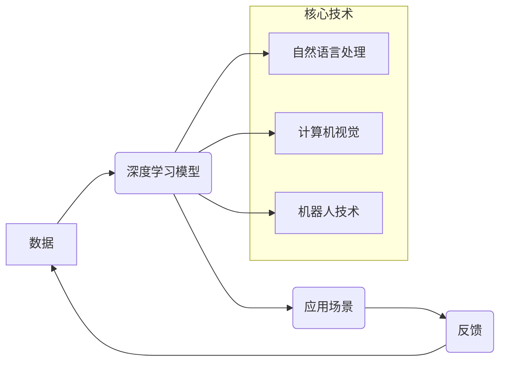

> AI 2.0, 
> 生态系统, 
> 深度学习, 
> 自然语言处理, 
> 计算机视觉, 
> 人机交互, 
> 伦理问题

## 1. 背景介绍

人工智能（AI）技术近年来发展迅速，从最初的局限于特定领域的应用，逐渐发展成为影响各行各业的通用技术。随着深度学习算法的突破和计算能力的提升，AI 进入了 2.0 时代，其应用场景更加广泛，对社会的影响也更加深远。

AI 2.0 时代的特点在于：

* **泛化能力增强:** 深度学习模型能够从海量数据中学习更复杂的模式，并应用于更广泛的领域。
* **交互性提升:** 人机交互方式更加自然，例如语音识别、自然语言处理等技术的发展，使得 AI 与人类的沟通更加流畅。
* **生态系统构建:** AI 技术的应用不再局限于单一领域，而是形成了一系列相互关联的生态系统，例如自动驾驶、智能医疗、智慧城市等。

## 2. 核心概念与联系

AI 2.0 时代的生态系统是一个复杂而动态的网络，涉及到多个核心概念和技术，它们相互关联，共同推动 AI 技术的发展和应用。

**核心概念:**

* **深度学习:** 是一种模仿人类大脑神经网络结构的机器学习算法，能够从海量数据中学习复杂的模式。
* **自然语言处理 (NLP):** 使计算机能够理解、生成和处理人类语言的技术。
* **计算机视觉 (CV):** 使计算机能够“看”和理解图像和视频的技术。
* **机器人技术:** 使计算机能够控制机械设备，并与人类进行物理交互的技术。
* **云计算:** 提供大规模计算资源和存储空间，为 AI 应用提供基础设施支持。

**生态系统架构:**



**联系:**

深度学习模型是 AI 2.0 时代的核心，它通过学习海量数据，能够实现自然语言处理、计算机视觉等多种功能。这些功能应用于不同的场景，例如自动驾驶、智能医疗、智慧城市等，并通过反馈数据不断完善深度学习模型，形成一个闭环的生态系统。

## 3. 核心算法原理 & 具体操作步骤

### 3.1  算法原理概述

深度学习算法的核心是多层神经网络，它模仿了人类大脑神经元的结构和功能。神经网络由多个层组成，每层包含多个神经元。每个神经元接收来自上一层的输入信号，并通过权重进行加权和求和，然后通过激活函数进行非线性变换，输出到下一层。

深度学习算法通过训练神经网络，调整神经元之间的权重，使得网络能够学习数据中的模式。训练过程通常使用反向传播算法，通过计算误差，反向传播到各层神经元，调整权重，最终使得网络输出的预测结果与真实值尽可能接近。

### 3.2  算法步骤详解

1. **数据预处理:** 将原始数据转换为深度学习模型可以理解的格式，例如归一化、编码等。
2. **网络结构设计:** 根据任务需求设计神经网络的结构，包括层数、神经元数量、激活函数等。
3. **参数初始化:** 为神经网络中的权重和偏置赋初值。
4. **前向传播:** 将输入数据通过神经网络进行一次传播，得到输出结果。
5. **损失函数计算:** 计算输出结果与真实值的误差，使用损失函数衡量误差的大小。
6. **反向传播:** 将误差反向传播到各层神经元，计算梯度。
7. **参数更新:** 使用梯度下降算法更新神经网络的权重和偏置，使得损失函数值减小。
8. **重复步骤4-7:** 迭代训练神经网络，直到损失函数值达到预设阈值。

### 3.3  算法优缺点

**优点:**

* **泛化能力强:** 深度学习模型能够从海量数据中学习复杂的模式，并应用于新的数据。
* **自动特征提取:** 深度学习模型能够自动提取数据的特征，无需人工特征工程。
* **性能优异:** 深度学习模型在许多任务上取得了优异的性能，例如图像识别、语音识别等。

**缺点:**

* **数据依赖:** 深度学习模型需要大量的训练数据，否则性能会下降。
* **计算资源消耗大:** 训练深度学习模型需要大量的计算资源和时间。
* **可解释性差:** 深度学习模型的决策过程难以理解，缺乏可解释性。

### 3.4  算法应用领域

深度学习算法应用于各个领域，例如：

* **计算机视觉:** 图像识别、物体检测、图像分割、人脸识别等。
* **自然语言处理:** 语音识别、机器翻译、文本摘要、情感分析等。
* **自动驾驶:** 路线规划、目标检测、路径跟踪等。
* **医疗诊断:** 病理图像分析、疾病预测、药物研发等。
* **金融分析:** 风险评估、欺诈检测、投资预测等。

## 4. 数学模型和公式 & 详细讲解 & 举例说明

### 4.1  数学模型构建

深度学习模型的核心是多层神经网络，其数学模型可以表示为：

* **输入层:**  $x = [x_1, x_2, ..., x_n]$
* **隐藏层:** $h = f(W_1x + b_1)$
* **输出层:** $y = f(W_2h + b_2)$

其中：

* $x$ 是输入数据向量。
* $h$ 是隐藏层神经元的输出向量。
* $y$ 是输出结果向量。
* $W_1$ 和 $W_2$ 是权重矩阵。
* $b_1$ 和 $b_2$ 是偏置向量。
* $f$ 是激活函数。

### 4.2  公式推导过程

损失函数用于衡量模型预测结果与真实值的误差，常用的损失函数包括均方误差 (MSE) 和交叉熵损失 (Cross-Entropy Loss)。

* **均方误差 (MSE):** $L = \frac{1}{n}\sum_{i=1}^{n}(y_i - \hat{y}_i)^2$

其中：

* $y_i$ 是真实值。
* $\hat{y}_i$ 是模型预测值。
* $n$ 是样本数量。

* **交叉熵损失 (Cross-Entropy Loss):** $L = -\frac{1}{n}\sum_{i=1}^{n}y_i \log(\hat{y}_i) + (1-y_i)\log(1-\hat{y}_i)$

其中：

* $y_i$ 是真实值 (0 或 1)。
* $\hat{y}_i$ 是模型预测值 (0 到 1 之间)。

反向传播算法用于计算梯度，并更新模型参数。梯度表示损失函数对模型参数的导数，方向指示参数更新的方向。

### 4.3  案例分析与讲解

**案例:** 使用深度学习模型进行图像分类。

**数据:** 使用 ImageNet 数据集进行训练，该数据集包含超过 1400 万张图像，并被分类到超过 2000 个类别。

**模型:** 使用卷积神经网络 (CNN) 进行图像分类，CNN 能够有效地提取图像特征。

**训练过程:** 使用反向传播算法训练 CNN 模型，并使用交叉熵损失函数衡量模型性能。

**结果:** 训练后的 CNN 模型能够准确地识别图像中的物体，并达到很高的分类精度。

## 5. 项目实践：代码实例和详细解释说明

### 5.1  开发环境搭建

* **操作系统:** Ubuntu 18.04
* **编程语言:** Python 3.6
* **深度学习框架:** TensorFlow 2.0
* **其他工具:** Jupyter Notebook, Git

### 5.2  源代码详细实现

```python
import tensorflow as tf

# 定义模型结构
model = tf.keras.models.Sequential([
    tf.keras.layers.Conv2D(32, (3, 3), activation='relu', input_shape=(28, 28, 1)),
    tf.keras.layers.MaxPooling2D((2, 2)),
    tf.keras.layers.Conv2D(64, (3, 3), activation='relu'),
    tf.keras.layers.MaxPooling2D((2, 2)),
    tf.keras.layers.Flatten(),
    tf.keras.layers.Dense(10, activation='softmax')
])

# 编译模型
model.compile(optimizer='adam',
              loss='sparse_categorical_crossentropy',
              metrics=['accuracy'])

# 加载数据
(x_train, y_train), (x_test, y_test) = tf.keras.datasets.mnist.load_data()

# 数据预处理
x_train = x_train.astype('float32') / 255.0
x_test = x_test.astype('float32') / 255.0
x_train = x_train.reshape((x_train.shape[0], 28, 28, 1))
x_test = x_test.reshape((x_test.shape[0], 28, 28, 1))

# 训练模型
model.fit(x_train, y_train, epochs=5)

# 评估模型
loss, accuracy = model.evaluate(x_test, y_test)
print('Test loss:', loss)
print('Test accuracy:', accuracy)
```

### 5.3  代码解读与分析

* **模型结构:** 代码定义了一个简单的卷积神经网络 (CNN) 模型，包含两层卷积层、两层最大池化层、一层全连接层和一层输出层。
* **模型编译:** 使用 Adam 优化器、交叉熵损失函数和准确率作为评估指标编译模型。
* **数据加载:** 使用 MNIST 数据集进行训练和测试。
* **数据预处理:** 将图像数据转换为浮点数，并调整形状以适应模型输入。
* **模型训练:** 使用 `model.fit()` 函数训练模型，指定训练轮数 (epochs)。
* **模型评估:** 使用 `model.evaluate()` 函数评估模型在测试集上的性能。

### 5.4  运行结果展示

训练完成后，模型能够准确地识别 MNIST 数据集中的手写数字。

## 6. 实际应用场景

### 6.1  自动驾驶

深度学习算法在自动驾驶领域发挥着重要作用，例如：

* **目标检测:** 识别道路上的车辆、行人、交通信号灯等物体。
* **路径规划:** 根据周围环境规划行驶路线。
* **路径跟踪:** 保持车辆在指定车道内行驶。

### 6.2  智能医疗

深度学习算法在智能医疗领域应用广泛，例如：

* **病理图像分析:** 辅助医生诊断疾病，例如癌症、心血管疾病等。
* **疾病预测:** 根据患者的医疗记录和生活习惯预测疾病风险。
* **药物研发:** 辅助药物研发，例如发现新的药物靶点、预测药物疗效等。

### 6.3  智慧城市

深度学习算法在智慧城市建设中发挥着重要作用，例如：

* **交通管理:** 优化交通流量，缓解交通拥堵。
* **环境监测:** 监测空气质量、水质等环境指标。
* **公共安全:** 监控公共场所，预防犯罪。

### 6.4  未来应用展望

AI 2.0 时代的生态系统将更加完善，深度学习算法将应用于更多领域，例如：

* **个性化教育:** 根据学生的学习情况提供个性化的学习方案