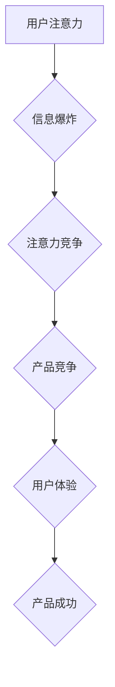

>  注意力经济, 用户体验, 产品设计,  心理机制,  认知科学,  用户行为,  交互设计

## 1. 背景介绍

在当今信息爆炸的时代，人们每天面临着海量的资讯和信息流。如何有效地获取和处理信息，成为了一个至关重要的挑战。在这个背景下，“注意力经济”的概念应运而生。注意力经济认为，注意力是稀缺的资源，而能够吸引和保持用户注意力的产品和服务，就拥有了巨大的价值。

用户体验设计（User Experience Design，简称UXD）作为产品设计的重要组成部分，在注意力经济时代显得尤为重要。优秀的UXD能够帮助产品更好地理解用户的需求和行为模式，从而设计出更具吸引力和实用性的产品，最终赢得用户的注意力和忠诚度。

## 2. 核心概念与联系

### 2.1 注意力经济

注意力经济的核心概念是，注意力是稀缺的资源，而能够吸引和保持用户注意力的产品和服务，就拥有了巨大的价值。

在信息爆炸的时代，人们每天面临着海量的资讯和信息流，注意力成为了最稀缺的资源。因此，企业和产品需要找到有效的方式来吸引和保持用户的注意力，才能在竞争激烈的市场中脱颖而出。

### 2.2 用户体验设计

用户体验设计（User Experience Design，简称UXD）是指通过设计和优化产品，以提升用户使用产品的愉悦度、效率和满意度。

优秀的UXD能够帮助产品更好地理解用户的需求和行为模式，从而设计出更具吸引力和实用性的产品，最终赢得用户的注意力和忠诚度。

### 2.3 联系

注意力经济和用户体验设计之间存在着密切的联系。

优秀的UXD能够帮助产品更好地理解用户的需求和行为模式，从而设计出更具吸引力和实用性的产品，最终赢得用户的注意力和忠诚度。

**Mermaid 流程图**



## 3. 核心算法原理 & 具体操作步骤

### 3.1 算法原理概述

在注意力经济时代，设计引人入胜的产品需要深入理解用户的认知机制和行为模式。 

**认知心理学**和**行为经济学**为我们提供了许多宝贵的理论和模型，可以帮助我们设计出更符合用户心理的产品。

例如，**“损失厌恶”**原理表明，人们对损失的敏感度高于对收益的敏感度。因此，在产品设计中，我们可以利用这个原理，设计出能够降低用户损失感的体验，例如提供退货保障、免费试用等。

**“锚定效应”**则表明，人们在做出决策时，往往会依赖于第一个接触到的信息，即“锚点”。因此，我们可以利用这个原理，在产品设计中设置合适的“锚点”，引导用户做出有利于产品的决策。

### 3.2 算法步骤详解

1. **用户研究:** 通过用户访谈、问卷调查、A/B测试等方式，深入了解用户的需求、行为模式和心理机制。
2. **信息架构设计:** 根据用户研究结果，设计出清晰、易懂、符合用户认知习惯的信息架构，帮助用户快速找到所需信息。
3. **交互设计:** 设计出直观、易用、符合用户操作习惯的交互设计，提升用户使用产品的流畅性和愉悦度。
4. **视觉设计:** 设计出美观、简洁、符合用户审美偏好的视觉设计，提升用户对产品的感知和好感度。
5. **测试与迭代:** 通过用户测试，收集用户反馈，并根据反馈进行产品迭代优化，不断提升用户体验。

### 3.3 算法优缺点

**优点:**

* 能够有效地提升用户体验，提高用户满意度和忠诚度。
* 能够帮助产品更好地理解用户的需求和行为模式，从而设计出更符合用户心理的产品。
* 能够提升产品的竞争力，在市场中脱颖而出。

**缺点:**

* 用户研究和产品迭代是一个持续的过程，需要投入大量的时间和资源。
* 不同的用户群体有不同的需求和行为模式，需要针对不同的用户群体进行个性化的设计。

### 3.4 算法应用领域

注意力经济和用户体验设计在各个领域都有广泛的应用，例如：

* **电商平台:** 通过个性化推荐、精美的商品展示、流畅的购物流程等，吸引用户注意力，提升转化率。
* **社交媒体:** 通过个性化内容推荐、互动游戏、实时消息推送等，吸引用户注意力，提升用户粘性。
* **教育平台:** 通过互动式学习内容、个性化学习路径、实时反馈等，吸引用户注意力，提升学习效率。

## 4. 数学模型和公式 & 详细讲解 & 举例说明

### 4.1 数学模型构建

注意力经济可以抽象为一个资源分配模型，其中用户注意力是有限的资源，而各种产品和服务则需要争夺用户的注意力。

我们可以用以下数学模型来描述用户注意力分配的过程：

**用户注意力 = ∑(产品吸引力 * 产品曝光时间)**

其中：

* **产品吸引力:** 指的是产品能够吸引用户注意力的程度，可以由多种因素决定，例如产品的主题、内容、设计等。
* **产品曝光时间:** 指的是用户接触产品的时长。

### 4.2 公式推导过程

我们可以通过以下公式推导得出用户注意力分配的规律：

**用户注意力 = ∑(产品吸引力 * 产品曝光时间) / ∑(所有产品曝光时间)**

这个公式表明，用户注意力分配的比例与产品吸引力和曝光时间成正比，与所有产品的总曝光时间成反比。

### 4.3 案例分析与讲解

例如，假设有两个产品A和B，产品A的吸引力为10，曝光时间为1小时，产品B的吸引力为5，曝光时间为2小时。

那么，用户对这两个产品的注意力分配比例为：

* 产品A注意力比例 = (10 * 1) / (10 * 1 + 5 * 2) = 0.4
* 产品B注意力比例 = (5 * 2) / (10 * 1 + 5 * 2) = 0.6

由此可见，尽管产品B的曝光时间更长，但由于产品A的吸引力更高，因此用户对产品A的注意力分配比例更高。

## 5. 项目实践：代码实例和详细解释说明

### 5.1 开发环境搭建

为了更好地理解注意力经济和用户体验设计，我们可以通过一个简单的项目实践来加深理解。

在这个项目中，我们将创建一个简单的网页应用，用于展示用户注意力分配的规律。

**开发环境:**

* 操作系统: Windows/macOS/Linux
* 编程语言: Python
* Web框架: Flask
* 数据库: SQLite

### 5.2 源代码详细实现

```python
from flask import Flask, render_template

app = Flask(__name__)

@app.route('/')
def index():
    return render_template('index.html')

if __name__ == '__main__':
    app.run(debug=True)
```

**index.html:**

```html
<!DOCTYPE html>
<html>
<head>
    <title>注意力经济</title>
</head>
<body>
    <h1>注意力经济</h1>
    <p>这是一个简单的网页应用，用于展示用户注意力分配的规律。</p>
</body>
</html>
```

### 5.3 代码解读与分析

* **Python代码:**

    * 我们使用Flask框架创建了一个简单的网页应用。
    * `index()`函数负责渲染`index.html`模板。

* **HTML代码:**

    * `index.html`是一个简单的网页模板，包含一个标题和一段说明文字。

### 5.4 运行结果展示

运行上述代码，访问`http://127.0.0.1:5000/`，即可看到简单的网页应用。

## 6. 实际应用场景

### 6.1  电商平台

电商平台可以利用注意力经济的原理，设计出更具吸引力和实用性的产品，例如：

* **个性化推荐:** 通过分析用户的浏览历史、购买记录等数据，为用户推荐更符合其兴趣的产品。
* **精美的商品展示:** 使用高质量的图片和视频，突出产品的特点和优势，吸引用户的注意力。
* **流畅的购物流程:** 简化购物流程，减少用户操作步骤，提升用户购物体验。

### 6.2  社交媒体

社交媒体平台可以利用注意力经济的原理，设计出更具互动性和粘性的产品，例如：

* **个性化内容推荐:** 通过分析用户的兴趣爱好，为用户推荐更符合其口味的内容。
* **互动游戏:** 设计一些有趣的互动游戏，吸引用户参与，提升用户粘性。
* **实时消息推送:** 实时推送用户感兴趣的消息，保持用户对平台的关注。

### 6.3  教育平台

教育平台可以利用注意力经济的原理，设计出更具趣味性和学习效率的产品，例如：

* **互动式学习内容:** 使用动画、视频、游戏等形式，将枯燥的知识点变得生动有趣。
* **个性化学习路径:** 根据用户的学习进度和能力，定制个性化的学习路径，提升学习效率。
* **实时反馈:** 提供实时反馈，帮助用户及时发现问题，并进行改进。

### 6.4 未来应用展望

随着人工智能、大数据等技术的不断发展，注意力经济和用户体验设计将得到更广泛的应用。

未来，我们可以期待看到更多基于注意力经济的创新产品和服务，例如：

* **个性化学习机器人:** 可以根据用户的学习进度和能力，提供个性化的学习指导和反馈。
* **智能内容推荐引擎:** 可以根据用户的兴趣爱好，推荐更符合其口味的内容。
* **沉浸式体验平台:** 可以通过虚拟现实、增强现实等技术，创造出更具沉浸性和互动性的体验。

## 7. 工具和资源推荐

### 7.1 学习资源推荐

* **书籍:**
    * 《Hooked: How to Build Habit-Forming Products》 by Nir Eyal
    * 《Don't Make Me Think, Revisited: A Common Sense Approach to Web Usability》 by Steve Krug
    * 《The Design of Everyday Things》 by Don Norman
* **在线课程:**
    * Coursera: User Experience Design Specialization
    * Udemy: The Complete User Experience (UX) Design Course
    * Interaction Design Foundation: UX Design Fundamentals

### 7.2 开发工具推荐

* **用户研究工具:**
    * UserTesting
    * Hotjar
    * Crazy Egg
* **原型设计工具:**
    * Figma
    * Sketch
    * Adobe XD
* **交互设计工具:**
    * Axure RP
    * InVision Studio

### 7.3 相关论文推荐

* **Attention is All You Need** (Vaswani et al., 2017)
* **BERT: Pre-training of Deep Bidirectional Transformers for Language Understanding** (Devlin et al., 2018)
* **The Psychology of Attention** (Kahneman, 1973)

## 8. 总结：未来发展趋势与挑战

### 8.1 研究成果总结

注意力经济和用户体验设计是近年来发展迅速的两个领域，取得了许多重要的研究成果。

例如，在人工智能领域，注意力机制的提出，为深度学习模型的训练和应用带来了新的突破。

在用户体验设计领域，用户研究方法和设计原则得到了不断完善，帮助产品设计者更好地理解用户需求和行为模式。

### 8.2 未来发展趋势

未来，注意力经济和用户体验设计将继续朝着以下几个方向发展：

* **更个性化的产品和服务:** 利用人工智能和大数据技术，为每个用户提供更个性化的产品和服务。
* **更沉浸式的体验:** 利用虚拟现实、增强现实等技术，创造出更具沉浸性和互动性的体验。
* **更注重用户隐私和安全:** 在设计产品和服务时，更加注重用户隐私和安全，保障用户的个人信息安全。

### 8.3 面临的挑战

注意力经济和用户体验设计也面临着一些挑战，例如：

* **用户注意力