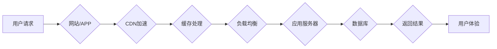

> 电商平台,供给能力,网站优化,APP优化,性能提升,用户体验,CDN,缓存,负载均衡,数据库优化,代码优化,A/B测试

## 1. 背景介绍

在当今激烈的电商市场竞争中，供给能力的提升至关重要。电商平台需要能够快速、高效地响应用户需求，提供流畅的用户体验，才能在激烈的竞争中脱颖而出。网站和APP作为电商平台的主要入口，其性能和用户体验直接影响着平台的整体运营效果。因此，优化网站和APP的供给能力，提升用户体验，成为电商平台持续发展的关键。

## 2. 核心概念与联系

**2.1 核心概念**

* **供给能力:** 指电商平台能够提供商品和服务的总量和速度。
* **网站优化:** 指通过对网站代码、结构、内容等方面的调整，提升网站的性能、用户体验和搜索引擎排名。
* **APP优化:** 指通过对APP代码、架构、功能等方面的调整，提升APP的性能、用户体验和稳定性。

**2.2 核心概念联系**

网站和APP是电商平台的重要组成部分，它们共同构成了用户获取商品和服务的入口。网站和APP的供给能力直接影响着用户体验，进而影响着平台的整体运营效果。

**2.3 架构流程图**



## 3. 核心算法原理 & 具体操作步骤

**3.1 算法原理概述**

电商平台供给能力提升的核心算法主要包括：

* **缓存算法:** 利用缓存机制，减少数据库访问次数，提升数据访问速度。
* **负载均衡算法:** 将用户请求分配到不同的服务器，避免单点故障，提升系统稳定性和处理能力。
* **数据库优化算法:** 通过优化数据库结构、索引和查询语句，提升数据库查询效率。

**3.2 算法步骤详解**

* **缓存算法:**
    1. 识别需要缓存的数据。
    2. 将数据存储到缓存服务器。
    3. 当用户请求数据时，先从缓存服务器查询，如果命中则直接返回，否则从数据库查询并缓存到缓存服务器。
* **负载均衡算法:**
    1. 收集用户请求信息。
    2. 根据负载均衡算法，将请求分配到不同的服务器。
    3. 监控服务器负载情况，动态调整请求分配策略。
* **数据库优化算法:**
    1. 分析数据库查询语句，优化查询结构和索引。
    2. 调整数据库配置参数，提升数据库性能。
    3. 使用数据库分库分表技术，将数据分散到多个数据库服务器，提升数据库处理能力。

**3.3 算法优缺点**

* **缓存算法:**
    * 优点: 提升数据访问速度，降低数据库压力。
    * 缺点: 需要额外的缓存服务器和维护成本。
* **负载均衡算法:**
    * 优点: 提升系统稳定性和处理能力，避免单点故障。
    * 缺点: 需要额外的负载均衡设备和配置成本。
* **数据库优化算法:**
    * 优点: 提升数据库查询效率，降低数据库资源消耗。
    * 缺点: 需要专业的数据库管理员和优化经验。

**3.4 算法应用领域**

* **电商平台:** 提升商品展示速度、订单处理速度和用户体验。
* **社交媒体平台:** 提升用户数据访问速度、消息推送速度和用户体验。
* **金融平台:** 提升交易处理速度、数据查询速度和系统稳定性。

## 4. 数学模型和公式 & 详细讲解 & 举例说明

**4.1 数学模型构建**

电商平台供给能力可以抽象为一个数学模型，其中涉及到以下几个关键因素:

* **用户请求量:**  表示用户对平台服务的访问频率。
* **响应时间:** 表示平台服务响应用户的平均时间。
* **资源利用率:** 表示平台资源（如CPU、内存、带宽）的利用率。

**4.2 公式推导过程**

供给能力可以定义为用户请求量与响应时间的乘积，即：

```latex
供给能力 = 用户请求量 * 响应时间
```

资源利用率可以定义为实际资源使用量与总资源量的比值，即：

```latex
资源利用率 = 实际资源使用量 / 总资源量
```

**4.3 案例分析与讲解**

假设一个电商平台的用户请求量为1000个/秒，响应时间为0.1秒，资源利用率为80%。那么，该平台的供给能力为：

```latex
供给能力 = 1000个/秒 * 0.1秒 = 100
```

这意味着该平台每秒可以处理100个用户请求。

## 5. 项目实践：代码实例和详细解释说明

**5.1 开发环境搭建**

* 操作系统: Ubuntu 20.04
* 编程语言: Python 3.8
* 框架: Django 3.2
* 数据库: MySQL 8.0

**5.2 源代码详细实现**

```python
# views.py
from django.shortcuts import render
from django.http import HttpResponse

def index(request):
    # 从数据库查询商品数据
    products = Product.objects.all()
    # 将商品数据传递给模板
    return render(request, 'index.html', {'products': products})
```

```html
# index.html
<h1>商品列表</h1>
<ul>
    
        <li>{{ product.name }} - {{ product.price }}</li>
    
</ul>
```

**5.3 代码解读与分析**

* views.py 文件定义了 index 函数，该函数负责处理用户访问首页的请求。
* index 函数从数据库中查询所有商品数据，并将数据传递给 index.html 模板。
* index.html 模板使用 Django 模板语法循环遍历商品数据，并将其渲染到页面上。

**5.4 运行结果展示**

当用户访问电商平台首页时，会调用 index 函数，查询商品数据并渲染到页面上，用户可以浏览商品列表。

## 6. 实际应用场景

**6.1 电商平台商品展示优化**

通过缓存商品数据，可以大幅提升商品展示速度，提升用户体验。

**6.2 电商平台订单处理优化**

通过负载均衡和数据库优化，可以提升订单处理速度，降低订单处理失败率。

**6.3 电商平台用户画像分析优化**

通过数据分析和机器学习算法，可以构建用户画像，为用户提供个性化推荐和服务。

**6.4 未来应用展望**

随着电商平台的发展，供给能力的提升将更加重要。未来，电商平台将更加注重以下方面：

* **人工智能技术应用:** 利用人工智能技术，实现智能推荐、智能客服、智能物流等功能，提升用户体验和运营效率。
* **云计算技术应用:** 利用云计算技术，实现弹性伸缩、资源共享等功能，提升平台的供给能力和稳定性。
* **大数据技术应用:** 利用大数据技术，进行用户行为分析、市场趋势预测等，为平台决策提供数据支持。

## 7. 工具和资源推荐

**7.1 学习资源推荐**

* **书籍:**
    * 《深入理解计算机系统》
    * 《操作系统导论》
    * 《数据库系统概论》
* **在线课程:**
    * Coursera: 操作系统、数据库、网络编程
    * Udemy: 电商平台开发、云计算、人工智能

**7.2 开发工具推荐**

* **代码编辑器:** VS Code, Sublime Text
* **版本控制系统:** Git
* **数据库管理工具:** MySQL Workbench, Navicat

**7.3 相关论文推荐**

* **CDN加速技术:**
    * Content Delivery Network: A Survey
* **负载均衡算法:**
    * A Survey of Load Balancing Algorithms
* **数据库优化技术:**
    * Database Optimization Techniques: A Comprehensive Review

## 8. 总结：未来发展趋势与挑战

**8.1 研究成果总结**

本文介绍了电商平台供给能力提升的原理、算法、实践案例以及未来发展趋势。通过优化网站和APP的性能、用户体验和资源利用率，电商平台可以提升用户满意度、促进业务增长。

**8.2 未来发展趋势**

未来，电商平台供给能力提升将更加注重以下方面:

* **人工智能技术应用:** 利用人工智能技术，实现智能推荐、智能客服、智能物流等功能，提升用户体验和运营效率。
* **云计算技术应用:** 利用云计算技术，实现弹性伸缩、资源共享等功能，提升平台的供给能力和稳定性。
* **大数据技术应用:** 利用大数据技术，进行用户行为分析、市场趋势预测等，为平台决策提供数据支持。

**8.3 面临的挑战**

电商平台供给能力提升也面临着一些挑战:

* **技术复杂性:** 优化网站和APP的供给能力需要掌握多种技术，例如缓存技术、负载均衡技术、数据库优化技术等。
* **成本压力:** 提升供给能力需要投入一定的成本，例如购买硬件设备、购买软件授权等。
* **人才短缺:** 掌握电商平台供给能力提升技术的专业人才相对稀缺。

**8.4 研究展望**

未来，我们将继续研究电商平台供给能力提升的技术，探索更有效的优化方法，为电商平台的发展提供技术支持。

## 9. 附录：常见问题与解答

**9.1 如何提高网站的加载速度？**

* 使用CDN加速
* 压缩图片和代码
* 优化数据库查询语句
* 使用缓存机制

**9.2 如何实现负载均衡？**

* 使用硬件负载均衡器
* 使用软件负载均衡器
* 使用云平台负载均衡服务

**9.3 如何优化数据库性能？**

* 优化数据库结构
* 创建索引
* 优化查询语句
* 分库分表

作者：禅与计算机程序设计艺术 / Zen and the Art of Computer Programming


<end_of_turn>