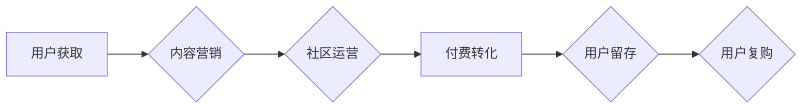

> 知识付费、增长黑客、用户增长、内容营销、社区运营、数据分析、付费转化

## 1. 背景介绍

知识付费行业近年来发展迅速，从线上课程、付费咨询到会员体系，各种模式层出不穷。然而，在竞争日益激烈的市场环境下，单纯依靠优质内容已经难以保证持续增长。如何通过增长黑客技巧，有效提升用户增长、付费转化率，成为知识付费创业者面临的共同挑战。

## 2. 核心概念与联系

**2.1 知识付费与增长黑客**

* **知识付费**是指通过提供专业知识、技能或经验，向用户收取费用的一种商业模式。
* **增长黑客**是指通过数据驱动、实验验证、持续迭代的方式，优化用户增长和转化率的实践方法。

**2.2 核心概念联系**

知识付费创业者可以通过增长黑客技巧，在用户获取、内容传播、付费转化等环节进行优化，从而实现用户增长和商业价值的提升。

**2.3 增长黑客流程图**



## 3. 核心算法原理 & 具体操作步骤

**3.1 算法原理概述**

增长黑客的核心在于数据驱动和实验验证。通过收集用户行为数据，分析用户画像，识别用户痛点和需求，并设计针对性的增长策略。

**3.2 算法步骤详解**

1. **数据收集与分析:** 收集用户行为数据，例如网站访问记录、课程报名情况、付费转化率等，并进行分析，了解用户画像、行为模式和痛点。
2. **增长策略制定:** 根据数据分析结果，制定针对性的增长策略，例如内容营销、社区运营、付费转化优化等。
3. **实验验证:** 将增长策略进行A/B测试，对比不同策略的效果，并根据测试结果进行优化调整。
4. **持续迭代:** 持续收集数据、分析结果、优化策略，形成一个闭环的增长迭代机制。

**3.3 算法优缺点**

* **优点:** 数据驱动、实验验证，能够有效提升用户增长和转化率。
* **缺点:** 需要投入大量时间和资源进行数据收集、分析和实验验证。

**3.4 算法应用领域**

增长黑客技术广泛应用于互联网行业，例如电商、社交媒体、在线教育等领域。

## 4. 数学模型和公式 & 详细讲解 & 举例说明

**4.1 数学模型构建**

用户增长模型可以采用指数增长模型或Logistic增长模型来描述。

* **指数增长模型:**  用户数量随着时间的推移呈指数增长，公式为：N(t) = N0 * e^(rt)，其中N(t)为t时刻的用户数量，N0为初始用户数量，r为增长率，t为时间。
* **Logistic增长模型:** 用户增长率随着用户数量的增加而逐渐减缓，公式为：dN/dt = rN(1 - N/K)，其中dN/dt为用户增长率，r为最大增长率，K为环境承载能力。

**4.2 公式推导过程**

指数增长模型的推导基于用户增长率与现有用户数量成正比的假设。Logistic增长模型的推导则考虑了环境承载能力的限制，用户增长率随着用户数量的增加而逐渐减缓。

**4.3 案例分析与讲解**

假设一个知识付费平台的初始用户数量为1000人，增长率为10%，则根据指数增长模型，一年后用户数量将达到2718人。然而，随着平台用户数量的增加，增长率可能会逐渐减缓，Logistic增长模型能够更准确地描述这种趋势。

## 5. 项目实践：代码实例和详细解释说明

**5.1 开发环境搭建**

使用Python语言和相关库进行开发，例如Pandas、NumPy、Scikit-learn等。

**5.2 源代码详细实现**

```python
import pandas as pd
from sklearn.linear_model import LinearRegression

# 数据加载
data = pd.read_csv('user_growth_data.csv')

# 数据预处理
X = data[['time']]
y = data['user_count']

# 模型训练
model = LinearRegression()
model.fit(X, y)

# 模型预测
future_time = pd.DataFrame({'time': [30, 60, 90]})
future_user_count = model.predict(future_time)

# 结果展示
print(future_user_count)
```

**5.3 代码解读与分析**

该代码示例展示了如何使用线性回归模型预测用户增长趋势。首先，加载用户增长数据，然后进行数据预处理，将时间作为自变量，用户数量作为因变量。接着，训练线性回归模型，并使用模型预测未来用户数量。

**5.4 运行结果展示**

运行代码后，将输出未来不同时间点的用户数量预测值。

## 6. 实际应用场景

**6.1 内容营销**

通过数据分析，了解用户感兴趣的主题和内容类型，并针对性地创作优质内容，吸引用户关注和转化。

**6.2 社区运营**

建立活跃的知识付费社区，鼓励用户互动交流，分享经验和观点，提升用户粘性和复购率。

**6.3 付费转化优化**

分析用户付费行为，优化付费流程和价格策略，提高付费转化率。

**6.4 未来应用展望**

随着人工智能技术的不断发展，增长黑客技术将更加智能化和自动化，能够更精准地预测用户行为，优化增长策略。

## 7. 工具和资源推荐

**7.1 学习资源推荐**

* 《增长黑客》
* 《Hooked》
* 《The Lean Startup》

**7.2 开发工具推荐**

* Google Analytics
* Mixpanel
* Amplitude

**7.3 相关论文推荐**

* "Growth Hacking: A Framework for User Acquisition"
* "The Lean Startup: How Today's Entrepreneurs Use Continuous Innovation to Create Radically Successful Businesses"

## 8. 总结：未来发展趋势与挑战

**8.1 研究成果总结**

增长黑客技术为知识付费创业者提供了有效提升用户增长和转化率的工具和方法。

**8.2 未来发展趋势**

* 人工智能驱动的增长黑客
* 数据分析和预测的进一步深入
* 个性化用户增长策略

**8.3 面临的挑战**

* 数据隐私和安全问题
* 算法的公平性和可解释性
* 持续迭代和优化成本

**8.4 研究展望**

未来研究将更加关注人工智能驱动的增长黑客，以及数据分析和预测的进一步深入，以实现更精准、更有效的用户增长策略。

## 9. 附录：常见问题与解答

**9.1 如何收集用户行为数据？**

可以使用网站分析工具、用户行为跟踪工具、用户调查等方式收集用户行为数据。

**9.2 如何进行A/B测试？**

可以使用A/B测试平台，将不同增长策略随机分配给用户群体，并比较不同策略的效果。

**9.3 如何分析用户画像？**

可以使用数据分析工具，分析用户年龄、性别、兴趣爱好、行为模式等信息，构建用户画像。


作者：禅与计算机程序设计艺术 / Zen and the Art of Computer Programming 
<end_of_turn>