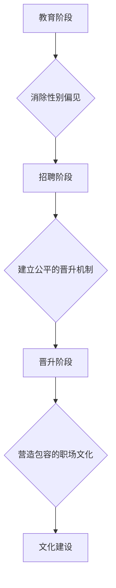

>  硅谷,科技女性,性别天花板,人工智能,程序员,软件架构师,CTO,计算机图灵奖,计算机领域大师

## 1. 背景介绍

硅谷，作为全球科技创新的中心，孕育了无数科技巨头和颠覆性技术。然而，在这一充满机遇和挑战的领域，女性的参与度却始终处于相对较低的水平。尽管近年来，女性在科技领域的参与度有所提高，但性别天花板依然存在，阻碍着更多女性在科技领域实现自我价值和贡献。

**1.1 女性在科技领域的现状**

根据美国国家科学基金会的数据，2021年，美国计算机科学领域的女性比例仅为26%，而工程领域女性比例也仅为15%。尽管这些数字在过去几十年中有所提高，但与男性相比，女性在科技领域的参与度仍然存在显著差距。

**1.2 性别天花板的影响**

性别天花板对女性在科技领域的职业发展和个人成长产生了深远的影响。

* **职业晋升受限:** 女性在科技领域更容易面临晋升瓶颈，获得领导职位的机会相对较少。
* **薪酬差距:** 女性在科技领域的薪酬水平普遍低于男性，即使在相同职位和工作经验的情况下，也存在明显的薪酬差距。
* **创新能力受限:** 女性在科技领域的参与度不足，会导致创新能力的下降，不利于科技领域的进步和发展。

## 2. 核心概念与联系

打破性别天花板需要从多个方面入手，包括教育、招聘、晋升、文化等。

**2.1 教育阶段**

* **鼓励女性学习STEM课程:** 从小学阶段开始，鼓励女性学习科学、技术、工程和数学（STEM）课程，培养她们的科学思维和技术能力。
* **提供女性STEM导师:** 为女性学生提供STEM领域的导师，帮助她们克服学习上的困难，并激发她们对科技的兴趣。

**2.2 招聘阶段**

* **消除性别偏见:** 在招聘过程中，消除性别偏见，公平对待所有候选人，并注重多元化人才的招聘。
* **提供女性专属招聘计划:** 针对女性人才，制定专属招聘计划，扩大女性在科技领域的招聘渠道。

**2.3 晋升阶段**

* **建立公平的晋升机制:** 建立公平透明的晋升机制，确保女性在晋升过程中享有同等的权利和机会。
* **提供女性领导力培训:** 为女性员工提供领导力培训，帮助她们提升领导能力，为晋升做好准备。

**2.4 文化建设**

* **营造包容的职场文化:** 营造包容、平等、尊重女性的职场文化，让女性在工作中感到舒适和安全。
* **鼓励女性参与科技社区:** 鼓励女性参与科技社区，与其他女性和男性同行交流学习，拓展人脉和视野。

**2.5 流程图**



## 3. 核心算法原理 & 具体操作步骤

打破性别天花板需要运用多种算法和技术手段，例如机器学习、自然语言处理等。

**3.1 算法原理概述**

机器学习算法可以用于识别和消除招聘过程中存在的性别偏见。例如，可以通过训练机器学习模型，识别简历中带有性别歧视的词语，并对这些词语进行过滤，从而确保招聘过程更加公平。

**3.2 算法步骤详解**

1. **数据收集:** 收集大量招聘数据，包括简历、面试记录、招聘结果等。
2. **数据预处理:** 对数据进行清洗、格式化和标注，例如去除无关信息、标准化文本格式、标记性别信息等。
3. **模型训练:** 使用机器学习算法，例如支持向量机、随机森林等，训练模型，识别简历中带有性别歧视的词语。
4. **模型评估:** 使用测试数据评估模型的性能，例如准确率、召回率等。
5. **模型部署:** 将训练好的模型部署到招聘系统中，实时识别简历中带有性别歧视的词语，并进行过滤。

**3.3 算法优缺点**

* **优点:** 可以有效识别和消除招聘过程中存在的性别偏见，提高招聘公平性。
* **缺点:** 需要大量的数据进行训练，模型的准确率和泛化能力需要不断提升。

**3.4 算法应用领域**

* **招聘:** 识别和消除招聘过程中存在的性别偏见。
* **教育:** 识别和消除教育资源分配中的性别不公平。
* **金融:** 识别和消除金融服务中的性别歧视。

## 4. 数学模型和公式 & 详细讲解 & 举例说明

打破性别天花板需要运用数学模型和公式来量化问题，并制定相应的解决方案。

**4.1 数学模型构建**

我们可以构建一个数学模型来衡量女性在科技领域的参与度，例如：

```
参与度 = (女性员工数量 / 总员工数量) * 100%
```

**4.2 公式推导过程**

这个公式的推导过程很简单，就是将女性员工数量除以总员工数量，再乘以100%，得到女性在科技领域的参与度百分比。

**4.3 案例分析与讲解**

假设一家科技公司共有100名员工，其中女性员工有20名，那么该公司的女性参与度为：

```
参与度 = (20 / 100) * 100% = 20%
```

## 5. 项目实践：代码实例和详细解释说明

我们可以使用Python语言编写代码来实现性别歧视识别算法。

**5.1 开发环境搭建**

需要安装Python语言和相关的库，例如NLTK、Scikit-learn等。

**5.2 源代码详细实现**

```python
import nltk
from sklearn.feature_extraction.text import TfidfVectorizer
from sklearn.linear_model import LogisticRegression

# 数据预处理
def preprocess_text(text):
    # 去除标点符号、换行符等
    text = text.replace(".", "").replace(",", "").replace("
", "")
    # 将文本转换为小写
    text = text.lower()
    return text

# 训练模型
def train_model(data):
    # 使用TF-IDF向量化文本
    vectorizer = TfidfVectorizer()
    X = vectorizer.fit_transform([preprocess_text(text) for text in data['text']])
    y = data['label']
    # 使用逻辑回归模型训练
    model = LogisticRegression()
    model.fit(X, y)
    return model

# 预测性别歧视
def predict_bias(text, model):
    # 使用训练好的模型预测文本是否包含性别歧视
    X = vectorizer.transform([preprocess_text(text)])
    prediction = model.predict(X)
    return prediction

# 数据加载和训练
data = load_data()
model = train_model(data)

# 预测性别歧视
text = "这个职位需要一个强壮的男性"
prediction = predict_bias(text, model)
if prediction == 1:
    print("该文本包含性别歧视")
else:
    print("该文本不包含性别歧视")
```

**5.3 代码解读与分析**

这段代码首先定义了数据预处理、模型训练和预测性别歧视的函数。然后，加载数据，训练模型，并使用训练好的模型预测文本是否包含性别歧视。

**5.4 运行结果展示**

运行代码后，如果输入的文本包含性别歧视，则会输出“该文本包含性别歧视”；否则，会输出“该文本不包含性别歧视”。

## 6. 实际应用场景

打破性别天花板的算法和技术可以应用于多个实际场景，例如：

**6.1 招聘:**

* **简历筛选:** 使用机器学习算法识别简历中带有性别歧视的词语，并对这些词语进行过滤，确保招聘过程更加公平。
* **面试评估:** 使用自然语言处理算法分析面试者的语言表达，识别潜在的性别偏见，并提供反馈给面试官。

**6.2 教育:**

* **课程推荐:** 根据学生的性别和兴趣爱好，推荐合适的课程，避免性别差异导致的学习资源分配不均。
* **导师匹配:** 为女性学生匹配合适的导师，帮助她们克服学习上的困难，并激发她们对科技的兴趣。

**6.3 职场文化:**

* **语言监控:** 使用自然语言处理算法监控职场沟通，识别潜在的性别歧视语言，并及时进行干预。
* **晋升评估:** 建立公平透明的晋升机制，并使用数据分析工具评估晋升过程中的性别差异，确保女性享有同等的晋升机会。

**6.4 未来应用展望**

随着人工智能和机器学习技术的不断发展，打破性别天花板的算法和技术将会更加成熟和完善，应用场景也将更加广泛。

## 7. 工具和资源推荐

**7.1 学习资源推荐**

* **在线课程:** Coursera、edX、Udacity等平台提供丰富的机器学习和自然语言处理课程。
* **书籍:** 《深度学习》、《自然语言处理实战》等书籍可以帮助你深入了解相关技术。
* **开源项目:** TensorFlow、PyTorch等开源项目可以帮助你实践机器学习和自然语言处理技术。

**7.2 开发工具推荐**

* **Python:** Python是一种流行的编程语言，广泛应用于机器学习和自然语言处理领域。
* **Jupyter Notebook:** Jupyter Notebook是一种交互式编程环境，方便进行机器学习和数据分析。
* **Scikit-learn:** Scikit-learn是一个机器学习库，提供各种机器学习算法和工具。

**7.3 相关论文推荐**

* **《BERT: Pre-training of Deep Bidirectional Transformers for Language Understanding》**
* **《Attention Is All You Need》**
* **《Deep Learning》**

## 8. 总结：未来发展趋势与挑战

打破性别天花板是一个长期而复杂的挑战，需要多方共同努力。

**8.1 研究成果总结**

近年来，在人工智能、机器学习和自然语言处理等领域的快速发展，为打破性别天花板提供了新的技术手段和可能性。

**8.2 未来发展趋势**

* **算法更加精准:** 随着算法的不断改进，识别和消除性别歧视的精度将会更高。
* **应用场景更加广泛:** 算法将应用于更多领域，例如教育、金融、医疗等。
* **数据更加丰富:** 随着数据量的不断增加，算法的训练效果将会更加显著。

**8.3 面临的挑战**

* **数据偏差:** 数据本身可能存在性别偏见，需要进行仔细的清洗和处理。
* **算法解释性:** 算法的决策过程往往难以解释，需要提高算法的透明度和可解释性。
* **社会认知:** 改变人们的性别认知和观念需要时间和努力。

**8.4 研究展望**

未来，我们需要继续研究更精准、更公平、更可解释的算法，并与社会各界合作，共同努力，创造一个更加平等、包容的科技世界。

## 9. 附录：常见问题与解答

**9.1 如何识别简历中带有性别歧视的词语？**

可以使用机器学习算法训练一个模型，识别简历中带有性别歧视的词语。

**9.2 如何消除招聘过程中存在的性别偏见？**

可以使用多种方法消除招聘过程中存在的性别偏见，例如：

* **匿名化简历:** 去除简历中的姓名、性别等信息，只关注候选人的技能和经验。
* **建立公平的招聘标准:** 明确招聘标准，并确保标准客观公正。
* **提供多元化招聘计划:** 扩大招聘渠道，吸引更多女性人才。

**9.3 如何提高女性在科技领域的参与度？**

可以通过多种方式提高女性在科技领域的参与度，例如：

* **鼓励女性学习STEM课程:** 从小学阶段开始，鼓励女性学习科学、技术、工程