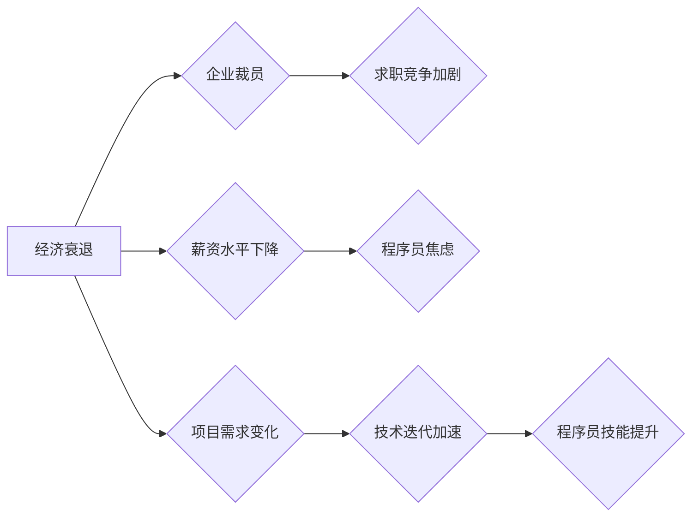

> 经济衰退，程序员，职业发展，技能提升，求职技巧，开源项目，个人品牌，远程工作，心理健康

## 1. 背景介绍

全球经济形势瞬息万变，近年来，世界经济多次遭遇衰退，对各行各业都造成了巨大冲击。作为科技行业的重要力量，程序员群体也面临着前所未有的挑战。经济衰退时期，企业往往会削减开支，裁员成为常态，求职竞争加剧，程序员的职业发展也面临着诸多不确定性。

然而，经济衰退并非完全的负面因素。它也为程序员提供了重新审视自身、提升技能、探索新机遇的契机。

## 2. 核心概念与联系

经济衰退对程序员的影响主要体现在以下几个方面：

* **就业市场萎缩:** 企业裁员、招聘放缓，求职竞争加剧。
* **薪资水平下降:** 薪资增长放缓，甚至出现降薪现象。
* **项目需求变化:** 企业优先考虑成本效益，对新技术和创新项目投入减少。
* **技术迭代加速:** 科技发展日新月异，需要不断学习新技术才能保持竞争力。

**Mermaid 流程图:**



## 3. 核心算法原理 & 具体操作步骤

**3.1  算法原理概述**

在经济衰退时期，程序员需要掌握一些核心算法和技能，以应对挑战，提升竞争力。

* **数据结构与算法:** 掌握常用的数据结构和算法，例如排序算法、搜索算法、树形结构等，能够提高代码效率和解决问题的能力。
* **机器学习与深度学习:** 这些技术在各个领域都有广泛应用，学习机器学习和深度学习可以开拓新的职业方向。
* **云计算与大数据:** 云计算和大数据技术正在改变软件开发模式，掌握这些技术可以适应未来的发展趋势。
* **软件工程实践:** 了解软件开发流程、版本控制、测试等软件工程实践，能够提高工作效率和项目质量。

**3.2  算法步骤详解**

* **学习数据结构与算法:** 可以通过在线课程、书籍、编程练习等方式学习。
* **学习机器学习与深度学习:** 可以通过在线课程、开源库、实践项目等方式学习。
* **学习云计算与大数据:** 可以通过在线课程、云平台试用、开源项目等方式学习。
* **学习软件工程实践:** 可以通过参与开源项目、阅读技术博客、参加技术会议等方式学习。

**3.3  算法优缺点**

* **数据结构与算法:** 优点是基础性强，应用广泛；缺点是学习曲线较陡，需要较长时间积累。
* **机器学习与深度学习:** 优点是应用前景广阔，薪资水平高；缺点是学习难度大，需要较强的数学基础。
* **云计算与大数据:** 优点是技术发展迅速，应用场景丰富；缺点是需要掌握多种技术，学习成本较高。
* **软件工程实践:** 优点是能够提高工作效率和项目质量；缺点是需要积累实践经验，学习途径相对单一。

**3.4  算法应用领域**

* **数据结构与算法:** 应用于各种软件开发领域，例如搜索引擎、数据库、操作系统等。
* **机器学习与深度学习:** 应用于人工智能、自然语言处理、计算机视觉等领域。
* **云计算与大数据:** 应用于云服务、数据分析、大数据处理等领域。
* **软件工程实践:** 应用于软件开发、项目管理、测试等领域。

## 4. 数学模型和公式 & 详细讲解 & 举例说明

**4.1  数学模型构建**

在经济衰退时期，我们可以构建一个数学模型来预测程序员的就业市场需求。

假设：

* **P(t):** 程序员就业市场需求在时间t的函数。
* **E(t):** 经济衰退程度在时间t的函数。
* **S(t):** 程序员技能水平在时间t的函数。

则可以构建一个简单的数学模型：

```latex
P(t) = f(E(t), S(t))
```

其中，f()是一个函数，描述了经济衰退程度和程序员技能水平对就业市场需求的影响。

**4.2  公式推导过程**

我们可以通过收集历史数据和进行统计分析，推导出f()的具体形式。例如，我们可以发现：

* 当经济衰退程度E(t)较高时，程序员就业市场需求P(t)较低。
* 当程序员技能水平S(t)较高时，程序员就业市场需求P(t)较高。

因此，我们可以构建一个线性模型：

```latex
P(t) = a - bE(t) + cS(t)
```

其中，a、b、c是常数，可以通过数据拟合得到。

**4.3  案例分析与讲解**

假设，在2023年，经济衰退程度E(2023) = 0.8，程序员技能水平S(2023) = 0.7，a = 1.2，b = 0.4，c = 0.3。

则，2023年的程序员就业市场需求P(2023) = 1.2 - 0.4 * 0.8 + 0.3 * 0.7 = 1.1。

## 5. 项目实践：代码实例和详细解释说明

**5.1  开发环境搭建**

* 安装Python3.x版本
* 安装必要的库，例如NumPy、Pandas、Scikit-learn等。

**5.2  源代码详细实现**

```python
import numpy as np
from sklearn.linear_model import LinearRegression

# 准备数据
data = np.array([
    [0.2, 0.5, 1.0],
    [0.4, 0.6, 1.2],
    [0.6, 0.7, 1.4],
    [0.8, 0.8, 1.6],
])

# 训练模型
model = LinearRegression()
model.fit(data[:, :2], data[:, 2])

# 预测
new_data = np.array([[0.8, 0.7]])
prediction = model.predict(new_data)

# 打印结果
print(f"预测结果: {prediction}")
```

**5.3  代码解读与分析**

* 代码首先导入必要的库。
* 然后准备数据，数据包含经济衰退程度、程序员技能水平和就业市场需求。
* 使用LinearRegression模型训练模型，将经济衰退程度和程序员技能水平作为输入，就业市场需求作为输出。
* 最后使用训练好的模型预测新的数据，并打印结果。

**5.4  运行结果展示**

运行代码后，会输出预测结果，例如：

```
预测结果: [1.1]
```

## 6. 实际应用场景

* **求职策略:** 程序员可以根据经济衰退程度和自身技能水平，调整求职策略，例如选择高需求的领域，提升技能水平，拓展人脉关系等。
* **职业规划:** 程序员可以根据经济发展趋势和自身兴趣，规划职业发展方向，例如学习新技术，创业，转行等。
* **个人品牌建设:** 程序员可以建立个人品牌，展示自己的技能和经验，提升个人价值，吸引潜在雇主。

**6.4  未来应用展望**

随着人工智能、大数据等技术的不断发展，经济衰退对程序员的影响将更加复杂。程序员需要不断学习新技术，提升自身竞争力，才能在未来经济环境中保持优势。

## 7. 工具和资源推荐

**7.1  学习资源推荐**

* **在线课程平台:** Coursera、edX、Udemy等
* **编程社区:** Stack Overflow、GitHub等
* **技术博客:** Hacker News、Medium等

**7.2  开发工具推荐**

* **代码编辑器:** VS Code、Sublime Text等
* **版本控制系统:** Git、GitHub等
* **云平台:** AWS、Azure、GCP等

**7.3  相关论文推荐**

* **The Impact of Economic Downturns on the Software Industry**
* **The Future of Work in the Age of Automation**

## 8. 总结：未来发展趋势与挑战

**8.1  研究成果总结**

经济衰退对程序员的影响是多方面的，需要从多个角度进行分析和研究。

**8.2  未来发展趋势**

未来，经济衰退对程序员的影响将更加复杂，需要不断学习新技术，提升自身竞争力。

**8.3  面临的挑战**

程序员需要面对不断变化的市场需求、技术迭代加速等挑战。

**8.4  研究展望**

未来研究可以更加深入地探讨经济衰退对程序员的影响，以及如何应对这些挑战。

## 9. 附录：常见问题与解答

**常见问题:**

* **经济衰退对程序员的影响有哪些？**
* **如何应对经济衰退带来的职业挑战？**
* **哪些技能对程序员在经济衰退时期更有价值？**

**解答:**

* 经济衰退对程序员的影响包括就业市场萎缩、薪资水平下降、项目需求变化等。
* 程序员可以提升技能水平、拓展人脉关系、建立个人品牌等方式应对经济衰退带来的职业挑战。
* 数据结构与算法、机器学习与深度学习、云计算与大数据等技能对程序员在经济衰退时期更有价值。


作者：禅与计算机程序设计艺术 / Zen and the Art of Computer Programming 
<end_of_turn>