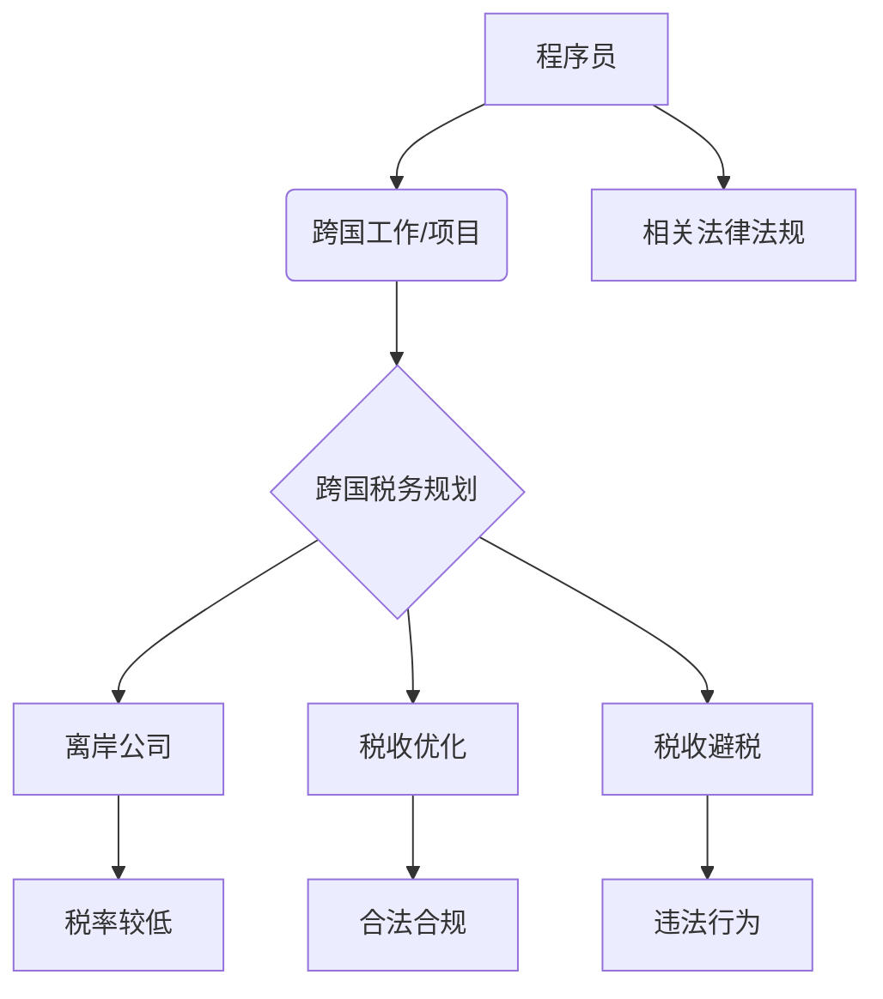

> 程序员，跨国税务，税务规划，离岸公司，税收优化，全球化，数字经济

## 1. 背景介绍

在全球化加速、数字经济蓬勃发展的时代，程序员作为科技创新的核心力量，越来越多的跨国工作和项目，也面临着越来越复杂的跨国税务问题。传统的税务规划模式难以适应程序员的特殊工作模式和收入结构，因此，程序员需要了解并掌握跨国税务规划的知识和技巧，才能有效地规避税收风险，合理地规划个人财富。

## 2. 核心概念与联系

**2.1 跨国税务规划**

跨国税务规划是指程序员在跨国工作或项目中，通过合法合规的方式，合理地安排收入和支出，以降低税收负担，并优化个人财富结构。

**2.2 离岸公司**

离岸公司是指在海外设立的企业，通常位于税收优惠的国家或地区，可以帮助程序员将部分收入转移到税率较低的地区，从而降低税收负担。

**2.3 税收优化**

税收优化是指通过合法合规的方式，利用税收政策的漏洞和优惠，合理地安排收入和支出，以降低税收负担。

**2.4 税收避税**

税收避税是指通过非法或不道德的方式，逃避缴纳应缴税款的行为，属于违法行为。

**2.5 相关法律法规**

程序员的跨国税务规划需要遵守相关国家和地区的税收法律法规，例如美国税法、中国税法等。

**2.6 核心概念关系图**



## 3. 核心算法原理 & 具体操作步骤

**3.1 算法原理概述**

跨国税务规划的算法原理是基于对税收法律法规的理解和分析，以及对个人财务状况的评估，通过合理地安排收入和支出，以降低税收负担。

**3.2 算法步骤详解**

1. **收集个人财务信息:** 包括收入来源、支出结构、资产负债情况等。
2. **分析税收法律法规:** 了解目标国家或地区的税收政策，包括个人所得税、企业所得税、资本利得税等。
3. **评估税收风险:** 分析个人财务状况可能面临的税收风险，例如双重征税、税务审计等。
4. **制定税务规划方案:** 根据个人财务状况和税收风险，制定合理的税务规划方案，例如设立离岸公司、利用税收优惠政策等。
5. **实施税务规划方案:** 按照规划方案，合理地安排收入和支出，并进行相关文件申报。
6. **定期评估和调整:** 定期评估税务规划方案的实施效果，并根据实际情况进行调整。

**3.3 算法优缺点**

**优点:**

* 可以有效降低税收负担。
* 可以优化个人财富结构。
* 可以规避税收风险。

**缺点:**

* 需要专业知识和经验。
* 需要花费时间和精力。
* 可能存在法律风险。

**3.4 算法应用领域**

* 程序员
* 自由职业者
* 跨国企业员工
* 海外投资人

## 4. 数学模型和公式 & 详细讲解 & 举例说明

**4.1 数学模型构建**

假设程序员的年收入为 X，目标国家或地区的个人所得税税率为 T，则程序员在目标国家或地区的税收负担为：

```latex
税收负担 = X * T
```

**4.2 公式推导过程**

该公式的推导过程非常简单，即将年收入 X 与目标国家或地区的个人所得税税率 T 相乘，即可得到程序员在目标国家或地区的税收负担。

**4.3 案例分析与讲解**

假设程序员的年收入为 100,000 美元，目标国家或地区的个人所得税税率为 20%，则程序员在目标国家或地区的税收负担为：

```latex
税收负担 = 100,000 * 0.2 = 20,000 美元
```

## 5. 项目实践：代码实例和详细解释说明

**5.1 开发环境搭建**

程序员需要选择合适的开发环境，例如 Windows、macOS 或 Linux，并安装必要的软件工具，例如代码编辑器、版本控制系统等。

**5.2 源代码详细实现**

程序员可以根据实际需求，编写相应的代码实现跨国税务规划的功能，例如计算税收负担、分析税收风险、制定税务规划方案等。

**5.3 代码解读与分析**

程序员需要对编写代码进行详细解读和分析，确保代码的正确性、安全性以及可维护性。

**5.4 运行结果展示**

程序员需要运行代码并展示运行结果，例如税收负担计算结果、税收风险分析报告、税务规划方案建议等。

## 6. 实际应用场景

**6.1 程序员跨国工作**

程序员在跨国工作时，需要了解目标国家或地区的税收法律法规，并制定相应的税务规划方案，以避免双重征税和其他税收风险。

**6.2 自由职业者海外收入**

自由职业者在海外获得收入时，需要了解相关税收政策，并合理地安排收入和支出，以降低税收负担。

**6.3 跨国企业员工海外差旅**

跨国企业员工在海外差旅时，需要了解相关税收政策，并合理地安排差旅费用，以避免税收风险。

**6.4 未来应用展望**

随着全球化和数字经济的加速发展，跨国税务规划将成为越来越重要的议题，程序员需要不断学习和掌握最新的税收知识和技能，以应对不断变化的税收环境。

## 7. 工具和资源推荐

**7.1 学习资源推荐**

* **书籍:** 《程序员的税务指南》、《跨国税务规划指南》
* **网站:** 美国税务局官网、中国税务总局官网
* **课程:** 在线课程平台上的跨国税务规划课程

**7.2 开发工具推荐**

* **代码编辑器:** Visual Studio Code、Sublime Text
* **版本控制系统:** Git、GitHub
* **税务计算软件:** TaxAct、TurboTax

**7.3 相关论文推荐**

* **跨国税务规划的最新趋势**
* **程序员跨国税务规划的法律风险**
* **离岸公司在跨国税务规划中的应用**

## 8. 总结：未来发展趋势与挑战

**8.1 研究成果总结**

本文介绍了程序员跨国税务规划的必要性、核心概念、算法原理、实际应用场景以及相关工具和资源。

**8.2 未来发展趋势**

随着全球化和数字经济的加速发展，跨国税务规划将成为越来越重要的议题，程序员需要不断学习和掌握最新的税收知识和技能，以应对不断变化的税收环境。

**8.3 面临的挑战**

* 税收法律法规的复杂性和变化性
* 跨国税务规划的专业性
* 数据安全和隐私保护

**8.4 研究展望**

未来研究可以关注以下方面：

* 开发更智能、更便捷的跨国税务规划工具
* 研究跨国税务规划的最新趋势和挑战
* 探讨跨国税务规划与人工智能的结合

## 9. 附录：常见问题与解答

**9.1 程序员需要注册离岸公司吗？**

程序员是否需要注册离岸公司取决于个人财务状况和税收需求，建议咨询专业的税务顾问。

**9.2 跨国税务规划合法吗？**

跨国税务规划是合法的，但需要遵守相关国家和地区的税收法律法规。

**9.3 跨国税务规划有什么风险？**

跨国税务规划存在一定的风险，例如税务审计、双重征税等，建议咨询专业的税务顾问。


作者：禅与计算机程序设计艺术 / Zen and the Art of Computer Programming 
<end_of_turn>