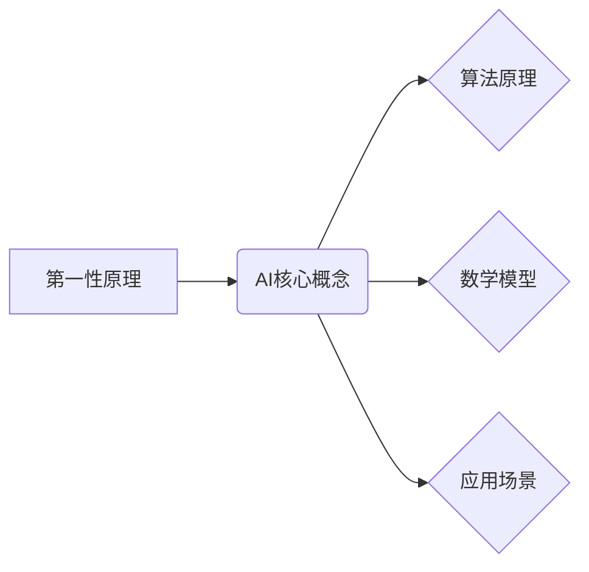

> 第一性原理，AI，机器学习，深度学习，算法原理，数学模型，项目实践，应用场景

## 1. 背景介绍

人工智能（AI）作为科技发展的重要方向，近年来取得了显著进展，并在各个领域展现出巨大的应用潜力。从语音识别、图像识别到自然语言处理，AI技术已经渗透到我们的日常生活。然而，在AI领域的发展过程中，我们也面临着一些挑战，例如模型的解释性、泛化能力和数据依赖性等。

为了更好地解决这些问题，我们需要深入理解AI技术的本质，并从更基础的原理出发进行研究和开发。第一性原理，即从最基本的、不可推导的假设出发，逐步推导出更复杂的结论，在AI领域具有重要的指导意义。

## 2. 核心概念与联系

**2.1 第一性原理**

第一性原理是一种思维方式，它强调从最基本的、不可推导的假设出发，逐步推导出更复杂的结论。这种思维方式可以帮助我们更好地理解事物本质，并找到解决问题的根本原因。

**2.2 AI 与第一性原理**

在AI领域，第一性原理可以帮助我们更好地理解算法原理、数学模型和应用场景。例如，在机器学习领域，我们可以从数据表示、损失函数和优化算法等基本概念出发，逐步推导出各种机器学习算法的原理和特性。

**2.3 联系图**



## 3. 核心算法原理 & 具体操作步骤

**3.1 算法原理概述**

这里我们将以深度学习算法为例，介绍其原理和操作步骤。深度学习算法是一种基于多层神经网络的机器学习算法，能够学习复杂的数据表示和模式。

**3.2 算法步骤详解**

1. **数据预处理:** 将原始数据转换为深度学习算法可以处理的格式，例如归一化、编码等。
2. **网络结构设计:** 根据任务需求设计神经网络的结构，包括层数、节点数、激活函数等。
3. **参数初始化:** 为神经网络的参数进行随机初始化。
4. **前向传播:** 将输入数据通过神经网络进行传递，计算输出结果。
5. **反向传播:** 计算输出结果与真实值的误差，并根据误差反向传播，更新神经网络的参数。
6. **训练迭代:** 重复前向传播和反向传播的过程，直到模型达到预定的精度。
7. **模型评估:** 使用测试数据评估模型的性能。

**3.3 算法优缺点**

**优点:**

* 能够学习复杂的数据表示和模式。
* 泛化能力强，能够应用于多种任务。

**缺点:**

* 训练时间长，需要大量的计算资源。
* 模型解释性差，难以理解模型的决策过程。

**3.4 算法应用领域**

深度学习算法在图像识别、语音识别、自然语言处理、机器翻译等领域取得了显著成果，并广泛应用于各个行业。

## 4. 数学模型和公式 & 详细讲解 & 举例说明

**4.1 数学模型构建**

深度学习算法的核心是神经网络模型，其数学模型可以表示为多层感知机（MLP）。MLP由多个神经元组成的层级结构组成，每个神经元接收来自上一层的输入信号，并通过激活函数进行处理，输出到下一层。

**4.2 公式推导过程**

* **激活函数:** 激活函数用于引入非线性，使神经网络能够学习复杂的数据表示。常见的激活函数包括 sigmoid 函数、ReLU 函数等。
* **损失函数:** 损失函数用于衡量模型预测结果与真实值的差异。常见的损失函数包括均方误差（MSE）、交叉熵损失等。
* **梯度下降:** 梯度下降算法用于更新神经网络的参数，使其能够最小化损失函数。

**4.3 案例分析与讲解**

以图像分类为例，假设我们有一个包含猫和狗的图像数据集。我们可以使用深度学习算法训练一个图像分类模型，使其能够识别出图像中是猫还是狗。

* **数据预处理:** 将图像数据转换为合适的格式，例如将图像尺寸调整为固定大小，并进行归一化处理。
* **网络结构设计:** 设计一个包含多个卷积层、池化层和全连接层的深度神经网络。
* **参数初始化:** 为神经网络的参数进行随机初始化。
* **训练迭代:** 使用训练数据训练模型，并根据损失函数的值更新模型参数。
* **模型评估:** 使用测试数据评估模型的分类准确率。

## 5. 项目实践：代码实例和详细解释说明

**5.1 开发环境搭建**

使用 Python 语言和 TensorFlow 或 PyTorch 等深度学习框架进行开发。

**5.2 源代码详细实现**

```python
import tensorflow as tf

# 定义模型结构
model = tf.keras.models.Sequential([
    tf.keras.layers.Conv2D(32, (3, 3), activation='relu', input_shape=(28, 28, 1)),
    tf.keras.layers.MaxPooling2D((2, 2)),
    tf.keras.layers.Conv2D(64, (3, 3), activation='relu'),
    tf.keras.layers.MaxPooling2D((2, 2)),
    tf.keras.layers.Flatten(),
    tf.keras.layers.Dense(10, activation='softmax')
])

# 编译模型
model.compile(optimizer='adam',
              loss='sparse_categorical_crossentropy',
              metrics=['accuracy'])

# 训练模型
model.fit(x_train, y_train, epochs=10)

# 评估模型
loss, accuracy = model.evaluate(x_test, y_test)
print('Test loss:', loss)
print('Test accuracy:', accuracy)
```

**5.3 代码解读与分析**

这段代码定义了一个简单的卷积神经网络模型，用于手写数字识别任务。

* **Conv2D:** 卷积层，用于提取图像特征。
* **MaxPooling2D:** 池化层，用于降低特征图尺寸，提高模型鲁棒性。
* **Flatten:** 将多维特征图转换为一维向量。
* **Dense:** 全连接层，用于分类。

**5.4 运行结果展示**

训练完成后，模型能够识别出手写数字的类别，并输出测试集上的准确率。

## 6. 实际应用场景

**6.1 图像识别**

深度学习算法在图像识别领域取得了突破性进展，能够识别各种物体、场景和人物。例如，在自动驾驶汽车中，深度学习算法用于识别道路、行人、车辆等物体，帮助车辆安全行驶。

**6.2 语音识别**

深度学习算法能够识别语音信号，并将其转换为文本。例如，在智能语音助手中，深度学习算法用于识别用户的语音指令，并执行相应的操作。

**6.3 自然语言处理**

深度学习算法能够理解和生成自然语言。例如，在机器翻译中，深度学习算法用于将一种语言翻译成另一种语言。

**6.4 其他应用场景**

深度学习算法还应用于医疗诊断、金融风险评估、推荐系统等领域。

**6.5 未来应用展望**

随着深度学习算法的不断发展，其应用场景将更加广泛，例如：

* **个性化教育:** 根据学生的学习情况，提供个性化的学习内容和教学方法。
* **智能医疗:** 利用深度学习算法辅助医生诊断疾病，并预测患者的健康状况。
* **智慧城市:** 利用深度学习算法优化城市交通、能源管理、环境监测等方面。

## 7. 工具和资源推荐

**7.1 学习资源推荐**

* **书籍:**
    * 深度学习
    * 构建深度学习模型
* **在线课程:**
    * Coursera 深度学习课程
    * Udacity 深度学习工程师 Nanodegree

**7.2 开发工具推荐**

* **TensorFlow:** 开源深度学习框架
* **PyTorch:** 开源深度学习框架
* **Keras:** 高级深度学习API

**7.3 相关论文推荐**

* **AlexNet:** ImageNet Classification with Deep Convolutional Neural Networks
* **VGGNet:** Very Deep Convolutional Networks for Large-Scale Image Recognition
* **ResNet:** Deep Residual Learning for Image Recognition

## 8. 总结：未来发展趋势与挑战

**8.1 研究成果总结**

第一性原理在AI领域具有重要的指导意义，可以帮助我们更好地理解算法原理、数学模型和应用场景。深度学习算法作为AI领域的重要分支，在图像识别、语音识别、自然语言处理等领域取得了显著成果。

**8.2 未来发展趋势**

* **模型解释性:** 研究更可解释的深度学习模型，以便更好地理解模型的决策过程。
* **数据效率:** 研究更有效的训练方法，减少对大量数据的依赖。
* **安全性和鲁棒性:** 研究更安全、更鲁棒的深度学习模型，防止模型受到攻击或误用。

**8.3 面临的挑战**

* **计算资源:** 深度学习算法训练需要大量的计算资源，这对于资源有限的机构或个人来说是一个挑战。
* **数据标注:** 深度学习算法需要大量的标注数据，数据标注工作耗时费力，成本较高。
* **伦理问题:** 深度学习算法的应用可能带来一些伦理问题，例如算法偏见、隐私泄露等，需要引起重视和解决。

**8.4 研究展望**

未来，我们将继续深入研究第一性原理在AI领域的应用，探索更有效的算法、更安全的模型和更广泛的应用场景。


## 9. 附录：常见问题与解答

**9.1 什么是深度学习？**

深度学习是一种基于多层神经网络的机器学习算法，能够学习复杂的数据表示和模式。

**9.2 深度学习算法有哪些？**

常见的深度学习算法包括卷积神经网络（CNN）、循环神经网络（RNN）、生成对抗网络（GAN）等。

**9.3 如何训练深度学习模型？**

训练深度学习模型需要使用训练数据，并使用梯度下降算法更新模型参数，使其能够最小化损失函数。

**9.4 深度学习算法有哪些应用场景？**

深度学习算法应用于图像识别、语音识别、自然语言处理、机器翻译等领域。


作者：禅与计算机程序设计艺术 / Zen and the Art of Computer Programming 
<end_of_turn>