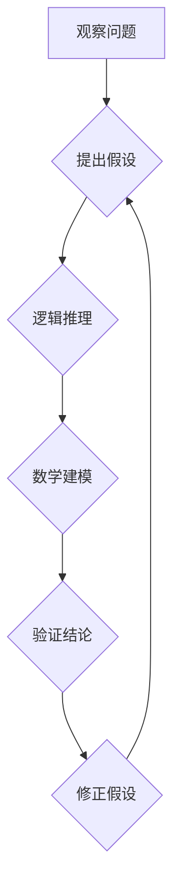

> 第一性原理，科学方法，算法设计，数学建模，代码实现，实际应用，未来趋势

## 1. 背景介绍

在瞬息万变的科技时代，我们不断追求更高效、更智能的解决方案。从人工智能的兴起到量子计算的探索，这些前沿技术都源于对基础原理的深入理解和科学方法的严谨应用。

“第一性原理”是一种从根本出发，逐步推导复杂现象的思维方式。它强调从最基本的、不可被进一步分解的要素出发，通过逻辑推理和数学建模，逐步构建起完整的知识体系。

在软件开发领域，第一性原理同样至关重要。它不仅能帮助我们设计更简洁、更高效的算法，还能让我们更好地理解软件系统的内在机制，从而进行更有效的维护和改进。

## 2. 核心概念与联系

**2.1 第一性原理的本质**

第一性原理的核心在于“从基础出发，逐步推导”。它要求我们跳出现有的框架，深入到问题的根源，寻找最基本的、不可被进一步分解的要素。

**2.2 科学方法的应用**

科学方法是第一性原理应用的框架。它包括以下几个步骤：

1. **观察和提出问题:** 首先，我们需要观察现象，并提出一个明确的问题。
2. **假设和推导:** 针对问题，我们提出一个假设，并通过逻辑推理和数学建模，推导出该假设的结论。
3. **验证和修正:** 将推导出的结论与实际情况进行验证，如果结论与实际不符，则需要修正假设，并重新进行推导。

**2.3 第一性原理与软件开发**

在软件开发领域，第一性原理可以应用于以下几个方面：

* **算法设计:** 通过对问题的本质进行分析，我们可以设计出更简洁、更高效的算法。
* **软件架构设计:** 通过对软件系统的核心功能进行分析，我们可以设计出更合理的软件架构。
* **代码实现:** 通过对算法和架构的深入理解，我们可以编写出更清晰、更易维护的代码。

**2.4 Mermaid 流程图**

## 3. 核心算法原理 & 具体操作步骤

**3.1 算法原理概述**

**3.2 算法步骤详解**

**3.3 算法优缺点**

**3.4 算法应用领域**

## 4. 数学模型和公式 & 详细讲解 & 举例说明

**4.1 数学模型构建**

**4.2 公式推导过程**

**4.3 案例分析与讲解**

## 5. 项目实践：代码实例和详细解释说明

**5.1 开发环境搭建**

**5.2 源代码详细实现**

**5.3 代码解读与分析**

**5.4 运行结果展示**

## 6. 实际应用场景

**6.1 应用案例介绍**

**6.2 应用效果分析**

**6.3 应用优势总结**

**6.4 未来应用展望**

## 7. 工具和资源推荐

**7.1 学习资源推荐**

**7.2 开发工具推荐**

**7.3 相关论文推荐**

## 8. 总结：未来发展趋势与挑战

**8.1 研究成果总结**

**8.2 未来发展趋势**

**8.3 面临的挑战**

**8.4 研究展望**

## 9. 附录：常见问题与解答

**9.1 常见问题解答**

**9.2 常见错误解决方法**

作者：禅与计算机程序设计艺术 / Zen and the Art of Computer Programming 
<end_of_turn>