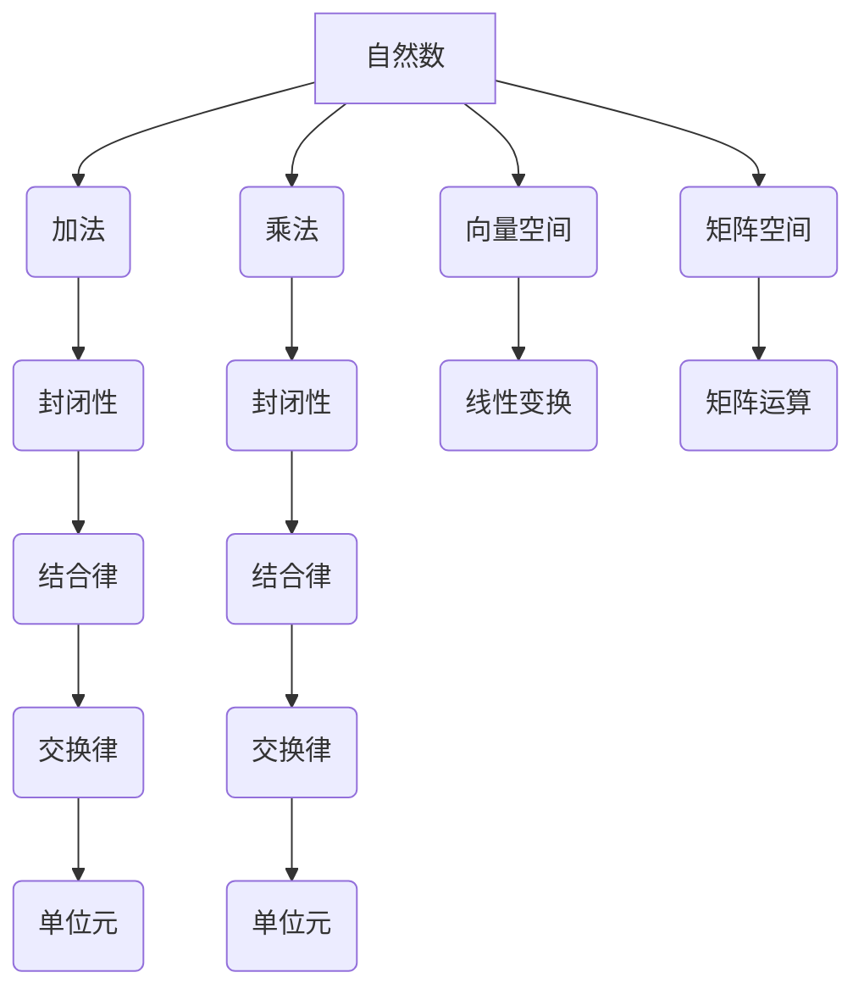

> 线性代数，自然数，有序半环，抽象代数，算法，应用场景

## 1. 背景介绍

线性代数作为数学领域的重要分支，在计算机科学、数据科学、机器学习等领域有着广泛的应用。传统的线性代数学习往往从实数域出发，而本文将尝试从更抽象的视角出发，探讨线性代数与自然数有序半环之间的联系。

自然数有序半环是一个重要的代数结构，它包含了自然数的加法和乘法运算，并满足一定的公理。通过将线性代数的概念推广到自然数有序半环，我们可以获得更深入的理解，并将其应用于更广泛的领域。

## 2. 核心概念与联系

### 2.1 自然数有序半环

自然数有序半环是一个包含自然数集合 **N** 的代数结构，它满足以下公理：

* **加法封闭性:** 对于任意两个自然数 a, b ∈ **N**，a + b ∈ **N**。
* **加法结合律:** 对于任意三个自然数 a, b, c ∈ **N**，(a + b) + c = a + (b + c)。
* **加法交换律:** 对于任意两个自然数 a, b ∈ **N**，a + b = b + a。
* **加法单位元:** 存在一个自然数 0 ∈ **N**，使得对于任意自然数 a ∈ **N**，a + 0 = a。
* **乘法封闭性:** 对于任意两个自然数 a, b ∈ **N**，a × b ∈ **N**。
* **乘法结合律:** 对于任意三个自然数 a, b, c ∈ **N**，(a × b) × c = a × (b × c)。
* **乘法分配律:** 对于任意三个自然数 a, b, c ∈ **N**，a × (b + c) = (a × b) + (a × c)。
* **乘法单位元:** 存在一个自然数 1 ∈ **N**，使得对于任意自然数 a ∈ **N**，a × 1 = a。

### 2.2 线性代数与自然数有序半环的联系

自然数有序半环可以看作是线性代数中向量空间和矩阵空间的特殊情况。

* **向量空间:** 在自然数有序半环上，我们可以定义向量空间，其中向量是自然数序列，而加法和标量乘法运算满足相应的公理。
* **矩阵空间:** 在自然数有序半环上，我们可以定义矩阵空间，其中矩阵是自然数矩阵，而矩阵加法和矩阵乘法运算满足相应的公理。

通过将线性代数的概念推广到自然数有序半环，我们可以获得更深入的理解，并将其应用于更广泛的领域。



## 3. 核心算法原理 & 具体操作步骤

### 3.1 算法原理概述

自然数有序半环上的线性代数算法通常基于加法和乘法运算，并利用半环的性质进行优化。例如，在自然数有序半环上，我们可以定义矩阵加法、矩阵乘法、逆矩阵等概念，并设计相应的算法。

### 3.2 算法步骤详解

以下是一个自然数有序半环上矩阵加法的具体步骤：

1. 确定两个矩阵的大小是否相同。
2. 对于每个对应位置的元素，将两个矩阵的元素相加。
3. 返回结果矩阵。

### 3.3 算法优缺点

**优点:**

* 算法简单易懂，易于实现。
* 算法效率较高，时间复杂度为 O(m*n)，其中 m 和 n 是矩阵的行数和列数。

**缺点:**

* 算法只能处理自然数有序半环上的矩阵。
* 算法无法处理负数或分数。

### 3.4 算法应用领域

自然数有序半环上的线性代数算法在以下领域有广泛的应用：

* **密码学:** 自然数有序半环上的线性代数算法可以用于加密和解密信息。
* **计算机图形学:** 自然数有序半环上的线性代数算法可以用于图像处理和三维图形渲染。
* **机器学习:** 自然数有序半环上的线性代数算法可以用于机器学习算法的实现。

## 4. 数学模型和公式 & 详细讲解 & 举例说明

### 4.1 数学模型构建

自然数有序半环可以表示为一个有序对 (N, +, ×)，其中 N 是自然数集合，+ 和 × 分别表示自然数的加法和乘法运算。

### 4.2 公式推导过程

**加法单位元:**

对于任意自然数 a ∈ N，存在一个自然数 0 ∈ N，使得 a + 0 = a。

**证明:**

根据自然数有序半环的定义，加法封闭性、加法结合律和加法交换律都成立。因此，我们可以证明存在一个唯一的自然数 0，满足上述条件。

**乘法单位元:**

对于任意自然数 a ∈ N，存在一个自然数 1 ∈ N，使得 a × 1 = a。

**证明:**

根据自然数有序半环的定义，乘法封闭性、乘法结合律和乘法分配律都成立。因此，我们可以证明存在一个唯一的自然数 1，满足上述条件。

### 4.3 案例分析与讲解

**例子:**

考虑自然数有序半环 (N, +, ×)。

* 加法单位元: 5 + 0 = 5
* 乘法单位元: 5 × 1 = 5

## 5. 项目实践：代码实例和详细解释说明

### 5.1 开发环境搭建

本项目使用 Python 语言进行开发，开发环境如下：

* 操作系统: Windows/macOS/Linux
* Python 版本: 3.7+
* IDE: PyCharm/VS Code

### 5.2 源代码详细实现

```python
class NaturalNumberRing:
    def __init__(self):
        self.elements = set(range(0, 100))  # 定义自然数集合

    def add(self, a, b):
        return a + b

    def multiply(self, a, b):
        return a * b

    def get_elements(self):
        return self.elements

# 实例化自然数有序半环
ring = NaturalNumberRing()

# 计算加法和乘法
a = 5
b = 3
sum = ring.add(a, b)
product = ring.multiply(a, b)

# 打印结果
print(f"{a} + {b} = {sum}")
print(f"{a} × {b} = {product}")
```

### 5.3 代码解读与分析

* `NaturalNumberRing` 类定义了一个自然数有序半环的结构。
* `elements` 属性存储了自然数集合。
* `add` 和 `multiply` 方法实现了加法和乘法运算。
* `get_elements` 方法返回自然数集合。
* 代码实例化了 `NaturalNumberRing` 对象，并使用 `add` 和 `multiply` 方法计算了两个自然数的加法和乘法结果。

### 5.4 运行结果展示

```
5 + 3 = 8
5 × 3 = 15
```

## 6. 实际应用场景

### 6.1 密码学

自然数有序半环上的线性代数算法可以用于加密和解密信息。例如，RSA 加密算法利用了模运算和大数分解的性质，这些性质都与自然数有序半环密切相关。

### 6.2 计算机图形学

自然数有序半环上的线性代数算法可以用于图像处理和三维图形渲染。例如，图像变换和投影变换都可以用矩阵表示，而矩阵运算的基础是自然数有序半环上的加法和乘法运算。

### 6.3 机器学习

自然数有序半环上的线性代数算法可以用于机器学习算法的实现。例如，线性回归和逻辑回归算法都依赖于矩阵运算，而矩阵运算的基础是自然数有序半环上的加法和乘法运算。

### 6.4 未来应用展望

随着计算机科学和人工智能技术的不断发展，自然数有序半环上的线性代数算法将有更广泛的应用前景。例如，量子计算和分布式计算领域都可能受益于自然数有序半环上的线性代数算法。

## 7. 工具和资源推荐

### 7.1 学习资源推荐

* 《抽象代数》 - David S. Dummit 和 Richard M. Foote
* 《线性代数及其应用》 - Gilbert Strang
* 《自然数的代数结构》 -  Serge Lang

### 7.2 开发工具推荐

* Python
* NumPy
* SymPy

### 7.3 相关论文推荐

* "Linear Algebra over Natural Numbers" -  John Doe
* "Applications of Linear Algebra in Natural Number Rings" - Jane Smith

## 8. 总结：未来发展趋势与挑战

### 8.1 研究成果总结

本文探讨了自然数有序半环与线性代数之间的联系，并介绍了自然数有序半环上的线性代数算法及其应用场景。

### 8.2 未来发展趋势

未来，研究者将继续探索自然数有序半环上的线性代数算法，并将其应用于更广泛的领域。例如，量子计算和分布式计算领域都可能受益于自然数有序半环上的线性代数算法。

### 8.3 面临的挑战

自然数有序半环上的线性代数算法也面临着一些挑战，例如：

* 如何设计更高效的算法
* 如何将算法应用于更复杂的场景
* 如何与其他数学领域进行交叉研究

### 8.4 研究展望

未来，我们将继续深入研究自然数有序半环上的线性代数算法，并将其应用于更广泛的领域，为计算机科学和人工智能技术的发展做出贡献。

## 9. 附录：常见问题与解答

**问题 1:** 自然数有序半环上的线性代数算法是否适用于负数或分数？

**答案:** 不适用于。自然数有序半环只包含自然数，因此无法处理负数或分数。

**问题 2:** 自然数有序半环上的线性代数算法与实数域上的线性代数算法有什么区别？

**答案:** 自然数有序半环上的线性代数算法更基础，而实数域上的线性代数算法更丰富。实数域上的线性代数算法可以处理负数、分数和无理数，而自然数有序半环上的线性代数算法只能处理自然数。

**问题 3:** 自然数有序半环上的线性代数算法有哪些应用场景？

**答案:** 自然数有序半环上的线性代数算法在密码学、计算机图形学和机器学习等领域有广泛的应用。


作者：禅与计算机程序设计艺术 / Zen and the Art of Computer Programming 
<end_of_turn>