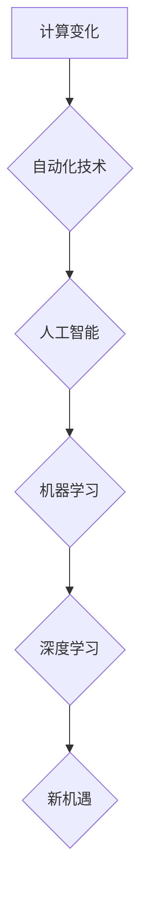

> 自动化、人工智能、机器学习、深度学习、流程优化、效率提升、数据驱动、软件开发、DevOps

## 1. 背景介绍

在当今科技飞速发展的时代，计算能力的飞跃和数据量的爆炸式增长为自动化带来了前所未有的机遇。自动化技术正在深刻地改变着各个行业，从制造业到金融业，从医疗保健到教育，无处不在。

传统的自动化主要集中在重复性任务的执行，例如生产线上的机器人操作、软件测试的自动化脚本等。然而，随着人工智能（AI）和机器学习（ML）技术的快速发展，自动化技术正在迈向更高级的阶段，能够处理更复杂的任务，甚至具备学习和适应能力。

## 2. 核心概念与联系

**2.1 自动化**

自动化是指利用技术手段，使系统或流程能够自动执行预先定义的任务，无需人工干预。自动化可以提高效率、降低成本、减少错误，并释放人力资源用于更具创造性和战略性的工作。

**2.2 人工智能（AI）**

人工智能是指模拟人类智能行为的计算机系统。AI 系统能够学习、推理、决策和解决问题，就像人类一样。AI 技术的应用范围非常广泛，包括语音识别、图像识别、自然语言处理、机器翻译等。

**2.3 机器学习（ML）**

机器学习是人工智能的一个子领域，它使计算机能够从数据中学习，并根据学习到的知识进行预测或决策。机器学习算法可以分为监督学习、无监督学习和强化学习三种类型。

**2.4 深度学习（DL）**

深度学习是机器学习的一个子领域，它使用多层神经网络来模拟人类大脑的学习过程。深度学习算法能够处理海量数据，并提取出隐藏的模式和特征，从而实现更准确的预测和决策。

**2.5 流程图**



## 3. 核心算法原理 & 具体操作步骤

### 3.1 算法原理概述

深度学习算法的核心原理是利用多层神经网络来模拟人类大脑的学习过程。神经网络由多个层组成，每层包含多个神经元。每个神经元接收来自上一层的输入信号，并对其进行处理，然后将处理后的信号传递到下一层。通过训练神经网络，可以调整每个神经元的权重，使网络能够学习到数据的特征和模式。

### 3.2 算法步骤详解

1. **数据预处理:** 将原始数据进行清洗、转换和格式化，使其适合深度学习算法的训练。
2. **网络结构设计:** 根据任务需求设计神经网络的结构，包括层数、神经元数量和激活函数等。
3. **参数初始化:** 为神经网络的参数（权重和偏置）进行随机初始化。
4. **前向传播:** 将输入数据通过神经网络进行前向传播，计算输出结果。
5. **损失函数计算:** 计算输出结果与真实值的差异，即损失函数的值。
6. **反向传播:** 利用梯度下降算法，反向传播损失函数的梯度，更新神经网络的参数。
7. **训练迭代:** 重复步骤4-6，直到损失函数达到预设的阈值或训练次数达到上限。
8. **模型评估:** 使用测试数据评估模型的性能，例如准确率、召回率和F1-score等。

### 3.3 算法优缺点

**优点:**

* 能够处理海量数据，并提取出隐藏的模式和特征。
* 具有强大的学习能力，能够自动学习和适应数据变化。
* 在图像识别、语音识别、自然语言处理等领域取得了突破性的进展。

**缺点:**

* 训练深度学习模型需要大量的计算资源和时间。
* 深度学习模型的解释性较差，难以理解模型的决策过程。
* 深度学习模型对数据质量要求较高，如果训练数据存在偏差，模型的性能也会受到影响。

### 3.4 算法应用领域

深度学习算法已广泛应用于各个领域，例如：

* **计算机视觉:** 图像识别、物体检测、图像分割、人脸识别等。
* **自然语言处理:** 文本分类、情感分析、机器翻译、对话系统等。
* **语音识别:** 语音转文本、语音助手等。
* **医疗保健:** 疾病诊断、药物研发、医疗影像分析等。
* **金融:** 风险评估、欺诈检测、投资预测等。

## 4. 数学模型和公式 & 详细讲解 & 举例说明

### 4.1 数学模型构建

深度学习模型的核心是神经网络，其数学模型可以表示为一系列的矩阵运算。

**4.1.1 激活函数**

激活函数是神经网络中一个重要的组成部分，它决定了神经元的输出值。常见的激活函数包括 sigmoid 函数、ReLU 函数、tanh 函数等。

**4.1.2 损失函数**

损失函数用于衡量模型的预测结果与真实值的差异。常见的损失函数包括均方误差（MSE）、交叉熵损失（Cross-Entropy Loss）等。

**4.1.3 梯度下降算法**

梯度下降算法是一种常用的优化算法，它用于更新神经网络的参数，使模型的损失函数最小化。

### 4.2 公式推导过程

**4.2.1 前向传播公式**

```
z = Wx + b
a = f(z)
```

其中：

* z 是神经元的输入值。
* W 是权重矩阵。
* x 是输入数据。
* b 是偏置向量。
* f 是激活函数。
* a 是神经元的输出值。

**4.2.2 反向传播公式**

```
δ = (∂L/∂a) * f'(z)
dW = δ * x^T
db = δ
```

其中：

* δ 是误差信号。
* L 是损失函数。
* f'(z) 是激活函数的导数。
* x^T 是输入数据的转置。

### 4.3 案例分析与讲解

**4.3.1 图像分类**

假设我们有一个图像分类任务，目标是将图像分类为不同的类别，例如猫、狗、鸟等。我们可以使用深度学习算法，例如卷积神经网络（CNN），来实现这个任务。

CNN 可以自动学习图像特征，例如边缘、纹理和形状等。通过训练 CNN 模型，它可以学习到不同类别的图像特征，并能够准确地将图像分类到相应的类别。

## 5. 项目实践：代码实例和详细解释说明

### 5.1 开发环境搭建

为了实现深度学习项目，我们需要搭建一个合适的开发环境。常用的开发环境包括：

* **Python:** Python 是深度学习领域最常用的编程语言，因为它拥有丰富的库和框架，例如 TensorFlow、PyTorch 和 Keras 等。
* **GPU:** 深度学习模型的训练需要大量的计算资源，GPU 可以显著加速训练速度。
* **IDE:** IDE（集成开发环境）可以提供代码编辑、调试和运行等功能，例如 PyCharm、VS Code 等。

### 5.2 源代码详细实现

以下是一个使用 TensorFlow 实现图像分类的简单代码示例：

```python
import tensorflow as tf

# 定义模型结构
model = tf.keras.models.Sequential([
    tf.keras.layers.Conv2D(32, (3, 3), activation='relu', input_shape=(28, 28, 1)),
    tf.keras.layers.MaxPooling2D((2, 2)),
    tf.keras.layers.Conv2D(64, (3, 3), activation='relu'),
    tf.keras.layers.MaxPooling2D((2, 2)),
    tf.keras.layers.Flatten(),
    tf.keras.layers.Dense(10, activation='softmax')
])

# 编译模型
model.compile(optimizer='adam',
              loss='sparse_categorical_crossentropy',
              metrics=['accuracy'])

# 训练模型
model.fit(x_train, y_train, epochs=5)

# 评估模型
loss, accuracy = model.evaluate(x_test, y_test)
print('Test loss:', loss)
print('Test accuracy:', accuracy)
```

### 5.3 代码解读与分析

这段代码定义了一个简单的卷积神经网络模型，用于图像分类任务。

* `tf.keras.models.Sequential` 创建了一个顺序模型，即层级结构。
* `tf.keras.layers.Conv2D` 定义了一个卷积层，用于提取图像特征。
* `tf.keras.layers.MaxPooling2D` 定义了一个最大池化层，用于降低特征图的大小。
* `tf.keras.layers.Flatten` 将多维特征图转换为一维向量。
* `tf.keras.layers.Dense` 定义了一个全连接层，用于分类。
* `model.compile` 编译模型，指定优化器、损失函数和评价指标。
* `model.fit` 训练模型，使用训练数据进行训练。
* `model.evaluate` 评估模型，使用测试数据评估模型的性能。

### 5.4 运行结果展示

训练完成后，我们可以使用测试数据评估模型的性能。输出结果会显示测试集上的损失值和准确率。

## 6. 实际应用场景

### 6.1 自动化测试

深度学习可以用于自动化测试，例如识别软件界面上的错误或异常情况。

### 6.2 流程优化

深度学习可以分析业务流程数据，识别瓶颈和改进机会，从而优化流程效率。

### 6.3 个性化推荐

深度学习可以分析用户行为数据，提供个性化的产品推荐和服务。

### 6.4 预测分析

深度学习可以用于预测未来趋势，例如销售预测、风险评估等。

### 6.5 未来应用展望

随着人工智能技术的不断发展，深度学习将在更多领域得到应用，例如：

* **医疗诊断:** 深度学习可以辅助医生进行疾病诊断，提高诊断准确率。
* **药物研发:** 深度学习可以加速药物研发过程，发现新的药物靶点和候选药物。
* **自动驾驶:** 深度学习是自动驾驶的关键技术，可以帮助车辆感知周围环境，做出决策。
* **机器人技术:** 深度学习可以使机器人更加智能化，能够更好地理解和响应人类指令。

## 7. 工具和资源推荐

### 7.1 学习资源推荐

* **在线课程:** Coursera、edX、Udacity 等平台提供深度学习相关的在线课程。
* **书籍:** 《深度学习》、《动手学深度学习》等书籍是深度学习学习的经典教材。
* **博客和论坛:** TensorFlow、PyTorch 等框架的官方博客和论坛提供丰富的学习资源和技术支持。

### 7.2 开发工具推荐

* **TensorFlow:** Google 开发的开源深度学习框架，支持多种硬件平台。
* **PyTorch:** Facebook 开发的开源深度学习框架，以其灵活性和易用性而闻名。
* **Keras:** 构建和训练深度学习模型的简洁高层API，可以运行在 TensorFlow、Theano 和 CNTK 等底层框架上。

### 7.3 相关论文推荐

* **《ImageNet Classification with Deep Convolutional Neural Networks》:** AlexNet 模型的论文，标志着深度学习在图像识别领域的突破。
* **《Deep Residual Learning for Image Recognition》:** ResNet 模型的论文，解决了深度网络训练中的梯度消失问题。
* **《Attention Is All You Need》:** Transformer 模型的论文，在自然语言处理领域取得了突破性进展。

## 8. 总结：未来发展趋势与挑战

### 8.1 研究成果总结

深度学习技术取得了显著的进展，在图像识别、自然语言处理、语音识别等领域取得了突破性的成果。

### 8.2 未来发展趋势

* **模型规模和复杂度:** 深度学习模型将继续朝着更大、更复杂的方向发展，例如千亿参数的模型。
* **数据效率:** 研究人员将致力于开发更有效的深度学习算法，能够利用更少的数据进行训练。
* **可解释性:** 深度学习模型的解释性仍然是一个挑战，研究人员将