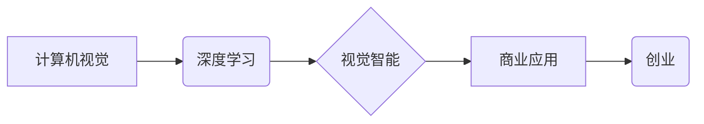

> 计算机视觉、深度学习、图像识别、物体检测、图像分类、商业应用、创业

## 1. 背景介绍

计算机视觉作为人工智能领域的重要分支，近年来取得了飞速发展。随着深度学习技术的突破，计算机视觉算法的性能大幅提升，能够实现人眼难以完成的视觉任务，如图像识别、物体检测、场景理解等。这些技术突破为商业应用带来了无限可能，催生了一批以计算机视觉为核心的创业公司。

传统商业模式正在被颠覆，视觉智能正在成为新的商业驱动力。从智能零售、智慧城市到自动驾驶、医疗诊断，计算机视觉技术正在渗透到各个行业，为企业带来新的价值和机遇。

## 2. 核心概念与联系

**2.1 计算机视觉**

计算机视觉是指赋予计算机“看”的能力，使其能够理解和解释图像和视频信息。它涵盖了图像处理、模式识别、机器学习等多个领域。

**2.2 深度学习**

深度学习是一种机器学习的子领域，它利用多层神经网络来模拟人类大脑的学习过程。深度学习算法能够从海量数据中自动学习特征，并实现复杂的视觉任务。

**2.3 视觉智能**

视觉智能是指利用计算机视觉和深度学习技术，赋予机器“智能视觉”的能力，使其能够像人类一样感知、理解和交互于视觉信息。

**2.4 商业应用**

商业应用是指将计算机视觉技术应用于商业领域，解决实际问题，创造商业价值。

**2.5 创业**

创业是指创立新的企业，开发新的产品或服务，并将其推向市场。

**2.6 关系图**



## 3. 核心算法原理 & 具体操作步骤

### 3.1  算法原理概述

计算机视觉的核心算法包括图像处理、特征提取、分类识别等。其中，深度学习算法在图像识别、物体检测等领域取得了突破性进展。

**3.1.1 图像处理**

图像处理是指对图像进行各种操作，例如增强、滤波、分割等，以提取图像中的有用信息。

**3.1.2 特征提取**

特征提取是指从图像中提取关键特征，例如边缘、纹理、颜色等，这些特征可以用于图像分类、识别等任务。

**3.1.3 分类识别**

分类识别是指将图像或物体分类到预定义的类别中，例如识别猫、狗、车等。

### 3.2  算法步骤详解

以图像分类为例，深度学习算法的具体操作步骤如下：

1. **数据预处理:** 将图像数据进行裁剪、缩放、归一化等处理，使其符合模型的输入要求。
2. **模型训练:** 使用深度学习模型，例如卷积神经网络（CNN），对预处理后的图像数据进行训练，学习图像特征和分类规则。
3. **模型评估:** 使用测试数据评估模型的性能，例如准确率、召回率等。
4. **模型部署:** 将训练好的模型部署到实际应用场景中，用于图像分类任务。

### 3.3  算法优缺点

**优点:**

* 性能优越：深度学习算法能够学习复杂的图像特征，实现高精度图像分类。
* 自动特征提取：无需人工设计特征，算法能够自动学习特征，提高效率。
* 可扩展性强：深度学习模型可以处理大规模图像数据，并可以扩展到其他视觉任务。

**缺点:**

* 数据依赖性强：深度学习算法需要大量数据进行训练，数据质量直接影响模型性能。
* 计算资源消耗大：训练深度学习模型需要大量的计算资源，成本较高。
* 可解释性差：深度学习模型的决策过程较为复杂，难以解释模型的决策结果。

### 3.4  算法应用领域

* **图像识别:** 人脸识别、物体识别、场景识别等。
* **物体检测:** 检测图像中物体的类别和位置。
* **图像分割:** 将图像分割成不同的区域，例如分割前景和背景。
* **图像生成:** 生成新的图像，例如生成人脸图像、风景图像等。
* **视频分析:** 视频监控、行为识别、事件检测等。

## 4. 数学模型和公式 & 详细讲解 & 举例说明

### 4.1  数学模型构建

深度学习模型通常采用多层神经网络结构，每个神经元接收多个输入信号，并通过激活函数进行处理，输出一个信号。

**4.1.1 卷积神经网络 (CNN)**

CNN 是一种专门用于处理图像数据的深度学习模型。它利用卷积层和池化层来提取图像特征。

**4.1.2 全连接层**

全连接层将提取到的特征进行分类或回归。

### 4.2  公式推导过程

**4.2.1 激活函数**

激活函数用于引入非线性，使神经网络能够学习复杂的映射关系。常见的激活函数包括 sigmoid 函数、ReLU 函数等。

**4.2.2 损失函数**

损失函数用于衡量模型预测结果与真实值的差异。常见的损失函数包括交叉熵损失函数、均方误差损失函数等。

**4.2.3 反向传播算法**

反向传播算法用于更新模型参数，使其能够更好地拟合训练数据。

### 4.3  案例分析与讲解

**4.3.1 图像分类**

假设我们有一个图像分类任务，目标是将图像分类到不同的类别，例如猫、狗、车等。我们可以使用 CNN 模型进行训练，训练数据包括大量带标签的图像。

**4.3.2 物体检测**

物体检测任务的目标是检测图像中物体的类别和位置。我们可以使用 YOLO 或 Faster R-CNN 等模型进行训练，训练数据包括带有物体边界框的图像。

## 5. 项目实践：代码实例和详细解释说明

### 5.1  开发环境搭建

* **操作系统:** Ubuntu 18.04 或更高版本
* **编程语言:** Python 3.6 或更高版本
* **深度学习框架:** TensorFlow 或 PyTorch
* **其他工具:** Git、Jupyter Notebook

### 5.2  源代码详细实现

```python
# 使用 TensorFlow 实现图像分类模型

import tensorflow as tf

# 定义模型结构
model = tf.keras.models.Sequential([
    tf.keras.layers.Conv2D(32, (3, 3), activation='relu', input_shape=(28, 28, 1)),
    tf.keras.layers.MaxPooling2D((2, 2)),
    tf.keras.layers.Conv2D(64, (3, 3), activation='relu'),
    tf.keras.layers.MaxPooling2D((2, 2)),
    tf.keras.layers.Flatten(),
    tf.keras.layers.Dense(10, activation='softmax')
])

# 编译模型
model.compile(optimizer='adam',
              loss='sparse_categorical_crossentropy',
              metrics=['accuracy'])

# 训练模型
model.fit(x_train, y_train, epochs=10)

# 评估模型
loss, accuracy = model.evaluate(x_test, y_test)
print('Test loss:', loss)
print('Test accuracy:', accuracy)
```

### 5.3  代码解读与分析

* **模型结构:** 代码定义了一个简单的 CNN 模型，包含卷积层、池化层和全连接层。
* **激活函数:** 使用 ReLU 函数作为激活函数，可以提高模型的训练效率。
* **损失函数:** 使用交叉熵损失函数，适合图像分类任务。
* **优化器:** 使用 Adam 优化器，可以快速收敛到最优解。
* **训练过程:** 使用训练数据训练模型，并使用测试数据评估模型性能。

### 5.4  运行结果展示

训练完成后，可以将模型应用于新的图像数据进行分类。

## 6. 实际应用场景

### 6.1 智能零售

* **商品识别:** 利用计算机视觉技术识别商品，实现自动商品分类、库存管理和价格标注。
* **顾客行为分析:** 分析顾客在店内行为，例如浏览商品、停留时间等，为商家提供个性化营销建议。
* **自助checkout:** 实现无人收银，提高购物效率。

### 6.2 智慧城市

* **交通管理:** 利用摄像头识别车辆类型、速度、违规行为等，优化交通流量和安全。
* **环境监控:** 检测空气质量、水质、噪音等环境指标，及时预警环境问题。
* **公共安全:** 利用视频监控系统识别犯罪嫌疑人、预警潜在安全风险。

### 6.3 自动驾驶

* **环境感知:** 利用摄像头、雷达、激光雷达等传感器感知周围环境，识别道路、车辆、行人等。
* **路径规划:** 根据环境感知信息，规划行驶路径，避免碰撞事故。
* **自动控制:** 控制车辆加速、减速、转向等动作，实现自动驾驶功能。

### 6.4 未来应用展望

* **增强现实 (AR) 和虚拟现实 (VR):** 将计算机视觉技术与 AR 和 VR 技术结合，创造更加沉浸式的体验。
* **医疗诊断:** 利用计算机视觉技术辅助医生诊断疾病，提高诊断准确率。
* **工业自动化:** 利用计算机视觉技术实现机器视觉，提高生产效率和产品质量。

## 7. 工具和资源推荐

### 7.1  学习资源推荐

* **书籍:**
    * 深度学习
    * 计算机视觉
* **在线课程:**
    * Coursera
    * edX
    * Udacity

### 7.2  开发工具推荐

* **深度学习框架:** TensorFlow, PyTorch
* **图像处理库:** OpenCV
* **云计算平台:** AWS, Azure, Google Cloud

### 7.3  相关论文推荐

* **AlexNet:** ImageNet Classification with Deep Convolutional Neural Networks
* **VGGNet:** Very Deep Convolutional Networks for Large-Scale Image Recognition
* **ResNet:** Deep Residual Learning for Image Recognition

## 8. 总结：未来发展趋势与挑战

### 8.1  研究成果总结

近年来，计算机视觉领域取得了显著进展，深度学习算法在图像识别、物体检测等任务上取得了突破性进展。

### 8.2  未来发展趋势

* **模型更深更广:** 研究更深层次、更广阔的网络结构，提高模型的表达能力和泛化能力。
* **数据更丰富更精准:** 探索新的数据获取方式，提高数据质量和多样性。
* **解释性更强:** 研究更易于解释的深度学习模型，提高模型的可信度和可控性。
* **边缘计算:** 将计算机视觉模型部署到边缘设备，实现实时处理和低延迟响应。

### 8.3  面临的挑战

* **数据标注成本高:** 深度学习模型需要大量标注数据，数据标注成本较高。
* **模型可解释性差:** 深度学习模型的决策过程较为复杂，难以解释模型的决策结果。
* **模型安全性问题:** 深度学习模型容易受到攻击，需要加强模型安全性研究。

### 8.4  研究展望

未来，计算机视觉领域将继续朝着更智能、更安全、更可解释的方向发展。


## 9. 附录：常见问题与解答

**9.1  如何选择合适的深度学习框架？**

 TensorFlow 和 PyTorch 是两个主流的深度学习框架， TensorFlow 更注重生产环境部署，PyTorch 更注重学术研究和快速原型开发。

**9.2  如何解决数据标注问题？**

 可以使用数据增强技术提高数据利用率，也可以探索自动化标注方法。

**9.3  如何评估计算机视觉模型的性能？**

 常用的评估指标包括准确率、召回率、F1-score 等。

**9.4  如何部署计算机视觉模型到实际应用场景？**

 可以使用云计算平台部署模型，也可以将模型部署到边缘设备。


作者：禅与计算机程序设计艺术 / Zen and the Art of Computer Programming 
<end_of_turn>