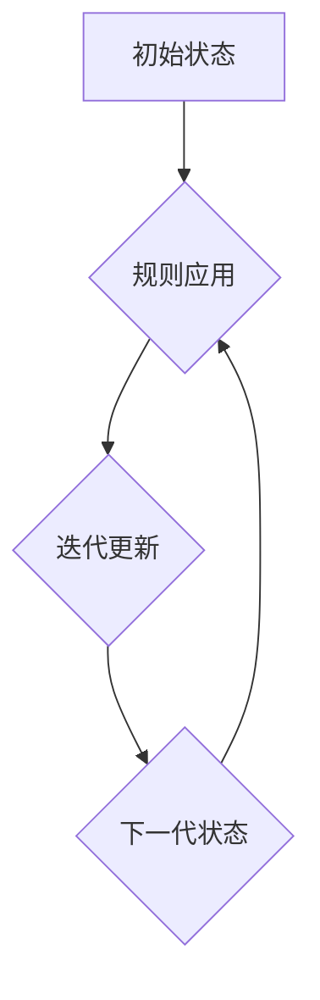

> 生命游戏，复杂性计算，康威生命游戏，细胞自动机，计算极限，混沌理论

## 1. 背景介绍

生命游戏，又称康威生命游戏，是由英国数学家约翰·何顿·康威于1970年发明的细胞自动机。它是一个简单而优雅的模型，展示了复杂系统如何从简单的规则演化出令人惊叹的复杂性。生命游戏以其简洁的规则和出乎意料的复杂性而闻名，它激发了对复杂性计算和自组织系统的深入研究。

## 2. 核心概念与联系

生命游戏是一个二维格点系统，每个格点可以是“存活”或“死亡”状态。游戏规则简单易懂：

1. **生存：** 如果一个存活细胞周围有2或3个存活细胞，它将在下一代存活。
2. **死亡：** 如果一个存活细胞周围没有2或3个存活细胞，它将在下一代死亡（过少或过多的邻居）。
3. **诞生：** 如果一个死亡细胞周围有3个存活细胞，它将在下一代诞生。

这些简单的规则，结合迭代更新，产生了令人惊叹的复杂性。生命游戏中的图案和结构可以演化出各种形态，包括稳定的状态、周期性图案和无限演化的“宇宙”。

**Mermaid 流程图**



## 3. 核心算法原理 & 具体操作步骤

### 3.1  算法原理概述

生命游戏的核心算法是基于规则的迭代更新。每个时间步，根据周围邻居的存活状态，每个细胞的状态都会发生改变。这个过程不断重复，导致细胞状态的复杂演化。

### 3.2  算法步骤详解

1. **初始化：** 创建一个二维格点，并为每个格点赋予初始状态（存活或死亡）。
2. **规则应用：** 对于每个格点，根据生命游戏规则（生存、死亡、诞生）计算其下一代状态。
3. **迭代更新：** 将所有格点的状态更新为下一代状态。
4. **重复步骤2和3：** 重复上述步骤，直到达到预设的迭代次数或观察到特定模式。

### 3.3  算法优缺点

**优点：**

* **简单易懂：** 生命游戏的规则非常简单，易于理解和实现。
* **复杂性产生：** 尽管规则简单，但生命游戏能够产生出令人惊叹的复杂性。
* **可视化：** 生命游戏的演化过程可以直观地观察，方便研究和理解。

**缺点：**

* **计算量：** 随着格点大小的增加，计算量会指数级增长。
* **预测性：** 由于生命游戏的复杂性，预测其演化结果变得非常困难。

### 3.4  算法应用领域

生命游戏在以下领域具有广泛的应用：

* **复杂系统研究：** 生命游戏提供了一个简单模型，用于研究复杂系统自组织和演化的机制。
* **人工智能：** 生命游戏启发了人工智能领域的某些研究，例如进化算法和自适应系统。
* **艺术创作：** 生命游戏的图案和结构被艺术家用于创作视觉艺术作品。
* **教育教学：** 生命游戏是一个有趣的教学工具，用于演示复杂性计算和系统动力学。

## 4. 数学模型和公式 & 详细讲解 & 举例说明

### 4.1  数学模型构建

生命游戏可以用数学模型来描述。每个格点可以用一个二进制变量表示，0表示死亡，1表示存活。整个生命游戏状态可以用一个二维数组来表示。

### 4.2  公式推导过程

生命游戏的规则可以用数学公式来表达：

* **生存：** 如果一个存活细胞周围有2或3个存活细胞，它将在下一代存活。
* **死亡：** 如果一个存活细胞周围没有2或3个存活细胞，它将在下一代死亡。
* **诞生：** 如果一个死亡细胞周围有3个存活细胞，它将在下一代诞生。

这些规则可以用逻辑运算符和计数函数来表达。

### 4.3  案例分析与讲解

我们可以通过一个具体的例子来分析生命游戏的演化过程。假设我们有一个初始状态，其中一个格点存活，周围格点死亡。根据生命游戏的规则，这个存活细胞将在下一代死亡，因为周围没有2或3个存活细胞。

## 5. 项目实践：代码实例和详细解释说明

### 5.1  开发环境搭建

生命游戏可以使用多种编程语言实现。这里以Python为例，需要安装Python环境和必要的库。

### 5.2  源代码详细实现

```python
import numpy as np

def update_grid(grid):
    """更新生命游戏格点状态"""
    new_grid = np.zeros_like(grid)
    for i in range(grid.shape[0]):
        for j in range(grid.shape[1]):
            live_neighbors = np.sum(grid[max(0, i - 1):min(grid.shape[0], i + 2),
                                        max(0, j - 1):min(grid.shape[1], j + 2)]) - grid[i, j]
            if grid[i, j] == 1 and (live_neighbors == 2 or live_neighbors == 3):
                new_grid[i, j] = 1
            elif grid[i, j] == 0 and live_neighbors == 3:
                new_grid[i, j] = 1
    return new_grid

# 初始化格点
grid = np.array([[0, 0, 0, 0, 0],
                 [0, 1, 0, 0, 0],
                 [0, 0, 0, 0, 0],
                 [0, 0, 0, 0, 0],
                 [0, 0, 0, 0, 0]])

# 迭代更新
for i in range(10):
    grid = update_grid(grid)
    print(grid)
```

### 5.3  代码解读与分析

这段代码实现了生命游戏的核心算法。

* `update_grid()` 函数负责更新格点状态。
* `np.sum()` 函数用于计算周围邻居的存活细胞数量。
* 循环迭代更新格点状态，直到达到预设的迭代次数。

### 5.4  运行结果展示

运行代码后，会输出生命游戏演化的过程，展示细胞状态的动态变化。

## 6. 实际应用场景

### 6.1  复杂系统研究

生命游戏可以用来模拟和研究复杂系统的行为，例如生态系统、社会网络和交通流量。

### 6.2  人工智能

生命游戏启发了人工智能领域的某些研究，例如进化算法和自适应系统。

### 6.3  艺术创作

生命游戏的图案和结构被艺术家用于创作视觉艺术作品。

### 6.4  未来应用展望

随着计算能力的提升，生命游戏在以下领域有望得到更广泛的应用：

* **生物学：** 模拟细胞生长和分化过程。
* **材料科学：** 研究材料的结构和性能。
* **金融学：** 模拟市场波动和风险管理。

## 7. 工具和资源推荐

### 7.1  学习资源推荐

* **书籍：**
    * 《生命游戏》 - 约翰·何顿·康威
    * 《复杂性：从生命游戏到宇宙》 - 迈克尔·布鲁克斯
* **网站：**
    * [Conway's Game of Life](https://conwaylife.com/)
    * [LifeWiki](https://lifewiki.org/)

### 7.2  开发工具推荐

* **Python:** 
    * NumPy
    * Matplotlib

### 7.3  相关论文推荐

* **The Game of Life](https://www.jstor.org/stable/2685977)** - 约翰·何顿·康威
* **Elementary Cellular Automata](https://www.sciencedirect.com/science/article/pii/002200008090011X)** - 约翰·何顿·康威

## 8. 总结：未来发展趋势与挑战

### 8.1  研究成果总结

生命游戏研究取得了显著成果，揭示了复杂系统自组织和演化的机制，并启发了人工智能、艺术创作等领域的应用。

### 8.2  未来发展趋势

未来生命游戏研究将朝着以下方向发展：

* **更复杂的模型：** 研究更复杂的细胞自动机模型，模拟更复杂的系统。
* **人工智能应用：** 将生命游戏应用于人工智能领域，例如进化算法和自适应系统。
* **量子生命游戏：** 研究量子生命游戏，探索量子计算的应用。

### 8.3  面临的挑战

生命游戏研究也面临一些挑战：

* **计算复杂性：** 随着模型复杂度的增加，计算量会指数级增长。
* **预测性：** 由于生命游戏的复杂性，预测其演化结果仍然非常困难。
* **理论解释：** 对于生命游戏产生的复杂性，仍然缺乏完整的理论解释。

### 8.4  研究展望

尽管面临挑战，生命游戏研究仍然充满着希望。随着计算能力的提升和理论研究的深入，生命游戏将继续为我们揭示复杂系统的奥秘，并为人工智能、艺术创作等领域带来新的启示。

## 9. 附录：常见问题与解答

**常见问题：**

* **生命游戏是否可以预测未来？**

**解答：** 由于生命游戏的复杂性，目前无法准确预测其演化结果。

* **生命游戏是否真的模拟了现实世界？**

**解答：** 生命游戏是一个简单的模型，不能完全模拟现实世界。但它可以用来研究复杂系统的某些基本原理。

* **生命游戏有什么实际应用？**

**解答：** 生命游戏在人工智能、艺术创作、复杂系统研究等领域都有实际应用。

作者：禅与计算机程序设计艺术 / Zen and the Art of Computer Programming


<end_of_turn>