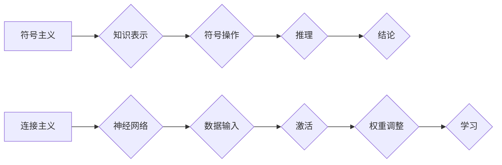

> 符号主义，连接主义，人工智能，机器学习，深度学习，认知科学，神经网络，计算模型

## 1. 背景介绍

自人类开始思考机器智能的可能性以来，关于机器是否能真正“思考”这个问题一直是哲学和计算机科学领域的核心议题。 

符号主义和连接主义是两种主要的人工智能（AI）理论，它们试图回答这个问题，并为构建能够像人类一样思考的机器提供不同的方法。

符号主义，也称为“规则-基于”人工智能，认为智能是通过符号的处理和推理实现的。它将知识表示为符号，并将推理过程定义为一系列符号操作的规则。例如，一个简单的符号主义系统可以被设计用来识别句子中的主语和谓语，通过分析符号之间的关系来理解句子的含义。

连接主义，也称为“神经网络”人工智能，则认为智能是通过大量相互连接的神经元网络的激活模式实现的。这些神经元网络通过学习从数据中提取模式和关系来模拟大脑的运作方式。连接主义系统通常通过调整神经元之间的连接权重来学习，这种权重调整的过程被称为“训练”。

## 2. 核心概念与联系

### 2.1 符号主义

* **符号:** 符号主义将知识表示为符号，例如单词、概念或关系。
* **规则:** 符号主义系统使用规则来描述如何处理符号，这些规则通常是逻辑推理或模式匹配的形式。
* **推理:** 符号主义系统通过应用规则对符号进行推理，以得出新的结论或预测。

### 2.2 连接主义

* **神经元:** 连接主义系统由许多相互连接的神经元组成，每个神经元接收来自其他神经元的输入，并根据这些输入产生输出。
* **连接权重:** 神经元之间的连接具有权重，这些权重表示连接的强度。
* **激活函数:** 每个神经元都有一个激活函数，它决定了神经元是否被激活，以及激活程度。
* **学习:** 连接主义系统通过调整神经元之间的连接权重来学习。

**Mermaid 流程图**



## 3. 核心算法原理 & 具体操作步骤

### 3.1 符号主义算法原理概述

符号主义算法的核心是符号的处理和推理。

* **知识表示:** 知识以符号的形式表示，例如逻辑表达式、概念图或规则库。
* **推理机制:** 使用逻辑推理、模式匹配或其他符号操作来从已知知识中推导出新的结论。

### 3.2 符号主义算法步骤详解

1. **知识库构建:** 将领域知识以符号的形式表示，并存储在知识库中。
2. **问题分析:** 将用户的问题转换为符号形式，以便符号主义系统可以理解。
3. **推理过程:** 使用符号主义推理机制从知识库中检索相关信息，并进行逻辑推理，以得出问题的答案。
4. **结果输出:** 将推理结果转换为自然语言，以便用户理解。

### 3.3 符号主义算法优缺点

**优点:**

* **可解释性强:** 符号主义系统的推理过程是可解释的，可以理解系统是如何得出结论的。
* **逻辑严密:** 符号主义系统基于逻辑推理，可以保证推理的正确性。

**缺点:**

* **知识表示困难:** 将复杂的世界知识以符号的形式表示非常困难。
* **推理能力有限:** 符号主义系统难以处理模糊、不确定或开放式的问题。

### 3.4 符号主义算法应用领域

* **专家系统:** 用于模拟人类专家的知识和推理能力，例如医疗诊断、金融分析等。
* **自然语言处理:** 用于理解和生成自然语言，例如机器翻译、文本摘要等。
* **逻辑推理:** 用于解决逻辑问题，例如证明定理、解决逻辑谜题等。

## 4. 数学模型和公式 & 详细讲解 & 举例说明

### 4.1 数学模型构建

符号主义算法可以基于逻辑学和集合论构建数学模型。

* **命题逻辑:** 用于表示符号和逻辑关系，例如“A ∧ B”表示“A且B”。
* **谓词逻辑:** 用于表示量词和关系，例如“∀x P(x)”表示“对于所有x，P(x)成立”。
* **集合论:** 用于表示符号之间的关系，例如“A ⊆ B”表示“A是B的子集”。

### 4.2 公式推导过程

符号主义算法使用逻辑推理规则来推导新的结论。

* ** Modus Ponens:** 如果已知“P → Q”和“P”，则可以推导出“Q”。
* ** Modus Tollens:** 如果已知“P → Q”和“¬Q”，则可以推导出“¬P”。
* ** 析取引入:** 如果已知“P”和“Q”，则可以推导出“P ∨ Q”。

### 4.3 案例分析与讲解

**例子:**

假设我们有一个知识库，其中包含以下规则：

* “如果一个人是医生，那么他/她知道如何治疗疾病。”
* “John是医生。”

我们可以使用 Modus Ponens 规则来推导出以下结论：

* “John知道如何治疗疾病。”

## 5. 项目实践：代码实例和详细解释说明

### 5.1 开发环境搭建

* **编程语言:** Python
* **符号主义库:** Prolog

### 5.2 源代码详细实现

```python
# 使用 Prolog 库实现符号主义推理

# 定义知识库
knowledge_base = [
    "医生(John).",
    "治疗疾病(医生).",
]

# 查询
query = "治疗疾病(John)."

# 使用 Prolog 库进行推理
result = prolog.query(query, knowledge_base)

# 打印结果
if result:
    print("John 知道如何治疗疾病。")
else:
    print("John 不知道如何治疗疾病。")
```

### 5.3 代码解读与分析

* **知识库:** 知识库包含了符号主义系统所拥有的知识，以逻辑表达式形式表示。
* **查询:** 查询是用户提出的问题，也以逻辑表达式形式表示。
* **Prolog 库:** Prolog 是一个符号主义推理引擎，可以根据知识库和查询进行推理。
* **推理结果:** 推理结果是一个布尔值，表示查询是否在知识库中可以被证明。

### 5.4 运行结果展示

```
John 知道如何治疗疾病。
```

## 6. 实际应用场景

* **医疗诊断:** 符号主义系统可以帮助医生诊断疾病，通过分析患者的症状和病史，并与医学知识库进行推理，得出可能的诊断结果。
* **法律推理:** 符号主义系统可以帮助律师分析法律案例，并根据法律法规进行推理，得出法律结论。
* **金融分析:** 符号主义系统可以帮助金融分析师分析市场数据，并根据经济模型进行推理，预测市场趋势。

### 6.4 未来应用展望

随着人工智能技术的不断发展，符号主义系统将在更多领域得到应用，例如自动驾驶、机器人控制、个性化教育等。

## 7. 工具和资源推荐

### 7.1 学习资源推荐

* **《人工智能：现代方法》:** Stuart Russell 和 Peter Norvig 著
* **《符号主义人工智能》:** John McCarthy 著
* **Prolog 教程:** https://www.learnprolog.org/

### 7.2 开发工具推荐

* **Prolog:** https://www.swi-prolog.org/
* **CLIPS:** https://clipsrules.sourceforge.io/

### 7.3 相关论文推荐

* **《A Logical Approach to Artificial Intelligence》:** John McCarthy
* **《The Symbol Grounding Problem》:** Harnad, S. (1990)

## 8. 总结：未来发展趋势与挑战

### 8.1 研究成果总结

符号主义人工智能在知识表示、逻辑推理和专家系统等领域取得了重要成果。

### 8.2 未来发展趋势

* **知识图谱:** 将知识表示为更丰富的结构化数据，例如知识图谱。
* **机器学习:** 将机器学习技术与符号主义方法相结合，提高系统的学习能力和泛化能力。
* **解释性 AI:** 开发更可解释的符号主义系统，以便更好地理解系统的推理过程。

### 8.3 面临的挑战

* **知识表示的复杂性:** 将复杂的世界知识以符号的形式表示仍然是一个挑战。
* **推理能力的局限性:** 符号主义系统难以处理模糊、不确定或开放式的问题。
* **可解释性的问题:** 一些符号主义系统过于复杂，难以解释其推理过程。

### 8.4 研究展望

未来研究将继续探索符号主义人工智能的潜力，并尝试解决其面临的挑战，以构建更智能、更可解释的机器。

## 9. 附录：常见问题与解答

* **符号主义和连接主义有什么区别？**

符号主义将知识表示为符号，并使用规则进行推理，而连接主义则模拟大脑的运作方式，通过神经网络学习。

* **符号主义人工智能的应用领域有哪些？**

符号主义人工智能的应用领域包括专家系统、自然语言处理、逻辑推理等。

* **符号主义人工智能的未来发展趋势是什么？**

未来研究将探索知识图谱、机器学习和解释性 AI 等方向，以提高符号主义人工智能的性能和可解释性。


作者：禅与计算机程序设计艺术 / Zen and the Art of Computer Programming 
<end_of_turn>